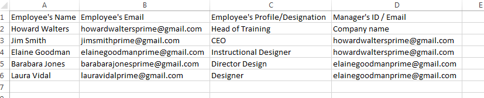

# 大量新增使用者

>[!INFO]
>
>在本次訓練中，您將瞭解如何透過CSV大量新增使用者。    

如果您無法啟動訓練，請寫信到<almacademy@adobe.com>。

## 如何新增多個使用者

您可以按照以下步驟同時新增多個使用者：

1. 在管理員登入中，按一下左窗格上的&#x200B;**[!UICONTROL Users]**，然後按一下&#x200B;**[!UICONTROL Add]** > **[!UICONTROL Upload a csv]**。 隨即顯示快顯對話方塊。

1. 您可以使用.CSV檔案新增多個使用者。 按一下&#x200B;**[!UICONTROL Import]**&#x200B;並從您的電腦中選取/開啟.csv檔案。

1. 匯入檔案後，第一次上傳.csv檔案時，請使用應用程式標籤對應.csv檔案的內容。

   對於所有後續的上傳，會考慮標籤的先前設定。 完成資料對應後按一下&#x200B;**[!UICONTROL Save]**，然後按一下&#x200B;**[!UICONTROL Add]**&#x200B;以上傳對應的.csv檔案。

1. 完成資料對應後按一下&#x200B;**[!UICONTROL Save]**，然後按一下&#x200B;**[!UICONTROL Add]**&#x200B;以上傳對應的.csv檔案。

## 包含必填欄位的CSV上傳 {#csvuploadwithmandatoryfields}

不強制在CSV中新增使用者的設定檔和管理員的電子郵件ID。 使用者名稱和使用者的電子郵件ID是唯一的必填欄位。

在此情況下，貴公司的管理員預設會被視為使用者的管理員。 依預設，會將員工視為使用者的設定檔。

>[!NOTE]
>
>若要新增使用者，請建立新的CSV檔案及其詳細資訊，然後將其上傳。 不支援更新及重新上傳現有的CSV檔案。

**範例CSV**

Learning Manager範例CSV包含下列必要欄位。
[Sample-CSV-name-email.zip](assets/sample-csv-name-email.zip)

## 包含所有欄位的CSV上傳 {#csvuploadwithallthefields}

在加入Manager的電子郵件ID給任何員工之前，請確保先在CSV中將該Manager新增為員工。 例如，在下列快照中，參照員工名稱Howard Walters：

要上載的&#x200B;*CSV範本*

此外，組織的管理員可以將&#x200B;**自己**&#x200B;新增為員工，並提及其經理的電子郵件ID作為根。

**範例CSV**

Learning Manager範例CSV包含下列所有欄位。
[learning-manager-sample-csv.zip](assets/learning-manager-sample-csv.zip)

如需詳細資訊，請參閱[使用CSV上傳](/help/migrated/administrators/feature-summary/add-users-user-groups.md)功能說明內容。
