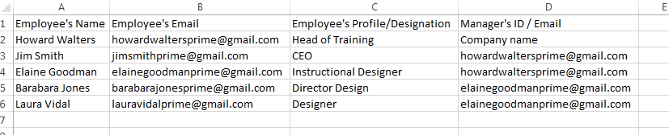

# 大量新增使用者

>[!INFO]
>
>在本次訓練中，您將學習如何透過 CSV 檔案批量新增使用者。    

如果你無法啟動訓練，請寫信至 <almacademy@adobe.com>。

## 如何新增多位使用者

你可以依照以下步驟同時新增多個使用者：

1. 在管理員登入中點選 **[!UICONTROL Users]** 左側窗格，然後點選 **[!UICONTROL Add]** > **[!UICONTROL Upload a csv]**。 彈出視窗視窗。

1. 你可以用 .CSV 檔案新增多個使用者。 點擊 **[!UICONTROL Import]** 並從電腦中選取/開啟.csv檔案。

1. 匯入檔案後，第一次上傳檔案時，將檔案內容與應用程式標籤.csv.csv對應。

   對於所有後續上傳，都會考慮先前標籤的設定。 完成資料映射後點擊 **[!UICONTROL Save]** 並上傳 **[!UICONTROL Add]** 映射.csv檔案。

1. 完成資料映射後點擊 **[!UICONTROL Save]** 並上傳 **[!UICONTROL Add]** 映射.csv檔案。

## CSV 上傳時必須填寫欄位 {#csvuploadwithmandatoryfields}

CSV 中並非必須加入使用者個人檔案和經理的電子郵件 ID。 使用者名稱和使用者的電子郵件ID是唯一必須填寫的欄位。

在這種情況下，預設情況下，貴公司的管理員會被視為使用者的管理者。 預設情況下，員工被視為使用者的個人檔案。

>[!NOTE]
>
>要新增使用者，請建立一個包含他們資料的新 CSV 檔案並上傳。 不支援更新並重新上傳現有的 CSV 檔案。

**範例 CSV**

學習管理軟體範例 CSV 可在下方取得，並附有必填欄位。
[Sample-CSV-name-email.zip](assets/sample-csv-name-email.zip)

## CSV 上傳，包含所有欄位 {#csvuploadwithallthefields}

在加入經理的電子郵件 ID 給任何員工之前，請確保該經理先被加入 CSV 中的員工。 例如，請參考下方快照中的員工姓名 Howard Walters：

*上傳用的 CSV 範本*

此外，組織的管理員也可以將自己&#x200B;**加**&#x200B;為員工，並以經理的電子郵件 ID 作為根源。

**範例 CSV**

學習管理工具範例CSV包含所有欄位，請參考下方。
[learning-manager-sample-csv.zip](assets/learning-manager-sample-csv.zip)。

更多資訊請參閱  [使用 CSV 上傳](/help/migrated/administrators/feature-summary/add-users-user-groups.md) 功能幫助內容。
