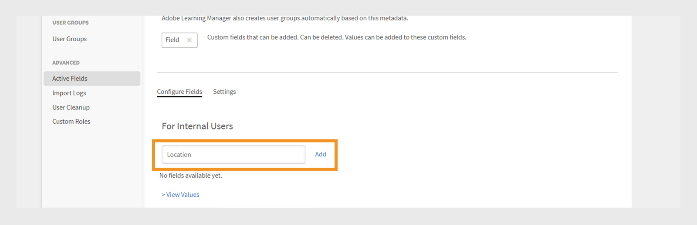
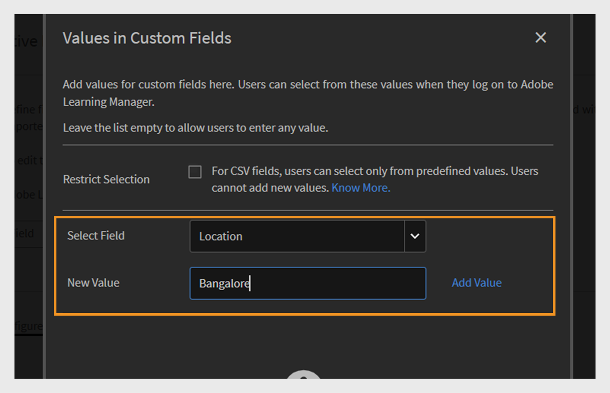
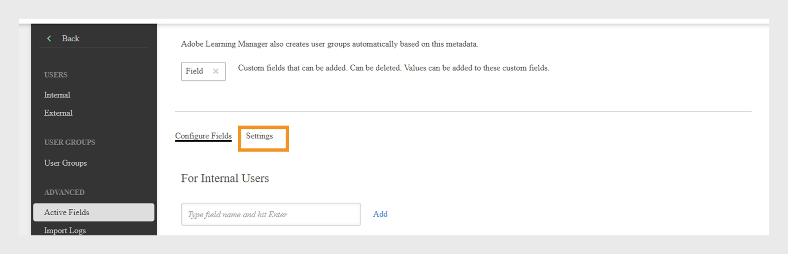
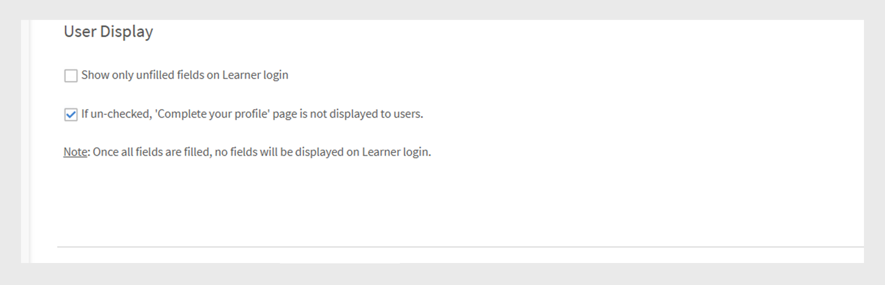
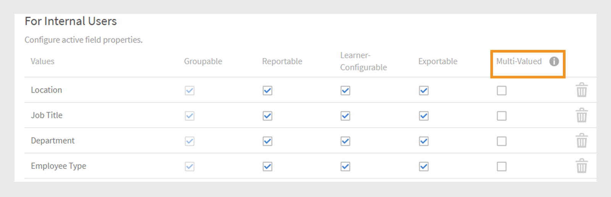
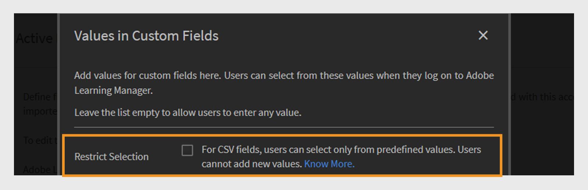

# 作用中的欄位

Adobe Learning Manager中的作用中欄位是自訂使用者屬性，可協助管理員有效組織和管理使用者。 它們可讓您擷取有關使用者的額外資訊，例如部門、位置或職稱。 管理員可以使用此資料來建立使用者群組、個人化學習，並更有效地篩選報表。

使用者屬性是使用者名字、姓氏和電子郵件地址等資訊片段。 這些屬性可協助管理員：

* 識別使用者
* 群組使用者
* 管理使用者許可權和存取限制

透過將自訂屬性新增到使用者設定檔，使用中欄位會擷取與您的組織相關的其他資訊。

>[!INFO]
>
>觀看這場ALM Academy培訓，瞭解如何新增、自訂及設定作用中的欄位。  

## 新增作用中欄位

作用中欄位適用於內部和外部學習者，可讓組織定義和管理所有使用者的自訂使用者屬性。

若要新增或管理內部使用者的作用中欄位：

1. 在系統管理員首頁上選取&#x200B;**使用者**。

2. 選取&#x200B;**作用中欄位**。

3. 輸入使用中的欄位名稱，然後選取&#x200B;**新增**。 為外部學習者新增作用中欄位的程式與內部學習者相同。

   
   _要輸入使用者新自訂屬性名稱的欄位_

4. 選取&#x200B;**儲存**。

## 新增自訂值至作用中欄位

作用欄位可包含符合您組織結構的預先定義或自訂值。 新增自訂值有助於擷取特定於內部使用者的詳細資訊，例如部門名稱、工作級別或區域辦公室。

若要新增內部使用者的自訂值：

1. 在&#x200B;**作用中欄位**&#x200B;區段下選取&#x200B;**檢視值**。
2. 在自訂欄位&#x200B;**對話方塊中的**&#x200B;值中：

   * 從&#x200B;**選取欄位**&#x200B;下拉式清單中選取使用中的欄位。
   * 在&#x200B;**新值**&#x200B;欄位中輸入作用中欄位的值。

   
   _輸入特定使用中欄位自訂值的對話方塊_

3. 選取&#x200B;**完成**，然後選取&#x200B;**儲存**&#x200B;以套用變更。

## 設定作用中欄位設定

自訂使用中欄位以協助處理使用者管理和報告工作，以及設定使用中欄位屬性：

* **可分組**：此選項可讓您根據作用中欄位值來分組學習者。
* **可報告**：此選項可讓您根據作用中欄位值建立報告使用者群組，並啟用控制面板報表中欄位的報告篩選器。
* **學習者可設定**：此選項可讓學習者自行設定欄位。
* **可匯出**：此選項包含匯出使用者群組報告中的作用中欄位。
* **多重值**：此選項支援使用中欄位的多個值。

若要設定作用中欄位設定：

1. 選取「**設定**」標籤，然後導覽至「**使用者顯示區**」區段。

   
   _選取[設定]索引標籤以自訂使用中的欄位_

2. 視需要選取一個或兩個選項。：

   * **在學習者登入時只顯示未填寫的欄位：**&#x200B;選取後，學習者將只看到他們尚未填寫的有效欄位。 這會提示他們完成個人檔案，協助確保使用者資料準確且為最新狀態。 顯示這些欄位可支援完整的學習者設定檔，並啟用個人化的學習體驗。
   * **如果取消勾選，「完成您的設定檔」頁面不會顯示給使用者：**&#x200B;當此選項停用時，學習者登入時不會看到&#x200B;**完成您的設定檔**&#x200B;頁面。 他們將不會收到更新或填寫任何設定檔資訊的提示，並且可以直接存取平台。

   
   _控制作用中欄位顯示方式和時間的設定介面_

3. 選取&#x200B;**儲存**&#x200B;以套用您的變更。

## 多值作用中欄位

多值作用中欄位可讓您將多個值指派給單一使用者屬性，例如位置、職稱或專案團隊。 這有助於擷取更詳細且更有彈性的使用者資訊。

您最多可以為每個帳戶設定三個多值作用中欄位。 這些功能可供內部和外部使用者使用。 將欄位設定為多值後，此設定便無法變更回。

若要將多個值指派給作用中欄位，請執行下列動作：

1. 選取&#x200B;**使用者**，然後選取&#x200B;**作用中欄位**。
2. 在&#x200B;**設定**&#x200B;索引標籤中，選取&#x200B;**多值**。

_控制作用中欄位顯示方式和時間的設定介面_

您可以透過CSV或使用者介面新增多個值。 一旦在使用者群組中使用了多值欄位，就無法將它變更為單值。

## 透過上傳CSV新增作用中欄位

在透過CSV上傳使用者時新增作用中欄位，方式是包含每個已定義欄位的相符標題。 管理員可以使用CSV檔案大量上傳使用者。 CSV應包含定義要匯入之使用者的新使用中欄位。 確保檔案中的標題名稱與系統中設定的作用中欄位完全相符，以便資料正確對應。 從&#x200B;**使用者**&#x200B;區段上傳CSV檔案。

檢視此[文章](/help/migrated/administrators/feature-summary/add-users-user-groups.md)，以取得大量新增使用者的詳細資訊。

## 限制CSV欄位的值

**自訂欄位值**&#x200B;中的&#x200B;**限制選取**&#x200B;選項控制透過CSV檔案匯入資料的使用者是否只能從自訂欄位的預先定義值中選取。 啟用後，使用者必須從值集清單中選擇，以確保資料一致性並防止新專案或意外專案。 如果停用，使用者可以輸入任何值，提供更大的彈性，但較少控制資料準確性。

_在CSV上傳期間啟用值限制的核取方塊_

## 管理使用者CSV匯入中缺少的作用中欄位

在某些情況下，管理員偏好學習者在登入Adobe Learning Manager時手動填寫某些作用中的欄位。 透過CSV檔案匯入的使用者可支援此功能。 請參閱此[文章](/help/migrated/administrators/feature-summary/add-users-user-groups.md)，瞭解如何大量新增使用者。

如果CSV檔案不包含所有作用中的欄位，管理員必須在匯入後手動輸入缺少的值。

依預設，每個使用中欄位都必須對應至來源CSV中的對應欄位。 不過，如果您不想將特定的作用中欄位對應到CSV中的任何欄，您可以在Box和FTP匯入程式期間，從下拉式清單中選取值&#x200B;**DontImportFromSource**。 透過FTP或Box聯結器匯入使用者時，此選項可供使用。 請參閱此[文章](https://experienceleague.adobe.com/en/docs/learning-manager/using/integration/connectors)，瞭解聯結器的詳細資訊。

