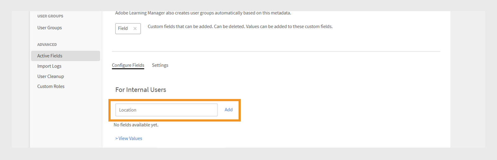
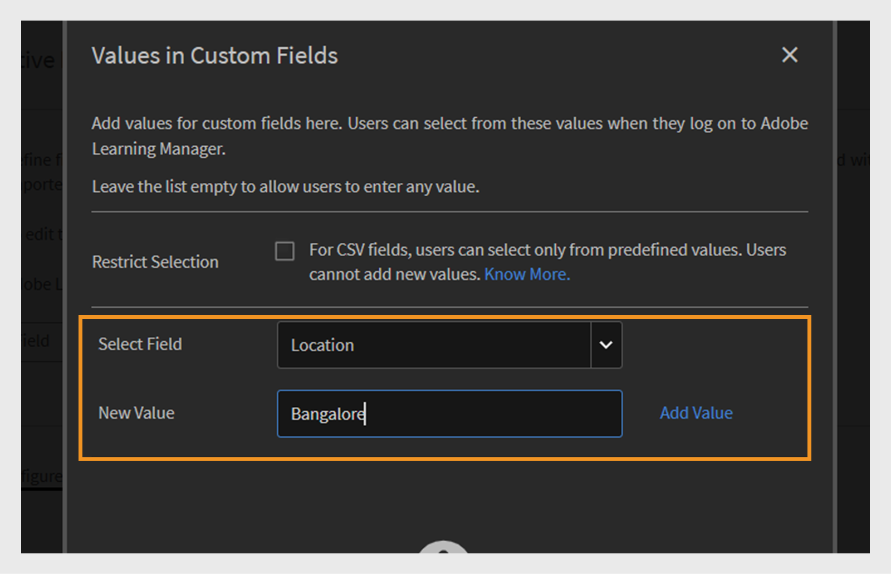
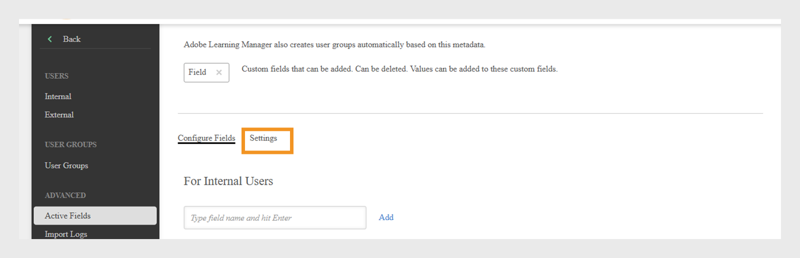
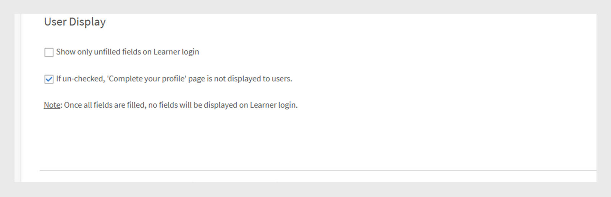
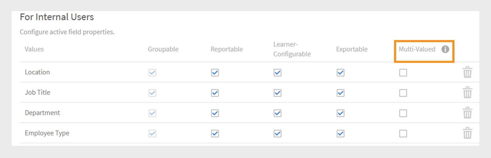
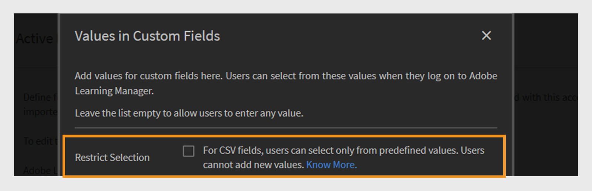

# 活躍場域

Adobe Learning Manager 中的活動欄位是自訂的使用者屬性，幫助管理員有效組織和管理使用者。 它們讓你能捕捉更多使用者資訊，例如部門、地點或職稱。 管理員可以利用這些資料建立使用者群組、個人化學習內容，並更有效地過濾報告。

使用者屬性是像使用者的名字、姓氏和電子郵件地址等資訊片段。 這些屬性幫助管理員：

* 識別使用者
* 群組使用者
* 管理使用者權限與存取限制

透過在使用者資料中加入自訂屬性，活動欄位能捕捉與組織相關的額外資訊。

>[!INFO]
>
>觀看這份 ALM Academy 培訓，學習如何新增、自訂及配置活動欄位。  

## 新增活動欄位

Active 欄位適用於內部與外部學習者，讓組織能為所有使用者定義並管理自訂的使用者屬性。

為內部使用者新增或管理活躍欄位：

1. 在管理員首頁選擇 **使用者** 。

2. 選擇 **「活動欄位**」。

3. 輸入啟用欄位名稱，然後選擇 **新增**。 為外部學習者新增主動欄位的過程與內部學習者相同。

   
   _輸入新自訂屬性名稱的欄位_

4. 選擇 **儲存**。

## 為活動欄位新增自訂值

活動欄位可以包含與組織結構相符的預先定義或自訂值。 新增自訂值有助於捕捉內部使用者專屬的細節，例如部門名稱、職階或區域辦公室。

為內部使用者新增自訂值：

1. 在「活動欄位&#x200B;**」區塊下選擇**「檢視值&#x200B;**」。**
2. 在自訂欄位&#x200B;**的值對話框中**：

   * 從 **「選擇欄位** 」下拉選單中選擇一個有效欄位。
   * 在新值&#x200B;**欄位輸入該活動欄位**&#x200B;的值。

   
   _輸入特定活動欄位自訂值的對話框_

3. 選擇 **「完成** 」，然後選擇 **「儲存** 」來套用變更。

## 設定主動欄位設定

自訂活動欄位以協助使用者管理與報告任務，並設定活動欄位屬性：

* **可分**&#x200B;組：此選項允許您根據活躍場域值將學習者分組。
* **可**&#x200B;報告：此選項允許您根據活動欄位值建立報告使用者群組，並啟用儀表板報告中該欄位的報告篩選功能。
* **學習者可**&#x200B;配置：此選項允許學習者自行設定欄位。
* **可**&#x200B;匯出：此選項包含匯出用戶群組報告中的活動欄位。
* **多值**：此選項支援多個活動欄位的值。

要設定活動欄位的設定：

1. 選擇設定&#x200B;**&#x200B;**&#x200B;標籤，然後導向&#x200B;**使用者顯示**&#x200B;區塊。

   
   _選擇設定標籤以自訂活動欄位_

2. 視需要選擇一個或兩個選項：

   * **學習者登入時僅顯示未填欄位：** 選擇後，學習者只會看到尚未填寫的活躍欄位。 這促使他們填寫個人資料，確保用戶資料的準確性與最新。 展示這些領域有助於完整的學習者輪廓，並促進個人化的學習體驗。
   * **若未勾選，「完成您的個人資料」頁面將不會顯示給使用者：** 當此選項被關閉時，學習者登入時將不會看到 **「完整您的個人資料** 」頁面。 他們不會被要求更新或填寫任何個人資料，且可直接存取平台。

   
   _設定介面用來控制活動欄位的顯示方式與時間_

3. 選擇 **儲存** 以套用您的變更。

>[!NOTE]
>
>指派新角色不會影響自訂使用者群組。 不過，這會影響自動產生的使用者群組，如 All Admins、All Authors 以及類似的角色基礎群組。

## 多值主動場

多值活躍欄位允許你為單一使用者屬性指派多個值，例如位置、職稱或專案團隊。 這有助於捕捉更詳細且靈活的使用者資訊。

每個帳號最多可以設定三個多價值的活躍欄位。 這些服務同時提供給內部與外部使用者。 欄位設為多值後，此設定無法再回復。

要為一個活動欄位指派多個值：

1. 選擇 **使用者** ，然後選擇 **活動欄位**。
2. 在設定標籤中&#x200B;**，選擇**&#x200B;多值&#x200B;**。**

_設定介面用來控制活動欄位的顯示方式與時間_

你可以透過 CSV 或使用者介面新增多個數值。 一旦多值欄位在使用者群組中使用，就無法更改為單一值。

## 透過上傳 CSV 來新增活躍欄位

透過 CSV 上傳使用者時，加入符合標頭的啟用欄位。 管理員可以使用 CSV 檔案批量上傳使用者資料。 CSV 應該包含定義要匯入使用者的新活躍欄位。 確保檔案中的標頭名稱與系統中設定的活動欄位完全一致，讓資料正確對應。 從使用者&#x200B;**區上傳 CSV 檔案**。

請參閱此 [文章](/help/migrated/administrators/feature-summary/add-users-user-groups.md) 以了解更多關於大量新增用戶的資訊。

## 限制 CSV 欄位的值

**自訂欄位**&#x200B;中的&#x200B;**「限制選取**」選項控制使用者是否只能從預設的自訂欄位值中選取。啟用後，使用者必須從集合值清單中選擇，確保資料一致性並防止新增或意外的條目。 若停用，使用者可輸入任意數值，提供更多彈性，但對資料準確性的控制較少。

_在 CSV 上傳時啟用值限制的勾選框_

## 管理使用者 CSV 匯入中缺少的活動欄位

在某些情況下，管理員希望學習者在登入 Adobe Learning Manager 時手動填寫某些活躍欄位。 此功能支援透過 CSV 檔案匯入的使用者。 請參閱這篇文章[&#128279;](/help/migrated/administrators/feature-summary/add-users-user-groups.md)了解如何大量新增用戶。使用者會根據 Box FTP 欄位值自動加入活躍欄位或基於角色的群組。 它們無法加入自訂群組。

若 CSV 檔案未包含所有活動欄位，管理員必須在匯入後手動輸入缺失值。

預設情況下，每個活躍欄位必須映射到來源 CSV 中的對應欄位。 不過，如果你不想將特定活躍欄位對應到 CSV 中的任何欄位，可以在 Box 和 FTP 匯入過程中，從下拉選單選擇 DontImportFromSource **這個值**。此選項適用於透過 FTP 或 Box 連接器匯入使用者。 有關連接器的更多資訊，請參閱本文[&#128279;](/help/migrated/integration-admin/feature-summary/connectors.md)。

