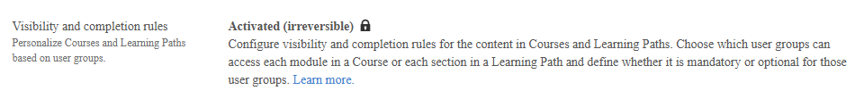

# Adobe Learning Manager 中的自適應課程

Adobe Learning Manager 的自適應課程讓你能將同一門課送到多個受眾，透過控制每位學習者根據所屬使用者群組看到的模組與必修模組。

與其為每個角色、地區或合規特性建立獨立課程，不如一門自適應課程動態地將正確的內容呈現給正確的學習者。

## 適應性課程解決的問題

培訓大型多元員工的組織面臨共同挑戰：資料隱私、職場倫理與安全必須觸及不同角色、地點或合規義務的學習者。

這造成重複：作者同時維護多門幾乎相同的課程，報告分散，且核心內容變動時每本稿件都必須更新。

自適應課程透過讓作者在模組層級設定可見性與完成規則，並與使用者群組綁定來解決此問題。 一門課程同時服務所有觀眾。

### 常見情境

- 合規課程包含所有員工的核心模組及司法管轄區特定的補充模組。 每位學習者只看到適用於其所在地的附錄。
- 新進員工課程會向員工、經理和承包商展示不同的模組。 每個角色只看到與自己相關的部分。
- 安全課程會在學年中新增必修模組。 管理員會觸發複習完成，所有先前完成的學習者必須完成新模組以保持合規。

### 真實世界的例子

組織會向全體員工推行強制合規課程。 課程包含七個模組：

- 所有員工皆需兩個模組。
- 有兩個模組只適用於人員管理。
- 其中兩個模組僅適用於技術角色的個別貢獻者。
- 其中一模組僅適用於資深及以上的主管。

## 模組可見性與完成度的運作方式

自適應課程中的每個內容模組有兩個設定：

**可看給：** 能看到模組的使用者群組。 這些組別的學習者會看到課程中的模組並能使用，但除非他們同時也是 **必修**&#x200B;課程，否則不計入完成。

**必修課程：** 必須修讀該模組的使用者群體。 在「強制&#x200B;**」下列出**&#x200B;的模組會自動顯示給這些群組;你不需要在兩個設定中都加入相同的群組。

模組在任何時間點對任一學習者而言，處於三種狀態之一：

| 州 | 如何決定 | 算作完成嗎？ |
|---|---|---|
| 強制性 | 學習者屬於一個在 **強制使用者群組中列出的** | 是的——必須完成 |
| 可選 | 學習者屬於「 **可見」** 但非 **強制的群組** | 不——可見且可接近，但非必須 |
| 隱藏 | 學習者在任何一個環境下都不屬於任何組別 | 學習者完全看不到 |

## 適應性課程的特徵

適應性課程的定義特徵是課程持續評估學習者的個人檔案，而不僅僅是在註冊時。

當學習者在註冊期間使用者群組發生變動：

- 不再在新使用者群組下可見的模組會立即消失。
- 如果新顯示的模組對新使用者群來說是必修的，則會加入完成要求。
- 若先前必修的模組不再是必修，則該模組將從完成要求中移除。
- 先前已完成的模組仍然完成。 設定檔變更不會重置已完成的工作。

### 自動退學

若使用者群組變更移除了學習者所有必修模組，該學習者將自動從課程中退名。

### 自動補全

若使用者群組變更移除了正在進行的學習者所有未完成的必修模組，該課程將自動完成。

若設定檔變更導致學習者有新的必修模組未完成，管理員可觸發刷新完成，回滾現有完成，並要求學習者完成新模組。

## 哪些會適應，哪些會保持不變

自適應規則僅 **適用於內容模組**。 以下內容適用於所有註冊學習者，不論使用者群組：

- **工作前模組：** 在核心內容開始前向所有學習者展示。
- **免試模組：** 對所有學習者開放;完成免試即完成課程，無論內容模組狀態如何。
- **先修條件：** 若課程已設定先修條件，所有學習者在報名前必須符合先修條件，無論使用者群組為何。 先決條件並非自適應性，無法針對特定使用者群進行範圍調整。

課程附帶的就業輔助工具和資源也不具適應性。 這些資料對所有註冊學習者皆可見。

技能、遊戲化點數及徽章依學習者完成首門課程而授予，且不因個人檔案變更而重新完成課程。

>[!NOTE]
>
>當自適應課程是外部共享的高階 LO 的一部分時，該自適應課程會被複製為子帳戶中的一般課程。

## 功能可用性

自適應課程功能由兩層帳戶旗標控制。 請聯絡您的 Adobe 帳戶團隊，為您的帳戶啟用此功能。

一旦帳戶標記啟用：

- **在建立或編輯課程時，會開啟「完成與可見規則**」切換功能。
- 啟用切換鍵會啟動自適應配置面板。

**注意：** 啟用自適應功能標誌是 **不可逆**&#x200B;的。 一旦在帳號層級啟用，就無法再停用。

## 目錄共享

適應性課程可以加入你帳號內的目錄。 當目錄外部分享給同儕帳號時，自適應課程會自動被排除在共享內容之外。

>[!NOTE]
>
>當包含自適應課程的學習路徑或認證在外部分享時，接收帳號會在其目錄中看到該學習路徑或認證，但其中的自適應課程則不顯示。 學習物件並未完全排除;只有自適應課程部分會從共享版本中移除。 接收帳號的作者應注意，共享的學習物件可能包含的模組數量比原始版本少。

## 支援的配置

| 配置 | 有支援嗎？ |
|---|---|
| 常規學習路徑中的適應性課程 | 是的（見下方註解） |
| 彈性學習路徑中的自適應課程 | 是的 |
| 適應性學習路徑中的自適應課程 | 不 |
| 認證中的適應性課程 | 是的（不建議重複取得證照） |
| 多重註冊 | 不 |
| 實例切換 | 是的 |
| 目錄共享（跨帳號） | 不 |
| 預備工作或測試模組的可見性規則 | 不 |
| 核心內容模組的可見性規則 | 是的 |

>[!NOTE]
>
>當自適應課程被納入 **有序** 學習路徑時，若學習者在自適應課程中沒有可見模組，因為其使用者群組與任何模組的可見性規則不符，將無法完成該課程。 在有序學習路徑中，這會阻止所有後續項目變得可存取。 為避免此情況，請確保每位註冊於學習路徑的學習者至少屬於一個使用者群組，該群組能看到路徑中任何自適應課程中至少一個模組。

此外，切勿將包含自適應課程的學習路徑嵌入於高階（巢狀）學習路徑中。 在此配置下，若學習者在自適應課程中沒有可見或必備的模組，嵌入的玩家可能會失去反應，導致無法繼續瀏覽剩餘內容。 這種行為會在未來版本中被修正。

>[!NOTE]
>
>當學習者在一般&#x200B;**學習路徑中自動取消註冊自適應課程**&#x200B;時，因為使用者群組變更移除了所有可見模組，父學習路徑仍維持註冊狀態。學習路徑不會自動退選。 學習者會在成績單上看到學習路徑已註冊，儘管其中的適應性課程已無法使用。 如果你的使用情境需要父學習路徑在自適應課程取消註冊時也要退名，建議考慮用 **自適應學習路徑** 取代一般學習路徑來容納自適應課程。

## 為您的帳號啟用自適應課程

開啟自適應學習，讓作者能根據使用者群組成員身份，為不同學習者建立不同的課程，展示不同的模組。

## 啟用之前

- **永久：** 啟用後，帳戶無法關閉自適應學習。
- **同時影響兩門課程與學習路徑：** 同一標誌同時啟用自適應課程，也同時促進自適應學習路徑。
- **現有課程不變：** 只有新建立的課程才能自適應。 現有的常規課程不會自動轉換。
- **作者會立即看到這個選項：** 一旦儲存，自適應課程類型就會出現在創作流程中。
- **雙層配置：** 如果您的帳號已設定為自適應學習，您會看到該選項已啟用且鎖定。 它無法從介面中更改。 如果帳號沒有被設定，設定就完全看不到。 請聯絡 Adobe 申請配置。

## 啟用自適應課程

1. 以管理員身份登入 Adobe Learning Manager。
2. 在左側導覽窗格選擇 **設定** 。
3. 選擇 **將軍**。
4. 請前往「可見性與完成規則&#x200B;**」區塊**。如果您的組織已啟用自適應學習，該選項將顯示為鎖定，如圖所示：

你的帳號現在已經啟用了自適應學習。 作者可以立即創建適應性課程與學習路徑。

## 啟用後會有什麼變化

啟用適應性學習後：

- 作者在建立課程時，除了現有的常規課程類型外，還會看到 **內容可見性與完成規則** 選項。
- 適應性課程中的每個內容模組皆可設定 **為使用者群組的可選** 與 **強制** 規則。
- 參加自適應課程的學習者只會看到他們使用者群組顯示的模組。
- 所有現有的常規課程保持不變。

## 疑難排解

- **在設定** 中，該功能必須先在後端配置，才能顯示「可視性」與「完成規則」部分，切換功能才會出現。 請聯絡您的 Adobe 客服代表或 Adobe 支援以申請存取權限。
- **切換功能已經啟用且顯示鎖定：** 自適應學習在你帳戶設定時已啟用。 不需要採取行動。 作者已經可以建立適應性課程。
