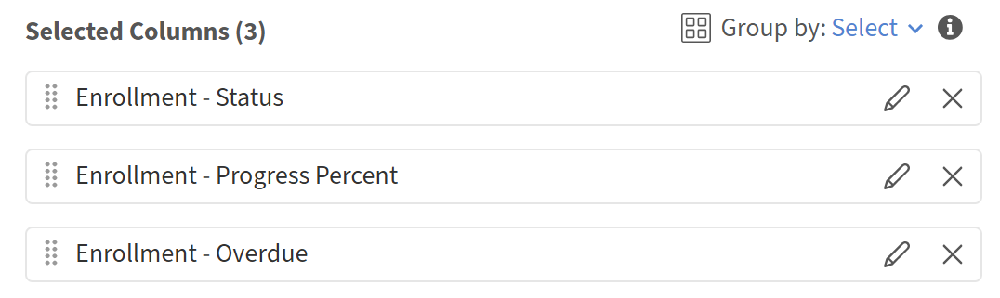
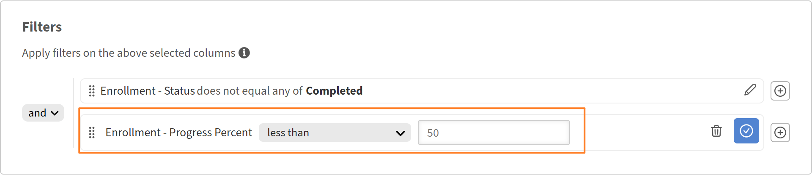

# 在報告中新增與合併篩選器

## 概觀

篩選器讓你能精確鎖定報告所需的紀錄範圍。 你可以套用單一濾波器，結合多個 AND 或 OR 邏輯的濾波器，並為複雜條件建立巢狀群組。

## 新增過濾器

使用篩選器限制報告只涵蓋特定資料子集，而不是全部查看。

例如，你可能想了解過去365天內有多少學習者報名了課程。 在這種情況下，你會在登記日期上套用日期篩選器，只包含最近的活動。

1. 啟動報表建器並選擇 **建立報表**。
2. 請輸入報告的名稱與描述。
3. 請選擇以下欄位： <dataset>:<column name>

   * 註冊日期
   * 使用者 - 名稱

   

4. 在「報告」區塊中，選擇 **新增篩選器**。
5. 搜尋或瀏覽到你想篩選的欄位。 在此範例中，選擇 **「註冊日期-註冊日期**」。

   

6. 選擇 **新增**。
7. 選擇一位操作員。 可用的運算子依欄位的資料型態而定：

   * 字串欄位 - 包含、等於、以
   * 數值場——大於、小於、等於
   * 日期欄位 - 等於 之前、之後、中間、過去 N 天
   * 列表（列舉）欄位 - 在 是，不在

8. 在這種情況下，選擇 **是在去年**&#x200B;以內。

   

9. 選擇 **儲存報告** 並選擇 **動作** > **下載** 以下載報告。

下載後的報告列出過去 365 天內註冊學習物件的所有使用者。

## 加入多個帶有 AND / OR 邏輯的濾波器

當你新增第二個過濾器時，過濾器間的預設關係是 AND;兩個條件都必須為真，才能顯示一列。

例如，你可能想找出過去365天內報名課程的學習者，並向特定經理報告。 此時，兩個條件都必須成立，因此濾波器會以 AND 邏輯組合。

1. 啟動報表建器並選擇 **建立報表**。
2. 請輸入報告的名稱與描述。
3. 請選擇以下欄位： <dataset>:<column name>

   * 使用者 - 名稱
   * 使用者-經理名稱
   * 註冊日期

4. 依欄位 **「使用者管理員名稱**」分組。
5. 在篩選器區塊中，選擇以下篩選器：

   * 註冊日期 - 去年以內&#x200B;**的登記日期**
   * 使用者 - 經理名稱 **以** N 開頭
   * 使用者 - 管理員名稱 **並非空**

     

6. 選擇 **儲存報告** 並選擇 **動作** > **下載** 以下載報告。

下載後的報告列出過去 365 天 **內註冊學習物件的所有使用者，並** 向一位以 N 開頭的經理報告。

## 建立巢狀過濾器群組

巢狀群組讓你能建立多層邏輯層次的條件，相當於公式中的括號。 例如：（目錄=安全，或目錄=衛生）且完成日期為過去90天內。

當你的邏輯包含 AND 和 OR 條件的混合，必須同時評估時，使用巢狀濾鏡群組。

例如，使用巢狀過濾器邏輯識別未完成的註冊，學習者進度低於50%或逾期訓練，展示AND與OR條件如何協同運作。

1. 啟動報表建器並選擇 **建立報表**。
2. 請輸入報告的名稱與描述。
3. 請選擇以下欄位： <dataset>:<column name>

   * 招生狀況
   * 招生 - 進度百分比
   * 註冊 - 逾期

     

4. 在 **篩選器** 區塊中，選擇以下篩選器：

   * 註冊狀態 **不等同於任何** 已完成。
   * 選擇+。
   * 搜尋註冊-進度百分比。
   * 選擇篩選器。
   * 選擇 **加入為群組**。

     

5. 新增註冊 - 進度百分比 **低於** 50%。

   

6. 選擇+。
7. 搜尋「**Enrollment-Overdue 」**
8. 選擇篩選器。
9. 選擇 **加入為群組**。

   

10. 加入逾期報名即為真。
11. 把巢狀的 AND 改成 OR。

    

12. 選擇 **儲存報告** 並選擇 **動作** > **下載** 以下載報告。

下載的報告列出所有正在進行中或未開始的登記，進度百分比低於50%或逾期未繳。
