# 新增使用者並建立使用者群組

瞭解如何在Learning Manager應用程式中新增使用者或使用者群組。

<!--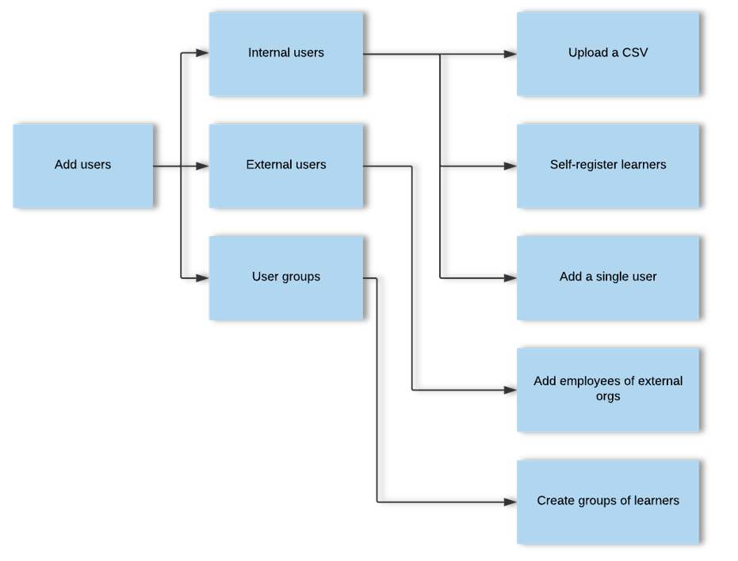-->

## 管理使用者群組

在本訓練中，您將瞭解如何依名稱、電子郵件ID以及結合多個自動產生的使用者群組來建立使用者群組。

<!--In this training, you will learn how to create a user group by names, email IDs, and combining multiple auto-generated user groups.-->

<a href="https://learningmanager.adobe.com/app/learner?accountId=98632#/course/7555694">
   <button type="button">Launch培訓</button>
</a>

 

如果您無法啟動培訓，請寫信至 <almacademy@adobe.com>.

## 概觀 {#overview}

在Learning ManagerAdobe中，您可擔任以下角色：

* **管理員：** 管理員定義組織的培訓策略。 管理員可以新增學習者、搜尋學習者的所需技能、管理和指派課程、建立學習計畫、認證和學習計畫，以及管理整個組織的報表。
* **作者：** 作者是教學設計人員和內容創作者。 作者可以將模組和課程新增至Learning Manager。
* **經理：** 經理管理團隊的學習活動。 經理可以指派團隊成員參加課程、核准團隊成員的請求，並在完成培訓後提供團隊成員績效的意見回饋。 經理也可以檢視其團隊的報告，以追蹤其績效。
* **學習者：** 學習者可存取指派給他們的課程、學習方案和認證。 學習者也可使用目錄瀏覽所有可用的課程，並註冊課程、學習計畫或認證。

身為管理員，您可以透過三種方式新增使用者：

* 內部
* 外部
* 使用者群組

## 新增單一使用者 {#addasingleuser}

使用單一使用者選項將內部學習者新增至Adobe學習管理員。

<a href="https://learningmanager.adobe.com/app/learner?accountId=98632#/course/7555534">
   <button type="button">Launch培訓</button>
</a>

 

如果您無法啟動培訓，請寫信至 <almacademy@adobe.com>.

若要新增使用者，

1. 以管理員身分登入Adobe Learning Manager 。
1. 在首頁上，按一下 **[!UICONTROL Add Users]**. 在此頁面上，您可以使用CSV一次新增一個或多個使用者。 您也可以為內部員工建立自助註冊連結，或建立外部學習者設定檔。
1. 若要新增單一使用者，請按一下 **[!UICONTROL Add]** 右上角，然後選擇選項 **[!UICONTROL Single User]**.

1. 若要新增單一使用者，請按一下 **[!UICONTROL Add]** 右上角，然後選擇選項 **單一使用者**.

   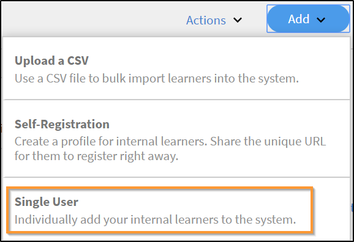
   *新增單一內部使用者*

1. 在 **[!UICONTROL Add User]** 對話方塊，輸入學習者的詳細資訊。 針對欄位 **[!UICONTROL Manager's Name]**，選取系統中現有使用者的名稱。

   
   *新增使用者對話方塊*

1. 若要新增學習管理員使用者，請按一下「 」 **[!UICONTROL Add]**. 新增使用者後，使用者會收到驗證郵件。 學習者接著會啟動帳戶並開始使用Learning Manager。 如果您需要新增有限數量的學習者至Learning Manager帳戶，此工作流程將有所幫助。 但是，如果您計畫註冊大型組織的所有員工，則可以在單次嘗試中新增他們。 如需詳細資訊，請參閱下一節。

## 大量新增使用者 {#addusersinbulk}

通常，大多陣列織都使用HR管理系統(HRMS)，HRMS會維護所有的員工記錄，例如，指定、地點、加入日期或員工階層。 您可以將此資料匯出為CSV格式。 若要匯入CSV，請遵循下列步驟：

1. 按一下 **[!UICONTROL Add]** ，然後選擇選項 **[!UICONTROL Upload a CSV]**.

   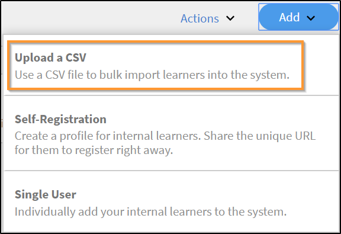
   *上傳CSV以大量新增使用者*

1. 您上傳的CSV包含欄位，如下所示：

   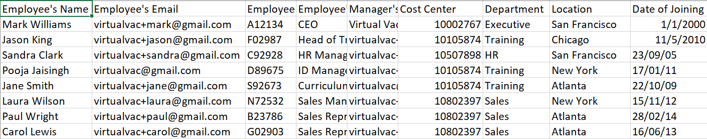
   *CSV的結構*

   您必須維護主CSV，並在主CSV上執行所有新增和刪除。 主要CSV包含以下欄位：

   * 名稱 &#42;
   * 電子郵件 &#42;
   * 設定檔
   * 經理

   (&#42;)必填欄位。

1. 在您按一下選項之後 **[!UICONTROL Upload a CSV]**，下列對話方塊隨即顯示。

   
   *上傳CSV對話方塊*

1. 選擇CSV或拖放檔案。 選擇檔案後，將資料欄位與CSV檔案中的欄位對應。 按一下必要的下拉式清單，然後選擇正確的欄位。

   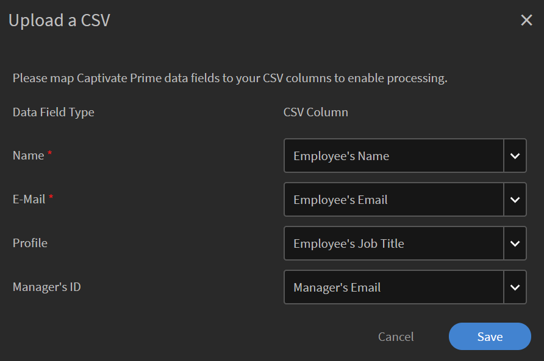
   *以CSV格式對應欄位*

1. 若要開始匯入使用者，請按一下 **[!UICONTROL Save]**. 您可以看到確認訊息。

   
   *成功上傳CSV的確認訊息*

1. 新使用者現在已新增至您的AdobeLearning Manager帳戶。 若要選取新使用者，請選取名稱旁的核取方塊，以便選取所有人。

   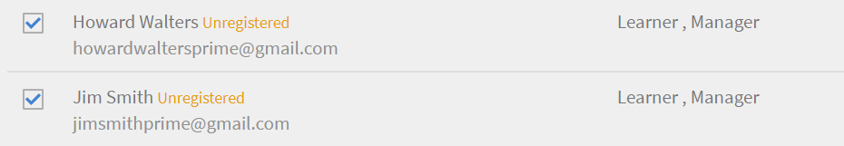
   *新增的使用者*

>[!NOTE]
>
>如需詳細資訊，請參閱常見問題集、 [大量新增使用者](../add-users-in-bulk.md).

選取使用者後，您可以執行下列動作：

## 註冊使用者 {#registerauser}

選取使用者後，按一下 **[!UICONTROL Actions]** 按一下「 」 **[!UICONTROL Register]**.

選取的使用者會收到歡迎電子郵件。 如果學習者已有的Adobe ID，可按一下此連結。 如果他們沒有現有的Adobe ID，他們可以繼續並按一下歡迎連結以建立Adobe ID並將其連結到他們的Learning Manager帳戶。

## 指派角色 {#assignarole}

將學習者新增至Learning ManagerAdobe帳戶後，如果您想變更其角色，請按一下頁面右上角的「動作」。 選擇選項 **[!UICONTROL Assign Role]**. 您可在此決定是否要將作者存取權或管理員存取權授予學習者。 在您指派角色後，此學習者便擁有該帳戶的作者存取權，並可新增模組及建立課程。

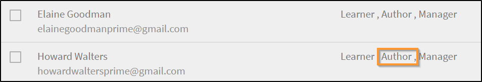
*指派角色給使用者*

## 移除角色 {#removearole}

您也可以移除使用者的「作者」或「管理員」存取權。 選取一或多個學習者，按一下 **[!UICONTROL Actions]**，並選取 **[!UICONTROL Remove Role]**. 選擇一個選項，例如， **[!UICONTROL Remove Author]**，則會撤銷此學習者的作者存取權。

>[!NOTE]
>
>您無法手動將Manager角色指派給系統中的某人。 當一個或多個員工新增到經理控制面板下時，管理員會自動存取該控制面板。

## 刪除使用者 {#deleteauser}

若要刪除使用者，請按一下 **[!UICONTROL Actions]**，並選擇 **[!UICONTROL Delete User]**. 在確認對話方塊中，按一下 **[!UICONTROL Yes]**，則會刪除學習者。

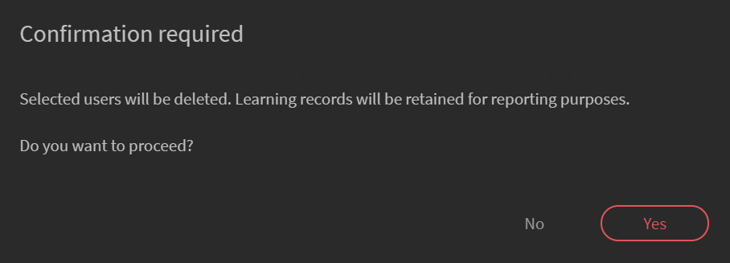
*刪除使用者的確認訊息*

## 編輯使用者 {#editauser}

在使用者清單中，選擇使用者，然後按一下該使用者。 在使用者詳細資訊上，按一下 **[!UICONTROL Edit]** ( )按鈕。 在 **[!UICONTROL Edit User]** 進行必要的編輯並儲存變更，請按一下 **[!UICONTROL Save]**.

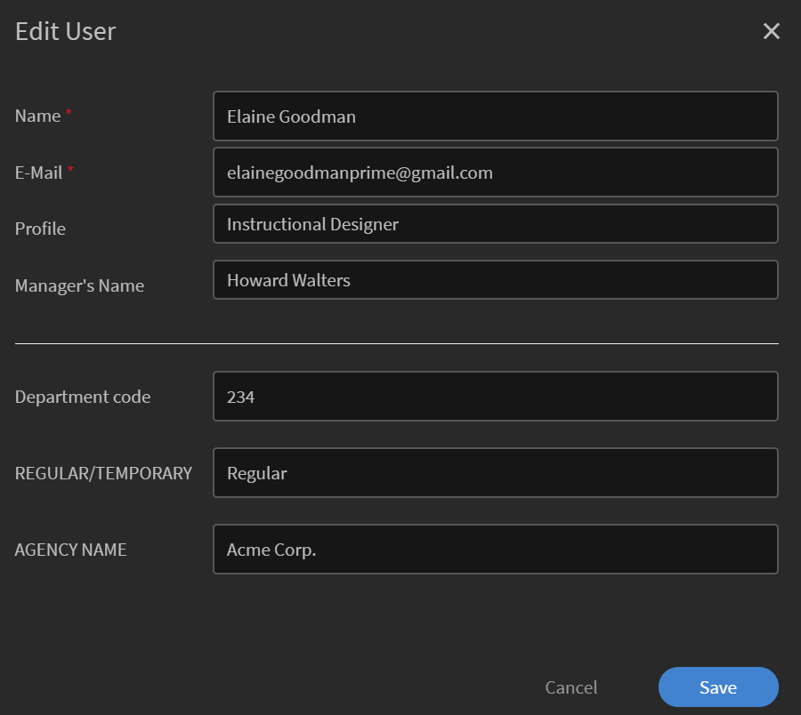
*編輯使用者對話方塊*

## 作用中欄位和作用中欄位值的工作流程會保留區分大小寫

在此版本中，Learning Manager會保留使用者屬性及其值區分大小寫。 **例如**，使用者屬性的區分大小寫為「location」，其值將保留並以相同方式顯示。 如果有任何問題，管理員現在可以編輯屬性名稱和值，以更正任何區分大小寫的錯誤。

管理員可透過造訪來達成此目的 **[!UICONTROL Admin app]** > **[!UICONTROL Users]** > **[!UICONTROL User groups]** 並按一下群組名稱。

管理員可以透過UI為學習者新增和更新允許的屬性值。

作用中欄位的型別：

* 可分組：學習者會根據值分組
* 可報告：會根據作用中欄位建立報告使用者群組
* 可匯出：欄位將顯示在使用者群組報表的匯出中。

## 建立自助註冊連結 {#createaselfregistrationlink}

您也可以讓組織中的員工註冊成為學習者，以AdobeLearning Manager帳戶，不需您擔任管理員的協助。 管理員可建立自助註冊連結並與員工共用，員工可使用其Adobe憑證進一步註冊至Learning Manager。

在頁面的右上角，按一下 **[!UICONTROL Add]**，並選取 **[!UICONTROL Self-Registration]**.

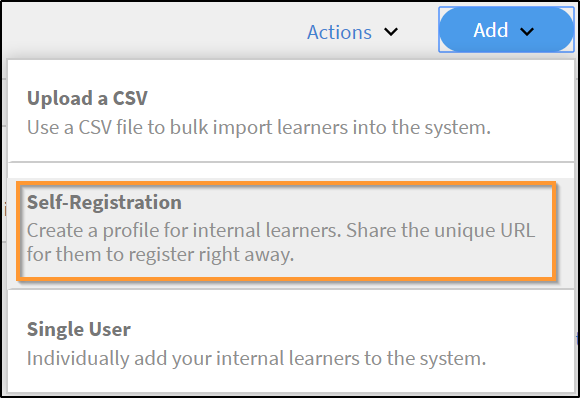
*建立學習者自助註冊的連結*

此 **[!UICONTROL Add Self-Registration Profile]** 對話方塊隨即顯示。 為此設定檔命名。 然後新增經理的姓名。 請務必知道經理必須已在Learning Manager中註冊學習者。

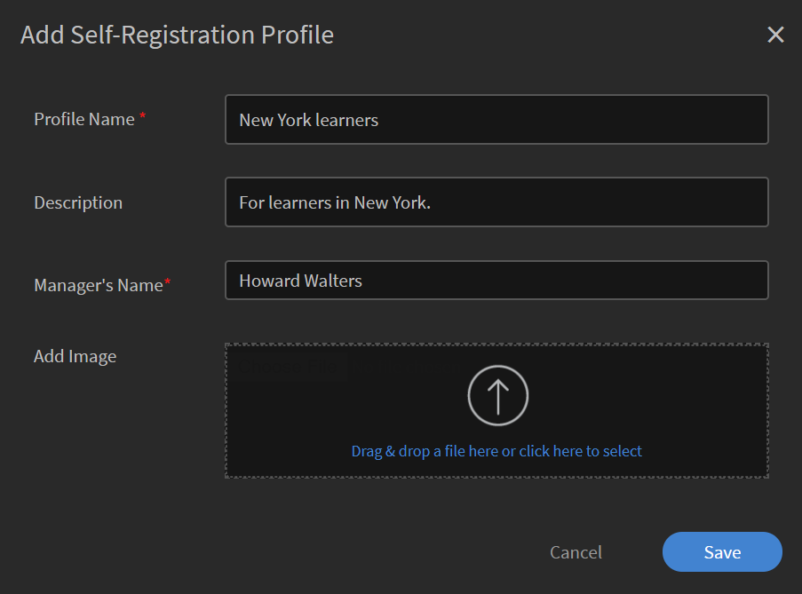
*新增個人檔案以進行自我註冊*

在您按一下 **[!UICONTROL Save]**，接著會產生URL，您可以與學習者共用，讓他們可以按一下URL並自行註冊。

## 註冊外部學習者 {#enrollexternallearners}

在Adobe Learning Manager中，您也可以為存取您帳戶受限的外部合作夥伴或代理商建立註冊連結，並向他們提供學習材料。

內部註冊和外部註冊之間有些差異。

<table>
 <tbody>
  <tr>
   <td>
    
<b>內部使用者</b>
</td>
   <td>
    
<b>外部使用者</b>
</td>
  </tr>
  <tr>
   <td>
    
使用Adobe ID或SSO憑證登入。
</td>
   <td>
    
使用任何電子郵件ID登入。
</td>
  </tr>
  <tr>
   <td>
    
遊戲化可供使用。
</td>
   <td>
    
遊戲無法使用。
</td>
  </tr>
  <tr>
   <td>
    
可使用學習者階層。
</td>
   <td>
    
無法使用學習者階層。
</td>
  </tr>
 </tbody>
</table>

若要註冊外部使用者，請遵循下列步驟：

1. 在左側導覽窗格中，按一下 **[!UICONTROL External]**.

   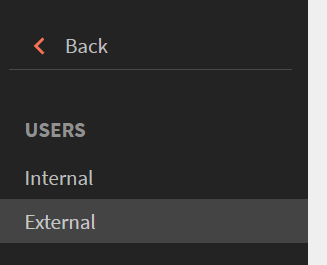

   *註冊外部使用者*

1. 在頁面的右上角，按一下 **[!UICONTROL Add]**.

1. 在 **新增外部註冊設定檔** 對話方塊，新增下列詳細資料：

   * 合作夥伴組織的設定檔名稱。
   * 合作夥伴組織經理的電子郵件地址。
   * 此合作夥伴的外部註冊名額限制。
   * 到期日：設定停止允許此群組新註冊的截止日期。 到期日之後，只有現有的註冊使用者才能存取此訓練。

   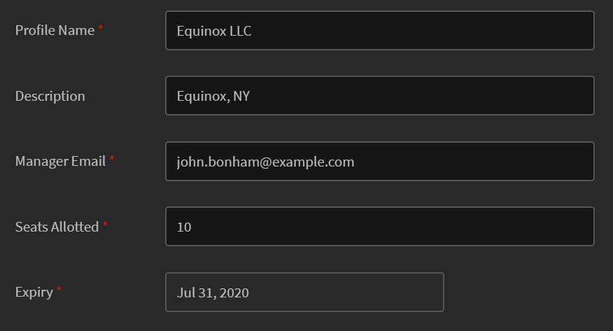

   *新增外部註冊設定檔對話方塊*

   * 在 **[!UICONTROL Advanced Settings]** 區段，輸入下列內容：

      * **[!UICONTROL Login Requirement]：** 以天為單位指定值。 如果學習者在上述期間未登入，則會被刪除。
      * **[!UICONTROL Allowed Domains]：** 以逗號分隔的白名單電子郵件網域名稱清單。
      * **[!UICONTROL Email Verification Required]：** 選取此選項，讓學習者必須驗證電子郵件。

   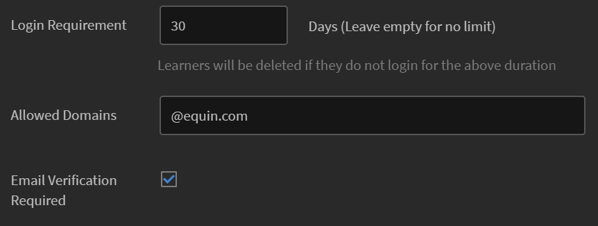

   *在「進階設定值」段落中輸入詳細資訊*

1. 在您按一下 **[!UICONTROL Save]**，您會看到下列確認訊息。 您必須與外部合作夥伴共用URL。

   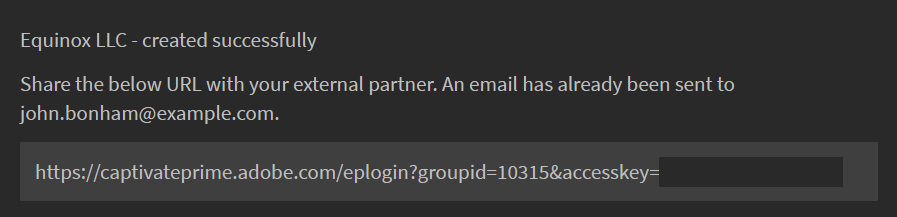

## 啟用外部設定檔 {#enableanexternalprofile}

建立外部設定檔後，您必須啟用其狀態。 從外部設定檔清單中，選擇所需的設定檔，然後切換狀態按鈕。

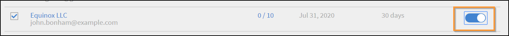
*啟用外部設定檔*

這會啟用外部註冊連結。 歡迎電子郵件會自動傳送給合作夥伴。 您也可以複製連結，並透過按一下「複製URL」圖示()與他們共用，或透過按一下「郵件」圖示()將歡迎電子郵件重新傳送給合作夥伴組織。

合作夥伴經理可與必須參加PrLearning Manager時間培訓的員工共用連結。 當他們按一下連結時，填寫一些詳細資料以在Learning Manager上建立設定檔後，即可自行註冊。 這些使用者不會與內部員工一起出現在學習者標籤上。 您可以在底下檢視其名稱， **[!UICONTROL External Learners]** 標籤。

## 暫停外部設定檔 {#pause}

將外部使用者群組新增至Learning Manager後，您也可以暫停外部使用者的註冊程式。 當您暫停時，會封鎖外部使用者的註冊程式。 不過，此程式只有在使用者尚未透過接受邀請註冊時才有效。

若要暫停外部使用者群組，請選擇一個或多個群組，然後按一下 **[!UICONTROL Actions]** ，然後按一下 **[!UICONTROL Pause]**.

## 繼續外部設定檔 {#resumeanexternalprofile}

您隨時都可以撤銷外部夥伴的暫停狀態，並繼續正常服務。 按一下 **[!UICONTROL Actions]** ，然後選取「 」 **[!UICONTROL Resume]**.

下列狀態適用於外部使用者：

* **非使用中狀態**  — 在此狀態下，外部使用者的註冊已過期。 管理員透過新增使用者工作流程新增外部使用者時，可設定其到期日。
* **作用中狀態**  — 在此狀態下，外部使用者可註冊Learning Manager應用程式並登入應用程式。
* **暫停**  — 在此狀態下，會封鎖外部使用者的註冊程式。 但是，現有的使用者可以繼續登入。

## 檢查已使用的座位 {#checkusedseats}

在外部設定檔清單上，按一下 **[!UICONTROL Seats Used]**. 您可以檢視合作夥伴組織中新增的學習者數。

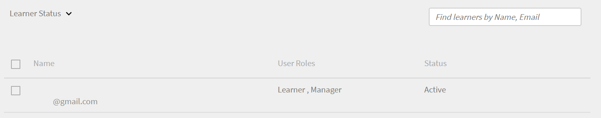
*檢查已使用的座位*

## 刪除使用者 {#Deleteauser-1}

選擇使用者，然後從右上角按一下 **[!UICONTROL Actions]** > **[!UICONTROL Delete User]**.

## 變更設定檔 {#changeprofile}

若要將使用者移動到另一個外部設定檔，請選擇使用者，從右上角，按一下 **[!UICONTROL Actions]** > **[!UICONTROL Change Profile]**. 從設定檔清單中，選擇設定檔，然後按一下 **[!UICONTROL Change]**.

## 指派角色 {#Assignarole-1}

選擇使用者，然後從右上角按一下 **[!UICONTROL Actions]** > **[!UICONTROL Assign Role]** > **製作`<role>`**. 使用者獲得新角色。

## 移除角色 {#Removearole-1}

選擇使用者，然後從右上角按一下 **[!UICONTROL Actions]** > **[!UICONTROL Remove Role]** > **移除`<role>`**. 選取的角色會從指派給使用者的角色清單中移除。

## 建立使用者群組 {#createusergroups}

使用者群組是指與類別相關的一組使用者。 使用者群組可協助管理員根據學習者的屬性來選取組織內的學習者，然後將學習內容指派給他們。 此外，這些使用者群組可讓管理員將自訂的圖志和目錄指派給學習者，並顯示其進度的自訂報告。

若要存取「使用者群組」，請在左側導覽窗格中按一下 **[!UICONTROL User Groups]**.

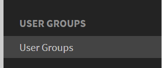
*建立使用者群組*

AdobeLearning Manager中有兩種型別的群組，自訂和自動產生。 當您將學習者新增至帳戶時，有些群組會根據其一般屬性自動建立。

若要檢視自動建立的群組，請按一下索引標籤 **[!UICONTROL Auto-generated]**.

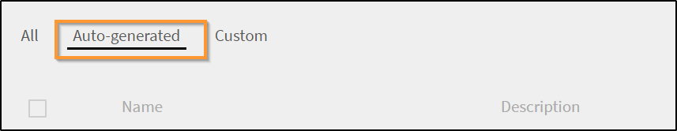
*檢視自動產生的群組*

您可以看到有不同的群組，例如「所有內部使用者」、「所有經理」、以「成本中心」為基礎的群組、以部門為基礎的群組以及以經理團隊為基礎的群組。

除了自動產生的群組之外，您也可以建立自訂群組。 若要新增自訂群組，請按一下右上角的「 」 **[!UICONTROL Add]**.

1. 輸入群組的名稱和描述。
1. 在「隨型別搜尋」欄位中輸入使用者名稱或設定檔，並從下拉式清單中選取，以新增使用者。

1. 若要新增更多學習者，請按一下 **[!UICONTROL Add More Users]**.

1. 若要建立使用者群組，請按一下 **[!UICONTROL Save]**.

此自訂群組現在已建立並新增至設定檔。 您建立的使用者群組本質上為動態的。 如果新使用者新增了類似的屬性，則會自動新增到使用者群組。

## 排除使用者群組

有時您會想要從大型使用者群組中排除一小部分使用者。 若要透過「學習計畫」將這組特定使用者註冊到培訓中，或設定正確的可見性目錄，則必須執行此操作。 在此版本的Learning Manager中，您可在建立自訂使用者群組時排除學習者或使用者群組。 在新增使用者群組對話方塊中，排除學習者區段可讓您達成此目的。

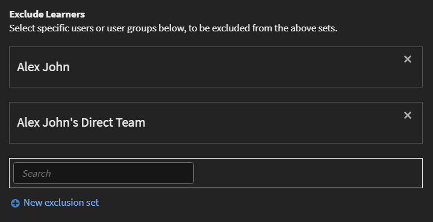
*排除使用者群組*

例如，如果您想要設定「學習計畫」，讓屬於「地點=加州」(Store-5 （位於加州）除外)的所有使用者都能註冊。

## 進階設定 {#advancedsettings}

### 資料來源 {#datasources}

當您想要將使用者或學習資料從您組織的資料庫匯入/同步至Learning Manager應用程式時，可使用此功能。 您也可以設定此同步的頻率。

按一下 **[!UICONTROL Data Sources]** 在左窗格中的 **[!UICONTROL Advanced]** 區段。

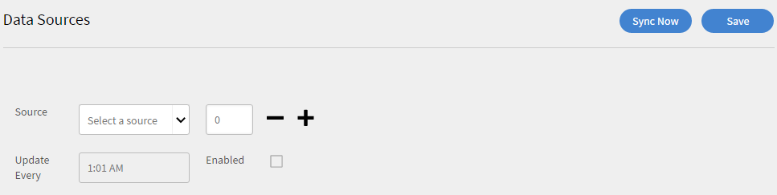

*匯入或同步使用者的資料來源*

從中選擇資料來源型別 **[!UICONTROL Source]** 下拉式清單，選取更新頻率，然後按一下 **[!UICONTROL Sync now]** 如果您需要立即同步或按一下 **[!UICONTROL Save].** 內部使用者的資料來源型別為SFDC、FTP等。

您可以新增多個資料來源。

### 作用中的欄位 {#activefields}

除了在使用者註冊期間提供的欄位之外，此功能可讓管理員新增更多作用中的欄位。

按一下 **[!UICONTROL Active Fields]** 「使用者」頁面中提供。 學習者只能從自訂值中指定的值中選擇。

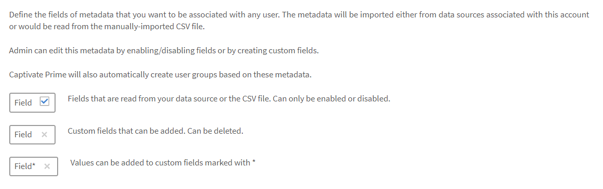
*作用中的欄位*

### 設定欄位 {#configurefields}

**內部使用者**

您可以為內部使用者的使用者欄位新增自訂值。

若要新增自訂值，請遵循下列步驟：

1. 按一下  **[!UICONTROL Modify Values]** 供內部使用者使用。

   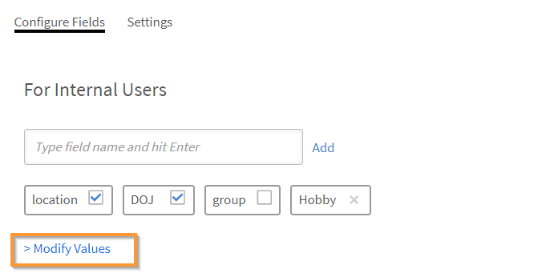
   *修改內部使用者的值*

1. 此 **自訂欄位中的值** 對話方塊隨即顯示。

   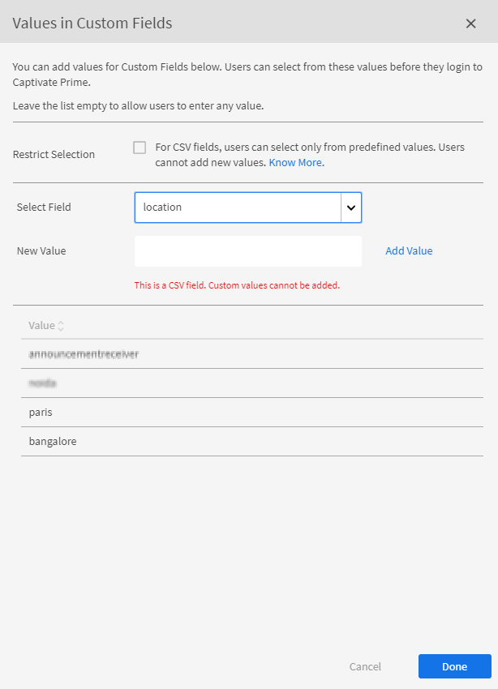
   *自訂欄位對話方塊中的值*

1. 從中選擇要新增的值 **[!UICONTROL Select Field]** 下拉式功能表。
1. 輸入新值 **[!UICONTROL New Value]** 欄位。
1. 按一下 **[!UICONTROL Done]**.
1. 按一下右上角的「儲存」以 **[!UICONTROL Save]** 變更。

**外部使用者**

新增與內部使用者類似的自訂值。

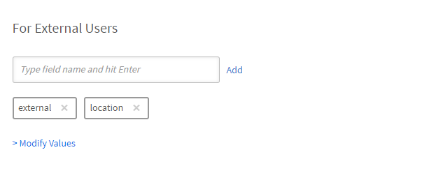
*修改外部使用者的值*

### 設定 {#settings}

**使用者顯示**

如果選項 **在學習者登入時僅顯示未填寫的欄位** 已啟用，使用者在登入時只會看到空白欄位。

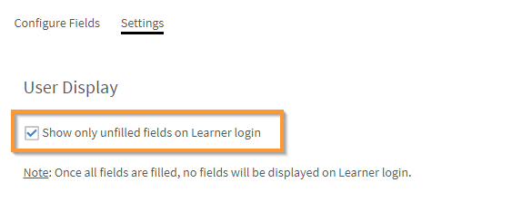
*顯示未填寫的欄位*

使用此選項，管理員可以決定是否要顯示欄位，或是在這些欄位填入後隱藏它們。

## 限制報告中的作用中欄位 {#restrictactivefields}

Learning Manager 27.7引進兩種新選項 —  **[!UICONTROL Reportable]** 和 **[!UICONTROL Exportable]**，適用於作用中欄位。

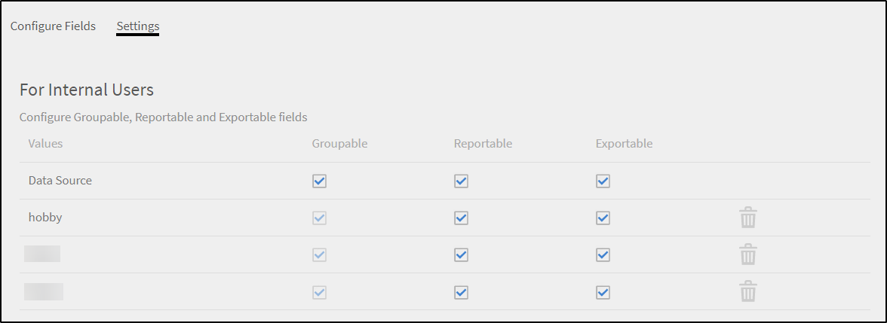
*作用中欄位中的選項*

對於CSV欄位和手動新增欄位，如果活動欄位標籤為 **[!UICONTROL Reportable]**，則作用中欄位可在控制面板報表內的篩選器中搜尋。

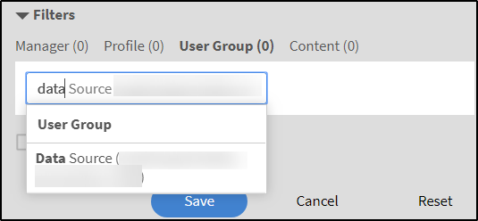
*儀表板報表中的篩選器*

如果作用中欄位標籤為 **[!UICONTROL Exportable]**，則在下載任何Excel報表時， 「作用中欄位」會顯示在Excel檔案中。

這些選項會針對內部和外部作用中欄位顯示。

您只能刪除自訂作用中欄位。

## 使用者顯示

您可以對學習者隱藏整個「完成您的設定檔」頁面。 學習者登入後，頁面不會隨即顯示。

請注意，現有的預設行為不會變更。 這是一項可選功能，現在可供管理員使用。

啟用下列選項：

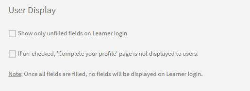
*使用者顯示區段*

## FTP和Box聯結器支援手動CSV欄位 {#import-connector}

使用者通常會在學習者登入Learning Manager時手動提供作用中欄位。 目前在Learning Manager中可實現此功能，即使用者手動匯入CSV時。

CSV可能未包含所有作用中的欄位。 對於所有未在上傳CSV中更新的「作用中」欄位，使用者需要輸入此類「作用中」欄位的資料。

目前，所有「作用中」欄位都必須對應至來源CSV中的某個欄位。

有時候使用者不想將作用中欄位對應到CSV中指定的欄位。 在這種情況下，使用者可以將作用中欄位對應到值 **[!UICONTROL DontImportFromSource]**. 從FTP和Box聯結器匯入使用者時，從下拉式清單中選取此值。

## 自訂角色 {#customroles}

將您選擇的任何欄位新增為使用者資訊的一部分，然後按一下 **[!UICONTROL Save]**. 新增欄位後，您還可以反複檢查 **[!UICONTROL Edit users]** 對話方塊。

新增欄位後，您可以注意到標有刻度的欄位來源為資料來源或CSV，如下面的快照所述。 管理員可以透過啟用或停用這些欄位來編輯這些來源欄位。

**Learning Manager中作用欄位的值**

系統會以下列方式擷取作用中欄位的值：

1. Learning Manager應用程式會從與您帳戶相關聯的資料來源匯入中繼資料。
1. 從手動匯入的CSV檔案擷取的中繼資料。
1. 學習者登入時填滿中繼資料
1. 管理員輸入使用者的資料。

>[!NOTE]
>
>Learning Manager應用程式會自動根據這些中繼資料建立使用者群組。

**新增自訂值**

您可以在內部和外部使用者欄位中為使用者欄位新增自訂值。

若要新增自訂值，請遵循下列步驟：

自訂欄位可以新增和刪除，它們適用於所有使用者。 CSV欄位可以啟用或停用，只有在您於「使用中」欄位中進行修改後上傳CSV時，這些欄位才會生效。 所有內部作用中的欄位都適用於所有型別的內部使用者。 外部欄位僅適用於外部使用者。 如果自訂欄位出現在CSV中，下次上傳時會自動轉換為CSV欄位並啟用。

## CSV欄位的值 {#valuesforcsvfields}

使用者只能從CSV欄位的預先定義欄位中進行選擇，如果 **[!UICONTROL Restrict Selection]** 核取方塊已啟用。

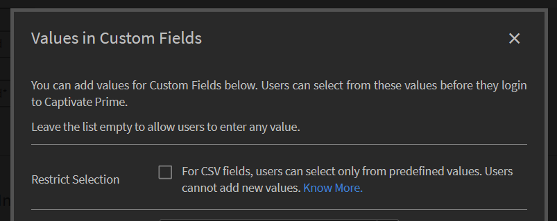
*限制選取核取方塊*

## 匯入記錄 {#importlogs}

您可以在此空間檢視管理員使用大量匯入功能新增之使用者的CSV匯入記錄。 您也可以按一下 **[!UICONTROL Add]** ，可使用CSV上傳功能新增使用者。

## 多值作用中欄位

使用此功能，一個使用中欄位可以有多個欄位。 帳戶中最多可以有三個多值作用中欄位。 多值作用中欄位可供外部和內部使用者使用。

一旦您將使用中的欄位標示為多值，就無法將它轉換回單一值。 這是不可逆的。

無法將現有的單一值欄位標示為多值欄位。

若要建立多值作用中欄位，請遵循下列步驟：

1. 新增使用中欄位。

   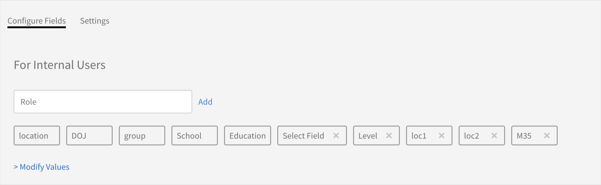
   *新增使用中欄位*

1. 按一下「新增」。
1. 在「設定」標籤中，將新欄位標示為多值。

   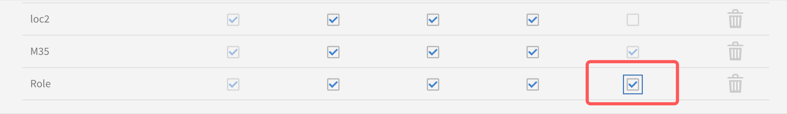
   *標籤為多值*

   還有另一個核取方塊， **[!UICONTROL Learner Configurable]**，停用時，學習者將無法在「設定檔」頁面上看到欄位。

1. 使用CSV或按一下「修改值」來新增值。

   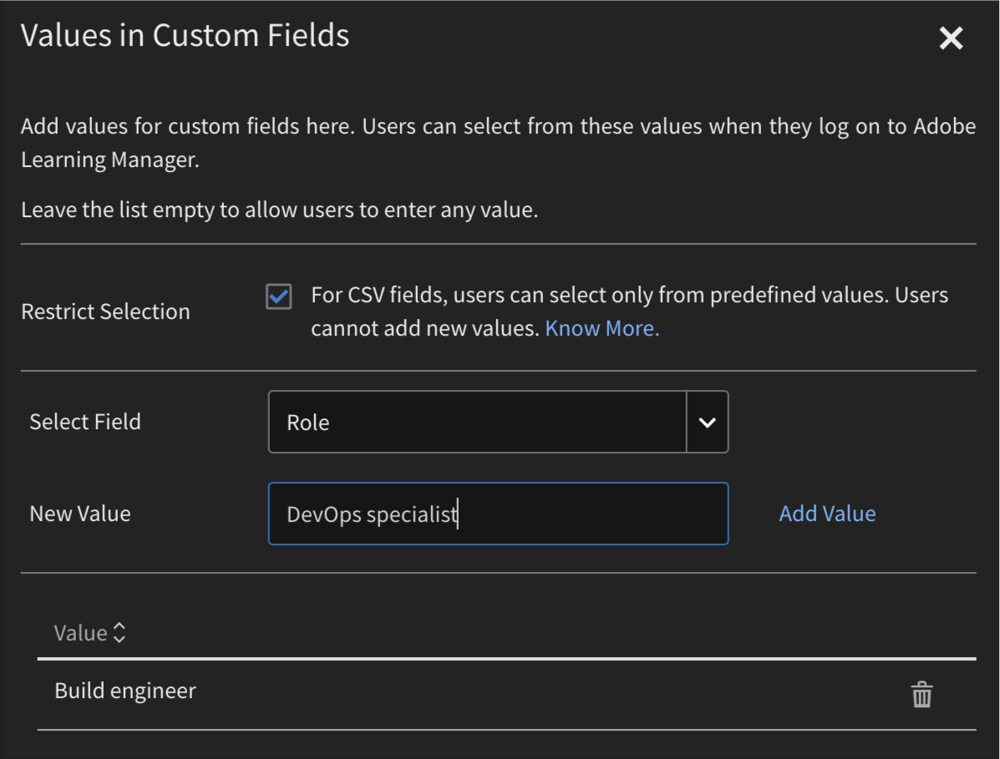
   *新增值*

1. 按一下 [!UICONTROL **完成**].

>[!NOTE]
>
>一旦建立了使用者群組並填入欄位，便無法將多個值轉換為單一值，反之亦然。

### 透過CSV新增多值作用中欄位

請遵循下列步驟：

1. 以欄的形式建立包含新使用中欄位的CSV （逗號分隔或單一值）。
1. 匯入CSV。
1. 在自訂欄位中的值對話方塊中，將欄位標示為多值。
1. 再次匯入CSV。

CSV必須有一個與標示為多值的作用中欄位同名的欄。

CSV包含欄位：

* **[!UICONTROL User]**：使用者群組已建立為角色。
* **[!UICONTROL Roles]**：具有值的多值作用中欄位。

如果CSV重新上傳為新值或刪除的值，則作用中的欄位和群組也會據此更新。

### 報表

所有報表都包含多值作用中欄位及其值。

管理員可以新增自動產生的作用中欄位，並設定使用者活動和培訓報告。

學習者成績單報告包含所有使用中的欄位和逗號分隔值。 然後，管理員可以相應地篩選資料。

## 常見問題 {#faq}

+++如何在Learning Manager中註冊使用者？

新增使用者並為使用者指派角色後，您可以透過執行以下步驟來註冊使用者：

1. 選取一個或多個使用者後，按一下 **[!UICONTROL Actions]** ，然後按一下 **[!UICONTROL Register]**.

1. 在快顯視窗中，按一下 **[!UICONTROL Yes]**.

選取的使用者會收到歡迎電子郵件。 如果學習者已有的Adobe ID，可按一下此連結。 如果他們沒有現有的Adobe ID，他們可以繼續並按一下歡迎連結以建立Adobe ID並將其連結到他們的Learning Manager帳戶。

按一下電子郵件中的任一連結對學習者而言是強制性的，因為這有助於Learning Manager驗證學習者的帳戶。

+++

+++如何編輯使用者資料？

若要編輯使用者，請遵循下列步驟：

1. 在使用者清單中，按一下您要編輯資料的使用者。
1. 按一下鉛筆圖示，如下所示。

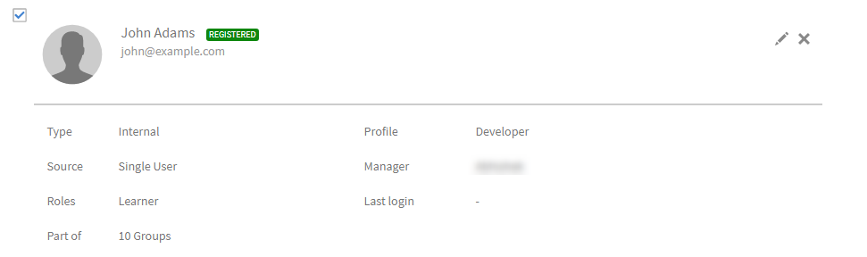

在 **編輯使用者** 對話方塊中，更新相應的欄位。 若要儲存變更，請按一下 **[!UICONTROL Save]**.

+++

+++如何在Learning Manager中暫停並繼續外部使用者？

在外部使用者清單中，選擇要刪除的使用者。 在右上角，按一下 **[!UICONTROL Actions]** > **[!UICONTROL Pause]**.

如需詳細資訊，請參閱 [暫停外部設定檔](add-users-user-groups.md#pause).

暫停設定檔後，外部設定檔會將狀態顯示為 ***已暫停***.

+++

+++如何將歡迎電子郵件傳送至新建立的外部設定檔？

新增外部使用者時，在 **[!UICONTROL Add External Registration Profile]** 對話方塊中，輸入外部管理員的電子郵件。 當您按一下「儲存」時，歡迎電子郵件也會傳送至您指定的電子郵件地址。 如果您要再次傳送歡迎郵件，請按一下信封圖示，如下所示：

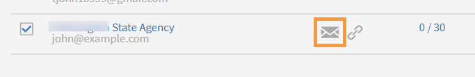

+++

+++如何建立自訂使用者群組？

按一下 **[!UICONTROL Users]** > **[!UICONTROL User Groups]** 而在使用者群組頁面上，按一下 **[!UICONTROL Add]**. 在「新增使用者群組」對話方塊中，將使用者新增為個人使用者或團隊使用者。

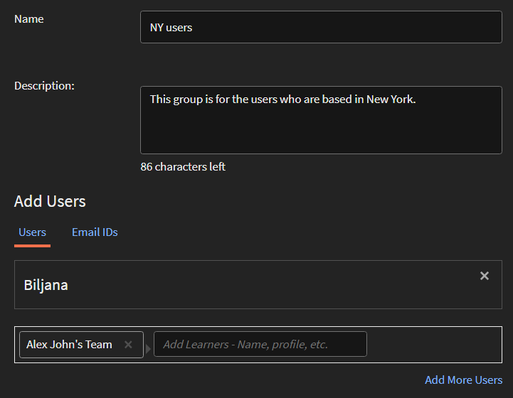

+++

+++如何停用已填入的活動欄位？

如果您希望學習者僅能看到他們未填寫的有效欄位，請遵循下列步驟：

1. 按一下 **[!UICONTROL Users]** > **[!UICONTROL Active Fields]**.

1. 按一下 **[!UICONTROL Settings]** 並啟用選項 **[!UICONTROL Show only unfilled fields on Learner login]**.

1. 按一下 **[!UICONTROL Save]**.

+++

+++如何防止學習者在作用中欄位中輸入隨機值？

您可以限制學習者的選擇，讓他們只能選擇預先定義的值，而不能輸入任何隨機值。 請遵循下列步驟：

1. 按一下 **[!UICONTROL Users]** > **[!UICONTROL Active Fields]**.
1. 啟用選項 **[!UICONTROL Restrict Selection]**.
1. 按一下 **[!UICONTROL Done]**.

+++

+++如何區分CSV作用中欄位和自訂作用中欄位？

您只能啟用或停用CSV作用中的欄位，但無法刪除它們。 另一方面，您無法啟用或停用自訂作用中欄位。

+++
