# 在Adobe Learning Manager中新增使用者

在Adobe Learning Manager中，使用者是指使用平台進行學習或訓練的學習者。 有兩種使用者：內部使用者和外部使用者。

內部使用者是您組織的員工或團隊成員。

外部使用者是指公司外的學習者，例如客戶、合作夥伴、廠商或客戶，可存取您的學習內容。

Adobe Learning Manager (ALM)可讓管理員使用各種方法（包括手動輸入、CSV上傳、自助註冊和系統整合），來建立和管理內部和外部使用者。

## 內部使用者

Adobe Learning Manager中的內部使用者是指您組織內的員工或團隊成員。 您可以手動新增、大量上傳檔案，或透過系統整合匯入檔案。 新增這些使用者後，您可以將其組織到群組中、指派課程並監視其學習進度。

Adobe Learning Manager中的使用者可以根據其獲指派的角色承擔不同的責任及管理不同的工作。 每個角色（包括管理員、作者、講師和整合管理員）都提供一組為支援使用者在平台內的責任而量身打造的特定權能。

### 新增內部使用者的方法

管理員可以使用以下方法新增內部使用者：

* **新增單一使用者**：一次手動新增一個使用者。
* **自助註冊設定檔**：允許學習者使用管理員建立的註冊連結在Adobe Learning Manager中自助註冊為學習者。
* **透過CSV大量上傳**：上傳CSV檔案以一次新增多個使用者。

### 手動新增內部使用者

管理員可提供使用者的名稱、電子郵件、唯一識別碼及管理員名稱，以手動方式新增使用者。 Adobe Learning Manager中的唯一識別碼是管理員在建立使用者時指派的必要識別碼。 每個使用者都必須有專屬的值，並作為整個系統的一致參考。

>[!INFO]
>
>觀看這場ALM Academy培訓，瞭解更多有關在Adobe Learning Manager中新增單一使用者的資訊。  

若要將單一使用者新增至Adobe Learning Manager：

1. 以管理員身分登入。
2. 選取&#x200B;**使用者**，然後選擇&#x200B;**內部**。
3. 選取&#x200B;**新增**，然後選擇&#x200B;**單一使用者**。

   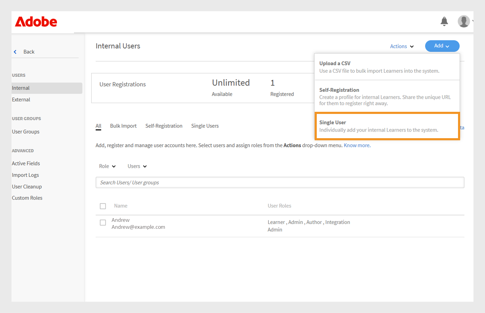
   _管理員介面顯示手動新增單一內部使用者的選項_
4. 在&#x200B;**新增使用者**&#x200B;提示上，輸入使用者的&#x200B;**名稱**、**電子郵件**&#x200B;和&#x200B;**設定檔** （職稱）。

   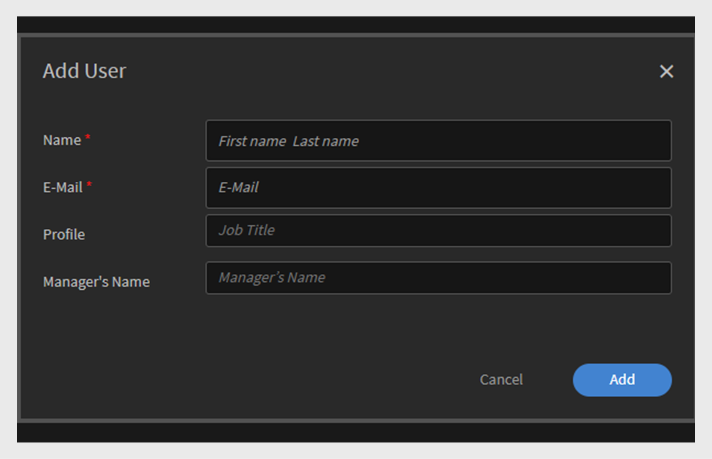
   _輸入新使用者的姓名、電子郵件、唯一識別碼和設定檔的欄位_
5. 搜尋使用者的管理員，並從管理員清單中選取名稱。
6. 選取&#x200B;**新增**。
使用者會收到包含存取登入URL的歡迎電子郵件。

### 允許內部使用者自行註冊

自助註冊是自助式上線流程，使用者可在此流程中造訪註冊URL、輸入其詳細資訊，以及自動在平台中註冊。 此方法可讓使用者透過提供的URL註冊自己，以儘量減少管理工作。

若要建立使用者的自我註冊URL：

1. 以管理員身分登入。
2. 選取&#x200B;**使用者**，然後選擇&#x200B;**內部**。
3. 選取「**新增**」，然後選擇「**自我註冊」。**

   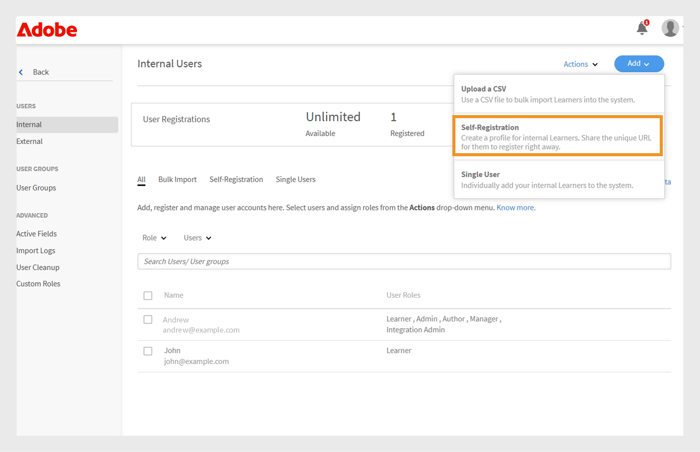
   _選取自助註冊選項的下拉式功能表_
4. 在&#x200B;**新增自我註冊設定檔**&#x200B;提示上，在&#x200B;**設定檔名稱** （使用者的職稱）欄位中輸入設定檔。
5. 在&#x200B;**管理員名稱**&#x200B;欄位中搜尋管理員，以選取使用者的管理員。 指派給自助註冊設定檔的管理員應該是Adobe Learning Manager中的註冊使用者。

   
   _用來設定設定檔名稱及指派管理員給自我註冊設定檔的輸入欄位_
6. 使用&#x200B;**新增影像**&#x200B;選項選取影像。 設定檔區段中的學習者可看見此影像。
7. 選取&#x200B;**儲存**。

   Adobe Learning Manager會建立使用者設定檔並產生自助註冊URL，此URL可與使用者共用以完成其註冊。

   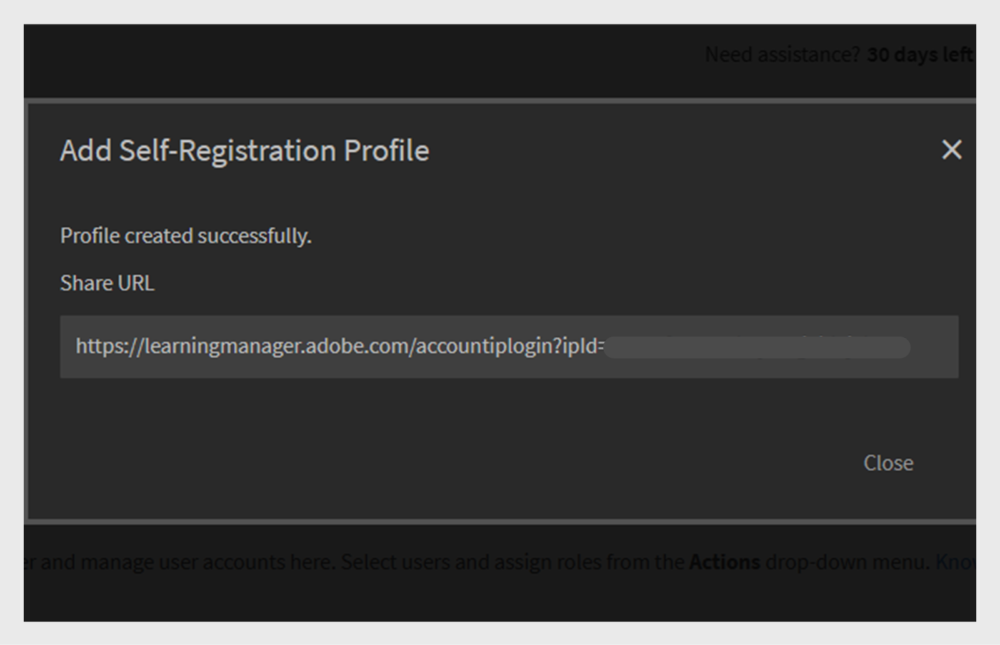
   _確認訊息，表示已成功建立自助註冊URL_
8. 與想要自行註冊的使用者共用URL。

   此URL可與多位使用者共用以進行註冊。 例如，您可以產生&#x200B;**Sales Associate**&#x200B;設定檔的URL，並與Sales Associate團隊共用，讓他們可以註冊。

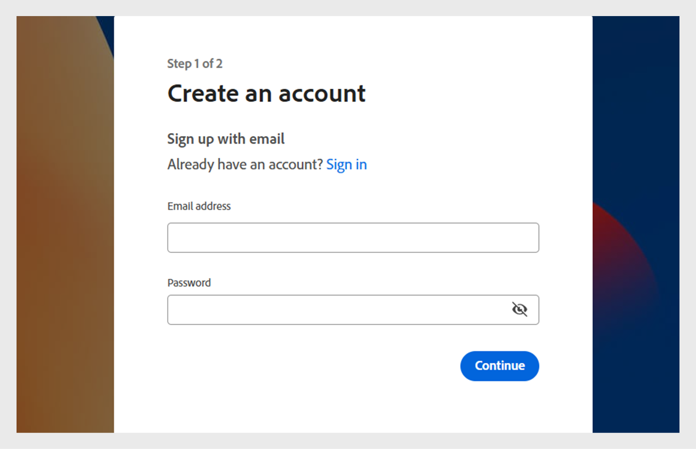
_自助註冊連結會開啟註冊頁面_

### 檢視自助註冊URL的清單

若要檢視自行註冊URL清單：

1. 選取&#x200B;**使用者**，然後選擇&#x200B;**內部**。
2. 選取&#x200B;**自行註冊**。

   管理員可檢視自我註冊URL清單。

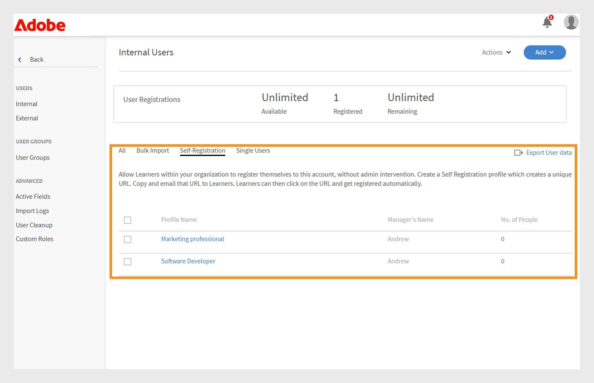
_清單檢視顯示內部使用者可用的現有自我註冊URL_

### 大量上傳內部使用者

管理員可透過上傳包含使用者資訊（例如姓名、電子郵件地址和管理者姓名）的CSV檔案，一次新增多個使用者。 與個別新增使用者相比，這項大量上傳功能可節省時間和精力。

>[!INFO]
>
>觀看這場ALM Academy培訓，瞭解如何透過CSV大量新增使用者。   

若要新增多個使用者：

1. 以管理員身分登入。
2. 選取&#x200B;**使用者**，然後選擇&#x200B;**內部**。
3. 選取[新增] **&#x200B;**，然後選擇[上傳CSV] **。**

   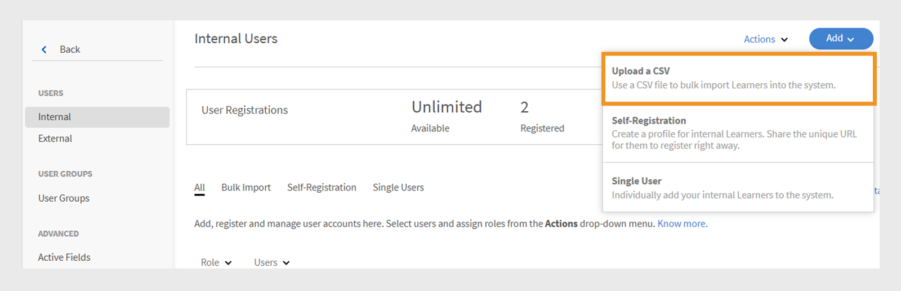
   _可上傳CSV檔案以大量匯入使用者的選項_

4. 準備包含下列欄位的CSV檔案：

   * 員工姓名*
   * 員工電子郵件*
   * 員工的設定檔/指定
   * 經理ID/電子郵件\
     (*)必填欄位。

5. 在為任何員工新增經理的電子郵件ID之前，請確保該經理已作為員工包含在CSV檔案中。 例如，在下方的快照中檢視名為Howard Walters的員工。

   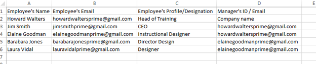
   _包含所有欄位的範例CSV影像_

6. 上傳CSV檔案並對應相應的資料欄位。

   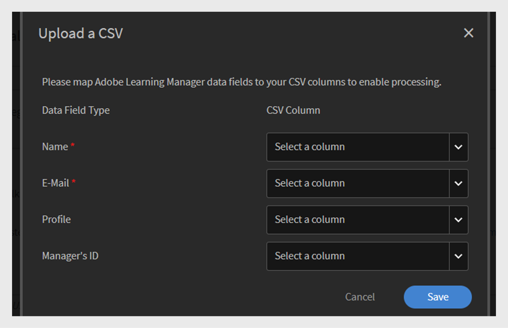
   _CSV對應介面，將試算表欄與系統欄位對齊_
7. 選取&#x200B;**儲存**&#x200B;以匯入使用者。

   上傳成功後會顯示確認訊息。

   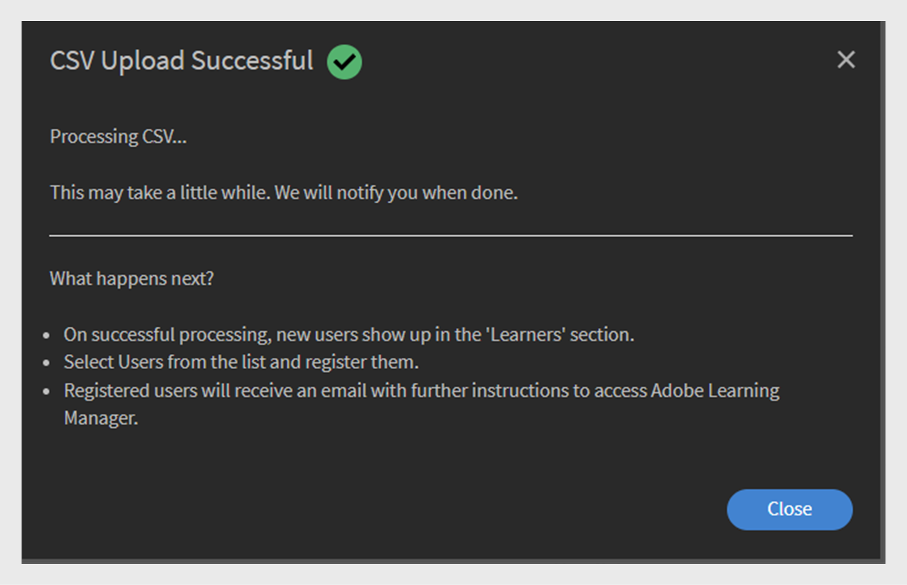
   _影像將CSV上傳的狀態顯示為成功_

>[!NOTE]
>
>維護所有新增和刪除的主CSV。 不支援更新及重新上傳現有的CSV檔案。

上傳CSV檔案以新增使用者時，請務必以正確順序包含所有相關資訊。 如果您將經理的電子郵件ID指派給員工，則經理的詳細資料必須較早地顯示在CSV檔案中。 這可確保系統在將管理員連結至其團隊成員之前，將其識別為現有使用者。 例如，如果Howard Walters是經理，請先在CSV中納入他的完整使用者詳細資訊，再列出向他報告的員工。

### 管理使用者註冊

個別或大量新增使用者後，您需要註冊他們以啟動其帳戶。 這可讓使用者存取Adobe Learning Manager並開始使用平台。

註冊使用者：

1. 在管理員首頁上選取&#x200B;**使用者**。
2. 選取您要註冊之使用者名稱旁的核取方塊。
3. 選取&#x200B;**動作**，然後選擇&#x200B;**註冊**。

   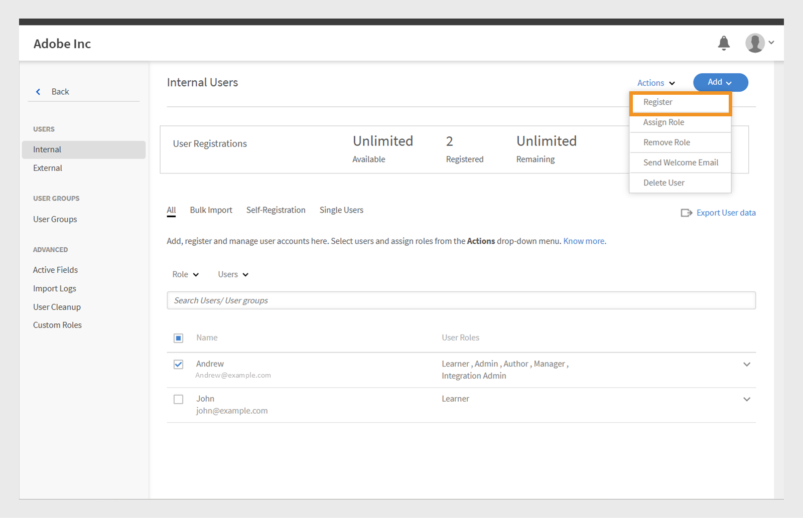
   _註冊按鈕以啟用Adobe Learning Manager中選取的使用者_

4. 選取&#x200B;**是**&#x200B;以啟動使用者。

驗證電子郵件會傳送給使用者。 使用者必須選取電子郵件中的連結，才能啟動其帳戶並開始使用Adobe Learning Manager。

## 外部使用者

Adobe Learning Manager可讓您新增公司以外的使用者（例如客戶、合作夥伴、廠商或客戶）以存取學習內容。 新增課程後，您就能進行分組、指派課程及追蹤其學習進度。

在Adobe Learning Manager中新增外部使用者涉及以下步驟：

* 建立外部註冊設定檔
* 啟用註冊設定檔
* 與外部使用者共用註冊連結
* 需要時暫停或恢復設定檔

Adobe Learning Manager支援透過外部註冊設定檔註冊這類使用者。

若要建立外部使用者，請遵循下列步驟：

1. 以管理員身分登入。
2. 選取&#x200B;**使用者**，然後選擇&#x200B;**外部**。
3. 選取&#x200B;**新增**&#x200B;以建立外部使用者的註冊。
4. 在&#x200B;**新增外部註冊設定檔**&#x200B;對話方塊中，提供下列專案：

   * **設定檔名稱：**&#x200B;請鍵入名稱。
   * **管理員電子郵件：**&#x200B;輸入管理員的電子郵件地址。
   * **名額限制：**&#x200B;設定允許註冊數目上限。
   * **到期日：**&#x200B;定義新註冊的最後日期。 到期後，此連結將無法用於新使用者註冊。

   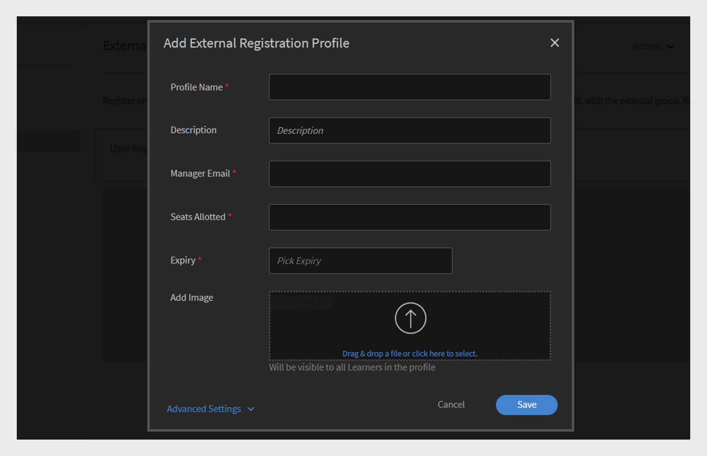
   _用於輸入設定檔名稱、經理電子郵件、名額限制和到期日的對話方塊_

5. 使用&#x200B;**新增影像**&#x200B;選項選取影像。 設定檔區段中的學習者可看見此影像。
6. 選取「**進階設定**」區段以展開並輸入必要的詳細資料：
   * **登入需求：**&#x200B;輸入天數。 如果學習者在整個期間都停用，系統會自動將其移除。
   * **允許的網域：**&#x200B;請輸入允許的電子郵件網域清單（以逗號分隔）。 只有擁有來自已核准網域的電子郵件地址的使用者才能註冊。
   * **需要電子郵件驗證：**&#x200B;選取此項以在註冊期間強制執行電子郵件驗證。

   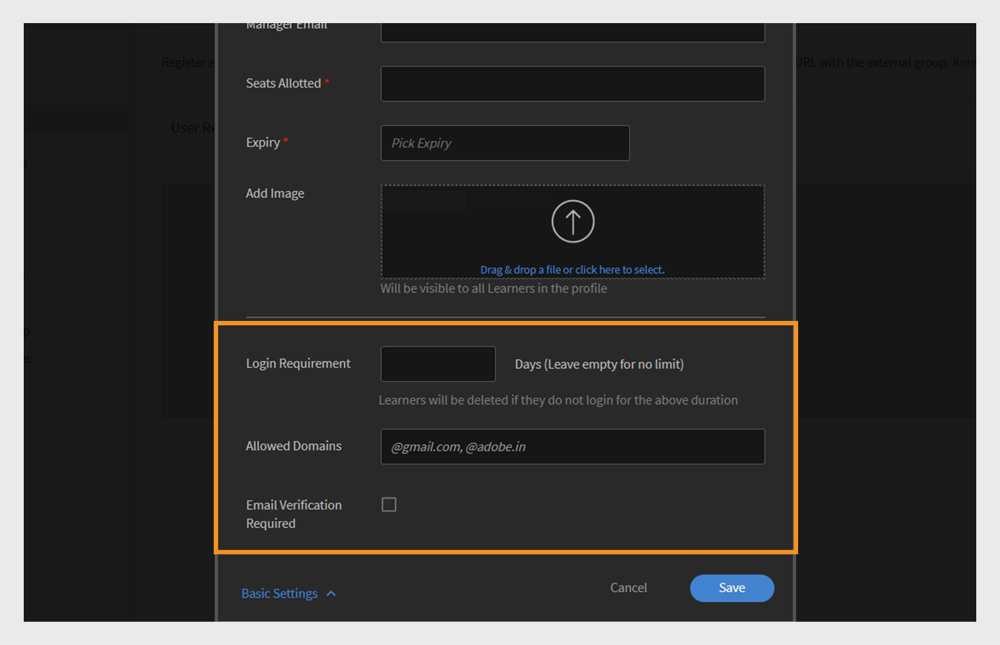
   _進階設定面板，可設定登入需求、允許的網域及電子郵件驗證_

7. 選取&#x200B;**儲存**。

已產生註冊URL。

### 啟用外部設定檔

若要啟用外部設定檔：

1. 在外部設定檔清單中找出新建立的設定檔。
2. 選取&#x200B;**狀態**&#x200B;切換按鈕以啟用它。

管理員可與外部合作夥伴共用此URL，讓他們可以註冊並使用它登入Adobe Learning Manager。

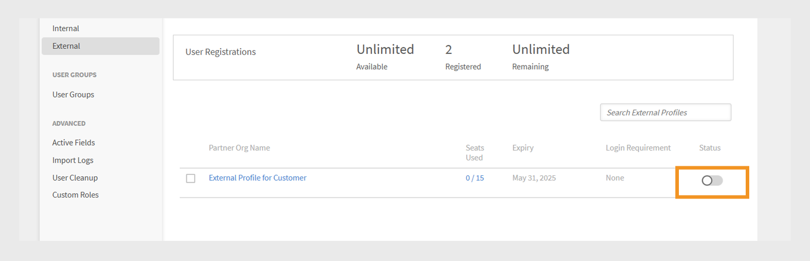
_選取切換以啟用外部設定檔_

### 複製並共用外部設定檔的註冊URL

外部設定檔的註冊URL可以從&#x200B;**外部使用者**&#x200B;區段複製。

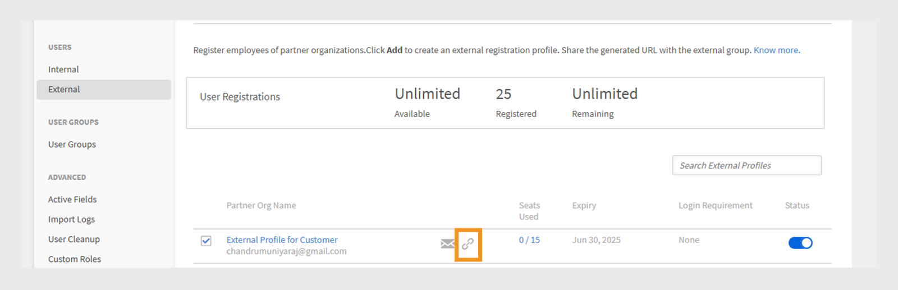
_複製外部設定檔的註冊URL_

### 內部和外部使用者註冊之間的主要差異

內部註冊和外部註冊之間有些差異：

| 內部使用者 | 外部使用者 |
|---|---|
| 可使用Adobe ID或SSO憑證登入。 | 可使用任何電子郵件ID登入。 |
| gamification現已推出。 | gamification現已推出。 管理員必須在[Gamification設定](https://experienceleague.adobe.com/en/docs/learning-manager/using/admin/gamification)中為外部學習者啟用gamification。 |

### 暫停外部註冊設定檔

在Adobe Learning Manager中，管理員可以透過暫停其設定檔來管理外部使用者註冊。 當您想要暫時暫停新使用者使用特定外部註冊設定檔加入時，這會很有幫助。 暫停設定檔會使收到邀請但尚未註冊的使用者無法完成註冊程式。 此動作不會影響已完成註冊的使用者。

暫停外部設定檔：

1. 選取&#x200B;**外部使用者**&#x200B;頁面右上角的&#x200B;**動作**。
2. 選取&#x200B;**暫停**&#x200B;以暫停外部註冊設定檔。

這會封鎖未接受邀請的使用者之新註冊。 請注意，此動作只會影響尚未完成註冊的使用者。

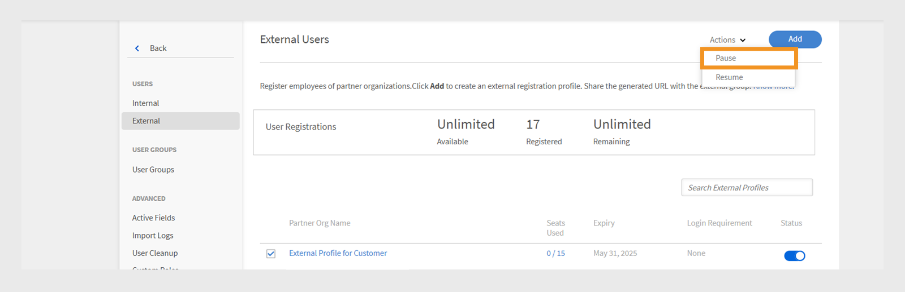
_從[動作]功能表暫停現有外部註冊設定檔的選項_

### 繼續外部註冊設定檔

如果先前暫停了外部設定檔，管理員可以恢復該設定檔，以允許新使用者完成註冊。 這會針對受邀但未完成註冊的使用者重新啟用註冊程式。

若要繼續外部使用者：

1. 選取頁面右上角的&#x200B;**動作**。
2. 選取&#x200B;**繼續**&#x200B;以繼續暫停夥伴的存取。

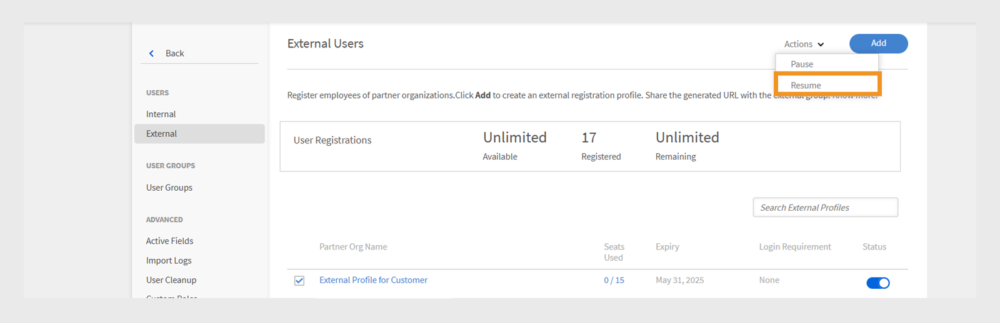
_繼續先前暫停的外部註冊設定檔的選項_

### 監視外部座位使用情況

管理員可以在Adobe學習中追蹤新增到每個外部設定檔的使用者數量。

檢查已使用的座位：

1. 在外部設定檔清單中選取&#x200B;**已使用的座位**。

您可以檢視新增至合作夥伴組織的學習者人數，以及學習者是否活躍。

## 管理使用者

管理員可以編輯使用者詳細資訊、刪除使用者、指派角色及移除角色。 這可協助確保每位使用者都擁有正確的存取權和工作。

>[!INFO]
>
>觀看這場ALM Academy培訓，瞭解如何指派和移除角色、傳送歡迎電子郵件，以及刪除和清除使用者。 [！[按鈕]](https://content.adobelearningmanageracademy.com/app/learner?accountId=98632#/course/7555586) 

### 編輯使用者

使用Adobe Learning Manager中的&#x200B;**編輯使用者**&#x200B;選項來更新使用者的設定檔資訊，例如，名稱、電子郵件地址、唯一識別碼、設定檔和管理員名稱。 管理員可進行這些變更，以確保使用者資料保持準確且為最新狀態。

若要編輯使用者：

1. 在管理員首頁上選取&#x200B;**使用者**。
2. 從&#x200B;**使用者**&#x200B;清單中選取您要編輯的使用者。
3. 選取&#x200B;**編輯設定檔**。

   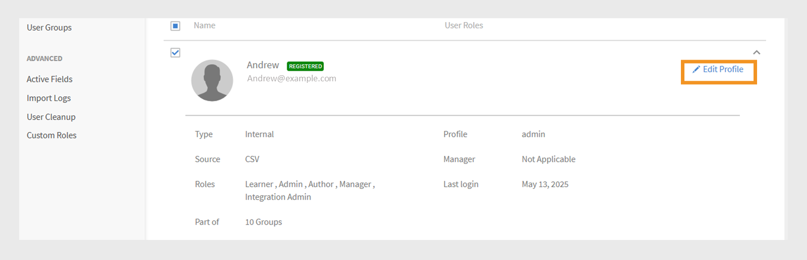
   _在[動作]功能表下的[刪除使用者]選項，將使用者從平台移除_

4. 選取&#x200B;**是**&#x200B;以刪除使用者。

成功刪除使用者後，系統會顯示確認訊息。

## 指派角色給使用者

Adobe Learning Manager中的使用者角色會定義每個人都能在系統中執行的動作。 每個角色都根據使用者的職責提供特定許可權。

Adobe Learning Manager支援下列使用者角色：

* **管理員**：管理使用者和使用者群組、指派角色，以及設定系統範圍的喜好設定，例如資料來源、允許的網域和顯示選項。 管理員也負責建立及組織學習內容、追蹤學習者進度、產生報表，以及設定與外部系統的整合。
* **作者**：建立及管理內容，包括模組及課程。
* **經理**：監督團隊學習活動、指派課程團隊成員、核准請求，以及提供意見回饋。
* **整合管理員**：管理ALM與外部平台之間的系統整合和資料連線。
* **自訂角色**：管理員可以建立自訂角色，根據使用者的職責為其提供量身打造的存取權。 請參閱此[文章](/help/migrated/administrators/feature-summary/custom-role.md)，瞭解自訂角色的詳細資訊。

若要指派角色給使用者：

1. 在管理員首頁上選取&#x200B;**使用者**。
2. 選取您要指派角色的使用者。
3. 選取右上角的&#x200B;**動作**。
4. 選取&#x200B;**指派角色**。
5. 選取所需的角色。

   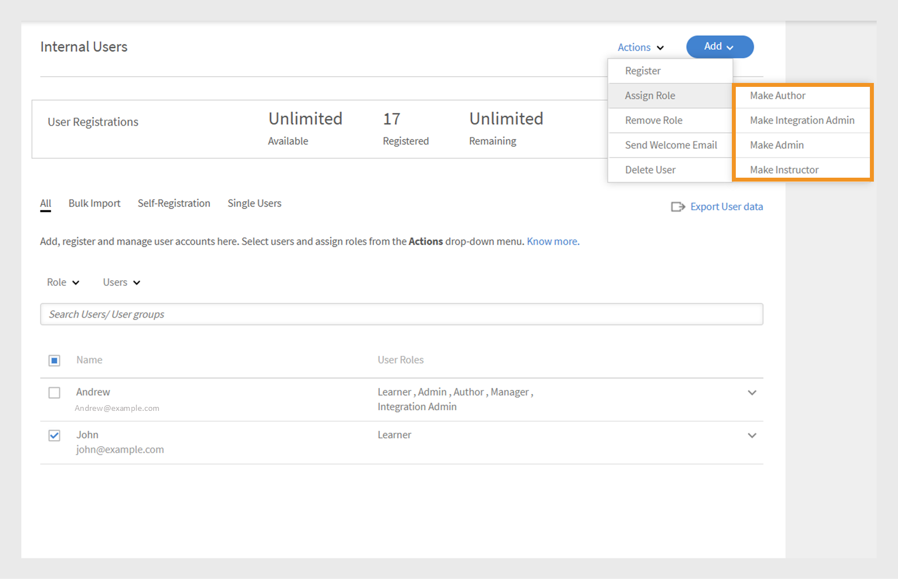
   _指派角色功能表選項顯示所選使用者的可用角色_

6. 在確認對話方塊上選取&#x200B;**是**。

## 移除角色

移除使用者角色會撤銷該角色所授予的許可權。

若要從使用者中移除角色：

1. 在系統管理員首頁上選取&#x200B;**使用者**。
2. 選取您要移除其角色的使用者。
3. 選取&#x200B;**動作**，然後選取&#x200B;**移除角色**。

   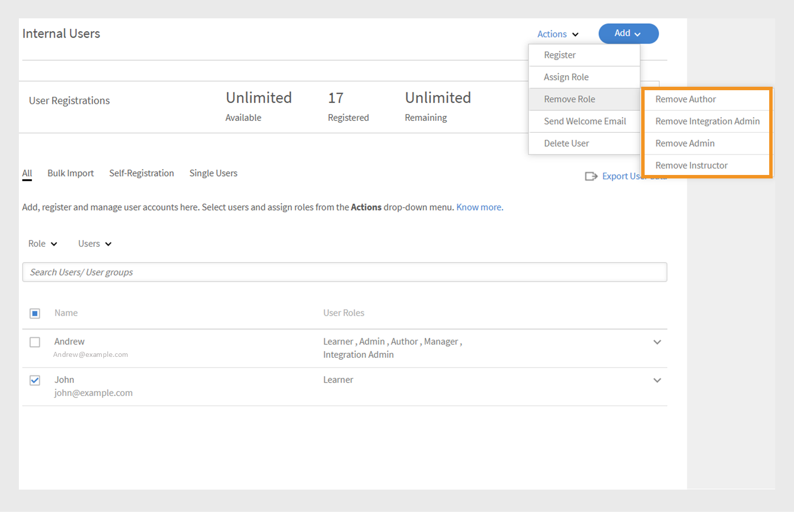
   _從[動作]功能表下的使用者移除指派角色的選項_

4. 在確認對話方塊上選取&#x200B;**是**。
