# 在 Adobe Learning Manager 新增使用者

在 Adobe Learning Manager 中，使用者是使用平台進行學習或訓練的學習者。 使用者分為兩種：內部使用者與外部使用者。

內部使用者是你組織中的員工或團隊成員。

外部使用者是公司外部的學習者，例如客戶、合作夥伴、供應商或客戶，他們可以存取你的學習內容。

Adobe Learning Manager （ALM） 允許管理員透過多種方式（包括手動輸入、CSV 上傳、自我註冊及系統整合）來導入並管理內部及外部使用者。

## 內部使用者

Adobe Learning Manager 中的內部使用者指的是組織內的員工或團隊成員。 你可以手動新增、批量上傳，或透過系統整合匯入。 新增這些使用者後，你可以將他們組織成群組、指派課程，並監控他們的學習進度。

Adobe Learning Manager 的使用者可依據分配角色承擔不同職責並管理各種任務。 每個角色，包括管理員、作者、講師及整合管理員，皆提供一套專門的能力，以支援使用者在平台上的職責。

### 新增內部使用者的方法

管理員可透過以下方法新增內部使用者：

* **新增單一使用者**：一次手動新增一位使用者。
* **自助註冊設定檔**：允許學習者使用管理員建立的註冊連結，在 Adobe Learning Manager 中自行註冊為學習者。
* **透過 CSV** 大量上傳：上傳 CSV 檔案，同時新增多個使用者。

### 手動新增一個內部使用者

管理員可以透過提供使用者的姓名、電子郵件、唯一識別碼及管理員姓名來手動新增。 Adobe Learning Manager 中的唯一識別碼是管理員在建立使用者時必須指派的識別碼。 它必須對每位使用者獨一無二，並在整個系統中作為一致的參考。

>[!INFO]
>
>觀看這場 ALM Academy 培訓，了解如何在 Adobe Learning Manager 中新增單一使用者。  

要新增單一使用者到 Adobe Learning Manager：

1. 以管理員身份登入。
2. 選擇&#x200B;**使用者**，然後選擇&#x200B;**內部。**
3. 選擇 **新增**，再選擇 **單一使用者**。

   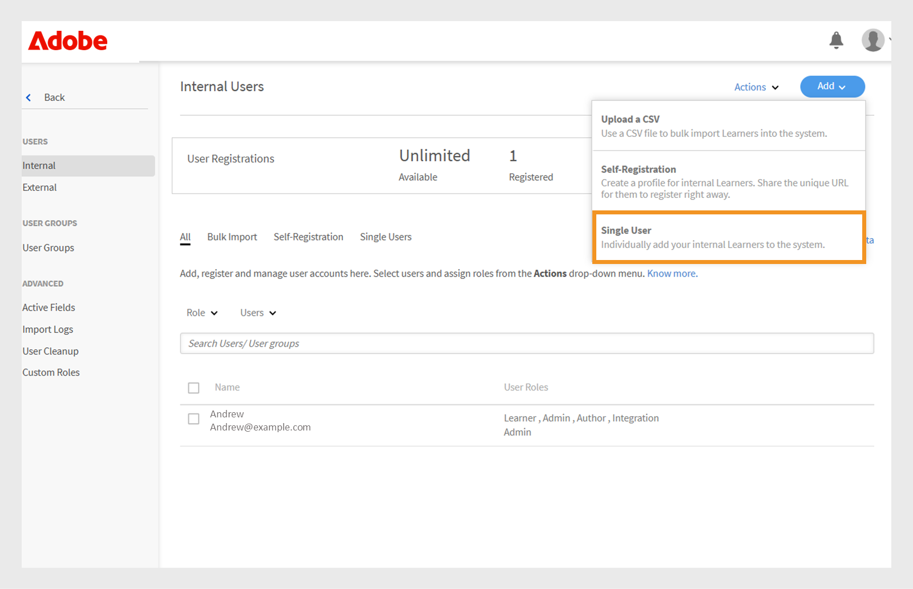
   _管理員介面顯示手動新增單一內部使用者的選項_
4. 在新增 **使用者** 提示時，輸入 **使用者的姓名**、 **電子郵件** 及 **個人資料** （職稱）。

   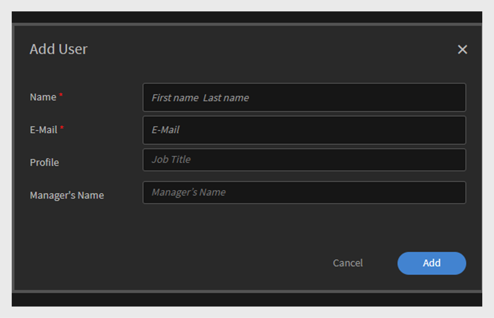
   _輸入新使用者姓名、電子郵件、唯一識別碼及個人資料欄位_
5. 搜尋使用者的管理員，並從管理員列表中選擇該名稱。
6. 選擇 **新增**。使用者會收到一封包含登入網址的歡迎電子郵件。

### 允許內部使用者自行註冊

自助註冊是一種自助入職流程，使用者可造訪註冊網址，輸入資料，並自動註冊平台。 此方法透過使用者透過提供的網址註冊，減少了管理工作量。

要為使用者建立自我註冊網址：

1. 以管理員身份登入。
2. 選擇&#x200B;**使用者**，然後選擇&#x200B;**內部。**
3. 選擇 **新增**，然後選擇 **自助註冊。**

   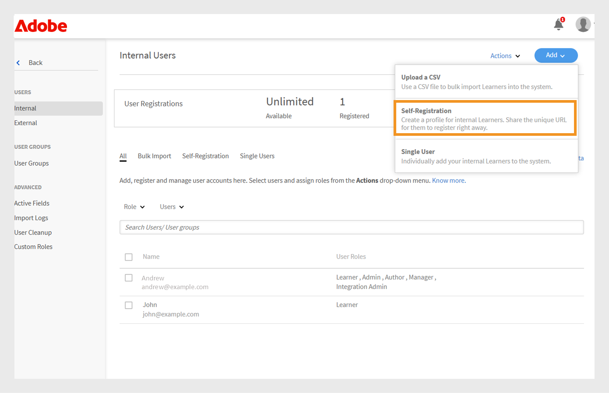
   _選擇自助報名選項的下拉選單_
4. 在 **「新增自我註冊個人資料** 」提示中，請在 **個人資料名稱** （使用者職稱）欄位輸入該個人資料。
5. 在管理員名稱&#x200B;**欄位搜尋該使用者的管理員**。分配給自我註冊設定檔的管理員應該是 Adobe Learning Manager 的註冊使用者。

   
   _設定設定檔名稱及指派經理至自我註冊設定檔的輸入欄位_
6. 請使用 **新增圖片** 選項選擇圖片。 此圖片會在個人檔案區段顯示給學習者。
7. 選擇 **儲存**。

   Adobe Learning Manager 會建立使用者個人檔案並產生自我註冊網址，該網址可分享給使用者以完成註冊。

   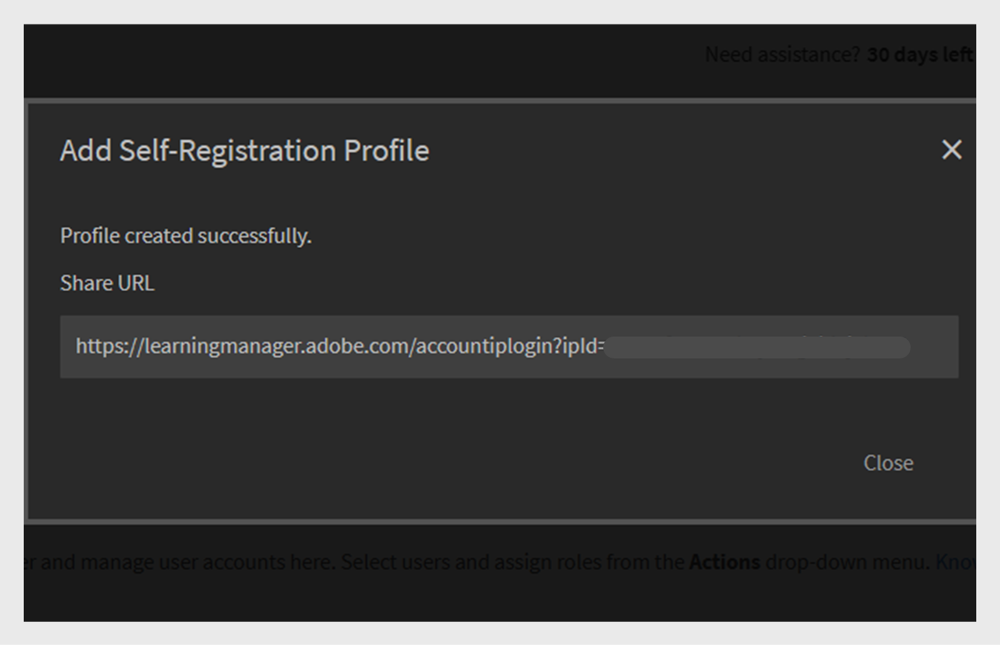
   _確認訊息顯示成功建立自我註冊網址_
8. 請將網址分享給想要自行註冊的用戶。

   該網址可與多位使用者共用以供註冊。 例如，你可以為銷售助理&#x200B;**建立個人檔案的網址**，並與銷售助理團隊分享，讓他們能自行註冊。

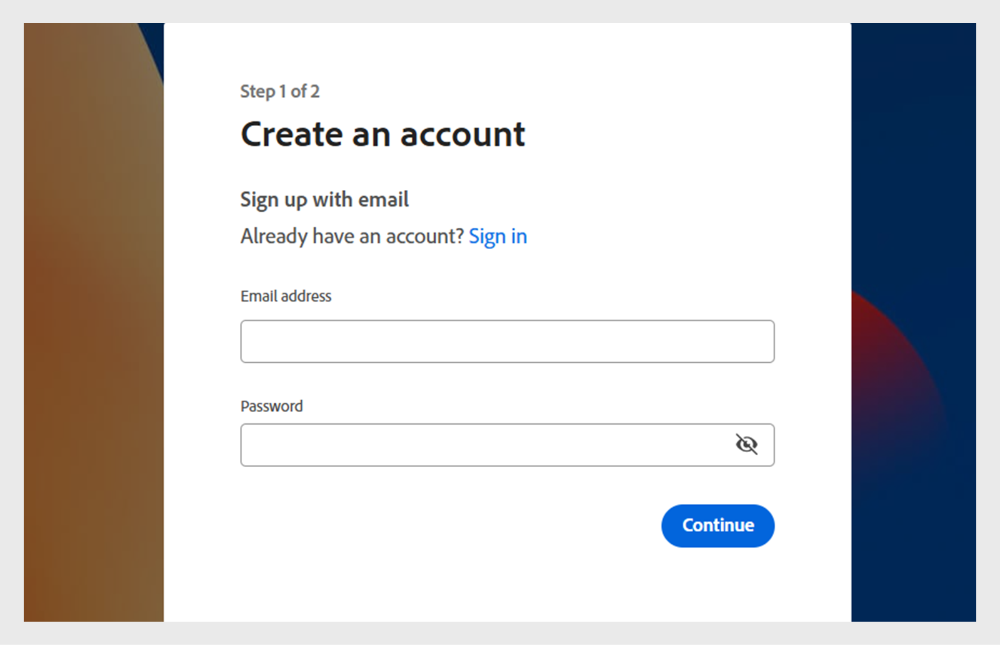
_自助註冊連結開啟報名頁面_

### 查看自助註冊網址列表

要查看自助註冊網址清單：

1. 選擇&#x200B;**使用者**，然後選擇&#x200B;**內部。**
2. 選擇 **自助註冊**。

   管理員可以看到自助註冊網址清單。

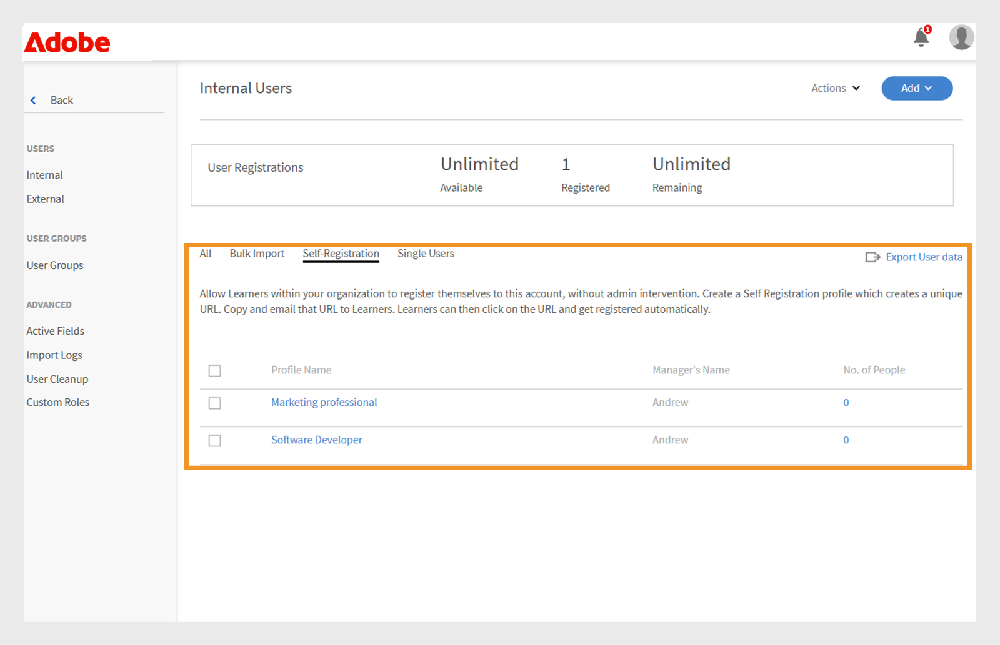
_列表檢視，顯示現有內部用戶可自行註冊的網址_

### 內部用戶大量上傳

管理員可透過上傳包含姓名、電子郵件地址及經理姓名等使用者資訊的 CSV 檔案，同時新增多個使用者。 此批量上傳功能比起個別新增用戶節省時間與精力。

>[!INFO]
>
>觀看這段 ALM Academy 培訓，學習如何透過 CSV 批量新增使用者。   

要新增多位使用者：

1. 以管理員身份登入。
2. 選擇&#x200B;**使用者**，然後選擇&#x200B;**內部。**
3. 選擇 **新增**，然後選擇 **上傳 CSV**。

   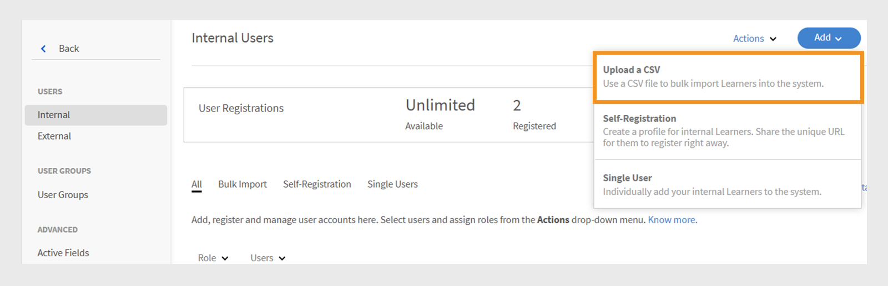
   _有個選項可以上傳 CSV 檔案以便大量使用者匯入_

4. 準備包含以下欄位的 CSV 檔案：

   * 員工姓名*
   * 員工電子郵件*
   * 員工檔案/職稱
   * 經理的證件/電子郵件\
     (*)必填欄位。

5. 在為任何員工新增經理的電子郵件 ID 前，請確保該經理已在 CSV 檔案中被列為員工。 例如，請參考下方快照中名叫 Howard Walters 的員工。

   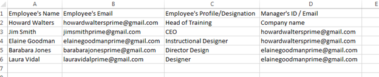
   _範例 CSV 圖片，包含所有欄位_

6. 上傳 CSV 檔案並相應地映射資料欄位。

   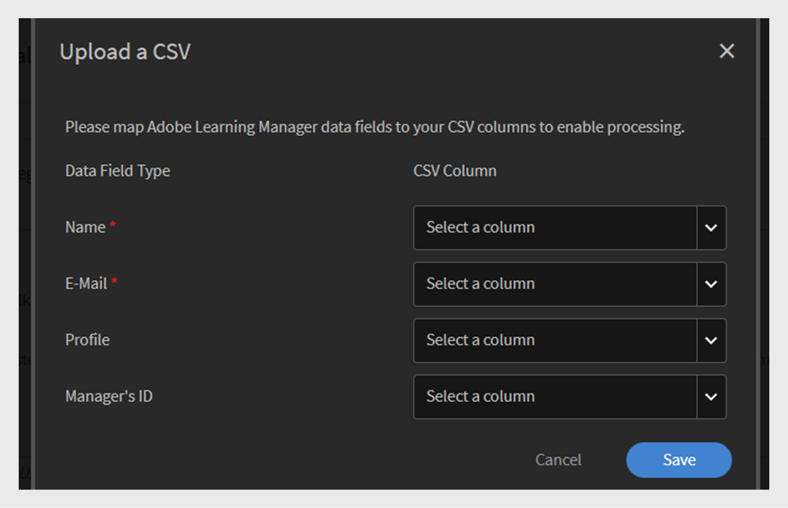
   _CSV 映射介面用於將試算表欄位與系統欄位對齊_
7. 選擇 **儲存** 以匯入使用者。

   上傳成功後會顯示確認訊息。

   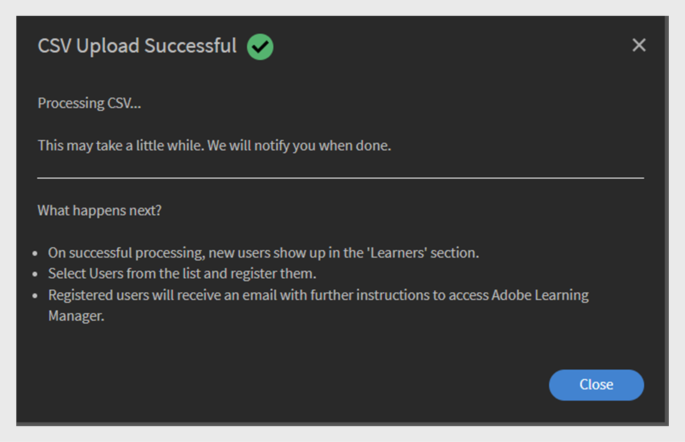
   _圖片顯示 CSV 上傳狀態為成功_

>[!NOTE]
>
>為所有新增和刪除都維護一個主 CSV 檔案。 不支援更新並重新上傳現有的 CSV 檔案。

上傳 CSV 檔案以新增使用者時，務必依正確順序包含所有相關資訊。 如果你把經理的電子郵件 ID 指派給員工，經理的詳細資料必須在 CSV 檔案中更早出現。 這確保系統在將經理與團隊成員連結前，先將該經理視為現有使用者。 例如，如果 Howard Walters 是經理，請在 CSV 中包含他的完整用戶資料，再列出向他報告的員工。

### 管理使用者註冊

在單獨或批量新增用戶後，你需要註冊他們才能啟用他們的帳號。 這讓使用者能存取 Adobe Learning Manager 並開始使用該平台。

註冊使用者：

1. 在管理員首頁選擇 **使用者** 。
2. 請在你想註冊的使用者名稱旁勾選勾選方塊。
3. 選擇 **動作**，然後選擇 **註冊**。

   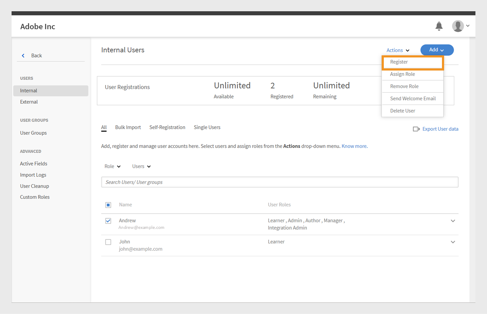
   _註冊按鈕以啟用 Adobe Learning Manager 中選定的使用者_

4. 選擇 **「是** 」以啟用該使用者。

會發送一封驗證電子郵件給使用者。 使用者必須選擇電子郵件中的連結來啟用帳號並開始使用 Adobe Learning Manager。

### 下載用戶報告

管理員可以匯出並下載使用者資料作為完整報告。 透過匯出這些資料，管理員能追蹤學習者活動、監控帳戶生命週期、識別非活躍使用者，並維持準確紀錄以供合規、稽核及報告使用。

下載用戶報告：

1. 以管理員身份登入 Adobe Learning Manager。
2. 選擇&#x200B;**使用者**，然後選擇&#x200B;**內部。**
3. 選擇 **匯出使用者資料**。 報告準備好時，您將收到通知。

   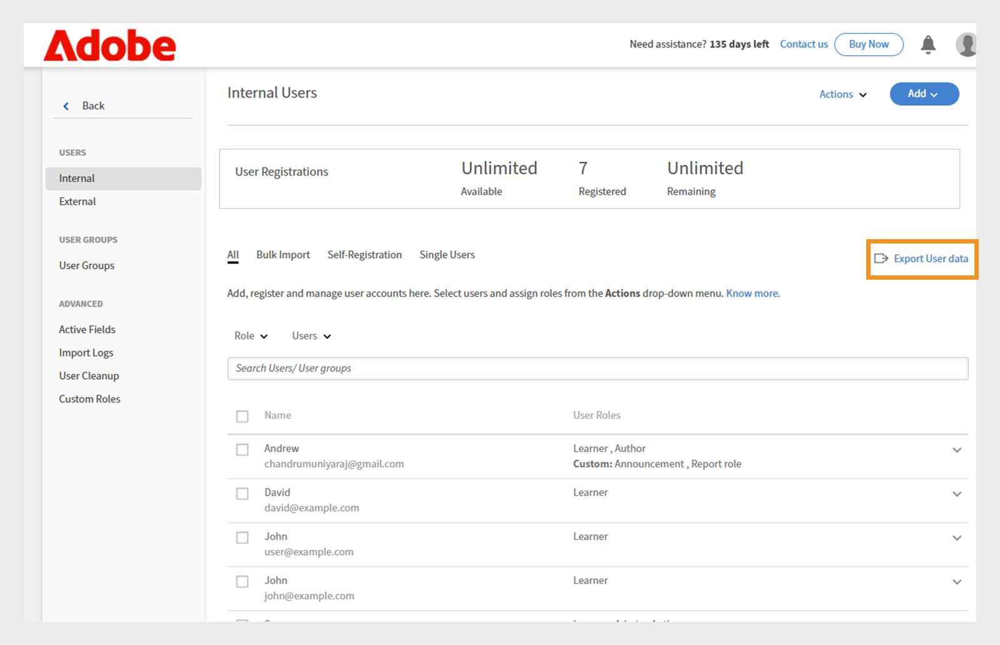
   _內部使用者區塊顯示匯出與下載使用者報告的選項。_
4. 選擇通知並下載用戶報告。

報告包含以下資訊：

* 名稱
* 電子郵件
* 現況
* 新增日期（UTC時區）
* 刪除日期（UTC時區）
* 最後登入日期（UTC 時區）
* Adobe ID
* 使用者狀態
* 簡介
* 介面語言
* 內容語言
* 時區
* 內部使用者識別碼
* 經理電子郵件

## 外部使用者

Adobe Learning Manager 允許你新增公司外的使用者，例如客戶、合作夥伴、供應商或客戶，以存取學習內容。 新增後，你可以將它們分組、指派課程並追蹤學習進度。

在 Adobe Learning Manager 中新增外部使用者需完成以下步驟：

* 建立外部註冊檔案
* 啟用註冊設定檔
* 與外部使用者分享註冊連結
* 需要時暫停或繼續個人檔案

Adobe Learning Manager 支援透過外部註冊設定檔註冊此類使用者。

要建立外部使用者，請依照以下步驟操作：

1. 以管理員身份登入。
2. 選擇&#x200B;**使用者**，然後選擇&#x200B;**外部。**
3. 選擇 **新增** 以建立外部使用者的註冊。
4. 在 **新增外部註冊資料** 對話框中，請提供以下資訊：

   * **個人資料名稱：** 輸入該名稱。
   * **經理電子郵件：** 輸入經理的電子郵件地址。
   * **名額限制：** 設定允許的最高報名人數。
   * **有效期限：** 定義新登記的最後期限。 過期後，該連結將無法使用新用戶註冊。

   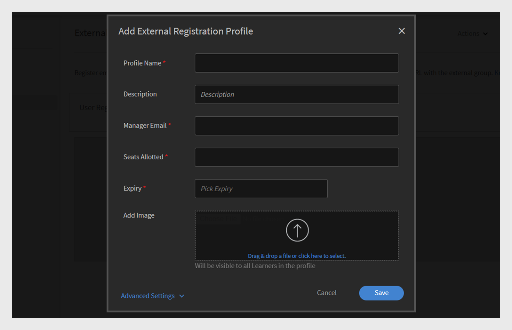
   _輸入個人檔案名稱、經理電子郵件、座位限制及到期日的對話框_

5. 請使用 **「新增圖片** 」選項選擇圖片。 此圖片會在個人檔案區段顯示給學習者。
6. 選擇 **「進階設定** 」區塊展開，並輸入所需細節：
   * **登入要求：** 輸入天數。 若學習者整期未活躍，將自動被移除。
   * **允許網域：** 輸入以逗號分隔的允許電子郵件網域清單。 只有擁有核准網域電子郵件地址的使用者才能註冊。
   * **電子郵件驗證要求：** 選擇此選項以強制註冊時的電子郵件驗證。

   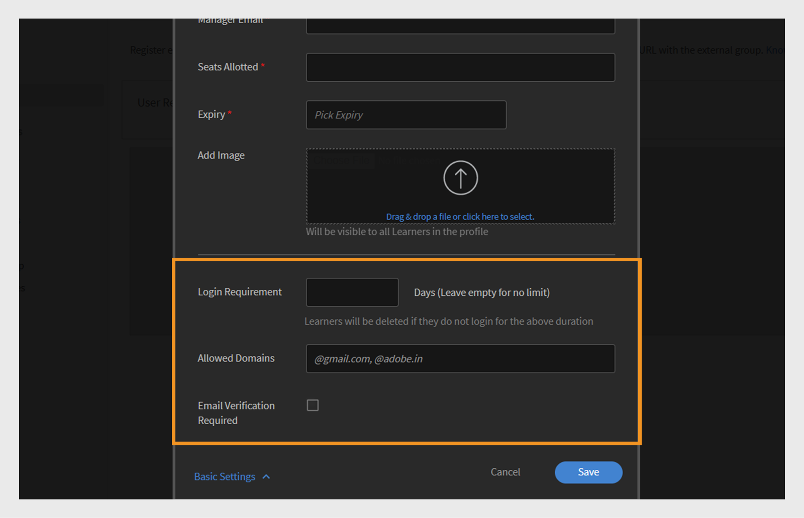
   _進階設定面板，可設定登入要求、允許網域及電子郵件驗證_

7. 選擇 **儲存**。

會產生一個註冊網址。

### 啟用外部設定檔

啟用外部設定檔：

1. 在外部設定檔列表中找到新建立的個人檔案。
2. 選擇&#x200B;**&#x200B;**&#x200B;狀態切換按鈕來啟用它。

管理員可以將此網址分享給外部合作夥伴，讓他們能註冊並登入 Adobe Learning Manager。

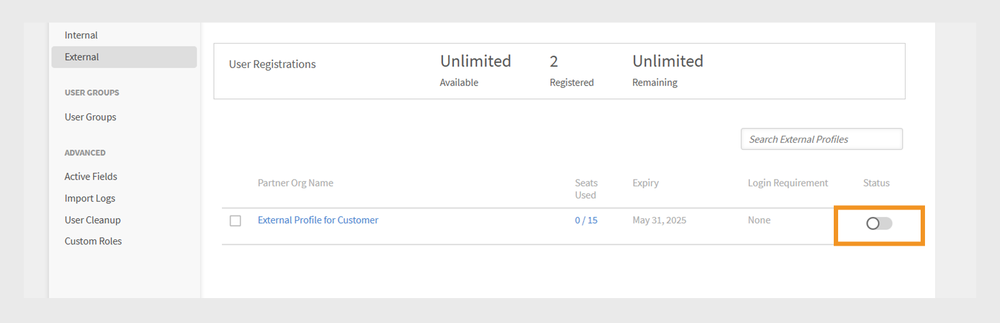
_選擇切換開關以啟用外部設定檔_

### 複製並分享外部個人檔案的註冊網址

外部個人檔案的註冊網址可從 **外部使用者** 區複製。

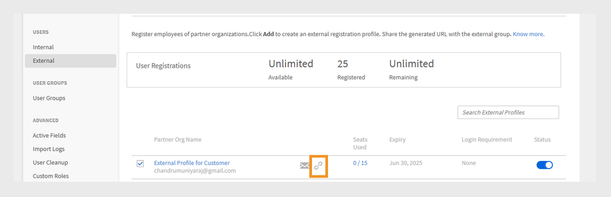
_複製外部設定檔的註冊網址_

### 內部與外部用戶註冊的主要差異

內部與外部註冊之間有幾項差異：

| 內部使用者 | 外部使用者 |
|---|---|
| 可以使用 Adobe ID 或 SSO 憑證登入。 | 可以用任何電子郵件 ID 登入。 |
| 遊戲化功能也已提供。 | 遊戲化功能也已提供。 管理員必須在 [遊戲化設定](https://experienceleague.adobe.com/en/docs/learning-manager/using/admin/gamification)中啟用外部學習者的遊戲化功能。 |

### 暫停外部註冊設定檔

在 Adobe Learning Manager 中，管理員可以透過暫停自己的個人檔案來管理外部使用者註冊。 當你想暫時暫停使用特定外部註冊帳號的新用戶加入時，這很有幫助。 暫停個人檔案會阻止已收到邀請但尚未註冊的用戶完成註冊流程。 此操作不影響已完成註冊的用戶。

要暫停外部設定檔：

1. 在外部使用者&#x200B;**頁面右上角**&#x200B;選擇&#x200B;**動作**。
2. 選擇 **暫停** 以暫停外部註冊設定檔。

這會阻擋尚未接受邀請的用戶的新註冊。 請注意，此操作僅影響尚未完成註冊的用戶。

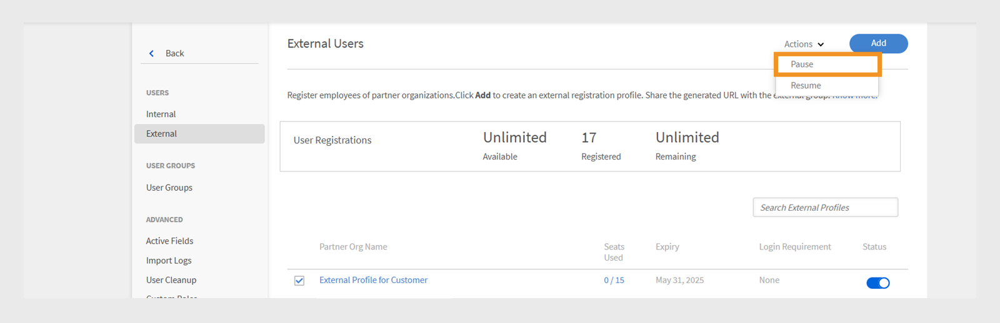
_從操作選單中暫停現有外部註冊設定檔的選項_

### 恢復外部註冊檔案

若先前暫停外部設定檔，管理員可恢復該設定檔，讓新用戶完成註冊。 這會重新啟動那些被邀請但未完成註冊的用戶的註冊流程。

要恢復外部使用者：

1. 選擇 **頁面右上角的動作** 。
2. 選擇 **履歷** 以恢復暫停的夥伴存取權限。

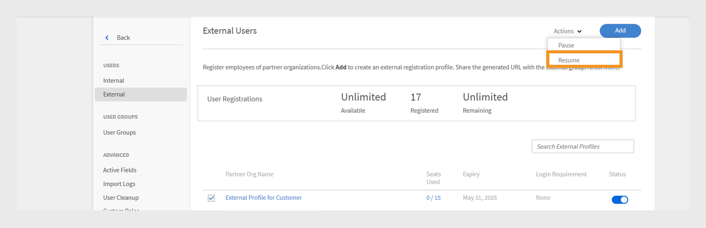
_恢復先前暫停的外部註冊檔案選項_

### 更改外部設定檔

管理員可以將學習者從一個外部設定檔重新分配到另一個設定檔。

要更改外部設定檔：

1. 以管理員身份登入 Adobe Learning Manager。
2. 選擇 **[!UICONTROL Users]** ，然後選擇 **[!UICONTROL External]**。
3. 在外部設定檔列表中選擇 **[!UICONTROL Seats Used]** 。

   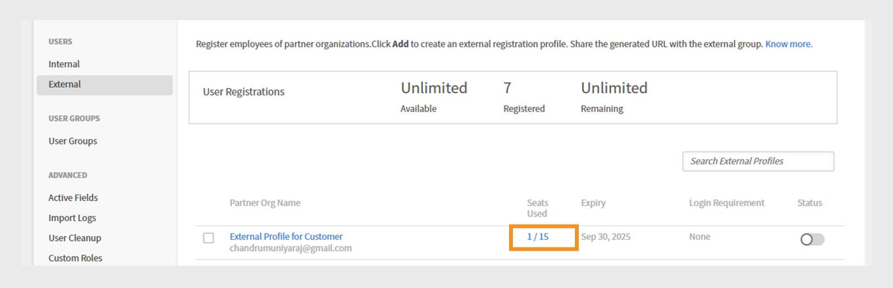
   _外部剖面顯示座位數量_

4. 選擇學習者，然後選擇 **[!UICONTROL Actions]**。

   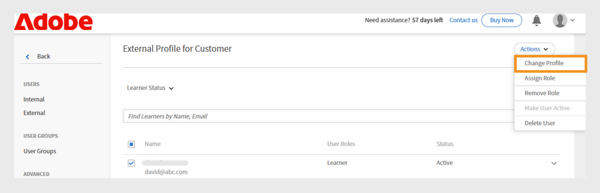
   _外部個人檔案頁面，重點顯示「變更個人檔案」選項，可將學習者移至不同個人檔案_

5. 選擇 **[!UICONTROL Change Profile]**。
6. 搜尋並選擇不同的外部設定檔。

   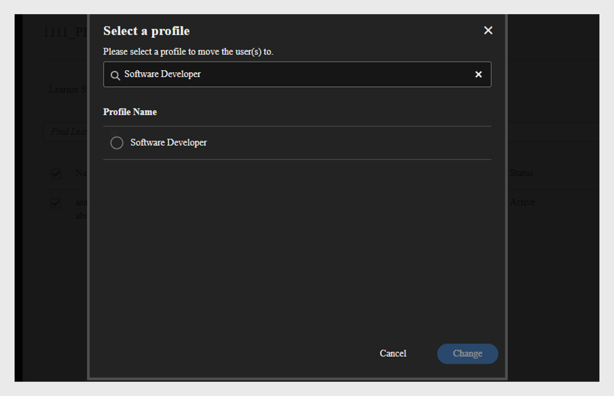
   _「變更個人檔案」提示會顯示搜尋外部個人檔案的選項_

被選中的學習者將移至所選的外部設定檔。

### 監控外部座椅使用情況

管理員可以在 Adobe Learning 中追蹤每個外部設定檔新增的使用者數量。

檢查使用過的座椅：

1. 外部檔案列表中所使用的&#x200B;**座位**&#x200B;選擇。

您可以查看新增到合作夥伴組織的學習者數量，以及這些學習者是否活躍。

## 管理使用者

管理員可以編輯使用者資訊、刪除使用者、指派角色以及移除角色。 這有助於確保每位使用者擁有正確的存取權限和任務。

>[!INFO]
>
>觀看這場 ALM Academy 培訓，學習如何指派與移除角色、發送歡迎電子郵件，以及刪除和清除使用者！ [[按鈕]](https://content.adobelearningmanageracademy.com/app/learner?accountId=98632#/course/7555586) 

### 編輯使用者

在 Adobe Learning Manager 中使用 **「編輯使用者** 」選項，更新使用者的個人檔案資訊，例如姓名、電子郵件地址、唯一識別碼、個人檔案及管理員名稱。 管理員可以進行這些變更，以確保使用者資料的準確性與最新性。

要編輯使用者：

1. 在管理員首頁選擇 **使用者** 。
2. 從使用者&#x200B;**列表中選擇你想編輯**&#x200B;的使用者。
3. 選擇 **編輯個人資料**。

   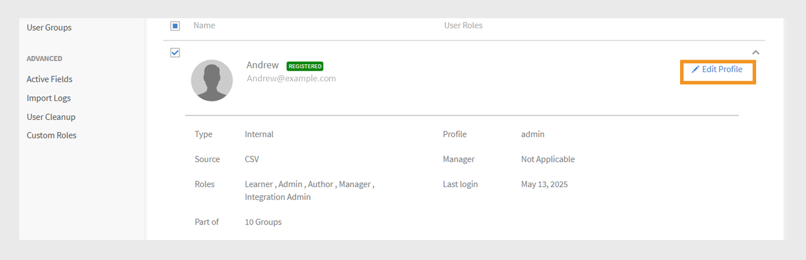
   _在動作選單中刪除使用者選項，將使用者從平台上移除_

4. 選擇 **「是** 」來刪除該使用者。

當使用者成功刪除時，會顯示確認訊息。

## 將角色指派給使用者

Adobe Learning Manager 中的使用者角色定義了每個人在系統中可執行的動作。 每個角色根據使用者的職責擁有特定的權限。

Adobe Learning Manager 支援以下使用者角色：

* **管理員**：管理使用者與使用者群組、指派角色，並配置系統範圍偏好設定，如資料來源、允許的網域及顯示選項。 管理員同時負責創建與組織學習內容、追蹤學習進度、產生報告，以及設定與外部系統的整合。
* **作者**：創建並管理內容，包括模組與課程。
* **經理**：監督團隊學習活動，提名團隊成員參加課程，核准申請並提供回饋。
* **整合管理員**：管理系統整合與資料連接，連接 ALM 與外部平台。
* **自訂角色**：管理員可以建立自訂角色，根據使用者的職責提供客製化的存取權限。 有關自訂角色的更多資訊，請參閱本文[&#128279;](/help/migrated/administrators/feature-summary/custom-role.md)。

要將角色分配給使用者：

1. 在管理員首頁選擇 **使用者** 。
2. 選擇你想指派角色的使用者。
3. 請選擇 **右上角的動作** 。
4. 選擇 **指派角色**。
5. 選擇所需的角色。

   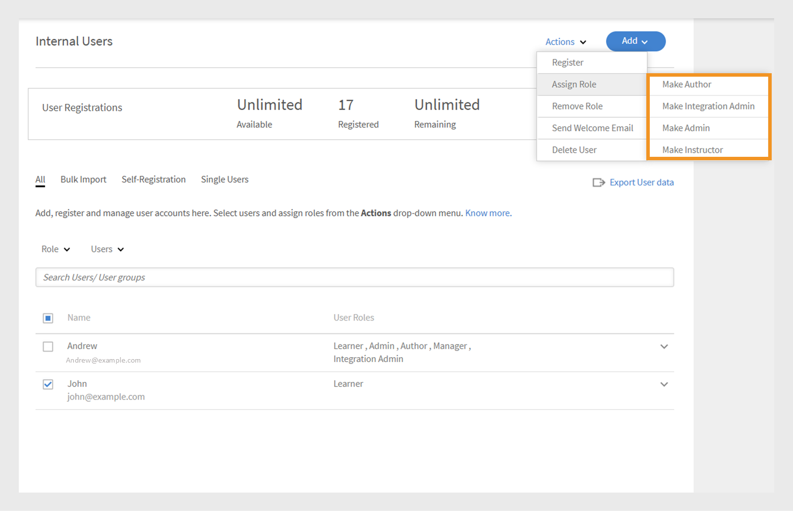
   _指派角色選單選項顯示所選使用者可用的角色_

6. 在確認對話框中選擇 **「是** 」。

## 移除角色

移除使用者角色會撤銷該角色所授予的權限。

要移除使用者的角色：

1. 在管理員首頁選擇 **使用者** 。
2. 選擇你想要移除角色的使用者。
3. 選擇 **動作** ，然後選擇 **移除角色**。

   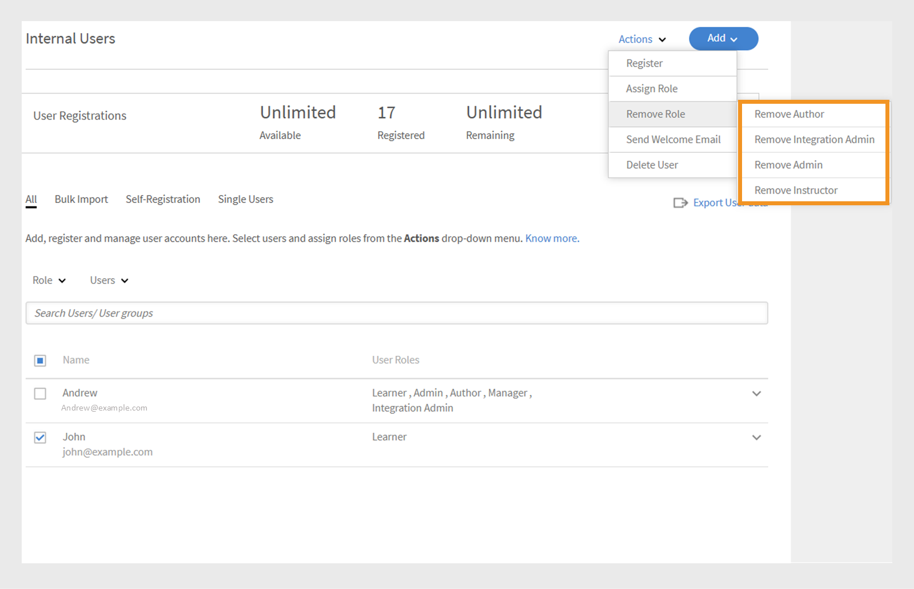
   _在「操作」選單中移除使用者所指派角色的選項_

4. 在確認對話框中選擇 **「是** 」。

