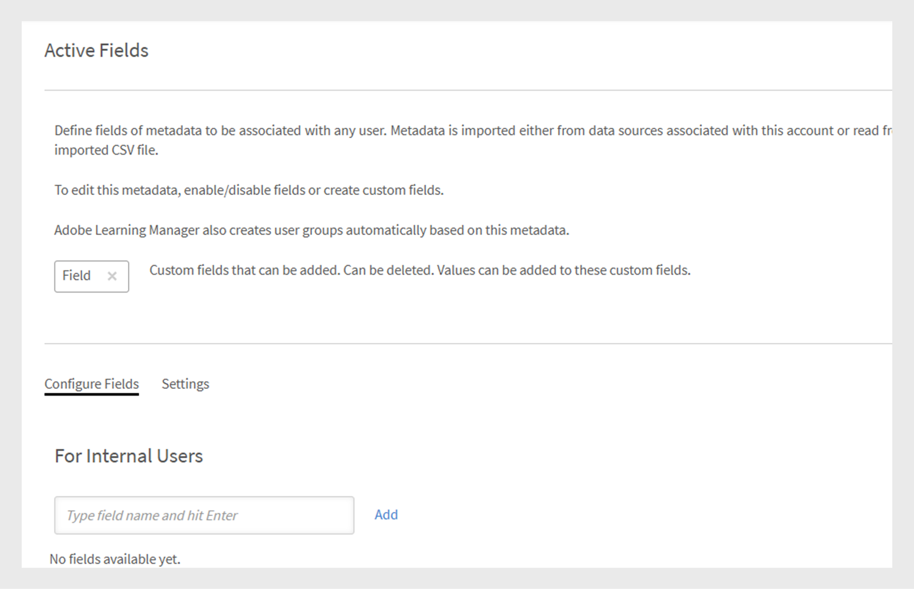

# 新增使用者並建立使用者群組

瞭解如何在Learning Manager應用程式中新增使用者或使用者群組。

<!---->

## 管理使用者群組

>[!INFO]
>
>在本訓練中，您將瞭解如何依名稱、電子郵件ID以及結合多個自動產生的使用者群組來建立使用者群組。    

<!--[Launch training](https://learningmanager.adobe.com/app/learner?accountId=98632&sdid=QLD1P6BS&mv=display&mv2=display#/course/7555694)-->

<!--In this training, you will learn how to create a user group by names, email IDs, and combining multiple auto-generated user groups.-->

<!---->

如果您無法啟動訓練，請寫信到<almacademy@adobe.com>。

## 概觀 {#overview}

在Adobe Learning Manager中，您可以擔任下列角色：

* **管理員：**&#x200B;管理員定義組織的訓練策略。 管理員可以新增學習者、搜尋學習者的所需技能、管理和指派課程、建立學習計畫、認證和學習計畫，以及管理整個組織的報表。
* **作者：**&#x200B;作者是教學設計人員和內容建立者。 作者可以將模組和課程添加到學習管理器。
* **經理：** 經理管理團隊的學習活動。 经理可以提名團隊成員參加課程，批准團隊成員的請求，並提供有關其團隊成員績效的反饋，貼文完成培訓。 經理還可以視圖報告，以便團隊跟踪他們的績效。
* **學習者：** 學習者可以訪問分配給他們的課程、學習計劃和認證。 學習者還可以使用目錄流覽所有可用課程，並自行註冊課程、學習計劃或認證。

身為管理員，您可以透過三種方式新增使用者：

* 內部
* 外部
* 使用者群組

## 新增單一使用者 {#addasingleuser}

使用單一使用者選項將內部學習者新增至Adobe Learning Manager。

>[!INFO]
>
>在本培訓中，您將學習如何向Adobe Systems學習管理器添加內部學習者。    

如果您無法啟動訓練，請寫信到<almacademy@adobe.com>。

若要新增使用者，

1. 以管理員身分登入Adobe Learning Manager。
1. 在首頁按一下&#x200B;**[!UICONTROL Add Users]**。 在此頁面上，您可以使用CSV一次新增一個或多個使用者。 您也可以為內部員工建立自助註冊連結，或建立外部學習者設定檔。
1. 要新增單個使用者，請按下 **[!UICONTROL Add]** 右上角並選擇選項 **[!UICONTROL Single User]**。

1. 要添加單個用戶，請按下 **[!UICONTROL Add]** 右上角並選擇選項 **單使用者**。

   
   *新增單一內部用戶*

1. 在 **[!UICONTROL Add User]** 對話框中，輸入學習者的詳細資訊。 對於欄位 **[!UICONTROL Manager's Name]**，選取系統中現有用戶的名稱。

   
   *新增使用者對話方塊*

1. 若要在學習管理器中添加新用戶，請按下 **[!UICONTROL Add]**。 添加用戶后，用戶會收到驗證郵件。 然後，學習者啟動帳戶並開始使用學習管理器。 如果您需要向學習管理器帳戶添加有限數量的學習者，則此工作流程非常有用。 但是，如果您計劃註冊大型組織的所有員工，則可以一次嘗試添加他們。 有關詳細資訊，請參閱下一節。

## 大量新增使用者 {#addusersinbulk}

### 管理使用者

在本訓練中，您將學習如何指派和移除角色、傳送歡迎電子郵件，以及刪除和清除使用者。

如果您無法啟動訓練，請寫信到<almacademy@adobe.com>。

通常，大多陣列織都使用HR管理系統(HRMS)，HRMS會維護所有的員工記錄，例如，指定、地點、加入日期或員工階層。 您可以將此資料匯出為CSV格式。 若要匯入CSV，請遵循下列步驟：

1. 按一下右上角的&#x200B;**[!UICONTROL Add]**，然後選擇選項&#x200B;**[!UICONTROL Upload a CSV]**。

   
   *上傳CSV以大量新增使用者*

1. 您上傳的CSV包含欄位，如下所示：

   
   *CSV的結構*

   您必須維護主CSV，並在主CSV上執行所有新增和刪除。 主要CSV包含以下欄位：

   * 名稱&#42;
   * 電子郵件&#42;
   * 設定檔
   * 經理

   (&#42;)必要欄位。

1. 按一下選項&#x200B;**[!UICONTROL Upload a CSV]**&#x200B;之後，會顯示下列對話方塊。

   
   *上傳CSV對話方塊*

1. 選擇CSV或拖放檔案。 選擇檔案後，將資料欄位與CSV檔案中的欄位對應。 按一下必要的下拉式清單，然後選擇正確的欄位。

   
   在CSV中對應欄位&#x200B;**

1. 要開始匯入使用者，請按兩下 **[!UICONTROL Save]**。 您可以看到確認訊息。

   
   *成功上傳CSV的確認訊息*

1. 新使用者現在已新增至您的Adobe Learning Manager帳戶。 若要選取新使用者，請選取名稱旁的核取方塊，以便選取所有人。

   
   *新使用者已新增*

>[!NOTE]
>
>如需詳細資訊，請參閱常見問題集，[大量新增使用者](../add-users-in-bulk.md)。

選取使用者後，您可以執行下列動作：

## 註冊使用者 {#registerauser}

選取使用者後，按一下右上角的&#x200B;**[!UICONTROL Actions]**&#x200B;並按一下&#x200B;**[!UICONTROL Register]**。

選取的使用者會收到歡迎電子郵件。 如果學習者已有的Adobe ID，可按一下此連結。 如果他們沒有現有的Adobe ID，他們可以繼續並按一下歡迎連結以建立Adobe ID並將其連結到他們的Learning Manager帳戶。

## 指派角色 {#assignarole}

將學習者添加到Adobe Systems學習管理器帳戶后，如果要更改其角色，請按下頁面右上角的作。 選擇選項 **[!UICONTROL Assign Role]**。 在這裡，您可以決定是要授予學習者作者訪問許可權還是管理員訪問許可權。 分配角色后，此學習者將作者帳戶的訪問許可權，並可以添加模組和創建課程。

*指派角色給用戶*

## 拿掉角色 {#removearole}

您也可以移除使用者的「作者」或「管理員」存取權。 選擇或多個學習者，按下 **[!UICONTROL Actions]**， 然後選擇 **[!UICONTROL Remove Role]**。 選擇一個選項（例如&#x200B;**[!UICONTROL Remove Author]**），系統會撤銷此學習者的作者存取權。

>[!NOTE]
>
>您無法手動將Manager角色指派給系統中的某人。 當一個或多個員工新增到經理控制面板下時，管理員會自動存取該控制面板。

## 刪除使用者 {#deleteauser}

要刪除用戶，請按下 **[!UICONTROL Actions]**，然後選擇 **[!UICONTROL Delete User]**。 在確認對話方塊中，按一下&#x200B;**[!UICONTROL Yes]**，學習者即被刪除。

*刪除用戶的確認訊息*

## 編輯使用者 {#editauser}

在使用者清單中，選擇使用者，然後按一下該使用者。 在使用者詳細資料上，按一下&#x200B;**[!UICONTROL Edit]** ( )按鈕。 在&#x200B;**[!UICONTROL Edit User]**&#x200B;對話方塊上，進行必要的編輯並儲存變更，請按一下&#x200B;**[!UICONTROL Save]**。

*編輯使用者對話方塊*

## 作用中的欄位

學習管理器中的Adobe Systems活動欄位是可自定義中繼資料欄位，用於商店和管理特定於用戶的信息。 這些欄位有助於定義與系統中每個用戶相關聯的關鍵屬性或特徵。

### 管理用戶屬性

>[!INFO]
>
>在本培訓中，您將學習如何添加、自定義和配置活動欄位。    

如果您無法啟動培訓，請寫信給 <almacademy@adobe.com>。

Adobe Learning Manager會保留使用者屬性及其值區分大小寫。 **例如**，用戶屬性的大小寫區分為“位置”，其值為“PARIS”將以相同的方式保留和顯示。 如果出現任何問題，管理員現在可以編輯屬性名稱和值以更正任何區分大小寫的錯誤。

管理員可以造訪&#x200B;**[!UICONTROL Admin app]** > **[!UICONTROL Users]** > **[!UICONTROL User groups]**&#x200B;並按一下群組名稱來執行此操作。

管理員可以透過UI為學習者新增及更新允許的屬性值。

作用中欄位的型別：

* 可分組：學習者會根據值分組
* 可報告：會根據作用中欄位建立報告使用者群組
* 可匯出：欄位將顯示在使用者群組報表的匯出中。

## 建立自助註冊連結 {#createaselfregistrationlink}

您也可以讓組織中的員工向Adobe Learning Manager帳戶註冊成為學習者，不需您擔任管理員的相關協助。 管理員可以建立自助註冊連結，並與員工共用，讓員工使用其Adobe憑證進一步註冊Learning Manager。

在頁面的右上角，按一下&#x200B;**[!UICONTROL Add]**，然後選取&#x200B;**[!UICONTROL Self-Registration]**。

*建立連結，以自我註冊為學習者*

**[!UICONTROL Add Self-Registration Profile]**&#x200B;對話方塊隨即顯示。 為此設定檔命名。 然後新增經理的姓名。 請務必知道經理必須已為Learning Manager中的註冊學習者。

*新增自我註冊的設定檔*

在您按一下&#x200B;**[!UICONTROL Save]**&#x200B;之後，就會產生一個URL，您可以與學習者共用，讓他們可以按一下該URL並自行註冊。

## 註冊外部學習者 {#enrollexternallearners}

在Adobe Learning Manager中，您也可以為存取您帳戶受限制的外部合作夥伴或機構建立註冊連結，並向他們提供學習資料。

內部註冊和外部註冊之間有些差異。

<table>
 <tbody>
  <tr>
   <td>
    
<b>內部使用者</b>
</td>
   <td>
    
<b>外部使用者</b>
</td>
  </tr>
  <tr>
   <td>
    
使用Adobe ID或SSO憑證登入。
</td>
   <td>
    
使用任何電子郵件ID登入。
</td>
  </tr>
  <tr>
   <td>
    
遊戲化可供使用。
</td>
   <td>
    
遊戲化可供使用。 管理員必須在「遊戲化」設定中為外部學習者啟用遊戲化。
</td>
  </tr>
  <tr>
   <td>
    
可使用學習者階層。
</td>
   <td>
    
無法使用學習者階層。
</td>
  </tr>
 </tbody>
</table>

若要註冊外部使用者，請遵循下列步驟：

1. 在左側導覽窗格中，按一下&#x200B;**[!UICONTROL External]**。

   

   *註冊外部使用者*

1. 在頁面的右上角，按一下&#x200B;**[!UICONTROL Add]**。

1. 在&#x200B;**新增外部註冊設定檔**&#x200B;對話方塊中，新增下列詳細資料：

   * 合作夥伴組織的設定檔名稱。
   * 合作夥伴組織經理的電子郵件地址。
   * 此合作夥伴的外部註冊名額限制。
   * 到期日：設定停止允許此群組新註冊的截止日期。 到期日之後，只有現有的註冊使用者才能存取此訓練。

   

   *新增外部註冊設定檔對話方塊*

   * 在 **[!UICONTROL Advanced Settings]** 部分中，輸入以下內容：

      * **[!UICONTROL Login Requirement]：** 以天為單位指定值。 如果學習者在上述持續時間內未登入，則會被刪除。
      * **[!UICONTROL Allowed Domains]：** 以逗號分隔的白名單電子郵件功能變數名稱清單。
      * **[!UICONTROL Email Verification Required]：** 選擇此選項可強制學習者進行電子郵件驗證。

   

   *在進階設定區段中輸入詳細資料*

1. 按一下&#x200B;**[!UICONTROL Save]**&#x200B;後，您會看到下列確認訊息。 您必須與外部合作夥伴共用URL。

   

## 啟用外部設定檔 {#enableanexternalprofile}

建立外部設定檔後，您必須啟用其狀態。 從外部設定檔清單中，選擇所需的設定檔，然後切換狀態按鈕。

*啟用外部設定檔*

這將啟用外部註冊連結。 歡迎電子郵件會自動傳送給合作夥伴。 您也可以複製連結，並透過按一下「複製URL」圖示()與他們共用，或透過按一下「郵件」圖示()將歡迎電子郵件重新傳送給合作夥伴組織。

合作夥伴經理可與必須參加PrLearning Manager時間培訓的員工共用連結。 當他們按一下連結，填寫一些詳細資料以在Learning Manager上建立其設定檔後，可以自行註冊。 這些使用者不會與內部員工一起出現在學習者標籤上。 您可以在&#x200B;**[!UICONTROL External Learners]**&#x200B;標籤下看到他們的名稱。

## 暫停外部設定檔 {#pause}

將外部使用者群組新增至Learning Manager後，您也可以暫停外部使用者的註冊程式。 當您暫停時，會封鎖外部使用者的註冊程式。 不過，此程式只有在使用者尚未透過接受邀請註冊時才有效。

若要暫停外部使用者群組，請選擇一個或多個群組，從頁面的右上角按一下&#x200B;**[!UICONTROL Actions]**，然後按一下&#x200B;**[!UICONTROL Pause]**。

## 繼續外部設定檔 {#resumeanexternalprofile}

您隨時都可以撤銷外部夥伴的暫停狀態，並繼續正常服務。 按一下頁面右上角的&#x200B;**[!UICONTROL Actions]**&#x200B;並選取&#x200B;**[!UICONTROL Resume]**。

下列狀態適用於外部使用者：

* **非使用中狀態** — 在此狀態下，外部使用者的註冊已過期。 管理員透過新增使用者工作流程新增外部使用者時，可設定其到期日。
* **作用中狀態** — 在此狀態中，外部使用者可以註冊到Learning Manager應用程式，並登入應用程式。
* **暫停** — 在此狀態下，外部使用者的註冊程式被封鎖。 但是，現有的使用者可以繼續登入。

## 檢查已使用的座位 {#checkusedseats}

在外部設定檔清單上，按一下&#x200B;**[!UICONTROL Seats Used]**。 您可以檢視合作夥伴組織中新增的學習者數。

*檢查已使用的座位*

## 刪除使用者 {#Deleteauser-1}

選擇使用者，然後從右上角按一下&#x200B;**[!UICONTROL Actions]** > **[!UICONTROL Delete User]**。

## 變更設定檔 {#changeprofile}

若要將使用者移動到另一個外部設定檔，請選擇使用者，從右上角按一下&#x200B;**[!UICONTROL Actions]** > **[!UICONTROL Change Profile]**。 從設定檔清單中選擇設定檔，然後按一下&#x200B;**[!UICONTROL Change]**。

## 指派角色 {#Assignarole-1}

選擇使用者，從右上角按一下&#x200B;**[!UICONTROL Actions]** > **[!UICONTROL Assign Role]** > **製作`<role>`**。 使用者獲得新角色。

## 移除角色 {#Removearole-1}

選擇使用者，從右上角按一下&#x200B;**[!UICONTROL Actions]** > **[!UICONTROL Remove Role]** > **移除`<role>`**。 選取的角色會從指派給使用者的角色清單中移除。

>[!NOTE]
>
>指派新角色不會影響自訂使用者群組。 但是，它會影響自動產生的使用者群組，例如「所有管理員」、「所有作者」和類似的角色型群組。

## 建立使用者群組 {#createusergroups}

使用者群組是指與類別相關的一組使用者。 使用者群組可協助管理員根據學習者的屬性來選取組織內的學習者，然後將學習內容指派給他們。 此外，這些使用者群組可讓管理員將自訂的圖志和目錄指派給學習者，並顯示其進度的自訂報告。

若要存取「使用者群組」，請在左側導覽窗格中按一下&#x200B;**[!UICONTROL User Groups]**。

*建立使用者群組*

Adobe Learning Manager中有兩種型別的群組，自訂和自動產生。 當您將學習者新增至帳戶時，有些群組會根據其一般屬性自動建立。

若要檢視自動建立的群組，請按一下索引標籤&#x200B;**[!UICONTROL Auto-generated]**。

*檢視自動產生的群組*

您可以看到有不同的群組，例如「所有內部使用者」、「所有經理」、以「成本中心」為基礎的群組、以部門為基礎的群組以及以經理團隊為基礎的群組。

除了自動產生的群組之外，您也可以建立自訂群組。 若要新增自訂群組，請按一下右上角的&#x200B;**[!UICONTROL Add]**。

1. 輸入群組的名稱和描述。
1. 在「隨型別搜尋」欄位中輸入使用者名稱或設定檔，並從下拉式清單中選取，以新增使用者。

1. 若要新增更多學習者，請按一下&#x200B;**[!UICONTROL Add More Users]**。

1. 若要建立使用者群組，請按一下&#x200B;**[!UICONTROL Save]**。

此自訂群組現在已建立並新增至設定檔。 您建立的使用者群組本質上為動態的。 如果新使用者新增了類似的屬性，則會自動新增到使用者群組。

若要檢視使用者所屬的群組清單，請導覽至&#x200B;**[!UICONTROL User]** > **[!UICONTROL User Groups]**，搜尋使用者名稱並加以選取。 這會顯示使用者所屬的所有群組。

### 下載使用者群組中的使用者清單

要下載特定使用者群組中的使用者清單，請導航到 **[!UICONTROL User]** > **[!UICONTROL User Groups]**，選擇 **[!UICONTROL Download icon]** 群組旁邊的。 這將產生一個CSV文件，其中包含該群組中的使用者清單。

## 排除用戶組

有時您會想要從大型使用者群組中排除一小部分使用者。 若要透過「學習計畫」將這組特定使用者註冊到培訓中，或設定正確的可見性目錄，則必須執行此操作。 在此版本的Learning Manager中，您可以在建立自訂使用者群組時排除學習者或使用者群組。 在新增使用者群組對話方塊中，排除學習者區段可讓您達成此目的。

*排除使用者群組*

例如，如果您想要設定「學習計畫」，讓屬於「地點=加州」(Store-5 （位於加州）除外)的所有使用者都能註冊。

## 進階設定 {#advancedsettings}

### 資料來源 {#datasources}

當您想要將使用者或從您組織的資料庫學習資料匯入/同步到Learning Manager應用程式中，可以使用此功能。 您也可以設定此同步的頻率。

按一下&#x200B;**[!UICONTROL Advanced]**&#x200B;區段下左窗格上的&#x200B;**[!UICONTROL Data Sources]**。

*匯入或同步處理使用者的資料來源*

從&#x200B;**[!UICONTROL Source]**&#x200B;下拉式清單中選擇資料來源型別、選取更新頻率，如果需要立即同步或按一下&#x200B;**[!UICONTROL Save]，請按一下&#x200B;**[!UICONTROL Sync now]**。**&#x200B;內部使用者的資料來源型別為SFDC、FTP等。

您可以新增多個資料來源。

### 作用中的欄位 {#activefields}

除了在使用者註冊期間提供的欄位之外，此功能可讓管理員新增更多作用中的欄位。

按一下使用者頁面中可用的&#x200B;**[!UICONTROL Active Fields]**。 學習者只能從自訂值中指定的值中選擇。

*使用中的欄位*

### 設定欄位 {#configurefields}

**內部使用者**

您可以為內部使用者的使用者欄位新增自訂值。

若要新增自訂值，請遵循下列步驟：

1. 按一下&#x200B;**[!UICONTROL Modify Values]**&#x200B;以取得內部使用者。

   
   *修改內部使用者的值*

1. 自訂欄位&#x200B;**中的**&#x200B;值對話方塊就會顯示。

   
   *自訂欄位對話方塊中的值*

1. 從&#x200B;**[!UICONTROL Select Field]**&#x200B;下拉式選單中選取要新增的值。
1. 在&#x200B;**[!UICONTROL New Value]**&#x200B;欄位中輸入新值。
1. 按一下&#x200B;**[!UICONTROL Done]**。
1. 按一下右上角的「儲存」以&#x200B;**[!UICONTROL Save]**&#x200B;個變更。

**外部使用者**

新增與內部使用者類似的自訂值。

*修改外部使用者的值*

### 設定 {#settings}

**使用者顯示區**

如果啟用&#x200B;**在學習者登入時僅顯示未填寫的欄位**&#x200B;選項，使用者在登入時只會看到空白欄位。

*顯示未填寫的欄位*

使用此選項，管理員可以決定是否要顯示欄位，或是在這些欄位填入後隱藏它們。

## 限制報告中的作用中欄位 {#restrictactivefields}

Learning Manager 27.7為作用中欄位引進了兩個新選項 — **[!UICONTROL Reportable]**&#x200B;和&#x200B;**[!UICONTROL Exportable]**。

使用中欄位中的*選項*

對於CSV欄位和手動新增欄位，如果作用中欄位標示為&#x200B;**[!UICONTROL Reportable]**，則作用中欄位可在儀表板報表內的篩選器中搜尋。

*儀表板報告中的篩選器*

如果作用中欄位標示為&#x200B;**[!UICONTROL Exportable]**，則下載任何Excel報表時，作用中欄位會顯示在Excel檔案中。

這些選項會針對內部和外部作用中欄位顯示。

您只能刪除自訂作用中欄位。

## 使用者顯示

您可以從學習者那里隱藏整個“完整應用程式設定檔”頁面。 學習者登錄后，頁面將不會彈出。

請注意，現有的預設行為不會變更。 這是一項可選功能，現在可供管理員使用。

啟用下列選項：

*「用戶顯示」部分*

## 透過 FTP 和 Box 連接器支援手動CSV欄位 {#import-connector}

通常，使用者希望在學習者登錄到學習管理器時手動提供活動欄位。 目前，當用戶手動導入CSV時，可以在學習管理器中執行此作。

CSV可能不包含所有活動欄位。 對於上傳CSV中未更新的所有活動欄位，用戶需要輸入此類活動欄位的數據。

目前，所有「作用中」欄位都必須對應至來源CSV中的某個欄位。

有時候使用者不想將作用中欄位對應到CSV中指定的欄位。 在這種情況下，用戶可以將活動欄位映射到值 **[!UICONTROL DontImportFromSource]**。 從FTP和Box聯結器匯入使用者時，從下拉式清單中選取此值。

## 自訂角色 {#customroles}

將您選擇的任何欄位添加為用戶資訊的一部分，然後按下 **[!UICONTROL Save]**。 新增欄位後，您還可以交叉檢查&#x200B;**[!UICONTROL Edit users]**&#x200B;對話方塊中欄位的可用性。

新增欄位後，您可以注意到標有刻度的欄位來源為資料來源或CSV，如下面的快照所述。 管理員可以透過啟用或停用這些欄位來編輯這些來源欄位。

Learning Manager中作用中欄位的&#x200B;**值**

系統會以下列方式擷取作用中欄位的值：

1. Learning Manager應用程式會從與您帳戶相關聯的資料來源匯入中繼資料。
1. 從手動匯入的CSV檔案擷取的中繼資料。
1. 學習者登入時填滿中繼資料
1. 管理員輸入使用者的資料。

>[!NOTE]
>
>Learning Manager應用程式會自動從這些中繼資料建立使用者群組。

**新增自訂值**

您可以在內部和外部使用者欄位中為使用者欄位新增自訂值。

若要新增自訂值，請遵循下列步驟：

自訂欄位可以新增和刪除，它們適用於所有使用者。 CSV欄位可以啟用或停用，只有在您於「使用中」欄位中進行修改後上傳CSV時，這些欄位才會生效。 所有內部作用中的欄位都適用於所有型別的內部使用者。 外部欄位僅適用於外部使用者。 如果自訂欄位出現在CSV中，下次上傳時會自動轉換為CSV欄位並啟用。

## CSV欄位的值 {#valuesforcsvfields}

如果已啟用&#x200B;**[!UICONTROL Restrict Selection]**&#x200B;核取方塊，使用者只能從CSV欄位的預先定義欄位中選擇。

*限制選取核取方塊*

## 匯入記錄 {#importlogs}

您可以在此空間檢視管理員使用大量匯入功能新增之使用者的CSV匯入記錄。 您也可以按一下頁面右上角的&#x200B;**[!UICONTROL Add]**，使用CSV上傳功能新增使用者。

## 多值作用中欄位

使用此功能，一個使用中欄位可以有多個欄位。 帳戶中最多可以有三個多值作用中欄位。 多值作用中欄位可供外部和內部使用者使用。

一旦您將使用中的欄位標示為多值，就無法將它轉換回單一值。 這是不可逆的。

無法將現有的單一值欄位標示為多值欄位。

若要建立多值作用中欄位，請遵循下列步驟：

1. 新增使用中欄位。

   
   *新增使用中的欄位*

1. 按一下「新增」。
1. 在「設定」標籤中，將新欄位標示為多值。

   
   *標籤為多值*

   還有另一個核取方塊&#x200B;**[!UICONTROL Learner Configurable]**，當停用時，學習者將無法在「設定檔」頁面上看到欄位。

1. 使用CSV或按一下「修改值」來新增值。

   
   *新增值*

1. 按一下&#x200B;[!UICONTROL **完成**]。

>[!NOTE]
>
>一旦建立了使用者群組並填入欄位，便無法將多個值轉換為單一值，反之亦然。

### 透過CSV新增多值作用中欄位

請遵循下列步驟：

1. 以欄的形式建立包含新使用中欄位的CSV （逗號分隔或單一值）。
1. 匯入CSV。
1. 在自訂欄位中的值對話方塊中，將欄位標示為多值。
1. 再次匯入CSV。

CSV必須有一個與標示為多值的作用中欄位同名的欄。

CSV包含欄位：

* **[!UICONTROL User]**：使用者群組已建立為角色。
* **[!UICONTROL Roles]**：具有值的多值作用中欄位。

如果使用新值或刪除的值重新上傳CSV，則活動字段和組也會相應更新。

### 報表

所有報表都包含多值活動欄位及其值。

管理員可以添加自動生成的活動字段，並配置用戶活動和培訓報表。

學習者成績單報告包含所有活動字段和逗號分隔值。 然後，管理員可以相應地篩選資料。

## 使用者群組報表

Adobe Learning Manager的全新使用者群組報表可讓您檢視管理員離任時未受管理的群組，協助管理使用者群組。 管理員可以存取>**[!UICONTROL User Group]**&#x200B;區域下的&#x200B;**[!UICONTROL Users]**&#x200B;報表。它提供每個群組的詳細資訊，包括：

* 使用者群組類型
* 群組名稱
* 說明
* 建立者（名稱）
* 建立者（電子郵件）
* 建立時間（UTC時區）
* 使用者人數

若要下載報表，請遵循下列步驟：

1. 以&#x200B;**[!UICONTROL Admin]**&#x200B;登入。
2. 選取&#x200B;**[!UICONTROL Users]** > **[!UICONTROL User Group]**。
3. 選取&#x200B;**[!UICONTROL Actions]** > **[!UICONTROL Download User Group Report]**。

_下載使用者群組報告_

## 常見問題 {#faq}

+++如何在Learning Manager中註冊使用者？

新增使用者並為使用者指派角色後，您可以透過執行以下步驟來註冊使用者：

1. 選取一個或多個使用者後，按一下右上角的&#x200B;**[!UICONTROL Actions]**，然後按一下&#x200B;**[!UICONTROL Register]**。

1. 在快顯視窗中，按一下&#x200B;**[!UICONTROL Yes]**。

選取的使用者會收到歡迎電子郵件。 如果學習者已有的Adobe ID，可按一下此連結。 如果他們沒有現有的Adobe ID，他們可以繼續並按一下歡迎連結以建立Adobe ID並將其連結到他們的Learning Manager帳戶。

學習者必須按一下電子郵件中的任一連結，因為Learning Manager可協助驗證學習者的帳戶。

+++

+++如何編輯使用者資料？

若要編輯使用者，請遵循下列步驟：

1. 在使用者清單中，按一下您要編輯資料的使用者。
1. 按一下鉛筆圖示，如下所示。

在&#x200B;**編輯使用者**&#x200B;對話方塊中，相應地更新欄位。 若要儲存變更，請按一下&#x200B;**[!UICONTROL Save]**。

+++

+++如何在Learning Manager中暫停並繼續外部使用者？

在外部使用者清單中，選擇要刪除的使用者。 按一下右上角的&#x200B;**[!UICONTROL Actions]** > **[!UICONTROL Pause]**。

如需詳細資訊，請參閱[暫停外部設定檔](add-users-user-groups.md#pause)。

暫停設定檔之後，外部設定檔會顯示狀態為&#x200B;***已暫停***。

+++

+++如何將歡迎電子郵件傳送至新建立的外部設定檔？

添加外部用戶時，在 **[!UICONTROL Add External Registration Profile]** 對話框中輸入外部經理的電子郵件。 按兩下儲存時，歡迎電子郵件也會發送到您指定的電子郵件位址。 如果要再次發送歡迎郵件，請按下信封圖示，如下所示：

+++

+++如何創建自定義用戶組？

按兩下>，然後在&#x200B;**[!UICONTROL Users]**&#x200B;使用者群組頁面上按下&#x200B;**[!UICONTROL Add]**。 **[!UICONTROL User Groups]**&#x200B;在「新增使用者群組」對話方塊中，將使用者個別新增為團隊新增使用者。

+++

+++如何停用已填入的活動欄位？

如果您希望學習者只看到未由他們填寫的活動字段，請追隨以下步驟：

1. 點選 **[!UICONTROL Users]** > **[!UICONTROL Active Fields]**。

1. 按下 **[!UICONTROL Settings]** 並啟用選項 **[!UICONTROL Show only unfilled fields on Learner login]**。

1. 按兩下 **[!UICONTROL Save]**。

+++

+++如何防止學習者在活動字段中輸入隨機值。？

您可以限制學習者的選擇，讓他們只能選擇預先定義的值，而不能輸入任何隨機值。 請遵循下列步驟：

1. 按一下&#x200B;**[!UICONTROL Users]** > **[!UICONTROL Active Fields]**。
1. 啟用選項&#x200B;**[!UICONTROL Restrict Selection]**。
1. 按一下&#x200B;**[!UICONTROL Done]**。

+++

+++如何區分CSV作用中欄位和自訂作用中欄位？

您只能啟用或停用CSV作用中的欄位，但無法刪除它們。 另一方面，您無法啟用或停用自訂作用中欄位。

+++
