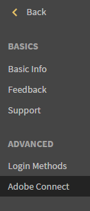
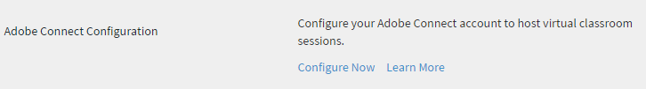
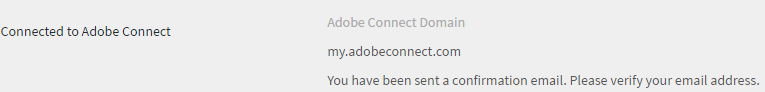
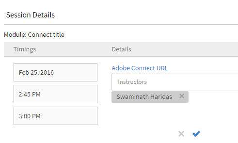

# Adobe Connect整合

組織的管理員可設定Learning Manager帳戶設定以啟用Adobe Connect整合。

## 設定Adobe Connect {#configureadobeconnect}

1. 在管理員登入中，按一下 **[!UICONTROL Settings]** ，以檢視貴公司的基本資訊。 按一下 **[!UICONTROL Adobe Connect]** 在左窗格中。

   

   *在左窗格中選取Adobe Connect*

1. 按一下 **[!UICONTROL Configure Now]** 中的連結 **[!UICONTROL Adobe Connect Configuration]** 區段。

   <!---->

1. 提供您公司的Adobe Connect網域名稱並登入認證。

   

   *新增網域名稱和認證*

   Adobe Connect URL範例： mycompany.adobeconnect.com\
   您必須提供Adobe連線帳戶之管理員的電子郵件ID。

   Learning Manager僅支援Adobe代管的連線帳戶。 範例； &#39;.adobeconnect.com&#39;。

1. 按一下 **[!UICONTROL Integrate].**

   驗證電子郵件ID後，Learning Manager會在Connect成功整合時顯示訊息。 您可以開始使用Adobe Connect自動檢視您的虛擬教室課程。

   Adobe Connect帳戶管理員應接受使用Adobe Connect的條款與條件。 如果不接受此設定，您的登入驗證可能會失敗。 建立Adobe Connect帳戶後，請登入該帳戶一次。 第一次登入時，條款與條件頁面就會顯示。

   <!---->

## 新增虛擬教室工作階段資訊 {#addvirtualclassroomsessioninformation}

如果虛擬教室課程的作者未提供工作階段資訊，則管理員可包含工作階段詳細資訊。

在管理員登入中，按一下VC課程名稱。 按一下 **[!UICONTROL Instances]** 在左窗格上並按一下 **[!UICONTROL Session Details]**.  按一下「階段作業詳細資訊」頁面右角的編輯圖示，以新增階段作業資訊。

*新增虛擬教室工作階段資訊*

透過整合Adobe Learning Manager和Adobe Connect來建立虛擬教室模組或工作階段，您的Connect帳戶應可支援會議室，且會議室數量足以提供您使用案例的並行使用者。 這些會議室用於託管Learning Manager虛擬教室模組。 Learning Manager會針對Learning Manager中的每個虛擬教室模組或工作階段，動態建立新的Connect會議室。

除了Adobe Learning Manager，您還必須另外購買Adobe Connect。

## 學習者出席率 {#learnersattendance}

如果虛擬教室課程的主機未出席工作階段，則出席不會自動為已出席工作階段的學習者註冊。 在這種情況下，管理員可以手動記錄出勤。

按一下虛擬教室課程，然後按一下下一頁左窗格中的「出勤率」並記錄出勤率。
