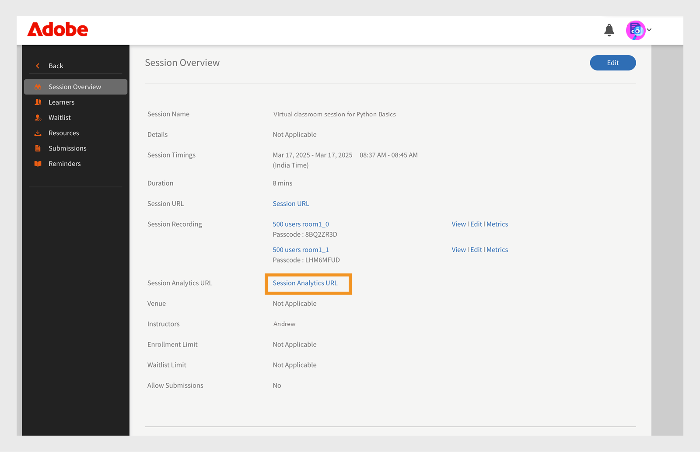

# Adobe Connect整合

組織的管理員可以設定Learning Manager帳戶的設定，以啟用Adobe Connect整合。

## 設定Adobe Connect {#configureadobeconnect}

1. 在管理員登入中，按一下左窗格中的&#x200B;**[!UICONTROL Settings]**&#x200B;以檢視有關您公司的基本資訊。 按一下左窗格上的&#x200B;**[!UICONTROL Adobe Connect]**。

   

   *在左窗格中選取Adobe Connect*

1. 按一下&#x200B;**[!UICONTROL Adobe Connect Configuration]**&#x200B;區段中的&#x200B;**[!UICONTROL Configure Now]**&#x200B;連結。

   <!---->

1. 提供您公司的Adobe Connect網域名稱並登入認證。

   

   *新增網域名稱和認證*

   Adobe Connect URL範例： mycompany.adobeconnect.com\
   您需要提供Adobe connect帳戶管理員的電子郵件ID。

   Learning Manager只支援Adobe代管的連線帳戶。 範例； &#39;.adobeconnect.com&#39;。

1. 按一下&#x200B;**[!UICONTROL Integrate].**

   驗證電子郵件ID後，Learning Manager會在Connect成功整合時顯示訊息。 您可以開始使用Adobe Connect自動檢視您的虛擬教室課程。

   Adobe Connect帳戶管理員應接受使用Adobe Connect的條款與條件。 如果不接受此設定，您的登入驗證可能會失敗。 建立Adobe Connect帳戶後，請登入該帳戶一次。 第一次登入時，條款與條件頁面就會顯示。

   <!---->

## 新增虛擬教室工作階段資訊 {#addvirtualclassroomsessioninformation}

如果虛擬教室課程的作者未提供工作階段資訊，則管理員可包含工作階段詳細資訊。

在管理員登入中，按一下VC課程名稱。 按一下左窗格上的&#x200B;**[!UICONTROL Instances]**，然後按一下&#x200B;**[!UICONTROL Session Details]**。  按一下「階段作業詳細資訊」頁面右角的編輯圖示，以新增階段作業資訊。

*新增虛擬教室工作階段資訊*

透過整合Adobe Learning Manager和Adobe Connect來建立虛擬教室模組或工作階段，您的Connect帳戶應可支援會議室，且會議室數量足以提供您使用案例的並行使用者。 這些會議室是用來裝載Learning Manager虛擬教室模組。 Learning Manager會為Learning Manager中的每個虛擬教室模組或工作階段動態建立新的Connect會議室。

除了Adobe Learning Manager以外，您還必須另外購買Adobe Connect。

## 學習者出席率 {#learnersattendance}

如果虛擬教室課程的主機未出席工作階段，則出席不會自動為已出席工作階段的學習者註冊。 在這種情況下，管理員可以手動記錄出勤。

按一下虛擬教室課程，然後按一下下一頁左窗格中的「出勤率」並記錄出勤率。

## 支援有大量受眾的Adobe Connect研討會

Adobe Learning Manager支援從Adobe Connect選取討論室，同時在Connect中設定虛擬教室工作階段。 以前，管理員只能選取會議室型別。 此功能可讓擁有有效研討會授權的管理員，在ALM中排程及管理單次或大型活動（最多1,500名與會者）。

請參閱此[文章](https://helpx.adobe.com/adobe-connect/using/creating-seminars.html)，以取得有關討論室的詳細資訊。

### 存取工作階段分析的支援

講師可透過工作階段控制面板中提供的新連結，存取其已完成Adobe Connect工作階段的「工作階段分析」。

_選取工作階段URL_

此連結會開啟Connect中的工作階段分析控制面板，提供工作階段參與度的詳細深入分析。
此功能僅適用於透過Adobe Connect進行的工作階段。 工作階段分析包括：

* **[!UICONTROL Engagement]**：即時工作階段整體效能的概觀
* **[!UICONTROL Interactions]**：不同Pod的參與者活動詳細劃分
* **[!UICONTROL Attendee Activity]**：參與者參與摘要
* **[!UICONTROL Download Reports]**：下載Pod特定參與資料報表的選項

_工作階段儀表板_

請參閱此[文章](https://helpx.adobe.com/in/adobe-connect/using/session-dashboard.html)，瞭解工作階段分析的詳細資訊。
