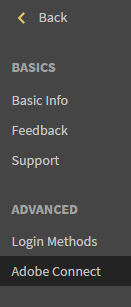
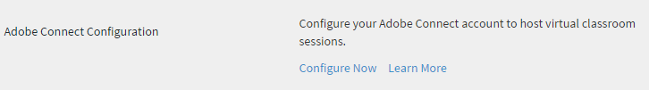
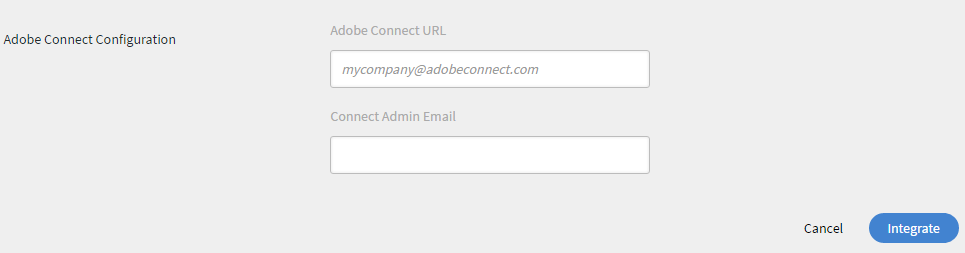
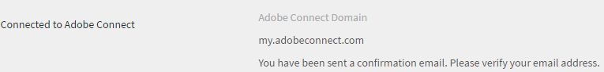
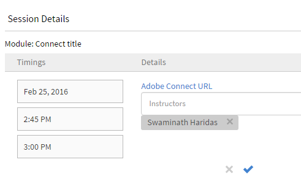
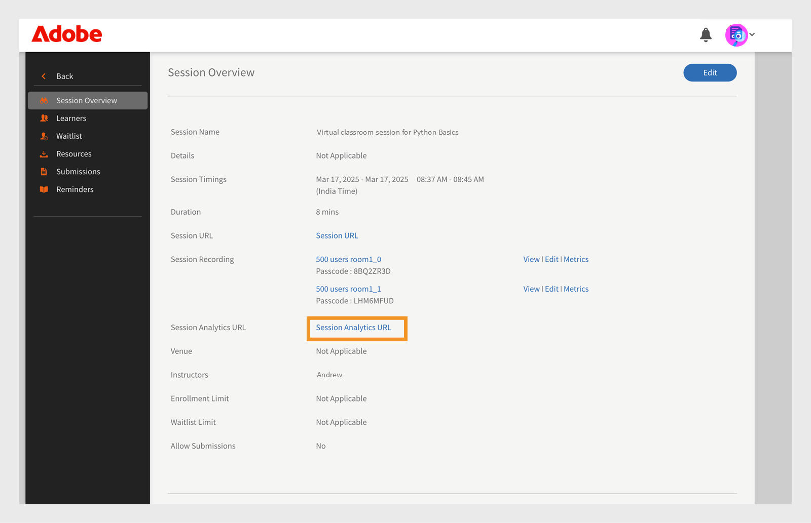
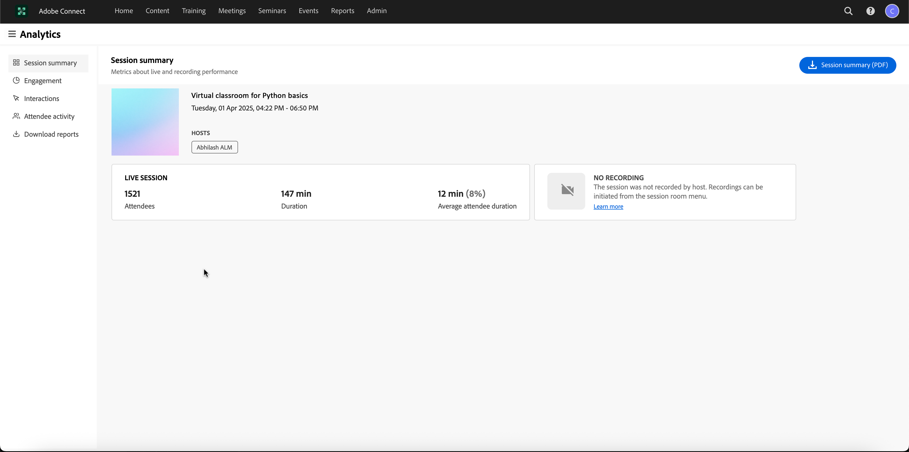

# Adobe Connect 整合

組織管理員可以設定學習管理員帳號的設定，以啟用 Adobe Connect 的整合。

## 設定 Adobe Connect {#configureadobeconnect}

1. 在管理員登入中，點擊 **[!UICONTROL Settings]** 左側窗格查看您公司的基本資訊。 點擊 **[!UICONTROL Adobe Connect]** 左側窗格。

   

   *在左側窗格選擇 Adobe Connect*

1. 點擊 **[!UICONTROL Configure Now]** 該區的 **[!UICONTROL Adobe Connect Configuration]** 連結。

   <!---->

1. 提供貴公司的 Adobe Connect 網域名稱及登入憑證。

   

   *新增網域名稱與憑證*

   Adobe Connect 範例網址：mycompany.adobeconnect.com\
   你需要提供 Adobe Connect 帳號管理員的電子郵件 ID。

   Learning Manager 只支援 Adobe 主機的 Connect 帳號。 舉例來說;「.adobeconnect.com」。

1. 點擊 **[!UICONTROL Integrate]。**

   在驗證電子郵件 ID 後，Learning Manager 會顯示訊息，因為 Connect 已成功整合。 你可以開始使用 Adobe Connect 自動瀏覽虛擬教室課程。

   Adobe Connect 帳號管理員應同意使用 Adobe Connect 的條款與條件。 如果不接受，你的登入認證可能會失敗。 建立 Adobe Connect 帳號後，請登入一次。 首次登入時，會跳出條款與細則頁面。

   <!---->

## 新增虛擬教室課程資訊 {#addvirtualclassroomsessioninformation}

若虛擬教室課程的作者尚未提供課程資訊，管理員可包含課程細節。

在管理員登入時，點選VC課程名稱。 點擊 **[!UICONTROL Instances]** 左側窗格並點選 **[!UICONTROL Session Details]**。  點擊會話詳情頁面右上角的編輯圖示，即可新增會話資訊。

*新增虛擬教室課程資訊*

透過整合 Adobe Learning Manager 與 Adobe Connect 來建立虛擬教室模組或會議，您的 Connect 帳號應能支援有足夠數量會議室及同時使用者的會議室，以符合您的使用情境。 這些會議室用於承載學習管理員虛擬教室模組。 Learning Manager 會為 Learning Manager 內的每個虛擬教室模組或會議動態建立一個新的 Connect 會議室。

你必須另外購買 Adobe Connect，Adobe Learning Manager 除外。

## 學習者出席率 {#learnersattendance}

若虛擬教室課程的主辦方未參加該課程，則已參加課程的學習者將不會自動登記出席。 在這種情況下，管理員可以手動記錄出勤情況。

點擊虛擬教室課程，在下一頁左側窗格點選「出席」，並記錄出席情況。

## 支持 Adobe Connect 與大型聽眾的研討會

Adobe Learning Manager 支援在 Connect 中設定虛擬教室時，從 Adobe Connect 選擇研討會教室。 過去，管理員只能選擇會議室類型。 此功能讓持有有效研討會授權的管理員能在 ALM 內排程和管理一次性或大型活動（最多 1,500 名參加者）。

有關研討會教室的更多資訊，請參閱此 [文章](https://helpx.adobe.com/adobe-connect/using/creating-seminars.html) 。

### 支援會話分析存取

講師可透過其課程儀表板中提供的新連結，存取已完成的 Adobe Connect 課程的 Session Analytics。

_選擇會話網址_

此連結可開啟 Connect 中的會話分析儀表板，提供詳細的會話互動洞察。
此功能僅適用於透過 Adobe Connect 進行的會話。 會話分析包括：

* **[!UICONTROL Engagement]**：現場演出整體概覽
* **[!UICONTROL Interactions]**：參與者在不同小組間的詳細活動分布
* **[!UICONTROL Attendee Activity]**：參與者參與度摘要
* **[!UICONTROL Download Reports]**：下載特定艙體交戰數據報告的選項

_會話儀表板_

請參閱本文[&#128279;](https://helpx.adobe.com/in/adobe-connect/using/session-dashboard.html)以獲取更多關於會話分析的資訊。
