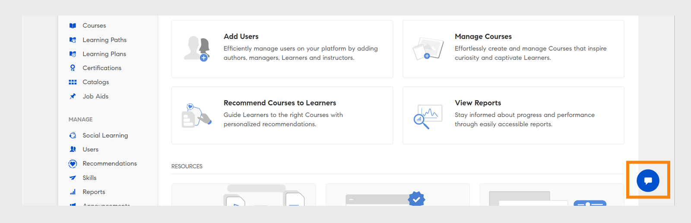
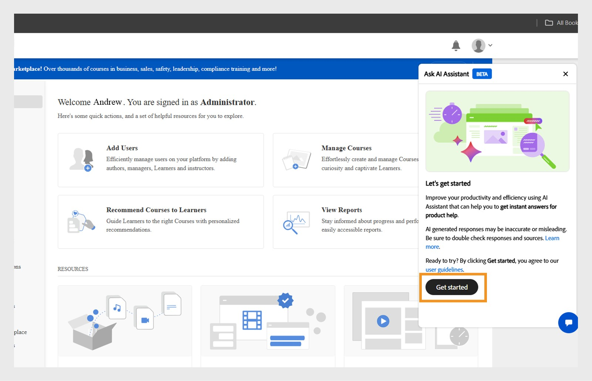
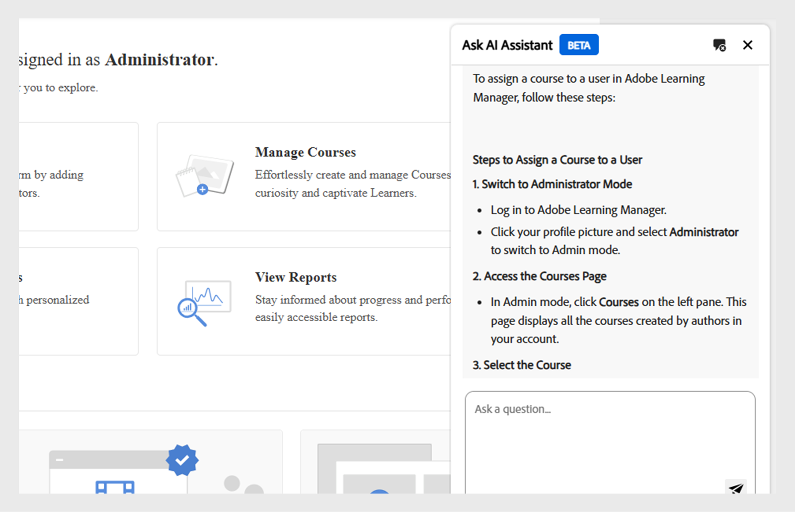
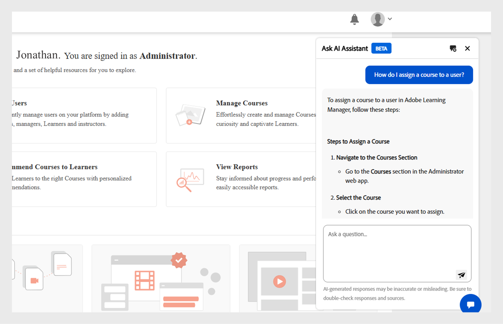
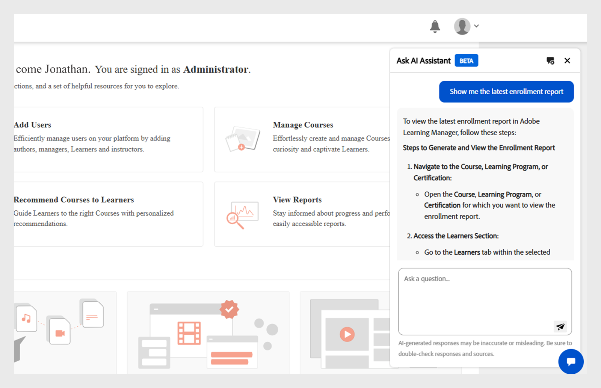
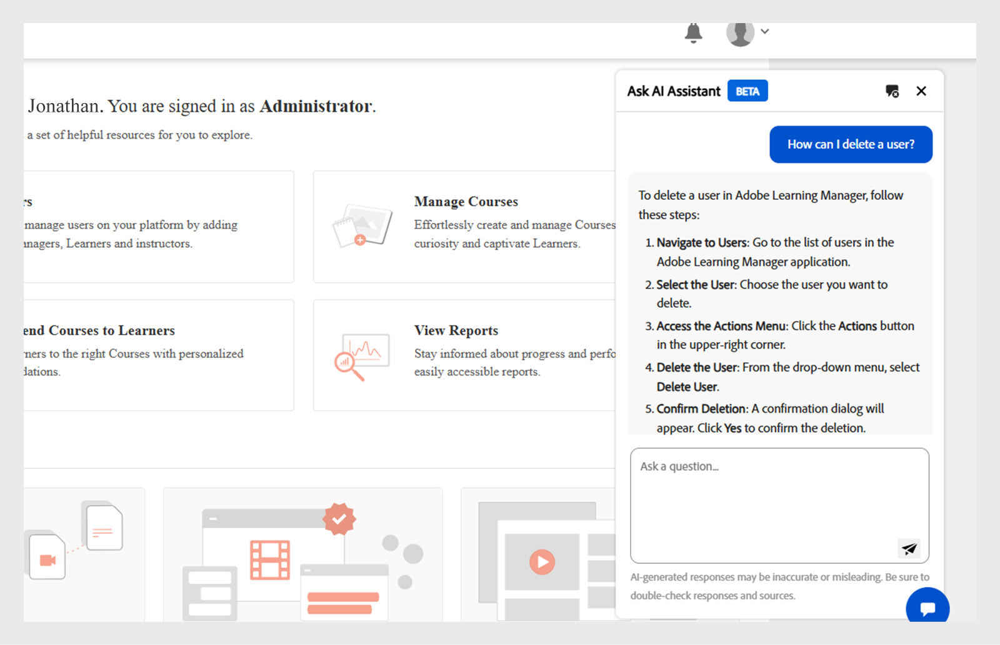
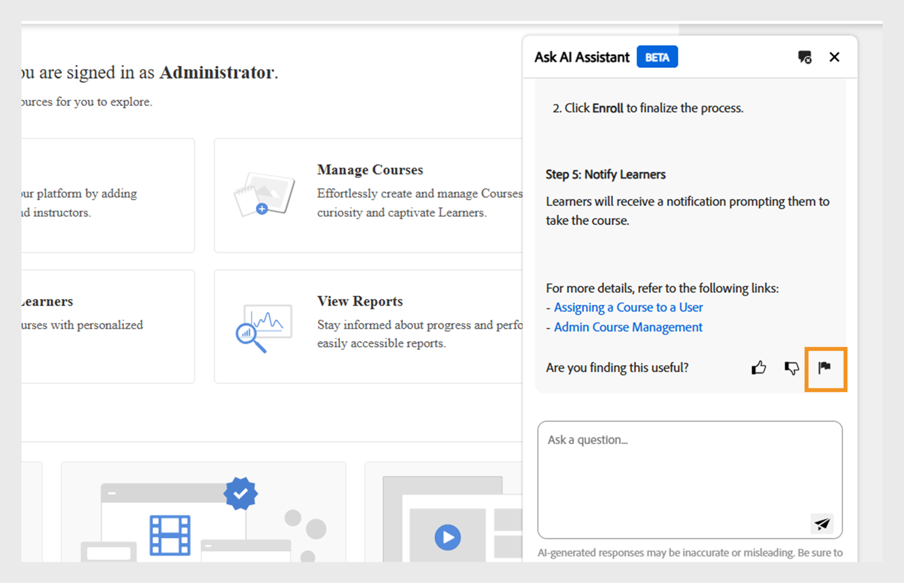
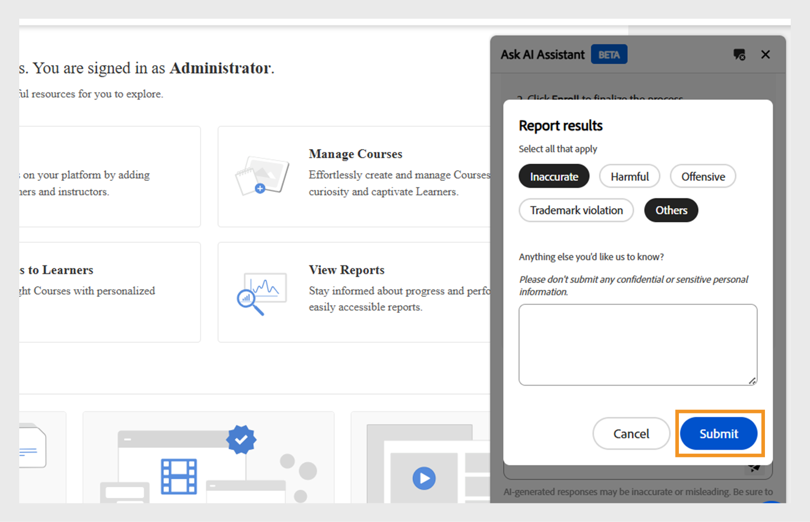

# Adobe Learning Manager中的Admin AI助理(Beta)

在複雜的學習設定中，由於選單複雜和工作流程中斷連線，管理員可能難以找到內容或完成任務。 例如，執行報表或存取特定資訊等工作，可能需要導覽多個畫面。 Admin AI助理(Beta)可幫助您找到正確的資訊，以便有效地瞭解並完成工作。

Adobe Learning Manager中的Admin AI Assistant (Beta)可協助管理員快速找到常見問題的解答、探索系統功能，並瞭解如何透過簡單語言提出問題來完成關鍵任務。 無論您是Adobe Learning Manager的新手還是想尋找更快的疑難排解方式，Admin AI Assistant (Beta)都透過直接在平台上提供內容感知協助來簡化您的工作流程。

它使用Adobe的AI功能來啟用跨學習內容和系統工作流程的自然語言查詢。  管理員可以提問，例如&#x200B;**如何將使用者新增到Adobe Learning Manager**&#x200B;或&#x200B;**如何新增學習路徑**。 Adobe Learning Manager Admin AI Assistant (Beta)專門針對可公開取得、由Adobe擁有的檔案（例如&#x200B;**[!UICONTROL Experience League]**&#x200B;上託管的資源）進行培訓。 它不會學習或存取客戶內容、內部訓練教材或使用者產生的資料。

此助理減少依賴手動導覽，縮短探索時間，並有助於快速呈現可操作的深入分析。

<!--## Key benefits

* Perform common administrator tasks faster with conversational guidance.
* Get instant answers without browsing through extensive menus.
* Gain real-time insights and step-by-step guidance for administrative workflows.-->

>[!IMPORTANT]
>
>它僅適用於管理員，目前僅支援英文。

## 隱私權、安全性和治理

Admin AI Assistant (Beta)的設計目的是為了密切注意安全性和資料隱私權。 以下是您可以期待的：

* Admin AI助理(Beta)不會使用任何個人資料，包括訓練用途。
* 無法存取學習資料或儲存在Adobe Learning Manager中的內容。
* Admin AI助理(Beta)不會存取或分享任何個人識別資訊(PII)，也不會分享私人或敏感資訊。
* 使用者提供的任何提示（例如問題或查詢）不會與其他客戶共用。

>[!IMPORTANT]
>
>Admin AI Assistant (Beta)將分階段推出，客戶會收到兩週預先通知。 如需任何協助，請聯絡您的客戶成功經理(CSM)。

## 如何存取Admin AI助理(Beta)

請依照下列步驟啟動Admin AI Assistant (Beta)：

1. 以管理員身分登入。
2. 選取聊天圖示以啟動Admin AI助理(Beta)。

   
   _選取聊天泡泡以啟動Admin AI Assistant (Beta)_

   >[!NOTE]
   >
   >第一次啟動Admin AI助理(Beta)時，您必須先提供同意才能使用。 同意對話方塊只會在初次啟動時顯示。 在後續的所有啟動中，您都會直接進入Admin AI助理(Beta)輸入提示。

3. 選取&#x200B;**[!UICONTROL Get started]**。 您現在可以使用Admin AI助理(Beta)了。

   
   _第一次使用前提示接受使用原則_

## 如何使用Admin AI助理(Beta)

若要使用Admin AI助理(Beta)：

1. 輸入提示並點選&#x200B;**[!UICONTROL Enter]**。 回應會顯示在Admin AI助理(Beta)中。

   
   _來自Admin AI助理(Beta)的範例查詢和回應_

### 提示範例

以下是管理員可用來有效利用Admin AI助理(Beta)的一些範例提示：

* **指派課程給使用者**
   * **提示**：「如何將課程指派給使用者？」

  
  _提示的回應如何指派課程給使用者_

* **最新註冊報告**
   * **提示**：顯示最新的註冊報告。

  
  _提示的回應顯示最新的註冊報告_

* **刪除使用者**
   * **提示**：「如何刪除使用者？」

  
  _提示的回應我如何刪除使用者_

### 有效使用Admin AI助理(Beta)的秘訣

* **指定您的提示**：詢問問題時，請包含清楚的內容和詳細資訊。 舉例來說，與其問「如何在Adobe Learning Manager中新增使用者？」，不如問「如何在Adobe Learning Manager中指派課程給使用者？」
* **使用簡潔明瞭的語言**：讓問題簡單明瞭，重點突出。 這可協助Admin AI助理(Beta)瞭解您的意圖，並提供更準確的回應。
* **探索不同的功能**：詢問各種功能，例如註冊報告、學習者進度、內容指派或認證追蹤，以探索所有可用的支援。
* **提供意見回饋**：收到回應後，請告知我們是否有幫助。 使用拇指向上、拇指向下、報告或評論功能，分享您的意見反應。 您的意見對於改善「小幫手」至關重要。

## 提供Admin AI助理(Beta)回應的意見回饋

您對Admin AI Assistant (Beta)產生的回應意見有助於改善其準確性、相關性和整體效能。

### 喜歡或不喜歡回應

* 如果回應有幫助且準確，請選取&#x200B;**[!UICONTROL Thumbs Up]**。
* 如果回應不正確或沒有幫助，請選取&#x200B;**[!UICONTROL Thumbs Down]**。

### 標幟回應

請依照下列步驟標幟回應：

1. 在回應結束時選取&#x200B;**[!UICONTROL Flag]**。

   
   _在Admin AI助理畫面中選取報告_

2. 選取一或多個原因，視需要新增註解，然後選取&#x200B;**[!UICONTROL Submit]**。

   
   _管理員使用拇指向上或向下加上選擇性註解來評定回應_

Adobe會利用這些意見回饋，隨時間改善Admin AI助理(Beta)。

## 常見問題

+++我可以使用Admin AI助理(Beta)作為學習者嗎？

不適用。 此助理僅供管理員使用。

+++

+++是否可在行動應用程式中使用？

目前不可以。

+++

+++它可以執行管理動作嗎？

不適用。 Admin AI助理(Beta)僅提供指引。

+++

+++會支援更多語言嗎？

Adobe Learning Manager團隊正在評估未來更新的多語言支援。

+++
