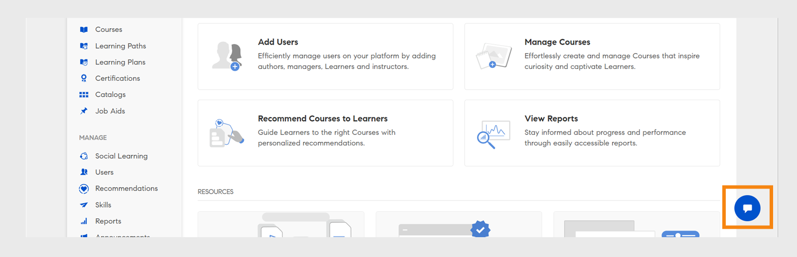
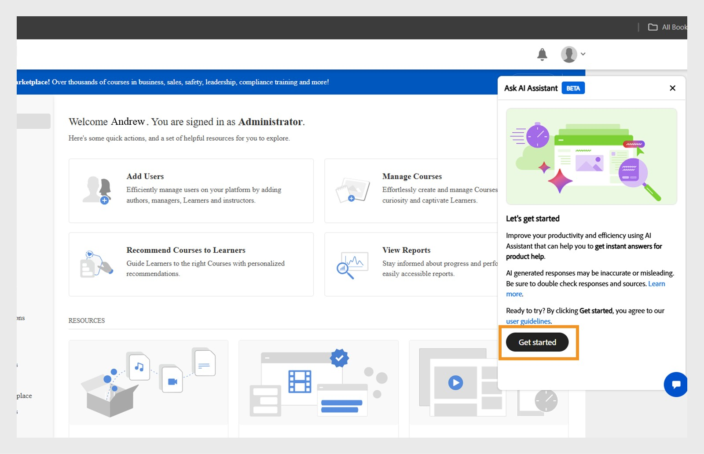
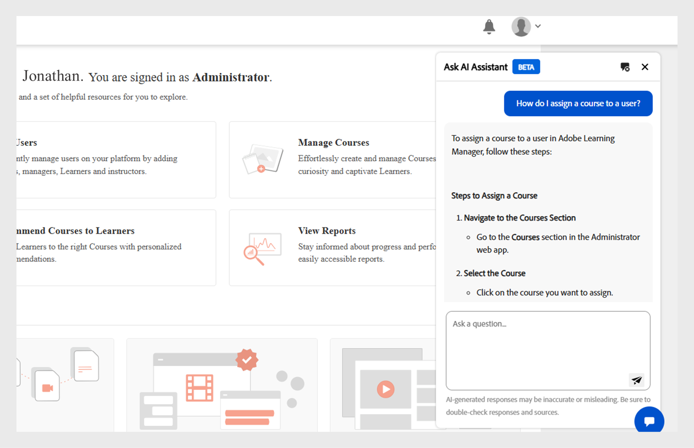
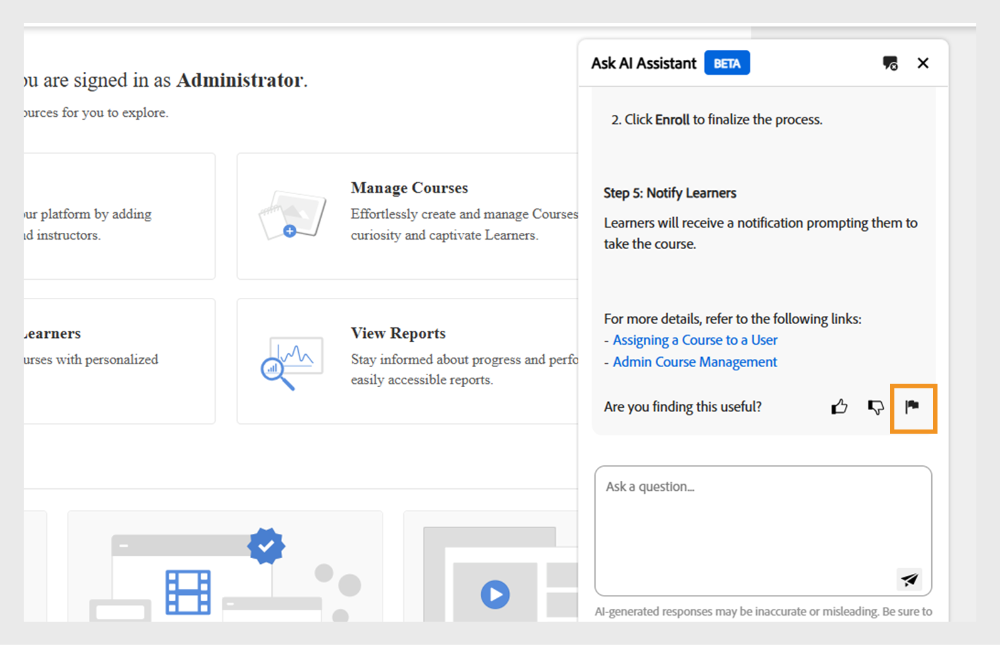
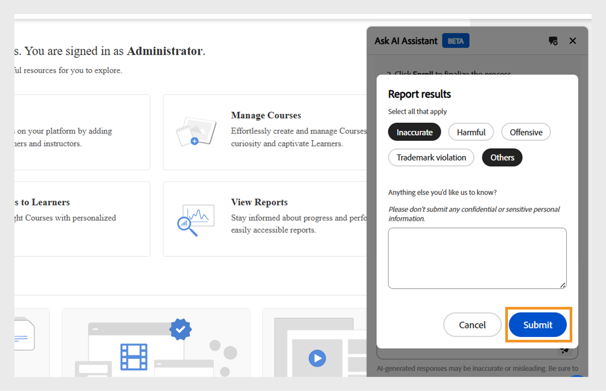

# Adobe Learning Manager 中的管理 AI 助理（測試版）

在複雜的學習環境中，管理員可能因選單複雜且工作流程分散而難以找到內容或完成任務。 例如，執行報告或存取特定資訊等任務，可能需要在多個畫面中切換。 行政 AI 助理（Beta）幫助您找到正確資訊，以有效理解並完成任務。

Adobe Learning Manager 中的 Admin AI 助理（測試版）幫助管理員快速找到常見問題的答案、探索系統功能，並了解如何完成關鍵任務，只需用淺顯的語言提問即可。 無論你是 Adobe Learning Manager 的新手，還是想更快的故障排除方法，Admin AI 助理（Beta）都能透過平台內直接提供情境感知協助，簡化你的工作流程。

它利用 Adobe 的 AI 能力，實現跨學習內容與系統工作流程的自然語言查詢。  管理員可以詢問「 **如何將使用者加入 Adobe Learning Manager** 或 **如何新增學習路徑**」等問題。 Adobe Learning Manager 管理 AI 助理（Beta）專門訓練於公開且由 Adobe 擁有的文件，例如託管於 **[!UICONTROL Experience League]**&#x200B;的資源。 它不會從客戶內容、內部培訓資料或使用者產生的數據中學習或存取。

此助理減少對手動導航的依賴，縮短發現時間，並協助快速呈現可行的洞察。

<!--
## Key benefits

* Perform common administrator tasks faster with conversational guidance.
* Get instant answers without browsing through extensive menus.
* Gain real-time insights and step-by-step guidance for administrative workflows.
-->

>[!IMPORTANT]
>
>目前僅限管理員使用，且僅支援英文。

## 隱私、安全與治理

Admin AI 助理（Beta）設計重點在於安全與資料隱私。 以下是你可以期待的內容：

* 管理員 AI 助理（測試版）不使用任何個人資料，包括訓練用途。
* 它無法存取 Adobe Learning Manager 中儲存的學習資料或內容。
* 管理員 AI 助理（測試版）不會存取或分享任何個人識別資訊（PII），也不會分享私人或敏感資訊。
* 用戶提供的任何提示（如問題或查詢）不會與其他客戶分享。

>[!IMPORTANT]
>
>Admin AI 助理（Beta）將分階段推出，客戶會提前兩週收到通知。 如需協助，請聯絡您的客戶成功經理（CSM）。

## 如何存取管理員 AI 助理（測試版）

請依照以下步驟啟動管理員 AI 助理（測試版）：

1. 以管理員身份登入。
2. 選擇聊天圖示以啟動管理員 AI 助理（測試版）。

   
   _選擇聊天氣泡以啟動管理員 AI 助理（測試版）_

   >[!NOTE]
   >
   >首次啟動管理員 AI 助理（測試版）時，您必須先提供同意才能使用。 同意對話框只會在這次初始啟動期間出現。 在所有後續的啟動中，您將直接進入管理員 AI 助理（測試版）輸入提示。

3. 選擇 **[!UICONTROL Get started]**。 你現在已經準備好使用 Admin AI Assistant（測試版）。

   
   _首次使用前提示接受使用政策_

## 如何使用管理員 AI 助理（測試版）

要使用 Admin AI Assistant（測試版）：

1. 輸入你的提示詞並按 **[!UICONTROL Enter]**。 回應內容出現在 Admin AI 助理（測試版）中。

   
   _管理員 AI 助理（測試版）的範例查詢與回應_

### 範例提示

以下是管理員可用來有效使用管理員 AI 助理（測試版）的一些範例提示：

* **將課程指派給使用者**
   * **提示**：「我該如何指派課程給使用者？」

  
  _針對「我如何將課程指派給使用者」的回應_

* **最新入學報告**
   * **提示：請**&#x200B;給我最新的入學報告。

  
  _回應題目「Show me the recent enrollment report」_

* **刪除使用者**
   * **提示**：「我該如何刪除使用者？」

  
  _針對提示「我該如何刪除使用者」的回應_

### 有效使用管理員 AI 助理（測試版）的技巧

* **具體你的提示**：提問時，包含明確的背景和細節。 例如，與其問「我如何在 Adobe Learning Manager 新增使用者？」改問「我如何在 Adobe Learning Manager 中指派課程給使用者？」
* **使用清晰簡潔的語言**：保持問題直白且聚焦。 這有助於管理員 AI 助理（Beta）理解你的意圖，並提供更準確的回應。
* **探索不同功能**：詢問多種功能，如註冊報告、學習進度、內容分配或認證追蹤，以了解所有可用的支援。
* **提供回饋**：收到回覆後，告訴我們是否有幫助。 使用讚、倒讚、檢舉或留言功能來分享你的回饋。 你的回饋在提升助理方面扮演關鍵角色。

## 對 Admin AI 助理（Beta）回應提供回饋

您對管理員 AI 助理（測試版）所產生回應的回饋，有助於提升其準確性、相關性及整體效能。

### 喜歡或不喜歡某個回應

* 選擇 **[!UICONTROL Thumbs Up]** 回答是否有幫助且準確。
* 選擇 **[!UICONTROL Thumbs Down]** 回答是否錯誤或無助。

### 標記A回應

請依照以下步驟標記回應：

1. 在回應的最後選擇 **[!UICONTROL Flag]** 。

   
   _在管理 AI 助理畫面中選擇報告_

2. 選擇一個或多個理由，必要時加入評論，然後選擇 **[!UICONTROL Submit]**。

   
   _管理員會用大拇指或讚或踩來評分回應，並附有可選的評論_

Adobe 利用這些回饋持續改進 Admin AI 助理（Beta）。

## 常見問題

+++我可以以學習者身份使用 Admin AI Assistant（測試版）嗎？

不。 此助理僅供管理員使用。

+++

+++手機應用程式裡有這個功能嗎？   

目前還沒有。

+++

+++它能執行管理員操作嗎？    

不。 管理員 AI 助理（測試版）僅提供指導。

+++

+++會支援更多語言嗎？

Adobe Learning Manager 團隊正在評估未來更新的多語言支援。

+++
