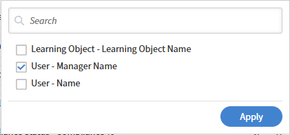

# 在報表建構器中建立自訂報告

## 概觀

從零開始建立最有效的方法是你對需要的欄位和輸出有清晰的了解，且沒有任何現有範本符合你的使用情境。 如果你是報告建構器新手，可以考慮從範本開始。

## 建立自訂報告

在這個範例中，你會辨識每位經理下有合規課程風險的學習者。

1. 以管理員身份登入 Adobe Learning Manager。
2. 選擇報表&#x200B;**，然後選擇**&#x200B;報表建置器&#x200B;**。**
3. 選擇「**報告」標籤，然後選擇**「建立報告&#x200B;****」。
4. 輸入報告名稱。 需要一個名字。 可選擇性地輸入描述。

   

5. 在欄位面板中，選擇以下資料集並展開：

   * 使用者
   * 學習物件
   * 使用者合規狀態

6. 在你想包含的欄位旁邊選擇 **+** 鍵。 選取的欄位會出現在報告畫布中。

   * 使用者-名稱
   * 使用者-管理員名稱
   * 學習物件- 學習物件名稱
   * 使用者合規狀態-完成率
   * 使用者合規狀態-合規率

   

7. 在畫布中拖曳欄位即可重新排序。
8. 要重新命名欄位，請在欄位的別名欄位輸入名稱。 別名會以下載檔案的欄頭出現。
9. 選擇 **「儲存報告**」。

## 下載報告

1. 請選擇 **右上角的動作** 。

   

2. 選擇 **下載**。 當報告準備好時，你可以從通知圖示下載。

下載的報告（csv）包含以下欄位：

* 名稱
* 經理姓名
* 名稱
* 完成Pct
* 合規Pct

## 套用群組、篩選器與排序

### 濾波器

現在你已經下載了報告，請套用一個篩選條件，使 completionPct 或 compliancePct 等於 100。

1. 打開報告，並在右上角選擇 **編輯** 。
2. 選擇 **新增篩選器** ，並在你想套用篩選器的欄位搜尋。

   

3. 選擇 **新增**。
4. 將濾波器與 AND/OR 邏輯結合;在濾波器列間選擇操作員切換。

   

5. 選擇 **儲存報告** 並下載報告。

下載的報告包含完成Pct或合規Pct等於100的紀錄。

### 分組

依管理者將紀錄分組為：

* 依管理者彙整學習者資料
* 計算管理器層級的平均值
* 在每位管理者下計算學習者

1. 打開報告，並在右上角選擇 **編輯** 。
2. 選擇&#x200B;**群組並選擇**&#x200B;使用者管理員名稱&#x200B;**:Select**&#x200B;欄位。

   

3. 彙總以下欄位：

   * 使用者名稱
   * 學習物件 - 學習物件名稱

4. 選擇 **「計數** 」作為欄位的彙總函數。

   

5. 學習物件 - 學習物件名稱重複。

   

6. 選擇 **儲存報告** 並下載報告。

下載的報告包含了各經理對學習者培訓表現的總結。 它顯示每位經理的平均完成率、平均合規分數及總學習人數。 數據顯示所有團隊均完成培訓，而合規表現在不同經理間差異顯著。

### 排序

請依每位經理的學習者數量，依照報告的數量從多到低排序。

1. 打開報告，並在右上角選擇 **編輯** 。
2. 選擇 **新增排序**。
3. 搜尋使用者名稱並選擇 **使用者名稱**。
4. 選擇 **下降**。

   

5. 選擇 **新增**。
6. 選擇 **儲存報告** 並下載報告。

下載的報告依序顯示每位經理的學習人數。
