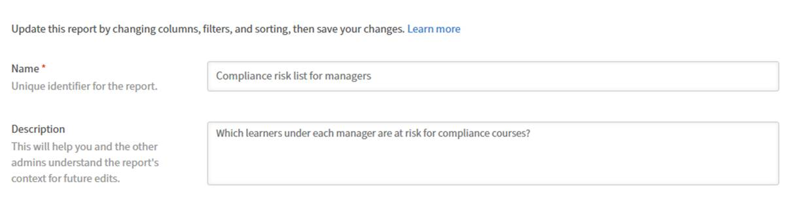

# 在報告中新增與合併篩選器

篩選器讓你能精確鎖定報告所需的紀錄範圍。 你可以套用單一濾波器，結合多個 AND 或 OR 邏輯的濾波器，並為複雜條件建立巢狀群組。

## 新增過濾器

使用篩選器限制報告只涵蓋特定資料子集，而不是全部查看。

例如，你可能想了解過去365天內有多少學習者報名了課程。 在這種情況下，你會在登記日期上套用日期篩選器，只包含最近的活動。

1. 啟動報表建器並選擇 **建立報表**。
2. 請輸入報告的名稱與描述。
3. 請選擇以下欄位： `dataset>:<column name>`
a. 註冊-註冊日期
b.使用者名稱   
4. 在「報告」區塊中，選擇 **新增篩選器**。
5. 搜尋或瀏覽到你想篩選的欄位。在此範例中，選擇 **註冊日期-註冊日期**。   
6. 選擇 **新增**。
7. 選擇一位操作員。 可用的運算子依欄位的資料型態而定：a. 字串場 — 包含、等於、以 開頭b. 數值場 — 大於、小於、等於c. 日期欄位 — 等於 之前、之後、中間、過去 N 天d. 列表（列舉）欄位 — 在 是，不在
8. 在這種情況下，選擇 **是在去年**&#x200B;以內。   
9. 選擇 **儲存報告** 並選擇 **動作** > **下載** 以下載報告。

下載後的報告列出過去 365 天內註冊學習物件的所有使用者。

### 加入多個帶有 AND / OR 邏輯的濾波器

當你加入第二個過濾器時，過濾器間的預設關係是 AND;這兩個條件都必須成立，列才會出現。

例如，你可能想找出過去365天內報名課程的學習者，並向特定經理報告。 此時，兩個條件都必須成立，因此濾波器會以 AND 邏輯組合。

1. 啟動報表建器並選擇 **建立報表**。
2. 請輸入報告的名稱與描述。
3. 請選擇以下欄位： `<dataset>:<column name>`
a. 使用者名稱
b. 使用者管理員名稱
c. 註冊-註冊日期   

4. 依欄位 **「使用者管理員名稱**」分組。
5. 在 **篩選器** 區塊中，選擇以下篩選器：
a. 註冊-註冊日期 **為去年**&#x200B;以內
b. 使用者管理員名稱 **以 N** 開頭
c. 使用者管理員名稱 **並非空**
   
6. 選擇 **儲存報告** 並選擇 **動作** > **下載** 以下載報告。

下載的報告列出過去 365 天內註冊學習物件的所有使用者，並向一位以 N 開頭的經理回報。

### 建立巢狀過濾器群組

巢狀群組讓你能建立多層邏輯層次的條件，相當於公式中的括號。 例如：（目錄=安全，或目錄=衛生）且完成日期為過去90天內。

當你的邏輯包含 AND 和 OR 條件的混合，必須同時評估時，使用巢狀濾鏡群組。

例如，使用巢狀過濾器邏輯識別未完成的註冊，學習者進度低於50%或逾期訓練，展示AND與OR條件如何協同運作。

1. 啟動 **報表建器** 並選擇 **建立報表**。
2. 請輸入報告的名稱與描述。
3. 請選擇以下欄位： `<dataset>:<column name>`
a. 註冊狀況
b. 招生 - 進度百分比
c. 註冊 - 逾期   
4. 在 **篩選器** 區塊中，選擇以下篩選器：
a.註冊狀態 **不等同於任何已** 完成。
b. 選擇 **+**。
c. 搜尋註冊進度百分比。
d. 選擇篩選條件。
e.選擇 **加入為群組**。   f. 將入學進度百分比 **加於低於** 50   g. 選擇 **+**。
h.搜尋「Enrollment-Overdue 」
i. 選擇篩選條件。
j.選擇 **加入為群組**。   k. 將逾期入學加為真。
l. 將巢狀的 AND 改為 OR。   
5. 選擇 **儲存報告** 並選擇 **動作** > **下載** 以下載報告。

下載的報告列出所有正在進行中或未開始的登記，進度百分比低於50%或逾期未繳。
