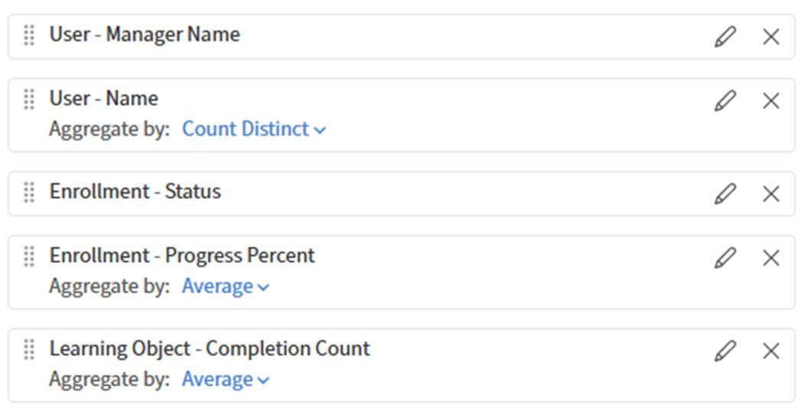

# 在報告建構器中建立趨勢報告

趨勢報告顯示課程數量、註冊人數或完成人數等指標隨時間的變化。 你可以選擇日期欄位和趨勢細度（日、週或月），然後在報表建工具中依該時間段將資料分組。

## 趨勢數據的意義

報告工具中的趨勢報告反映 **依日期**&#x200B;分組的即時快照資料。 它們不會顯示每個過去日期的資料歷史狀態。

例如，每月註冊趨勢顯示現存註冊人數，分布於創建月份內。 若學習者於一月註冊，後來退選，該登記紀錄可能不再顯示。 該報告反映的是當前的紀錄狀況，而非一月份的真實情況。

這對審計來說是一個重要的區分。 若您需要時間點的歷史資料，請使用此報告進行方向趨勢分析，而非精確的歷史紀錄。

## 建立課程數量趨勢報告

此報告顯示每月新增課程數量。

1. 選擇 **報表** 建> **報表建構器**，然後選擇 **報表** 標籤。
2. 選擇 **建立報告**。 輸入名稱，例如課程數量 MoM。
3. 從學習物件資料集新增&#x200B;**學習物件 ID**&#x200B;**。**
4. 從學習物件資料集新增&#x200B;**已建立日期**&#x200B;**。**   
5. 申請 **按創建日期**&#x200B;分組&#x200B;**&#x200B;**。將趨勢細度設定為 **Month**。   
6. 將計數&#x200B;**套用**&#x200B;到&#x200B;**學習物件 ID**。請輸入別名課程數量。   
7. 依創建日期&#x200B;**排序**，按時間順序顯示趨勢。   
8. 選擇 **儲存報告** 並選擇 **動作** > **下載** 以下載報告。

下載的檔案包含每月課程創建活動的趨勢，顯示隨時間創建的課程數量。 它有助於追蹤課程生產模式、高峰、衰退以及整體內容成長。

## 建立依目錄分類的完成趨勢報告

本報告顯示各目錄在特定期間內的月度完成總數。

1. 選擇 **報表** 建> **報表建構器**，然後選擇 **報表** 標籤。
2. 選擇 **建立報告**。 輸入名稱，例如目錄完成、MoM。
3. 從目錄資料集中新增&#x200B;**目錄名稱**&#x200B;**。**
4. 從模組逐字稿資料集新增&#x200B;**完成日期**&#x200B;**。**
5. 從學習物件&#x200B;**資料集新增**&#x200B;學習物件 ID **&#x200B;**，以計算完成次數。
6. 申請 **依目錄**&#x200B;名稱&#x200B;**分組**。也請依完成日期&#x200B;**分組**&#x200B;**申請**，並以&#x200B;**月份**&#x200B;細分方式申請。   
7. 將計數&#x200B;**套用**&#x200B;到&#x200B;**學習物件 ID**。這才是別名：總完成數。
8. 新增篩選條件： **目錄** 在安全、銷售、配送（或與你帳戶相關的目錄）中。
9. 新增篩選條件： **完成日期** 在去年以內。   
10. 依完成日期&#x200B;**遞增排序**。   
11. 選擇 **儲存報告** 並選擇 **動作** > **下載** 以下載報告。

## 最佳實務

* 使用完成日期&#x200B;**來查看完成趨勢，**&#x200B;使用&#x200B;**註冊日期**&#x200B;來查看註冊趨勢。使用錯誤的日期欄位會產生誤導性的結果。
* 新增日期篩選器，將趨勢限制在有意義的時間範圍，例如每月趨勢是過去12個月，週趨勢則是過去8週。
* 在趨勢報告名稱中標示細節和日期範圍，例如「目錄完成度 MoM – 最近三個月」，這樣日後查看時就很清楚。
