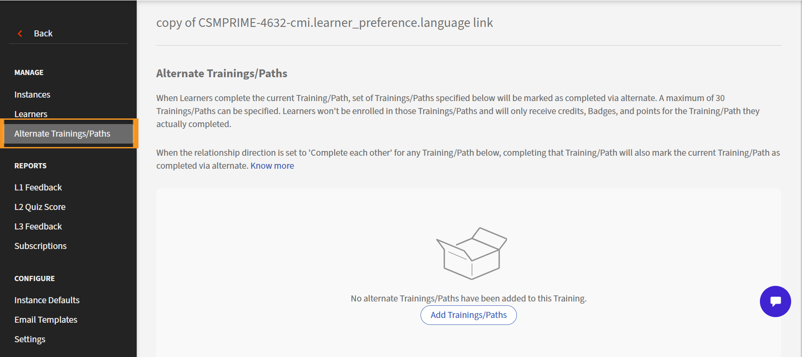
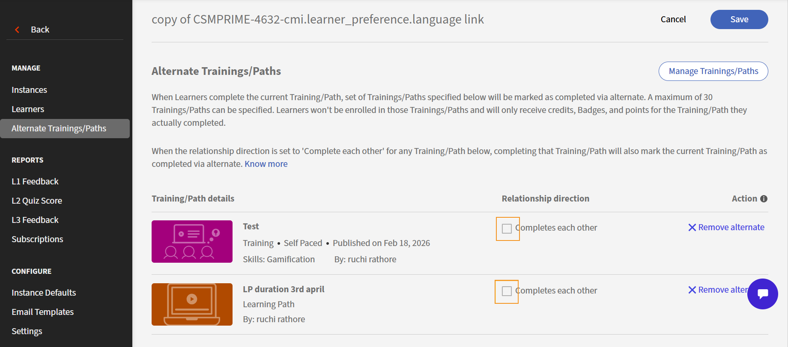
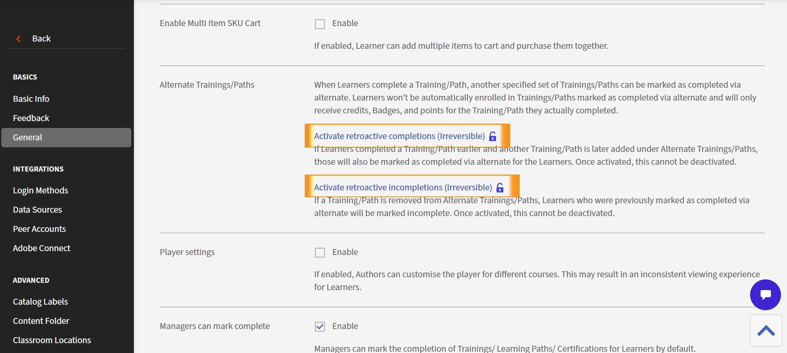

# 替代與等價

## 簡介

在許多組織中，學員會遇到不同課程能合法滿足相同需求的訓練情境。 例如，什麼時候應該用新課程取代舊課程？ 何時應該以較完整的課程取代較短的課程，或何時應該提供特別的替代課程？

替代課程或學習路徑功能為ALM提供了正式表達方式：

「如果學員完成了這項訓練，就當作已經完成了相關訓練要求。」

此功能跨課程與學習路徑運作，確保後續要求如先修條件與合規規則得到遵守，且不需強迫學習者硬背重複內容。 它也透過記錄直接完成的事項與替代完成的事項，保持報告的準確性。

核心功能引入了替代完成的概念：當學習者完成設定的原始訓練後，自動產生一種特殊的完成狀態，該訓練計入另一個目標訓練。

## 替代關係

有些培訓關係是雙向的，意即每門課程都能滿足對方的需求。 這實際上是一種兩種訓練被視為互換的情境。 相較之下，單向關係允許一種訓練滿足另一種訓練的要求，但反之則不然。 ALM 使用相同的替代補全機制來建模兩種情境。

* **雙向關係（等效** ）：完成任一訓練即可滿足另一項訓練的要求。
* **單向關係：** 完成訓練A滿足訓練B，但完成B不滿足A。這種情況常見於較新或更全面的版本應計入舊有要求，但反過來則不然。

例如，當一個更完整的超集課程涵蓋較簡單的子集課程時， 完成超集合應該滿足子集的要求，但不一定反過來。

一門更新、擴充的課程，應該算入舊有的必修課程。

為特定族群設計的課程（例如區域性或無障礙調整的變體），同時仍符合主課程的要求。

一個加強版的新課程，組織希望將其計入舊有要求，但舊版本不應計入新要求。

在《Alternates》中，關係通常是單向的。 如果課程A是課程B的備選，完成課程A可以滿足課程B的要求，但完成課程B不一定符合課程A的要求。

當設定的原始訓練完成後，ALM 會自動產生一個或多個目標訓練的替代完成。

## 這解決了哪些問題？

沒有替代方案，管理者與學習者將面臨多項反覆出現的問題：

* 學習者經常被要求重修已完成內容的課程，內容內容不同版本或格式。
* 更新合規計畫更簡單，因為管理員可以替換或重組訓練內容，而不必強迫完成舊版本的學習者重修替代或已取代的內容。
* 前提邏輯是僵硬的。 如果一條路徑需要特定課程作為先決條件，那麼沒有明確的方法能辨識另一項訓練是否足夠。
* 報告和審計更困難。 沒有正式訊號顯示該要求透過替代完成方式被滿足，也無法直接追蹤信用來源。

替代功能透過以下方式解決這些問題：

* 當替代方案有效時，避免學習者重複工作。
* 允許管理員修改訓練結構（例如在路徑內交換課程），而不會中斷先前版本學習者的完成度。
* 允許先決條件與合規檢查同時尊重直接完工及替代或等效完工。
* 清楚記錄訓練是直接完成還是透過其他關係完成，以及訓練來源為何。

## 這個功能在概念上如何運作

此功能建立在三個主要理念上：**關係**、**替代完成**&#x200B;與&#x200B;**下游行為**。

### 訓練之間的關係

管理者定義課程與學習路徑之間的關係。 每段關係，他們會選擇一個來源及一個或多個目標。 一門課程可能有多達30個目標，視應滿足的早期或相關訓練數量而定。

對等的，管理員可以讓雙方的關係是雙向的，如果他們希望雙方訓練都能滿足彼此。 對於替代，管理員通常會保持方向單向，以反映只允許部分替換。

這些關係儲存在訓練層級，而非學習者層級。 一旦設定並啟用，這些訓練可適用於所有目前及未來完成的原始訓練，但須依帳號層級設定（如是否啟用追溯完成）而有所不同。

### 替代完備

當學習者完成來源訓練時，ALM 會檢視所有已設定的替代關係，並為每個相關目標訓練建立備用完成紀錄。 此紀錄與正常完備化不同：

* 它標示學習者的目標訓練，但會記錄該訓練是透過交替完成，而非直接完成。
* 它記錄了用來滿足目標的來源訓練。
* 它被儲存在專用結構中，以便報告能區分直接完成與替代完成。

即使學員未註冊，仍能看到交替完成課程。 學習者成績單（LT）報告僅包含學習者已報名的培訓紀錄。

#### 學習者應用程式的替代及等效完成體驗

替代完成課程會在學習者應用程式中明確顯示，讓學習者清楚了解培訓需求如何達成，同時保持成績單與報告的一致性。

#### LO 卡的行為

##### 替代完工狀態

當學習者透過替代關係完成訓練時，學習對象（LO）卡片會顯示一個獨立狀態，該狀態為 **透過替代**&#x200B;完成。 這種視覺區分幫助學習者區分直接完成與透過配置關係獲得的完成。

#### 完工方法指示器

LO 卡片包含完成方法指示（例如標籤或圖示），以顯示完成是透過替代完成。 若替代完成因追溯未完成或原始訓練刪除等變更而被撤銷，ALM 將撤銷所有替代完成的介面新增內容。 學習者仍無法依照目前目錄存取行為鎖定 LO。

#### 透明度與審計細節

學習者可打開 LO 卡查看更多細節，包括：

* 提供替代完成的來源課程或學習路徑

這確保了透明度。

#### 過濾與檢視

##### 補全方法濾波器

學習者應用程式提供篩選器，讓學習者能區分以下內容：

* 已完成
* 透過替代完成（此會過濾只有替代完成的 LO）。 如果LO同時有替代和直接完成，則不會被包含在內。）
* 當你選擇 **已完成** 或 **透過替代**&#x200B;完成時，你就能看到所有完成的

這讓學習者能快速了解其學習需求如何被滿足。

##### 逐字稿與進度觀點

完成方法過濾器可在面向學習者的視圖中使用。 例如：

* 進度與完成追蹤部分

這些觀點清楚指出哪些培訓是直接完成的，哪些則是透過替代完成的。

<!--
## Configure equivalent courses (complete each other)

Use this workflow to define courses that are **equal in value**, where completing either course should automatically complete the other.

1. Launch ALM and navigate to courses.
2. Select a course to configure.
3. Navigate to the **Alternates** section.
4. Search for and select one or more related courses.
5. For each selected course, enable **Completes each other**.
6. Save the configuration.

**Result**

- ALMm records a **bi-directional equivalence relationship**.
- Either course can act as a completion source for the other.

## Configure alternate courses (superset → subset)

Use this workflow when one course is a **superset** of another and should satisfy completion for the simpler or subset course.

1. Launch ALM and navigate to courses.
2. Select the **superset (primary)** course.
3. Go to the **Alternates** section.
4. Select one or more **alternate (subset)** courses.
5. Leave the relationship as **alternate** (do not enable completes each other).
6. Save the configuration.

**Result**

- Completion flows **one-way** from the source course to the alternate.
- Reverse completion is not applied.

## Apply completion logic after source course completion

Automatically evaluate and apply alternate or equivalent completion once a learner completes a configured source course. ALM:

1. Detects completion of a **source course**.
2. Evaluates configured relationships:
   - Equivalent relationships
   - Alternate relationships
3. For each related course:
   - Marks the course as completed if conditions are met
4. Creates a completion record with method **Alternate**.

**Key system rules**

- Alternate completion:
  - Satisfies prerequisites
  - Allows progress in learning paths and certifications
- Alternate completion does **not** award:
  - Skills
  - Badges
  - Gamification credits

## Record completion in Learning Transcript

Ensure alternate and equivalent completions are clearly distinguishable from direct completions for audit and reporting. ALM:

1. Updates the **Learner Transcript (LT)**.
2. Sets:
   - Completion status = Completed
   - Completion method = **Alternate**
3. Sets completion date equal to the **source course completion date**.

## Enable retroactive completion (optional)

Apply alternate or equivalent completion benefits to learners who completed source courses **before** the relationships were configured.

1. Open **Account-level settings** from Administrator home > Settings > General.
2. Enable **Retroactive completion**.
3. Save the configuration.

ALM:

1. Scans historical learner completions.
2. Applies alternate or equivalent completion where applicable.
3. Updates learner transcripts automatically.

## Enable retroactive incompletion (irreversible)

Revoke previously applied alternate or equivalent completions when relationships are removed or corrected.

1. Open **Account-level settings**.
2. Enable **Retroactive incompletion**.
3. Modify or remove alternate/equivalent relationships.

ALM:

1. Identifies impacted alternate completions.
2. Revokes previously applied alternate or equivalent completions.
3. Updates transcript entries to **Alternate (Revoked)**.
-->

### 端到端流動

**給學習者**

1. 在學習者應用程式中切換到 **「我的學習** 」或 **「已完成課程** 」。
2. 檢視 LO 卡，辨識標示 **為「透過替代**&#x200B;完成」的訓練。
3. 打開 LO 卡以查看（在概覽頁面）關於來源訓練的詳細資訊。
4. 使用篩選器選擇 **直接**、 **替代**&#x200B;或 **全部**。
5. 根據所選完成方式檢視更新後的清單。

**給管理員與作者**

* 在管理介面中設定課程或學習路徑間的替代關係。

## 追溯完成與不完成行為

ALM 支援追溯完成與追溯不完成，以確保替代關係隨時間保持準確，即使關係在學習者完成訓練後被修改或移除。

### 追溯完成

#### 定義

啟用追溯完成後，過去完成原始課程的學習者，若後來建立替代關係，將自動獲得目標課程的替代完成。 這確保歷史學習得以尊重，且不需學習者重修訓練。

#### 運作原理

1. 管理員在帳號層級啟用追溯完成。
2. 管理者會定義來源訓練與目標訓練之間的替代關係。
3. 系統會掃描來源訓練的歷史完成紀錄。
4. 符合資格的學員可獲得目標訓練的替代完成。
5. 這些紀錄在學習者成績單及報告中顯示&#x200B;**為「透過替代**&#x200B;完成」。

>[!NOTE]
>
>啟用追溯完成後，僅適用於後續建立的關係。 此不適用於在啟用追溯設定前已存在的關係。

### 追溯未完成

#### 定義

當啟用追溯性未完成時，若移除底層替代關係或刪除來源訓練，則替代完成資料會被撤銷。
這確保系統反映目前且有效的訓練關係。

#### 運作原理

1. 管理員在帳戶層級啟用追溯性未完成。
2. 管理員會移除替代關係或刪除來源訓練。
3. 系統識別透過受影響關係獲得交替完成的學習者。
4. 相應的替代完成紀錄會被撤銷。
5. 被撤銷的紀錄會在逐字稿及報告中標示&#x200B;**為替代（撤銷）**&#x200B;以便審計可見。

#### 對先修課程的影響

替代完成課程——包括追溯授予的——在評估先修條件時被視為有效完成。 若學員已 **透過替代**&#x200B;完成課程，則可繼續修讀需要目標訓練的課程。

若替代完成課程因追溯性未完成而被撤銷，學習者可能會失去依賴該先修條件課程的資格。 若學習者未開始受扶養人或後續的貸款，來源貸款機構所執行的資格將被恢復。 如果學習者已經開始或完成了扶養人/後續的LO，那就不會有影響。

#### 對學習路徑與認證的影響

替代完成課程有助於完成學習路徑及永久認證。 當學生透過其他關係完成所需訓練時，可以推進或完成這些課程。

若替代完成被撤銷，受影響的學習路徑或認證可能會失去進度，直到透過有效完成達成要求為止。

### 端對端工作流程

#### 允許追溯性完成或不完成

1. 管理員可進入帳戶設定，啟用追溯完成及/或追溯未完成。
2. 管理者可以建立、修改或移除訓練間的替代關係。

#### 系統動作

* **追溯完成**：系統根據歷史來源補全提供替代補全。
* **追溯未完成**：當關聯被移除或來源訓練被刪除時，系統會撤銷替代完成。

#### 學習者體驗

學習者可在 LO 卡及成績單上看到最新的完成狀態，例如：

* **透過替代完成**

當替代完成被撤銷時，學習者介面上不會顯示任何標籤。 在報告與逐字稿中，完成方法如下：

* 替代
* 替補（撤銷）
* 直接

先修課檢查、學習路徑進度及認證狀態會根據當前完成狀態動態更新。

排序的LO會根據替代完成度動態解鎖。

技能、徽章、遊戲化點數或回饋不會在交替完成目標後授予學習者。

#### 報告與審計

所有追溯性變更均反映在學習成績單（LT）報告中。 在來源被刪除後，學習者成績單仍可在替代撤銷&#x200B;**旁邊**&#x200B;顯示來源訓練 ID。報告明確區分直接完成、替代完成及撤銷替代完成，以支持合規、支援調查及稽核。

註冊報告中直接完成時，完成來源欄位為空白，而學習者成績單則顯示電子郵件及該欄位的類型。

當目標從來源中移除（或來源本身被刪除）時，註冊報告可能不會顯示與學習者成績單中相同的&#x200B;**替代或替代（撤銷）**&#x200B;狀態。

即使&#x200B;**替代資料**&#x200B;被停用，內容審核&#x200B;**或**&#x200B;註冊&#x200B;**列中的**&#x200B;歷史條目仍可能顯示與替代檔案相關的活動。

完成日期可能早於註冊日期，若 LO 已透過替代路徑&#x200B;**完成，學習者尚未**&#x200B;正式註冊。 由於無論學習者狀態如何（**已註冊、**&#x200B;未註冊&#x200B;**或**&#x200B;在進行中&#x200B;**）都可能進行交替完成，學習者可先完成 LO，之後再報**&#x200B;名目標課程。

## 替代版本中退休與刪除原始訓練的影響

來源訓練的生命週期狀態（退休或刪除）直接影響學習者如何維護替代完成。 ALM 會以不同方式處理這些情境，以維持歷史準確性，同時確保現有關係有效。

### 退役資源訓練

#### 定義

退休課程會讓新生無法使用，但系統中仍保留以供歷史參考、報告及稽核。

#### 影響

* 透過已退休來源課程所授予的現有替代完成資格仍然有效。
* 先前完成原始課程的學習者，仍可保留目標課程的替代完成資格。
* 退休課程不會產生新的替代完成課程，因為新學習者無法完成。
* 受影響學習者的成績單與報告仍顯示&#x200B;**「透過替代**&#x200B;完成」。

### 刪除原始碼訓練

#### 定義

刪除課程會完全從系統中移除，包括完成紀錄和設定的關係。

#### 影響

* 若原始訓練被刪除，狀態可能會改為&#x200B;**替代（撤銷）。**&#x200B;退休貸款對象不會觸發這個狀態。
* 若啟用追溯未完成，則所有透過刪除原始課程授予的替代完成課程將被撤銷。
* 學習者成績單與報告更新為&#x200B;**備用（撤銷）**&#x200B;以提升審計與合規透明度。
* 完成學習路徑及證書取得不受影響。
* 刪除賽道不再提供替代完成。

#### 工作流程

1. 管理員可透過管理員介面退休或刪除原始課程。
2. 系統會評估源課程衍生的所有替代完成課程。
3. 完成狀態會根據課程州份更新：
   * **已退役：**&#x200B;現有的替代完工路線保持不變。
   * **刪除：**&#x200B;若啟用追溯未完成，替代完成會被撤銷。
4. 學習者成績單與報告反映更新狀態，以支持合規與稽核要求。

## 沒有關係的連鎖

ALM 不支援替代關係的連鎖。 替代完成僅授予直接設定的關係，且不會跨越多層級的課程。

### 理念：不連結關係

#### 定義

連鎖是指允許交替關係在多個路徑間傳播。 例如，如果A課程是B課程的替代，B課程是C課程的替代課程，連鎖即表示完成A課程後，C課程也能完成。

#### 政策

不支援串接。 替代關係與等價關係僅在單一層級評估。 完成源課程僅能完成其直接目標課程的替代完成，不包括任何下游目標。

### 工作流程

#### 關係設定

管理員會定義課程間的替代關係，例如：

* A課程→課程B課程
* B→C課程

#### 完成活動

學習者直接完成課程A。

#### 系統動作

* 若A→B的關係被定義，系統可為B課程提供交替完成。
* 即使存在B→C的關係，系統也不會給予C課程的替代完成。

#### 直接完成要求

欲獲得C課程的替代完成，學習者必須：

* 直接完成課程B，或
* 完成一門明確設定為 C 課程直接替代或等效課程的課程。

## 影響

### 沒有間接效益

學習者若未完成每門課程（或其直接替代課程），無法獲得關係鏈下方課程的完成學分。 這確保學習需求能明確且可預測地被滿足。

### 簡化的稽核與報告

報告與學習者成績單僅顯示直接關聯的替代完成。 這避免了複雜且多跳的稽核流程，並確保在審查完工核准過程時能清楚說明。

## 與同儕帳號共享目錄：未共享的關係

目錄共享允許 LO 在同儕帳號間共享，但各帳號內獨立管理替代及等效關係，且不共享。

### 概念：目錄共享與關係

#### 目錄共享

帳號可以與同儕帳號共享目錄，讓帳號間能存取課程、學習路徑及其他 LO。

#### 未被分享的關係

來源帳號中設定的替代、等效及替代完成關係，在共享目錄時不會被共享或複製。 每個帳戶獨立維護並評估自己的關係。

### 工作流程

#### 目錄共享

帳號 A **的**&#x200B;管理員與帳號 B **共享包含 LO**&#x200B;的目錄。

#### 關係配置

帳戶 A 在共享目錄中，可以定義不同的 LO 關係。

#### 同儕帳號存取

帳號 B 會獲得共享學習物件的存取權，但不會繼承帳號 A 中設定的任何替代關係。

#### 獨立管理

若帳號 B 需要類似的替代行為，帳號 B 的管理員必須手動設定該帳號內的關聯。

#### 影響

##### 無自動關係傳播

透過目錄共享，節點帳號中不會自動提供替代關係。

##### 需要手動設定

每個對等帳號負責定義並管理其共享 LO 的關係。

##### 一致性考量

完成行為、先決條件滿意度及報告可能因帳戶間而異，除非透過人工設定刻意調整關係。

## 下游行為

一旦目標訓練有替代完成，ALM 會在下游檢查中使用：

* 若目標訓練是&#x200B;**其他訓練的先決條件**，學員將有資格參加該訓練，視同已完成目標。
* 若目標為&#x200B;**學習路徑**&#x200B;中的必修課程，該路徑的完成邏輯可視為已完成該部分，並在其他條件達成時標記該路徑完成。
* 合規及其他儀表板如團體成功儀表板（Group Success Dashboard）若依賴是否完成培訓要求，則可包含僅有替代完成次數的學習者。

該系統區分實際完備與替代完備，使得：

* 若學習者後來直接完成目標訓練，這種直接完成可取代替代完成的必要性。
* 若來源與目標之間的關係被移除或改變，ALM 可以在不觸及真實補全的情況下移除替代補全，前提是帳號啟用追溯性未完成功能。

交替完成設計不干擾學習者在目標訓練中的實際活動。 它們作為一個疊加層，如果關係改變，可以進行修正。

## 電子郵件與通知

一旦學習者完成課程，學習者會立即收到應用程式內通知及電子郵件，說明課程狀態及完成方式——是否透過其他課程完成。

>[!NOTE]
>
>替代完成仍可能觸發目錄中目標LO的通知，而學習者無法看到。 替代完成/未完成通知在行動沉浸式應用程式上可能與其他地方不同。

## 新增替代路線

作為管理員，你可以新增替代課程和路徑，讓學習者有多種選擇完成他們的課程和路徑。

1. 前往&#x200B;**課程>****學習**區。可用課程清單將陸續顯示。
   
   *課程列表*
2. 導航到你想新增替代課程的課程。
   
   *為課程新增替代課程*
3. 請前往 **管理** > **替代課程/路徑**區塊。
   
   *替代訓練/路徑*
4. 選擇 **新增課程/路徑**。 可用課程清單將陸續顯示。
   
   *可選課程列表*
5. 請在圖塊左上角勾選每個課程的勾選框，選擇你想標記為 **替代** 的課程。
   
   *新增替代航道*
6. 選擇 **新增**。

   >[!NOTE]
   >
   >此時，如果你願意，可以移除替代賽道。 要移除替代賽道，請在右側每條賽道旁邊選擇&#x200B;**「移除選考」。**

7. 選擇 **儲存**。 替代賽道現已保存。

進度不會受到替代完成的限制。 當課程或學習路徑透過替代完成完成時，學習者仍可直接存取並使用該課程，以強化學習並獲得後續效益（例如遊戲化點數）。 在這種情況下，進度狀態反映學習者直接使用後的實際進展，與替代完成狀態無關。 你還會收到應用程式內通知及透過替代平台收到完成通知的電子郵件通知。

此完成有多項好處，以下列出：

* 若有此情況，這也算作完成。
* 這也開啟了其他相關課程或路徑的開放。

## 進階使用者設定

以下設定允許進階使用者使用追溯性補全與未補全。

1. 請前往&#x200B;**設定區>****設定>基礎**>****&#x200B;一般&#x200B;**>**&#x200B;替代路線/路徑區塊&#x200B;**。**
2. 選擇 **啟用追溯完成項目** 和 **啟動追溯未完成項目** ，或依需求選擇兩者之一。
   
   *啟動追溯完成或未完成*

## 學習者成績單報告

學習者完成課程/路徑的方式會被記錄在學習者成績單報告中。 以下情境被捕捉：

1. 當學習者直接完成課程而未選擇其他課程時，會反映在學習者成績單報告中
2. 當學習者完成替代課程時，會反映在學習者成績單報告中
3. 當所有替代完成因追溯性未完成及關係刪除而被撤銷時，會反映在學習者成績單報告中。
