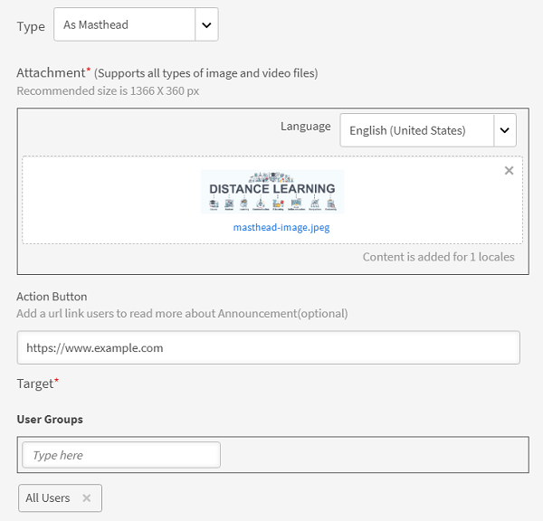
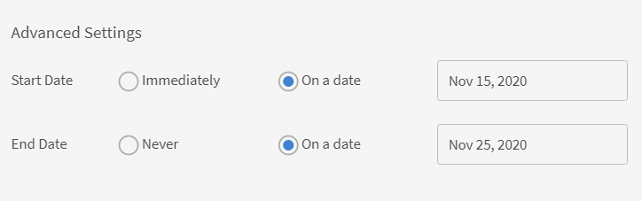
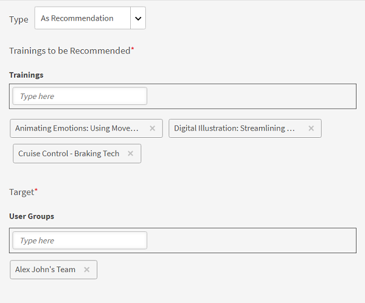
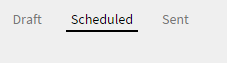
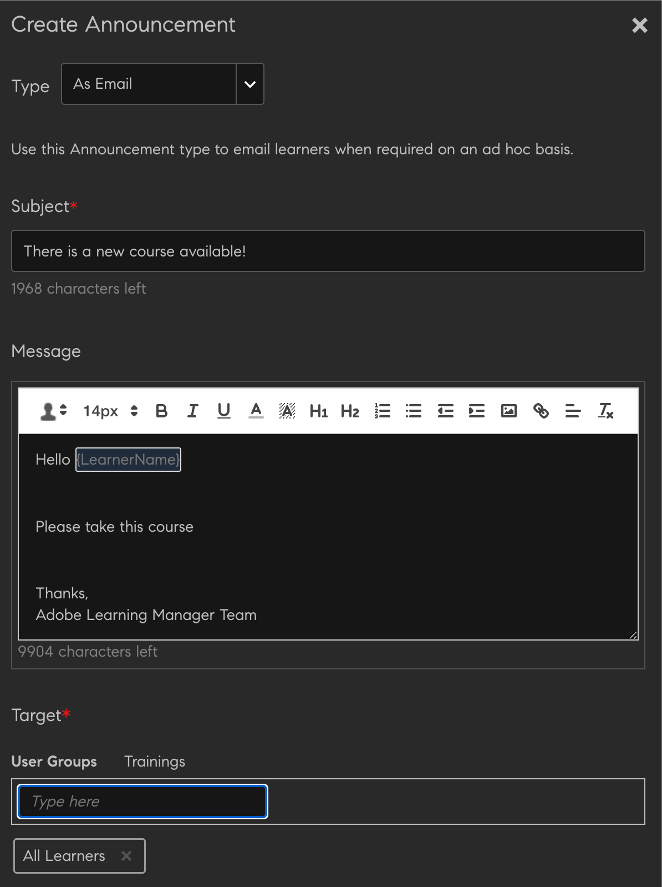

# 公告

宣告是管理員廣播給已定義使用者集合的多媒體訊息（文字、影像或視訊）。

管理員可以將公告廣播給學習者，通知他們事件發生或活動。 宣告可以是文字、影像或視訊的組合。 您可以將學習物件（如課程、學習計畫和認證）連結至公告。

公告共有四種型別：

* 通知
* 刊頭
* 建議
* 電子郵件

## 通知 {#notification}

1. 以管理員使用者身分，按一下左窗格中的公告。
1. 按一下頁面右上角的「新增」 。
1. 從「型別」下拉式清單中，選取選項 **作為通知**.
1. 在「訊息」欄位中，新增宣告的訊息。 您也可以在這裡新增公告的URL。 不過，您必須以HTML表單新增URL。

   例如，  `code <a href="http://www.w3schools.com" target="_blank">Visit W3Schools</a>.`

   將目標指定為空白時，則當使用者按一下宣告URL時，連結會在新標籤中開啟。 如果您未指定目標，連結會在相同瀏覽器中開啟。

1. 選擇性地為宣告新增附件，例如影像或視訊檔案。
1. 選擇目標使用者群組或目標學習物件。 您只能為宣告選擇其中之一。

   開始在文字方塊中輸入使用者群組名稱，然後從下拉式清單中選擇。 同樣地，在文字方塊中輸入物件名稱來選擇訓練。

1. 從對話方塊按一下「進階設定」。 您可以執行下列動作：

   * 選取啟用粘性宣告核取方塊，將此宣告設為粘性宣告。
   * 選取宣告的傳送時間。

1. 選取 **[!UICONTROL On a date]** 如果您想要排程在稍後的日期宣告，請按一下旁邊的文字區域。 此時會出現一個日曆快顯視窗，您可以從中選擇開始日期。 請依照相同的步驟選擇結束日期。
1. 按一下 **[!UICONTROL Save]**.
1. 在「草稿」索引標籤中，按一下宣告旁的設定圖示，然後按一下「傳送」 。

如果多媒體附件為大型附件，則可能需要時間上傳。 按一下「儲存」後，當處理上傳時，您會收到內含訊息的快顯視窗。 附件上傳成功後，您將會收到通知。

## 刊頭 {#masthead}

當您選擇此選項時，您選擇功能的任何媒體檔案都會作為學習者首頁的刊頭。 刊頭可作為其適用學習者的行動號召。

*自訂刊頭*

1. 瀏覽並選擇代表刊頭的影像。 建議的大小為1280 x 360畫素。
1. 選擇要新增刊頭的地區設定。 您必須針對每種語言選擇刊頭資產。
1. 在 **[!UICONTROL Action Button]** 欄位，新增url以便當學習者按一下報頭上的按鈕時，他們被重新導向至該url。 此為選用欄位。
1. 選擇目標使用者群組或目標學習物件。 您只能為宣告選擇其中之一。

   開始在文字方塊中輸入使用者群組名稱，然後從下拉式清單中選擇。 同樣地，在文字方塊中輸入物件名稱來選擇訓練。

1. 在 **[!UICONTROL Advanced Settings]** 區段，您有以下選項：

   * 按一下 **[!UICONTROL Immediately]** 如果您要立即張貼宣告。
   * 按一下 **[!UICONTROL Never]** 如果您不希望宣告過期。
   * 選取 **[!UICONTROL Start]** 和 **[!UICONTROL End]** 宣告日期。

   

   *設定刊頭顯示的時間*

**即時刊頭公告的數量是否有限制？**

您只會看到最近10個刊頭公告。

## 建議 {#recommendation}

選擇此選項時，您選擇的任何訓練都會建議給指定的使用者群組。 建議由機器學習演演算法驅動。

*選取要向學習者顯示的建議訓練*

1. 選擇您想要建議給學習者的培訓。 您可以新增最多10個培訓。

   學習者將只看到「按組織推薦」中未註冊的培訓。 根據目錄可見性，學習者有權檢視培訓。

1. 選擇目標使用者群組或目標學習物件。 您只能為宣告選擇其中之一。

   開始在文字方塊中輸入使用者群組名稱，然後從下拉式清單中選擇。 同樣地，在文字方塊中輸入物件名稱來選擇訓練。

1. 在「進階設定」段落中，您有以下選項：

   * 按一下 **[!UICONTROL Immediately]** 如果您要立即張貼宣告。
   * 按一下 **[!UICONTROL Never]** 如果您不希望宣告過期。
   * 選取 **[!UICONTROL Start]** 和 **[!UICONTROL End]** 宣告日期。

   <!---->

當您按一下 **[!UICONTROL Save]**，您可以立即發佈公告或稍後發佈。 宣告屆時仍會處於草稿狀態。

* 刊頭/Recommendations不會觸發任何通知。
* 刊頭/Recommendations未出現在公告報表中。

## 草稿、已排程和已傳送清單 {#draftscheduledandsentlist}

在管理員登入中，您可以在三個索引標籤中檢視所有宣告，例如草稿、已排程和已傳送。

<!---->

### 草稿 {#draft}

在「草稿」標籤中，您可以檢視管理員建立但尚未廣播或尚未排程廣播的所有宣告。

依預設，所有公告都設定為立即廣播。 如果您為未排程的宣告選擇「設定>傳送」選項，則會立即廣播。 若要排程宣告廣播，您必須在進階設定中選擇開始和結束日期。

### 已排程 {#scheduled}

在排程索引標籤中，您可以檢視排程在稍後日期廣播的所有公告。

### 已傳送 {#sent}

在「已傳送」標籤中，您可以檢視已廣播的所有宣告。

## 作為電子郵件

使用此選項將目標隨選電子郵件傳送給所選使用者群組的學習者或註冊特定訓練的學習者。

*傳送目標定位的臨機電子郵件給學習者*

*管理員建立電子郵件公告*

1. 選取 **[!UICONTROL Type as Email]**.
1. 輸入電子郵件主旨和郵件內文。
1. 在「目標」段落中，您可以：

   * 選取使用者群組或
   * 選取課程。 如果課程有多個例項，您可以選取所需的例項。

1. 按一下 **[!UICONTROL Save]**.
