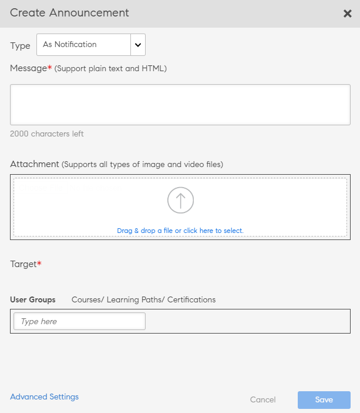
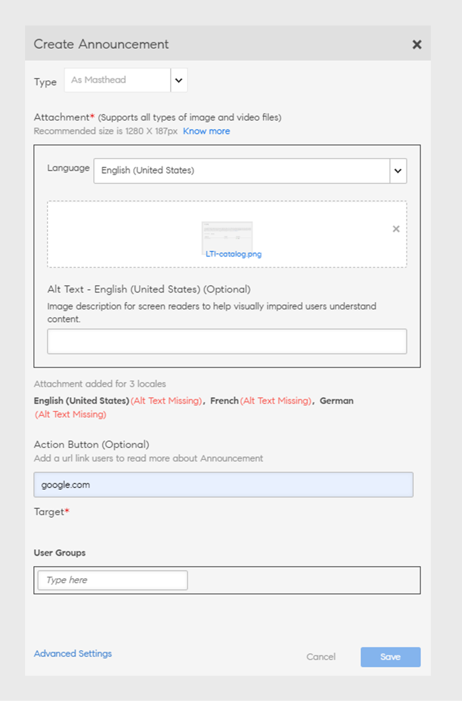
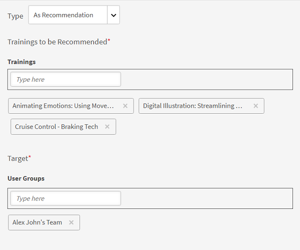
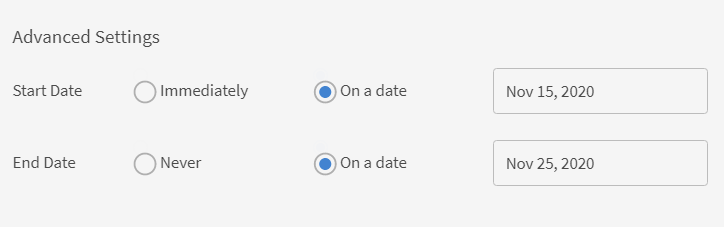
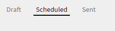
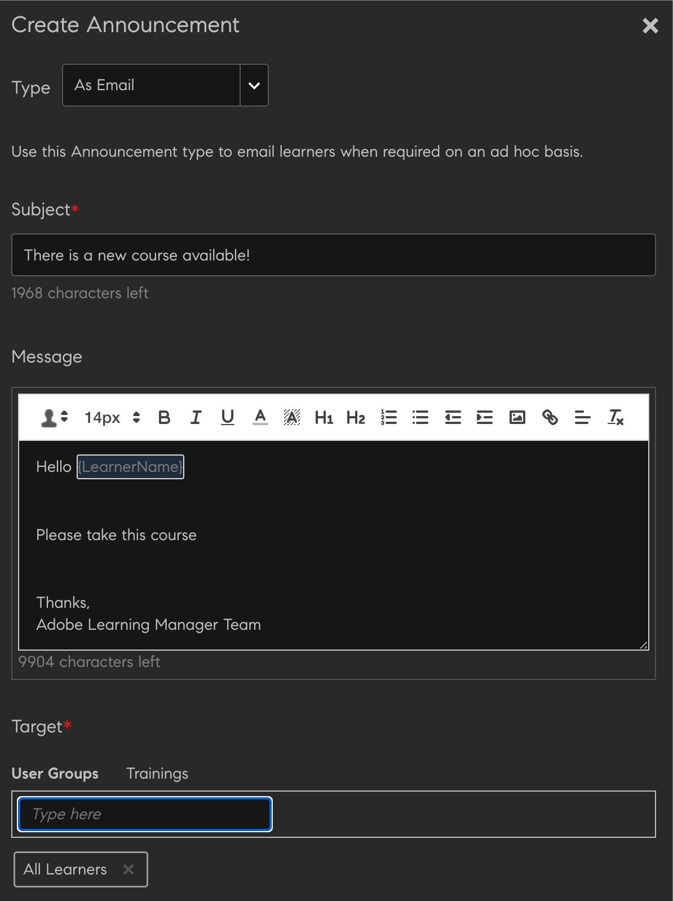

# 公告

公告是管理員向特定使用者廣播的多媒體訊息（文字、圖片或影片）。

管理員可以向學習者廣播公告，告知他們事件或活動的發生。 公告可以是文字、圖片或影片的組合。 你可以將學習對象如課程、學習計畫和證照連結到公告中。

公告有四種類型：

* 通知
* 報頭
* 推薦
* 電子郵件

## 通知 {#notification}

1. 作為管理員使用者，請點擊左側窗格的公告。
1. 點擊頁面右上角的「新增」。
1. 從「類型」下拉選單中，選擇「作為通知&#x200B;**」選項**。

*自訂通知*

1. 在訊息欄位，新增公告訊息。 您也可以在此新增公告網址。 不過，你必須在 HTML 表單中加入網址。

   例如，  `code <a href="http://www.w3schools.com" target="_blank">Visit W3Schools</a>.`

   當你將目標指定為空白，然後使用者點擊公告網址時，連結會在新分頁開啟。 如果你沒有指定目標，連結會在同一瀏覽器中開啟。

1. 可選擇性地加入圖片或影片檔案等附件以供公告使用。
1. 選擇目標使用者群組或目標學習物件。 你只能從其中一個選擇作為公告。

   開始在文字框輸入使用者群組名稱，然後從下拉選單中選擇。 同樣地，請在文字框中輸入物件名稱來選擇訓練項目。

1. 從對話框中點選進階設定。 你可以執行以下操作：

   * 請選擇啟用置頂公告的勾選框，讓此公告成為置頂公告。
   * 請選擇公告的送達時間。

1. 選擇 **[!UICONTROL On a date]** 是否要排定公告日期，然後點擊旁邊的文字區。 會出現一個行事曆彈出視窗，你可以從中選擇開始日期。 請依照相同步驟選擇結束日期。
1. 點擊 **[!UICONTROL Save]**。
1. 在草稿分頁，點擊公告旁的設定圖示，然後點擊傳送。

如果多媒體附件尺寸很大，上傳可能需要時間。 點擊儲存後，會跳出一個訊息，說明你的上傳正在處理中。 附件成功上傳後，您將收到通知。

## 報頭 {#masthead}

當你選擇此選項時，任何你選擇的媒體檔案都會在學習者首頁以報頭形式顯示。 報頭像是對學習者的行動呼籲。

管理員可以為所有報頭新增替代文字，以提升學習者的無障礙性。 這讓有特殊需求的學習者能使用螢幕閱讀器閱讀替代文字並理解圖片。 你可以選擇多種語言，並為每種語言提供替代文字。 記得要把對應語言的替代文字加進去。

要加入報頭，請依照以下步驟操作：

1. 以 . 登入。**[!UICONTROL Admin]**
2. 選擇 **[!UICONTROL Announcements]** > **[!UICONTROL Add]**。
3. 從「類型」下拉選單選擇 **[!UICONTROL As Masthead]** 。

   
   _建立公告_

4. 選擇語言並上傳圖片。

   >[!NOTE]
   >
   >你可以選擇多種語言，並為每種語言提供替代文字。 記得要把對應語言的替代文字加進去。

5. 請輸入欄位中合適的文本 **[!UICONTROL Alt Text]** 。
6. 在現場 **[!UICONTROL Action Button]** ，新增網址，讓學習者點擊報頭按鈕時重新導向。
7. 選擇目標使用者群組或目標學習物件。 你只能從其中一個選擇作為公告。
8. 在這個 **[!UICONTROL Advanced Settings]** 區塊裡，你有以下選項：

   * 選擇 **[!UICONTROL Immediately]** 是否希望當場發布公告。
   * 選擇 **[!UICONTROL Never]** 是否希望公告失效。
   * 請選擇 **[!UICONTROL Start]** 與 **[!UICONTROL End]** 日期以發布公告。
9. 選擇儲存並發布公告。

**直播主播公告的數量有限制嗎？**

您只會看到最近10個Masthead公告。

## 推薦 {#recommendation}

當你選擇這個選項時，任何你選擇的訓練都會被推薦給指定的使用者群組。 這些推薦是由機器學習演算法驅動的。

*選擇推薦的訓練以展示給學習者*

1. 選擇你想推薦給學習者的培訓內容。 你可以加起來最多10次訓練。

   學習者將只會看到未註冊的培訓，並於「組織推薦」中看到。 根據目錄可見性，學習者可查看培訓內容。

1. 選擇目標使用者群組或目標學習物件。 你只能從其中一個選擇作為公告。

   開始在文字框輸入使用者群組名稱，然後從下拉選單中選擇。 同樣地，請在文字框中輸入物件名稱來選擇訓練項目。

1. 在進階設定區塊，你有以下選項：

   * 點擊 **[!UICONTROL Immediately]** 如果你想立即發布公告。
   * 點擊 **[!UICONTROL Never]** 不希望公告失效。
   * 請選擇 **[!UICONTROL Start]** 與 **[!UICONTROL End]** 日期以發布公告。

   <!---->

點擊 **[!UICONTROL Save]**&#x200B;後，你可以立即發布公告，或稍後再發布。 在那之前，公告將處於草稿狀態。

* 主頁/推薦不會觸發任何通知。
* 報頭/推薦不會出現在公告報告中。

## 草稿、排程與寄出清單 {#draftscheduledandsentlist}

在管理員登入中，你可以在三個分頁中查看所有公告，分別是草稿、排程和已發送。

<!---->

### 選秀 {#draft}

在草稿分頁中，您可以查看管理員建立但尚未播出或尚未排定播出的所有公告。

預設情況下，所有公告都會設定為即時廣播。 如果你選擇設定>發送選項來播放未排程公告，該公告會立即廣播。 要排定公告廣播，你必須在進階設定中選擇開始和結束日期。

### 預定 {#scheduled}

在排程分頁，您可以查看所有預定於稍後播出的公告。

### 已傳送 {#sent}

在已發送標籤中，你可以查看所有已廣播的公告。

## 以電子郵件形式

使用此選項向特定使用者群體的學習者或已參加特定培訓的學習者發送針對性的臨時郵件。

*Wend 針對學習者提供針對性的臨時郵件*

*管理員建立電子郵件公告*

1. 選擇 **[!UICONTROL Type as Email]**。
1. 輸入電子郵件主旨與訊息正文。
1. 在目標區，你可以選擇：

   * 選擇使用者群組或
   * 選擇課程。 如果課程有多個實例，你可以選擇所需的實例。

1. 點擊 **[!UICONTROL Save]**。
