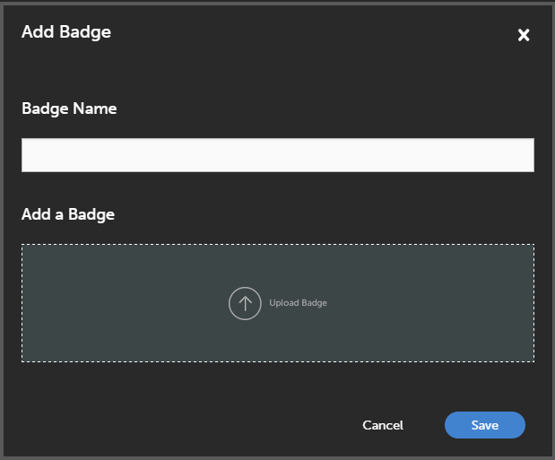

# 徽章

徽章是衡量員工完成課程後可取得之成就的指標。 Adobe Learning Manager匯入了名為徽章的最新電子學習概念之一。 全球的專業人員使用這些徽章作為特定技能或學習成績的表示。

您可以定義當作使用者動機的徽章。

管理員可為學習者建立徽章，如下所示：

1. 以管理員身分登入，然後按一下 **[!UICONTROL Badges]** 在左窗格中。 學習者的徽章清單隨即顯示。

   >[!NOTE]
   >
   >依預設，有幾個範例徽章清單可供使用。

1. 按一下 **[!UICONTROL Add Badge]** 位於頁面的右上角。 新增徽章對話方塊隨即顯示。

   

   *新增徽章名稱及其影像*

1. 輸入徽章名稱。 按一下以上傳徽章 **[!UICONTROL Upload Badge]** 並按一下 **[!UICONTROL Save]**.
