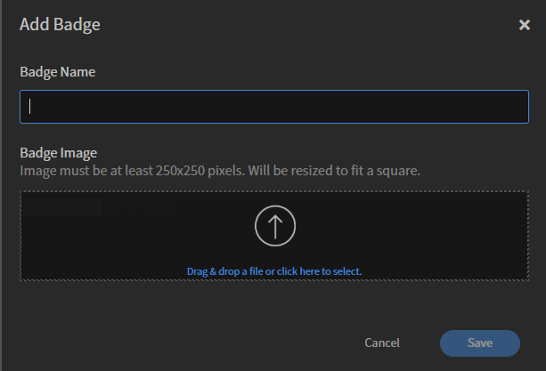

# 徽章

徽章是衡量員工完成課程後可取得之成就的指標。 Adobe Learning Manager匯入了名為徽章的最新電子學習概念之一。 全球的專業人員使用這些徽章作為特定技能或學習成績的表示。

您可以定義當作使用者動機的徽章。

管理員可為學習者建立徽章，如下所示：

1. 以管理員身分登入Adobe Learning Manager。
2. 在左窗格中選取&#x200B;**[!UICONTROL Badges]**。 學習者的徽章清單隨即顯示。

   >[!NOTE]
   >
   >依預設，有幾個範例徽章清單可供使用。

3. 選取頁面右上角的&#x200B;**[!UICONTROL Add]**。 **[!UICONTROL Add Badge]**&#x200B;對話方塊出現。

   

   *新增徽章名稱及其影像*

4. 輸入&#x200B;**[!UICONTROL Badge Name]**。 按一下&#x200B;**[!UICONTROL Upload Badge]**&#x200B;並按一下&#x200B;**[!UICONTROL Save]**&#x200B;以上傳徽章。

>[!NOTE]
>
>請透過[learningmanagersupport@adobe.com](mailto:learningmanagersupport@adobe.com)聯絡Adobe Learning Manager支援團隊，為完成課程或學習路徑的學習者新增自訂徽章或憑證。

