# 管理Learning Manager訂單和帳單

信用卡式購買僅適用於[美國地區](http://learningmanager.adobe.com/)。

管理Learning Manager帳單、使用信用卡下訂單、使用採購訂單或透過每月活躍使用者計畫訂閱。

Adobe Learning Manager具有彈性、方便客戶使用的定價模式，也是最符合貴組織需求的最佳定價模式之一。 如需詳細資訊，請參閱[Learning Manager](https://www.adobe.com/products/learningmanager.html)頁面。

只有貴組織的管理員可以管理帳單。

如果您想聯絡Adobe以取得有關Learning Manager訂閱和帳單的詳細資訊，請寄信至[learningmanagersales@adobe.com](mailto:learningmanagersales@adobe.com)。

## 使用信用卡下訂單 {#placeordersusingcreditcards}

透過任何信用卡付款單，最多可購買3500名學習者的訂閱。 帳戶中的第一筆訂單必須至少供10個學習者使用。

1. 在管理員應用程式上，按一下左側導覽窗格中的&#x200B;**[!UICONTROL Billing]**。

   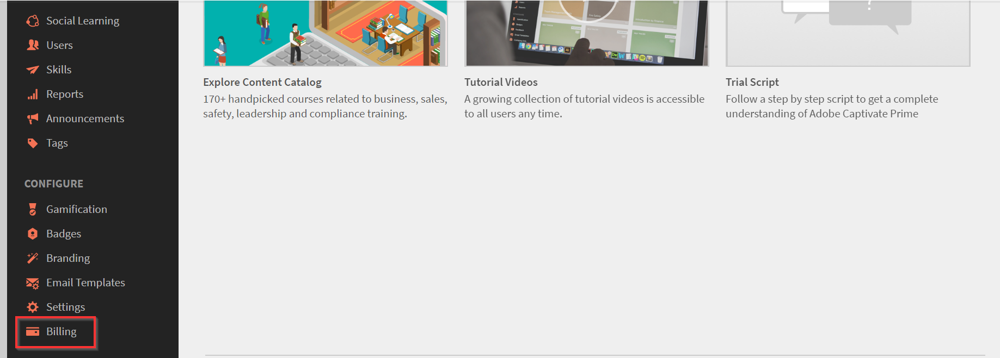

   *啟動Adobe Learning Manager帳單*

1. 在&#x200B;**[!UICONTROL Billing Information]**&#x200B;頁面上，在&#x200B;**[!UICONTROL Add Users]**&#x200B;欄位中新增使用者人數。 使用信用卡進行預付訂閱時，您可以檢視可以為訂閱新增的使用者人數。 您可以新增的使用者數目不得超過Remaining一節中提到的數目。1.

   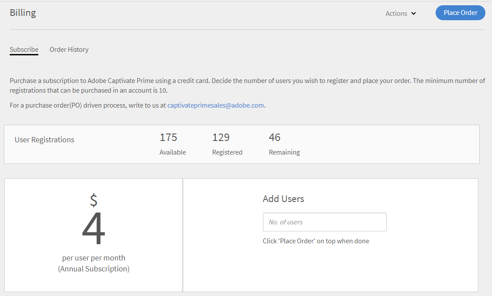

   *新增使用者數目*

1. 指定要新增的使用者數目後，按一下頁面右上角的「下訂單」 。

   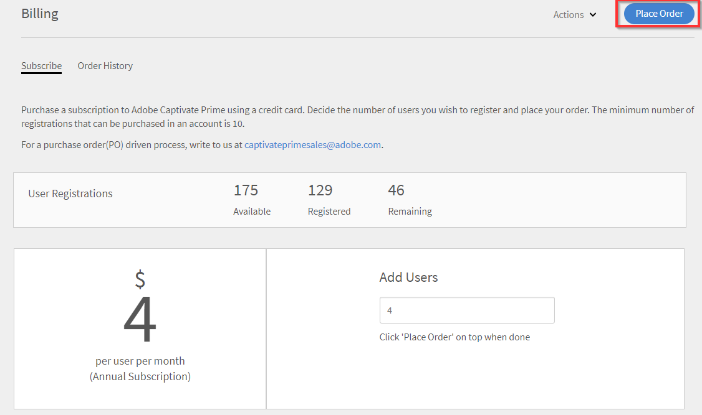

1. 檢閱熒幕上顯示的預估值。

   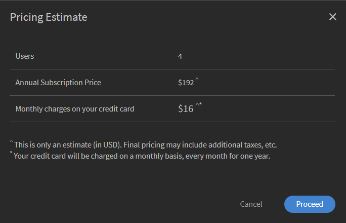

   *下訂單*

   年度訂閱費用是根據新增至訂閱的使用者人數來計算。 例如，如果新增4位使用者，則年費會使用4位使用者X$4X$12運算式計算，該運算式會傳回$192。

   按一下&#x200B;**[!UICONTROL Proceed]**。

   *檢閱預估值*

1. 在「付款明細」頁面上，您可以檢視訂單的預估價格。 貨幣會根據目前的地區設定而顯示。

   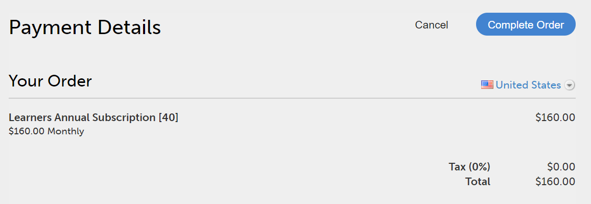

   *檢視付款詳細資料*

   您也可以從下拉式清單中選擇國家/地區來變更地區設定。

   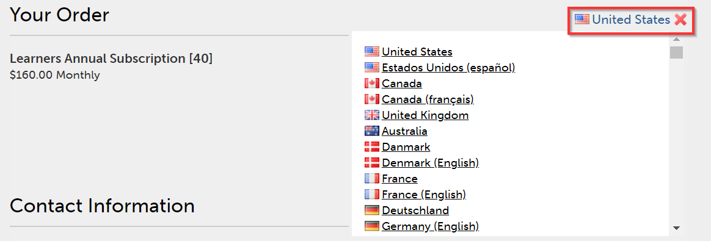

   *選取帳單國家/地區*

1. 輸入您的連絡資訊、選擇信用卡型態，並提供信用卡的明細。 輸入必要的詳細資料後，請按一下&#x200B;**[!UICONTROL Complete Order]**。
1. 下訂單後，若要檢視最近訂購的封裝，請按一下&#x200B;**[!UICONTROL Billing]**&#x200B;頁面上的&#x200B;**[!UICONTROL Order History]**&#x200B;標籤。

   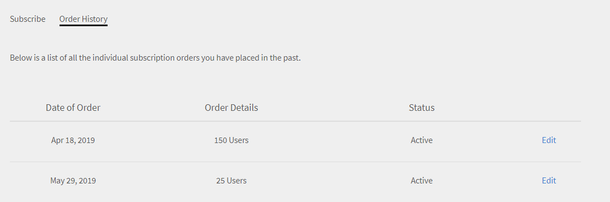

   *檢視訂單歷史記錄*

## 檢查訂單狀態 {#checkorderstatus}

所有訂單都可以有以下四種狀態之一：

**作用中：**&#x200B;訂單作用中，使用者已成功註冊。

**已暫停：**&#x200B;訂單在下列情況下會進入已暫停狀態：

* 延遲收到信用卡的付款
* 信用卡到期日。
* 任何週期性付款週期的付款均遭拒。

**已初始化：**&#x200B;當Learning Manager管理員停用帳戶時，訂單會進入此狀態。 在收到訂單的取消確認之後，訂單會進入取消狀態。

## 更新訂閱詳細資料 {#updatesubscriptiondetails}

1. 在訂單清單中，按一下&#x200B;**[!UICONTROL Edit]**。

   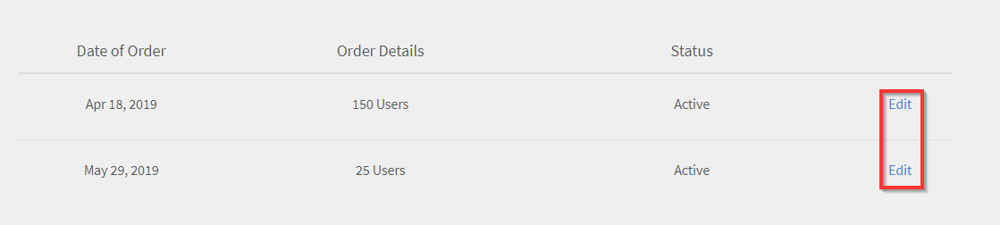

   *更新訂閱詳細資料*

1. 在訂閱詳細資訊頁面中，按一下&#x200B;**[!UICONTROL Edit Subscription]**。
1. 選擇您要編輯的專案：

   * 付款方式：使用此選項來更新付款明細，例如信用卡。
   * 地址：使用此選項來更新地址詳細資料。

## 取消訂閱 {#cancelasubscription}

若要取消訂單，請執行下列步驟：

1. 在「管理員」頁面的左窗格中，按一下「帳單」。
1. 在「帳單」頁面的右上角，選擇&#x200B;**[!UICONTROL Actions]** > **[!UICONTROL Deactivate Account]**。
1. 一旦管理員停用該帳戶，該帳戶中的所有現有訂單就會從下一個帳單週期取消。

客戶停用帳戶時，帳戶會在接下來的30天內進入試用狀態。 帳戶擁有者會收到三封提醒電子郵件，要求恢復帳戶。 如果擁有者未重新啟用帳戶，則除了擁有者外，其他使用者都無法存取Learning Manager。

## 使用採購單下訂單 {#placeordersusingpurchaseorder}

您可以選擇採購單處理作為替代付款模式。 您必須先向Adobe註冊貴組織的帳戶，作為先決條件。 您的組織帳戶需為此處理付費。 根據學習者的活動對帳戶收費。 僅會收費學習物件層級活動。 若要使用採購單下訂單，請執行下列步驟：

1. 傳送電子郵件至[learningmanagersales@adobe.com](mailto:learningmanagersales@adobe.com)並提及所需學習者人數。
1. Learning Manager團隊會傳送啟用金鑰給您。
1. 在管理員應用程式的「計費」頁面中，輸入啟用金鑰。
1. 按一下頁面右上角的「啟動」 。

## 檢查帳戶狀態 {#checkaccountstatus}

帳戶啟動後，帳戶可能會處於以下任一狀態：

* **試用版** — 您可以建立Adobe Learning Manager帳戶，並在30天內不需支付任何款項即可使用。 在試用期間註冊的學習者人數沒有限制。
* **作用中** — 在此狀態下，帳戶具有作用中的學習者訂閱，並根據訂閱訂單每月定期付款。
* **非使用中** — 帳戶在下列情況下會進入非使用中狀態：

   * 在試用期之後（如果帳戶中沒有有效的訂閱訂單）。
   * 管理員會停用帳戶，這會導致從訂閱的下一個帳單週期中取消帳戶中的所有現有訂單。
   * 即使在提醒之後，帳戶中有效訂單的付款仍遭拒。

非使用中狀態不會立即取消您的帳戶。 Learning Manager團隊會提醒您至少提供一些相關的最新資訊。

信用卡過期時。 在非作用中狀態，只有管理員可以登入Captivate

Learning Manager帳戶。 所有其他使用者無法存取該帳戶。

* **需要啟用** — 當Learning Manager管理員選擇停用帳戶時，您的帳戶會進入此狀態。 此帳戶的所有訂單都會被取消。 這些訂單的付款不會從下一個帳單週期開始收集。 帳戶狀態會維持在此狀態，直到最後一個帳單週期的那天為止。 在此狀態下，所有使用者都可繼續使用此應用程式，直到最後一個定期付款日期結束為止，沒有任何影響。

## 取消訂閱 {#Cancelasubscription-1}

若要取消作用中的訂閱，請聯絡Learning Manager支援團隊。

## 帳戶終止費 {#accountterminationfee}

如果您想在年度期限完成之前取消訂閱，則需支付提前終止費用。 終止費等於剩餘承諾期間訂閱價格的50%。

## 每月作用中使用者(MAU)計畫 {#monthlyactiveusersmauplan}

您可以選擇MAU計畫作為您偏好的計費方式。 此選項會根據每月不重複作用中使用者的數目來產生帳單。 每月不重複作用中使用者會從計畫啟用當月開始，累加12個月的期間。 此數字用於期間的帳單。

使用下列範例來瞭解MAU的計算方式。

假設每月使用者人數如下：

* 第1個月= 50
* 第2個月= 500
* 第3個月= 5000
* 第4個月至第12個月= 10

已計費的每月作用中使用者總數=第1個月+第2個月+第3個月+第4個月至第12個月= 50 + 500 + 5000 + 90 = 5640。

該期間的計費將適用於5640位使用者。

在12個月期間結束時，使用量計數會重設回零，而MAU計畫會開始新的期間。 您可以新增多個啟動金鑰以增加已購買的座位數。

任何執行下列動作或因他人所執行動作而完成作業的使用者，皆視為該日曆月份的每月不重複作用中使用者。

* 使用課程、學習計畫或認證。
* 使用、下載工作輔助或課程附件。
* 使用、下載或建立個人筆記。
* 透過建立面板、貼文或評論參與社交學習。
* 因外部憑證提交核准或教室/虛擬教室工作階段的出席而達成完成。

## 檢視使用情況詳細資料 {#viewusagedetails}

1. 若要依月份檢視作用中使用者的數目，請按一下&#x200B;**[!UICONTROL View Usage Details]**。

   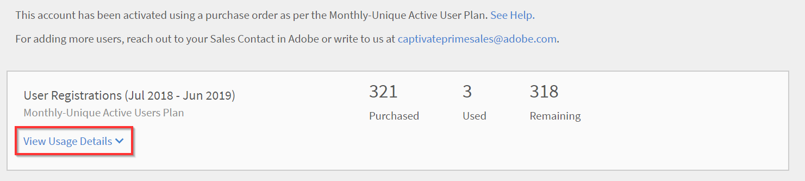

   *依月份檢視使用中的使用者*

1. 在顯示的頁面上，您可以檢視下列專案：

   * **整體使用狀況：**&#x200B;您可以檢查使用中的使用者總數、一個月內使用Learning Manager的使用者總數，以及尚未註冊任何課程的使用者人數。

   * **每月使用量：**&#x200B;您可以檢視每月不重複作用中使用者的表格。

## 下載使用情況報表 {#downloadusagereport}

您也可以按月份和年份下載作用中使用者人數的資料。 若要下載，請按一下&#x200B;**[!UICONTROL Download Detailed Report]**。

在&#x200B;**產生報表要求**&#x200B;對話方塊中，輸入所需的月份和年份，然後按一下&#x200B;**[!UICONTROL Generate]**。

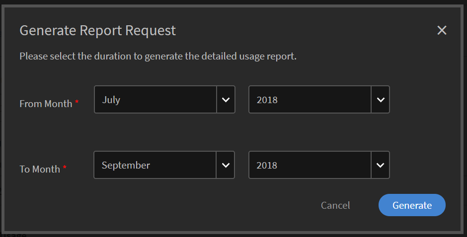

*下載使用中報告*

如果關閉瀏覽器視窗，則會在您下次造訪Learning Manager時開始下載。

這些報告會儲存在瀏覽器的「下載」資料夾中。

## 取消訂閱

若要取消作用中的訂閱，請聯絡Learning Manager支援團隊。

## 常見問題 {#frequentlyaskedquestions}

+++如何從帳戶新增/移除訂閱？

若要在帳戶中新增訂閱，請為您想要購買訂閱的使用者數量新增使用者數量。 然後在右上角，按一下&#x200B;**[!UICONTROL Place Order]**。 檢閱估計並按一下&#x200B;**[!UICONTROL Proceed]**。 輸入您的帳戶詳細資料，以及您的信用卡詳細資料。 然後，若要購買訂閱，請按一下&#x200B;**[!UICONTROL Complete Order]**。

若要移除作用中的訂閱，請聯絡Learning Manager支援團隊。
+++

+++如何變更訂閱的信用卡？

在&#x200B;**[!UICONTROL Order History]**&#x200B;索引標籤中，針對使用中的帳戶，按一下&#x200B;**[!UICONTROL Edit]**。 然後在[訂閱詳細資料]頁面上，按一下[**[!UICONTROL Edit Subscription]**]。 輸入您的新信用卡詳細資料，然後按一下&#x200B;**[!UICONTROL Update Payment Method]**。

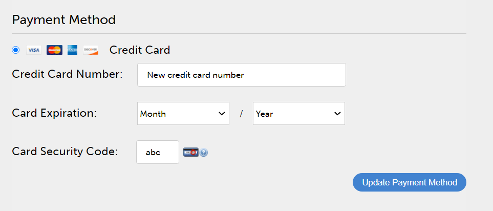

*檢視信用卡詳細資料*
+++

+++如何更新Learning Manager的計費資訊？

若要更新帳單資訊，請遵循下列步驟：

1. 以&#x200B;**管理員**&#x200B;身分登入，然後按一下&#x200B;**[!UICONTROL Billing]**。
1. 在訂單清單中，按一下&#x200B;**[!UICONTROL Edit]**。
1. 在訂閱詳細資訊頁面中，按一下&#x200B;**[!UICONTROL Edit Subscription]**。

選擇您要編輯的專案：

1. **[!UICONTROL Payment method]：**&#x200B;使用此選項來更新付款詳細資料，例如信用卡。
1. **[!UICONTROL Address]：**使用此選項來更新地址詳細資料。
+++

+++我可以部分取消訂閱嗎？

否，您無法部分取消訂閱。 如果您需要減少已購買的座位數，可以在計費週期結束時取消訂閱，然後購買所需的座位數。
+++

+++如何取得信用卡付款的商業發票？

請連絡[FastSpring](https://fastspring.com/)，使用下列其中一種方式取得付款發票：

* 使用連結`https://questionacharge.com`與FastSpring建立服務要求。
* 在`orders@fastspring.com`傳送電子郵件給FastSpring要求發票。
+++
