# 管理學習管理經理的訂單與帳單

信用卡購買僅在 [美國地區](http://learningmanager.adobe.com/)提供。

管理 Learning Manager 帳單、使用信用卡下訂單、透過採購訂單訂閱，或透過每月活躍用戶方案訂閱。

Adobe Learning Manager 擁有靈活、友善且價格優良的方案之一，能滿足您的組織需求。 欲了解更多資訊，請參閱 [學習管理員](https://www.adobe.com/products/learningmanager.html) 頁面。

只有您組織的管理員能管理帳單。

如果您想聯絡 Adobe 以了解更多關於 Learning Manager 訂閱與帳單的資訊，請寫信至 [learningmanagersales@adobe.com](mailto:learningmanagersales@adobe.com) 與我們聯繫。

## 帳單頁面

要進入帳單頁面，請以管理員身份登入 Adobe Learning Manager，並在左側導覽窗格選擇 **[!UICONTROL Billing]** 。

帳單頁面包含以下標籤：

| 分頁 | 目的 |
|---|---|
| **訂閱** | 查看帳號詳情、授權權限及座位使用情況。 管理計畫啟動。 |
| **修會歷史** | 請檢視過去在該帳戶下訂單。 |

### 訂閱標籤

**帳戶詳情**

**訂閱**&#x200B;分頁頂端&#x200B;**的帳戶詳情**&#x200B;卡顯示了你帳戶的四個唯讀識別碼。

| 場地 | 說明 |
|---|---|
| **ECCID** | Adobe 給你帳戶的參考編號。 聯絡 Adobe 客服時請引用這段話。 |
| **帳號ID** | 你獨特的 Adobe Learning Manager 帳號識別碼。 |
| **帳號名稱** | 你 Adobe Learning Manager 帳號的顯示名稱。 |
| **IMS 組織識別碼** | 與此帳號連結的 Adobe 管理主控台組織。 如果還沒連結，則是空白。 |

**執照**

**授權**&#x200B;區塊列出帳戶上所有有效的授權或權利。每個區塊會顯示執照名稱、適用的方案描述，以及一列顯示當前合約期間的用電數據。

統計列的欄位會依授權類型而異：

| 執照類型 | 列數顯示 |
|---|---|
| 付費授權（例如 Adobe Learning Manager Ultimate） | 已購買/使用/被同儕帳號使用/剩餘 |
| 試用執照（例如，虛擬教練） | 可用/二手/剩餘 |

在統計資料列下方選取 **[!UICONTROL View Usage Details]** ，展開內嵌分析。 擴展後的部分顯示：

- 一個 **選擇期間** 下拉選單，可依合約期間篩選，包括歷史期間
- **一個包含欄位的整體使用**&#x200B;量表：購買/此帳戶使用/對等帳戶使用 / 剩餘
- 一個 **查看帳號拆分** 連結，可查看不同同儕帳號間的使用情況分布
- 下載 **詳細報告** 連結，可匯出使用資料成檔案

**代理編排器授權區塊**

當連結到代理協調者執照時，統計欄位會顯示：

| 柱狀 | 說明 |
|---|---|
| **購買** | 合約期間內購買的 Gen AI 點數總額。 |
| **使用過** | 所有使用此授權服務的點數消耗。 |
| **ALM 所使用** | 這些學分是專門由 Adobe Learning Manager 消費的。 |
| **現存** | 製作人員名單仍然可用。 |

如果您的組織使用父子帳戶，父帳戶 **的授權** 欄位會顯示 **「同儕帳戶** 已使用」欄位，反映所有連結子帳戶的信用消耗情況。 兒童帳戶顯示其座位分配為 **「** 認可」而非「已購買」。

## 將您的 Adobe Learning Manager 帳號連結到 Adobe 管理控制台

在生成式 AI 功能啟動之前，你的 Adobe Learning Manager 帳號必須連結到 Adobe 管理控制台組織。 連結後，Adobe Learning Manager 會偵測到 Agent Orchestrator 授權並啟用 **「Credits** 」標籤。

連結會在你的帳號透過 Adobe 標準訂購流程購買時自動建立，或是你使用啟用金鑰啟用帳號時。 你可以在&#x200B;**訂閱**&#x200B;標籤中驗證連結——如果&#x200B;**帳戶細節**&#x200B;中的 **IMS 組織 ID** 欄位有填入，代表該帳戶已經連結完成。

### 手動連結你的帳號

如果你的帳號是獨立設立的，且 **IMS 組織 ID** 欄位是空白的，請手動連結。

**先修條件：**
- 您必須是 Adobe Learning Manager 帳號的管理員。
- 你必須在你想連結的 Adobe 管理控制台組織中持有系統管理員角色。
- Adobe 管理控制台組織必須擁有有效的代理協調器授權。

1. 選擇 **[!UICONTROL Billing]**，然後選擇分 **[!UICONTROL Subscription]** 頁。
2. 在帳戶 **詳情** 卡中，選擇 **[!UICONTROL Link IMS Org]**。
3. 登入視窗打開。 輸入您的 Adobe 帳號憑證，並從列表中選擇您的組織。 Adobe Learning Manager 確認登入帳號在 Adobe 管理主控台組織中擔任系統管理員，且同一帳號在 Adobe Learning Manager 中擔任管理員。
4. 若兩項檢定皆通過，連結即成立。 **IMS 組織識別**&#x200B;欄位會更新您的組織識別碼，信用餘額則顯示在&#x200B;**授權**&#x200B;區塊。
5. 若任一檢查失敗，則會顯示錯誤訊息。 確認上述先修條件後再試一次。

### 解除連結你的帳號

解除連結後，所有學習者都會停用生成式 AI 功能，且&#x200B;****&#x200B;在帳號重新連結前，信用分頁也無法使用。

1. 選擇 **[!UICONTROL Billing]**，然後選擇分 **[!UICONTROL Subscription]** 頁。
2. 在帳戶 **詳情** 卡中，選擇 **[!UICONTROL Unlink IMS Org]**。
3. 請再次登入以確認您在組織中的管理員角色。
4. 連結已被移除。 **IMS 組織 ID** 欄位會回到空白，且 **Credits** 標籤也被隱藏。

要恢復存取權，請重複上述手動連結步驟。

## 使用信用卡下訂單 {#placeordersusingcreditcards}

你最多可以透過單一信用卡付款訂單購買訂閱，最多可達3500名學習者。 帳戶中的第一個訂單必須至少為10名學習者。

1. 在管理員應用程式中，點擊 **[!UICONTROL Billing]** 左側導覽窗格。

   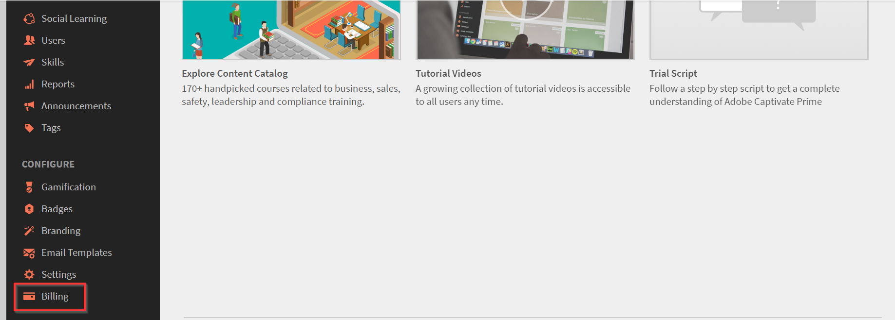

   *啟動 Adobe Learning Manager 計費*

1. 在 **[!UICONTROL Billing Information]** 頁面上，將欄位中的 **[!UICONTROL Add Users]** 使用者數相加。 使用信用卡訂閱預付訂閱時，您可以看到可新增的訂閱用戶數量。 您可新增的使用者數量不得超過「剩餘」部分所列的人數。1.

   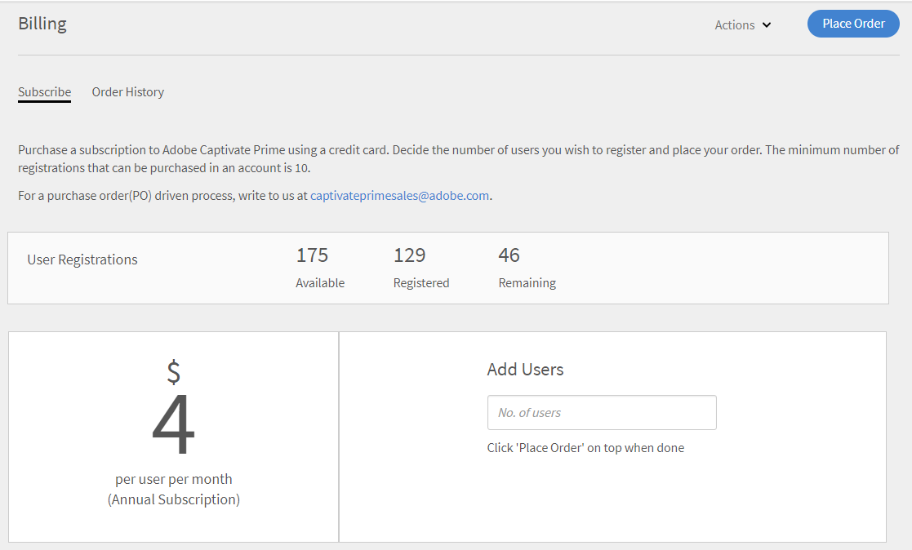

   *新增使用者數量*

1. 在指定新增用戶數量後，點擊頁面右上角的「下單」。

   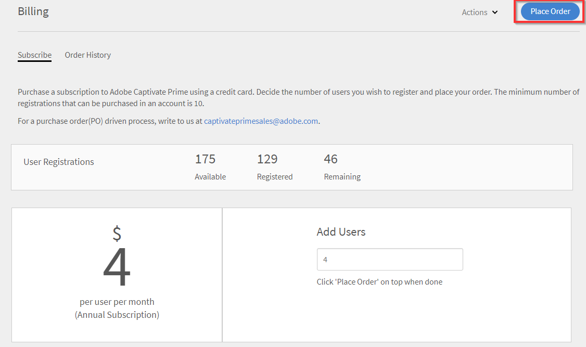

1. 請查看螢幕上顯示的報價。

   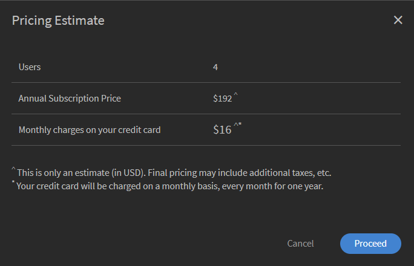

   *下訂單*

   年度訂閱費是根據新增訂閱用戶數量計算的。 例如，若新增四名使用者，年費會使用4 usersX$4X$12的表達式計算，回贈金額為192美元。

   點擊 **[!UICONTROL Proceed]**。

   *檢視估價*

1. 在付款詳情頁面，您可以查看訂單的預估價格。 貨幣依據當前地區出現。

   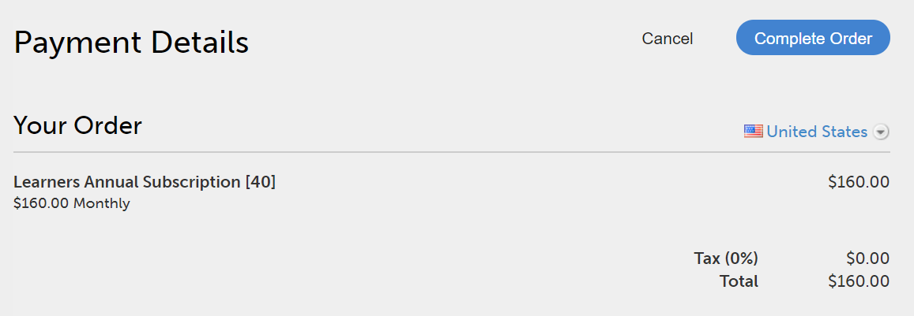

   *查看付款詳情*

   你也可以從下拉選單中選擇國家來更改地點。

   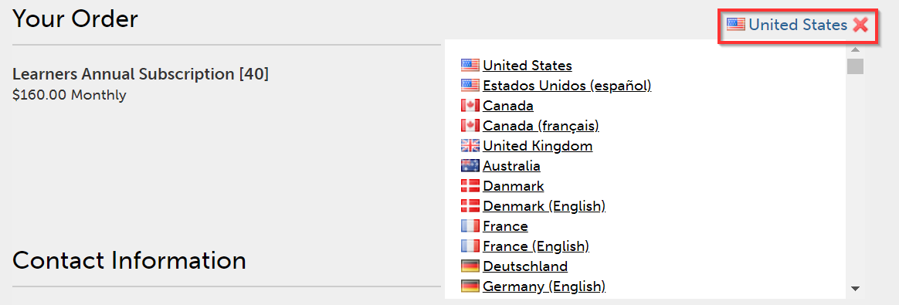

   *選擇帳單國家*

1. 輸入您的聯絡資訊，選擇信用卡類型，並提供信用卡的詳細資訊。 輸入所需資料後，請點擊 **[!UICONTROL Complete Order]**。
1. 下單後，要查看最近訂購的包裹，請點擊 **[!UICONTROL Order History]** 頁面上的 **[!UICONTROL Billing]** 分頁。

   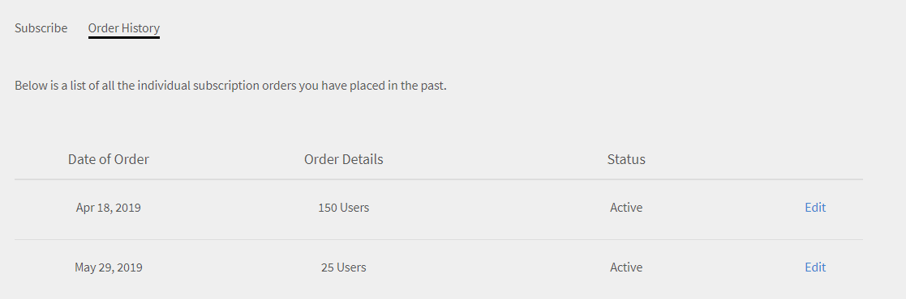

   *查看訂單歷史*

## 查詢訂單狀態 {#checkorderstatus}

所有勳章皆可具備以下四種狀態之一：

**啟用：** 訂單已生效，且用戶成功註冊。

**暫停狀態：** 訂單在以下情況下進入暫停狀態：

- 信用卡付款延遲
- 信用卡到期。
- 任何定期付款週期均拒絕付款。

**取消啟動：** 當學習管理員停用帳戶時，訂單會進入此狀態。 訂單在收到取消確認後，會進入取消狀態。

## 更新訂閱詳情 {#updatesubscriptiondetails}

1. 在訂單列表中，點擊 **[!UICONTROL Edit]**。

   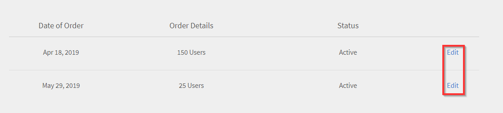

   *更新訂閱詳情*

1. 在訂閱詳情頁面，點擊 **[!UICONTROL Edit Subscription]**。
1. 選擇你想編輯的項目：

   - 付款方式：使用此選項更新付款資料，例如信用卡。
   - 地址：使用此選項更新地址細節。

## 取消訂閱 {#cancelasubscription}

取消訂單：

1. 在管理員頁面左側窗格，點擊「帳單」。
1. 在帳單頁面右上角，選擇 **[!UICONTROL Actions]** > **[!UICONTROL Deactivate Account]**。
1. 一旦管理員停用帳戶，帳戶內所有現有訂單將從下一個帳單週期起取消。

當帳戶被客戶停用時，該帳戶會進入接下來 30 天的試用狀態。 帳戶持有人會收到三封提醒郵件以恢復帳戶。 如果擁有者沒有重新啟用帳號，除了擁有者之外，沒有人能存取學習管理員。

## 使用採購訂單下訂單 {#placeordersusingpurchaseorder}

你可以選擇採購訂單流程作為付款方式。 作為先決條件，您的組織帳號必須在 Adobe 註冊。 此流程需向你的組織帳戶收費。 帳戶的收費是根據學習者的活動來計算。 只有學習物件層級的活動才收費。 使用 PO 下訂單：

1. 寄信給 [learningmanagersales@adobe.com](mailto:learningmanagersales@adobe.com) ，並說明所需學習人數。
1. 學習經理團隊會寄送你啟動金鑰。
1. 在管理員應用程式的帳單頁面，輸入啟用金鑰。
1. 點擊頁面右上角的啟用。

## 檢查帳戶狀態 {#checkaccountstatus}

帳戶啟用後，該帳戶可能位於以下任一州：

- **試用版** - 你可以建立 Adobe Learning Manager 帳號，並免費使用 30 天。 試用期間註冊學習人數無限制。
- **啟用** - 此狀態下，該帳號有有效的學習者訂閱，並依訂閱順序按月支付。
- **非活躍** - 帳戶在以下情況下進入非活躍狀態：

  - 試用期結束後，如果帳戶中沒有有效的訂閱訂單。
  - 管理員會停用該帳戶，導致下一輪訂閱帳單週期中所有現有訂單被取消。
  - 即使有提醒，帳戶內的活躍訂單付款仍會被拒絕。

非活躍州不會立即取消你的帳戶。 你會收到學習經理團隊至少幾次提醒，要求你提供信用卡的最新資訊（如果已過期）。 在非活躍狀態下，只有管理員能登入 Adobe Learning Manager 帳號。 其他用戶無法存取該帳號。

- **需要** 啟用 - 當學習管理員選擇停用帳號時，你的帳號會進入此狀態。 這個帳號的所有訂單都會被取消。 這些訂單的付款收取不會從下一個帳單週期開始。 帳戶狀態會維持到最後一個帳單週期當天。 在此狀態下，所有使用者可持續使用應用程式，且不受影響，直到最後一次定期付款日期結束。

## 取消訂閱 {#Cancelasubscription-1}

若要取消有效訂閱，請聯絡Learning Manager客服團隊。

## 帳戶終止費 {#accountterminationfee}

若您想在年度期限結束前取消訂閱，將收取提前終止費用。 終止費相當於剩餘承諾期間訂閱價格的50%。

## 每月活躍用戶（MAU）計畫 {#monthlyactiveusersmauplan}

您可以選擇 MAU 計劃作為您偏好的帳單方式。 此選項會根據每月獨立活躍用戶數產生計費。 每月獨立活躍用戶數會從方案啟用月份起累積 12 個月。 此號碼用於該期間的帳單。

請參考以下範例來了解MAU是如何計算的。

假設每月用戶數如下：

- 第1個月 = 50
- 第二個月=500
- 第三個月 = 5000
- 第4至12個月 = 10

每月活躍用戶總計 = 第 1 月 + 第 2 月 + 第 3 月 + 第 4 至 12 月 = 50 + 5000 + 90 = 5640。

該期間的帳單將為 5640 名用戶。

12個月期間結束時，使用量會重置回零，並開始新的MAU計畫期間。 你可以新增多個啟動金鑰來增加購買的座位數量。

任何執行以下動作或因他人行動而完成的用戶，皆視為該日曆月份的月度獨立活躍用戶。

- 參加課程、學習計畫或認證。
- 閱讀、下載工作援助或課程附件。
- 閱讀、下載或建立個人筆記。
- 透過建立討論區、貼文或留言參與社會學習。
- 完成課程需透過外部證書提交批准或出席課堂/虛擬課堂課程。

## 查看使用詳情 {#viewusagedetails}

1. 要查看每月活躍用戶數，請點擊 **[!UICONTROL View Usage Details]**。

   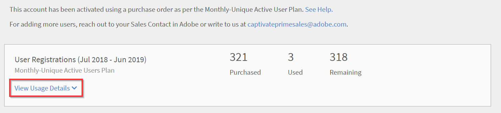

   *按月份查看活躍用戶*

1. 在顯示的頁面上，您可以查看以下內容：

   - **整體使用情況：** 你可以查看活躍用戶總數、每月使用 Learning Manager 的用戶數，以及尚未註冊任何課程的用戶數。
   - **每月使用量：** 你可以查看每月獨立活躍用戶的表格。

## 下載使用報告 {#downloadusagereport}

你也可以下載按月和按年計算的活躍用戶數資料。 下載請點擊 **[!UICONTROL Download Detailed Report]**。

在產生報告請求&#x200B;**的對話框中**，輸入所需的月份和年份，然後點選&#x200B;**[!UICONTROL Generate]**。

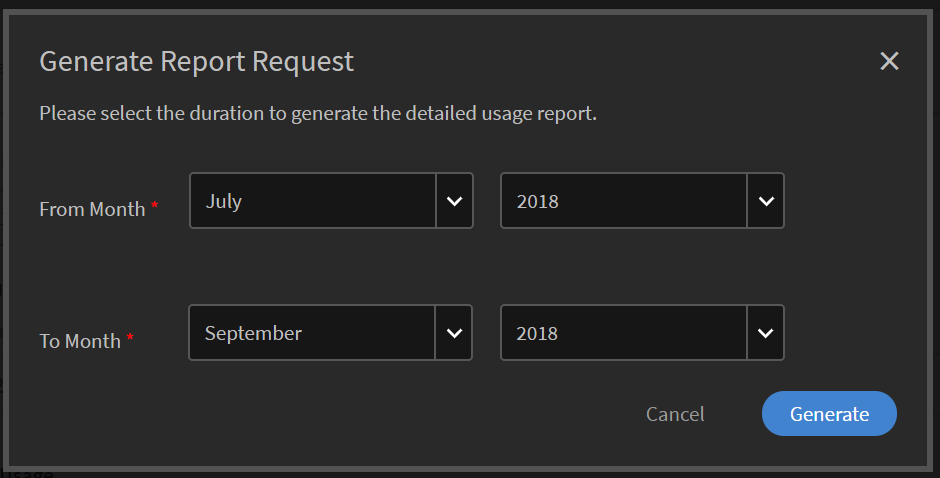

*下載活躍使用報告*

如果你關閉瀏覽器視窗，下載會從你下一次造訪學習管理員時開始。

報告會儲存在瀏覽器的下載資料夾中。

## 取消訂閱

若要取消有效訂閱，請聯絡Learning Manager客服團隊。

## 生成式人工智慧的製作團隊 {#genaicredits}

### 生成式人工智慧的運作方式

每當學習者與 AI 驅動的功能互動時，生成式 AI 點數都會被消耗——例如透過 AI 助理提問或產生個人化學習建議時。 每次互動開始前，Adobe Learning Manager 會檢查學分是否可用。 若有信用點數，互動會繼續進行。 若餘額已用盡，學習者會看到該功能暫時無法使用的訊息。

點數是作為 Adobe Experience Platform 代理協調器授權的一部分購買。 該授權由您的 Adobe 管理控制台管理，Adobe Learning Manager 會自動連接以偵測可用學分。

**學分優先規則：** 如果你的 Adobe Learning Manager 計畫包含捆綁的 Gen AI 信用點數，且你同時持有 Agent Orchestrator 授權，則綁定的信用點數會優先被消費。 特工策劃者點數僅在捆綁點數用盡後使用。

**共享信用池：** 如果您的組織有多個 Adobe Learning Manager 帳戶，且都連結到同一個 Adobe 管理控制台組織，所有帳戶都會從同一個共享信用池中提取。

>[!IMPORTANT]
>
>所有生成式AI功能預設都是關閉的。 您必須啟用每個功能並設定信用額度上限，學習者才能使用。

### 進入 Gen AI 信用分頁

1. 選擇 **[!UICONTROL Admin]** > **[!UICONTROL Billing]**。
2. 選擇該 **[!UICONTROL Credits]** 標籤。

**信用**&#x200B;分頁僅在購買或帳戶歷史上活躍的 Gen AI 信用點數時才會顯示。如果該分頁看不到，請確認你的帳號是否連結到擁有有效代理編排器授權的 Adobe 管理控制台組織。

### 生成式 AI 功能表

**Gen AI 功能**&#x200B;表列出了該帳戶上所有可用的 AI 功能。

| 柱狀 | 說明 |
|---|---|
| **特色名稱** | AI 功能名稱。 選擇名稱即可進入該功能的設定頁面。 |
| **現況** | 不管功能是開啟還是關閉。 從設定頁面切換該功能即可。 |
| **最大信用點數使用上限** | 此功能在合約期間可消耗的最大信用點數。 必須先設定好才能啟用此功能。 僅適用於面向學習者的特性。 |
| **使用製作人員** | 自合約開始以來，此功能消耗的總信用點數會即時更新。 |

### 啟用生成式 AI 功能

1. 在分 **[!UICONTROL Credits]** 頁中，請在 **生成式 AI 功能** 表中找到該功能。
2. 在 **「最大信用額度使用限制」欄位中，輸入** 此功能在合約期間可消耗的最大信用點數。
3. 選擇功能名稱即可前往功能 **設定** 頁面。
4. 在 **功能設定** 頁面，開啟該功能。
5. 完成任何額外設定，例如將學習者與目錄指派給 AI 助理。

### 當信用點數用盡時會發生什麼事

- 若功能達到 **最大信用點數使用限制**，學習者會看到該功能暫時無法使用。 隨時可從 **信用** 分頁調高金額。
- 若整體帳號點數用盡，所有生成式 AI 功能將停止對學習者運作，直到購買額外點數。 使用報告與信用指標仍對管理員開放。
- 如果學習者在互動中且學分已用盡，該互動即告完成。 之後所有互動都會被封鎖。
- 管理員可以設定比購買信用點數更高的信用額度。 允許超額分配，續約時可進行調整。

### 每月信用點數使用圖表

在生成式 AI 功能表下方，有 **每月信用點數使用** 圖表，顯示每個功能每月消耗的信用點數。 預設情況下，圖表顯示的是根據代理協調員合約開始日期的當前合約年度期間。 選擇 **[!UICONTROL Download]** 匯出所選期間的月報。 報告產生是非同步的——當檔案準備好時，你會收到應用程式內通知和電子郵件。

### 生成式 AI 使用報告

Adobe Learning Manager 提供兩份 Gen AI 使用報告，>**[!UICONTROL Reports]****[!UICONTROL AI Reports]**。

**每月信用點數使用報告**

顯示每個功能每月消耗的點數。 對預算規劃和合約續約非常有用。

- **專欄：** 月份 |專題 |使用的來源
- **篩選：** 選擇涵蓋一個或多個合約期間的日期範圍
- **下載：** 非同步 — 檔案準備好時你會收到應用程式內通知和電子郵件

**學習者生成 AI 信用使用報告**

一個審計追蹤，顯示哪些學習者使用了哪些功能，以及每次互動消耗了多少信用點數。

- **欄位：** 日期 |學習者姓名 |學習者電子郵件 |專題 |使用名單
- **篩選條件：** 選擇你想審核的日期範圍
- **下載：** 非同步 — 檔案準備好時你會收到應用程式內通知和電子郵件

### 信用使用警示

Adobe Learning Manager 會自動通知你學分消費超過關鍵門檻。 通知同時透過應用程式內及電子郵件傳送。

| 觸發 | 通知 |
|---|---|
| 帳戶抵扣額度可達總購買額度的90% | 警告——帳戶層級的信用額度幾乎用盡 |
| 帳戶抵扣金額達到購買總額的100% | 警示 — 所有學分都已消耗，生成式 AI 功能對學習者來說將停止使用 |
| 某個功能達到其個人的最大信用點數使用上限 | Alert — 命名特定功能;該功能對學習者而言停止 |

當你收到 90% 警告時，請聯絡你的 Adobe 帳戶團隊，在達到 100% 門檻前購買額外點數。

## 常見問題 {#frequentlyaskedquestions}

**如何從帳號新增或移除訂閱？**

要在帳號中新增訂閱，請將你想購買訂閱的用戶數加進去。 然後在右上角點擊 **[!UICONTROL Place Order]**。 查看報價並點擊 **[!UICONTROL Proceed]**。 輸入你的帳戶資料以及信用卡資料。 然後點擊 **[!UICONTROL Complete Order]**.

若要移除有效訂閱，請聯絡學習經理客服團隊。

**如何更改信用卡以訂閱？**

在 **[!UICONTROL Order History]** 分頁中，對於有效帳號，請點選 **[!UICONTROL Edit]**。 然後在訂閱詳情頁面點擊 **[!UICONTROL Edit Subscription]**。 輸入您的新信用卡資訊並點擊 **[!UICONTROL Update Payment Method]**。

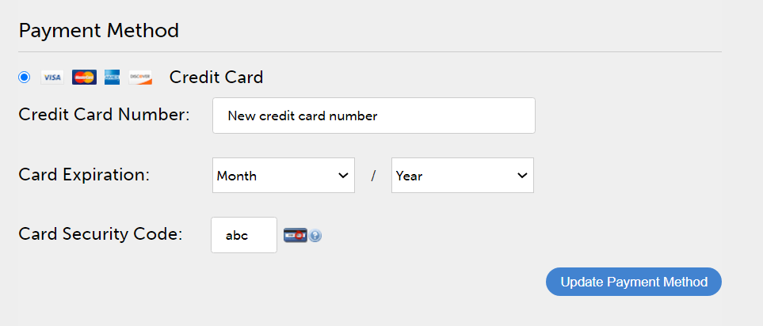

*查看信用卡資料*

**如何更新學習管理員的帳單資訊？**

要更新帳單資訊，請依照以下步驟操作：

1. 以管理員身份登入&#x200B;**並點擊&#x200B;**[!UICONTROL Billing]**。**
1. 在訂單列表中，點擊 **[!UICONTROL Edit]**。
1. 在訂閱詳情頁面，點擊 **[!UICONTROL Edit Subscription]**。

選擇你想編輯的項目：

1. **[!UICONTROL Payment method]：** 使用此選項更新付款資料，例如信用卡。
1. **[!UICONTROL Address]：** 使用此選項更新地址詳情。

**我可以部分取消訂閱嗎？**

不，你不能部分取消訂閱。 如果你需要減少已購買的座位數，可以在計費週期結束時取消訂閱，然後再購買所需的座位數。

**我該如何取得信用卡付款的發票？**

請聯絡 [FastSpring](https://fastspring.com/) ，透過以下方式之一取得您的付款發票：

- 使用 FastSpring 建立服務請求，請使用連結 `https://questionacharge.com`。
- 請寄電子郵件給 FastSpring 申請 `orders@fastspring.com` 發票。

## 排解生成式人工智慧信用問題

| 子嗣 | 解法 |
|---|---|
| **製作名單標籤不見** | 此帳戶尚未購買或套用 Gen AI 點數。 請在 Adobe 管理控制台驗證你的代理協調者授權，然後確認組織是否在>**帳戶詳情**>**[!UICONTROL Billing]** **[!UICONTROL Subscription]** 連結。 |
| **IMS 組織 ID 欄位為空白** | 你的帳號還沒綁定。 選擇&#x200B;**[!UICONTROL Link IMS Org]****帳戶詳情**&#x200B;卡，並依照上述連結步驟操作。 |
| **連結失敗時會發生錯誤** | 請確認你在 Adobe Learning Manager 和你想連結的 Adobe 管理控制台組織中都有管理員角色。 這兩個檢查都必須通過，連結才會建立。 |
| **啟用金鑰後，IMS 組織 ID 欄位為空白** | 自動連結只會發生在透過 Adobe 標準訂購流程啟用的帳號。 對於獨立設定的帳號，啟動金鑰後完成上述手動連結步驟即可。 |
| **解除連結後，生成式 AI 功能將無法使用** | 取消連結會移除所有生成式 AI 功能的存取，並隱藏製作名單標籤。 請重新連結您的帳號到擁有有效代理編排器授權的 Adobe 管理控制台組織，以恢復存取權限。 |

<!-- 
# Manage Learning Manager orders and billing

Credit card-based purchase is only available in the [US region](http://learningmanager.adobe.com/).

Manage Learning Manager billing, place orders by using a credit card, subscribe using a Purchase Order, or via a Monthly Active Users plan.

Adobe Learning Manager has a flexible, customer-friendly, and one of the best pricing models to cater to your organization needs. For more information, see the [Learning Manager](https://www.adobe.com/products/learningmanager.html) page.

Only the Administrators of your organization can manage billing.

If you want to contact Adobe for more information about Learning Manager subscription and billing, write to us at [learningmanagersales@adobe.com](mailto:learningmanagersales@adobe.com).

## Place orders using credit cards {#placeordersusingcreditcards}

You can buy a subscription for a maximum of 3500 learners through any single credit card payment order. The first order in the account must be for a minimum of 10 learners.

1. On the Administrator app, click **[!UICONTROL Billing]** on the left navigation pane.

   

   *Launch Adobe Learning Manager billing*

1. On the **[!UICONTROL Billing Information]** page, add the number of users in the **[!UICONTROL Add Users]** field. When using a credit card for pre-paid subscriptions, you can see the number of users that you can add for the subscription. The number of users you can add must not exceed the number mentioned in the section Remaining.1. 

   

   *Add number of users*

1. After specifying the number of users to add, click Place Order in the upper-right corner of the page.

   

1. Review the estimate that appears on the screen.

   

   *Place an order*

   The annual subscription fee is calculated based on the number of users who are added for the subscription. For example, if four users are being added, the annual fee is calculated using the expression 4 usersX$4X$12, which returns $192.

   Click **[!UICONTROL Proceed]**.

   *Review the estimate*

1. On the Payment Details page, you can view the estimated price of the order. The currency appears based on the current locale.

   

   *View payment details*

   You can also change the locale by choosing the country from the drop-down list.

   

   *Select the country of billing*

1. Enter your contact information, choose the credit card type, and provide the details of the credit card. After you've entered the required details, click **[!UICONTROL Complete Order]**.
1. After you've placed the order, to see the recently ordered packages, click the **[!UICONTROL Order History]** tab on the **[!UICONTROL Billing]** page.

   

   *View order history*

## Check order status {#checkorderstatus}

All orders can have one of the four statuses:

**Active:** An order is active, and users are registered successfully.

**Suspended:** An order moves into suspended state in the following scenarios:

* Delay in receipt of payment from the credit card
* Expiry of the credit card.
* Payment is declined for any recurring payment cycle.

**Canceled initiated:** An order moves into this state when the Learning Manager Administrator deactivates the account. The order then moves into a canceled state after receiving the cancellation confirmation of the order.

## Update subscription details {#updatesubscriptiondetails}

1. In the list of orders, click **[!UICONTROL Edit]**.

   

   *Update subscription details*

1. In the Subscription details page, click **[!UICONTROL Edit Subscription]**.
1. Choose the item that you want to edit:

   * Payment method: Use this option to update payment details, such as, credit card.
   * Address: Use this option to update address details.

## Cancel a subscription {#cancelasubscription}

To cancel an order:

1. In the left pane of the Administrator page, click Billing.
1. In the Billing page, on the upper-right corner, choose **[!UICONTROL Actions]** > **[!UICONTROL Deactivate Account]**.
1. Once the Administrator deactivates the account, all existing orders in the account are canceled from the next billing cycle.

When an account is deactivated by the customer, it enters a trial state for the next 30 days. The account owner receives three reminder emails to revive the account. If the owner does not reactivate the account, none of the users are able to access Learning Manager apart from the owner.

## Place orders using Purchase Order {#placeordersusingpurchaseorder}

You can choose purchase order process as an alternative mode of payment. As a pre-requisite, your organization's account must be registered with Adobe. Your organization account is charged for this process. The account is charged based on a learner's activities. Only Learning Object-level activities are charged. To place an order using PO:

1. Send an email to [learningmanagersales@adobe.com](mailto:learningmanagersales@adobe.com) and mention the number of required learners.
1. The Learning Manager team sends you an activation key.
1. In the Billing page of the Administrator app, enter the activation key.
1. Click Activate in the upper-right corner of the page.

## Check account status {#checkaccountstatus}

After an account gets activated, the account can be in any of the following states:

* **Trial** - You can create an Adobe Learning Manager account and use it without any payment for a period of 30 days. There is no limit on the number of learners registered during the trial period.
* **Active** - In this state, the account has active learner subscriptions with recurring monthly payment as per the subscription order.
* **Inactive** - An account moves into inactive state in the following scenarios:

  * After the trial period if there are no active subscription orders in the account.
  * Administrator deactivates the account, which results in canceling all the existing orders in an account from the next billing cycle of subscription.
  * Payment is declined for active orders in an account even after reminders.

An inactive state does not cancel your account with immediate effect. You receive at least a couple of reminders from the Learning Manager team asking you to provide the latest information about

your credit card if it has expired. In an inactive state, only an administrator can log in to the Captivate

Learning Manager account. All other users cannot access the account.

* **Activation required** - Your account moves into this state when the Learning Manager administrator chooses to deactivate the account. All the orders of this account get canceled. The collection of payment for these orders does not happen from the next billing cycle. The status of the account remains in this state until the day of the last billing cycle. In this state, all users can continue to use the application without any impact until the end of the last recurring payment date.

## Cancel a subscription {#Cancelasubscription-1}

To cancel an active subscription, contact the Learning Manager support team.

## Account termination fee {#accountterminationfee}

If you want to cancel the subscription before the completion of the annual term, an early termination fee is charged. The termination fee is equivalent to 50% of the subscription price of the remaining commitment period.

## Monthly Active Users (MAU) plan {#monthlyactiveusersmauplan}

You can choose a MAU plan as your preferred way of billing. This option generates billing based on the number of monthly unique active users. The monthly unique active users are added cumulatively for a period of 12 months starting from the month of plan activation. This number is used for billing for the period.

Use the following example to understand how MAU is calculated.

Let there be a case where the number of users per month are as follows:

* Month 1 = 50
* Month 2 = 500
* Month 3 = 5000
* Month 4 to 12 = 10

Total Monthly Active Users that are billed = Month 1 + Month 2 + Month 3 + Month 4 to 12 = 50 + 500 + 5000 + 90 = 5640.

The billing for the period would be for 5640 users.

At the end of the 12-month period, the usage count is reset back to zero and a new period for MAU plan starts. You can add multiple activation keys to increase the purchased number of seats.

Any user who performs the following actions or achieves completions due to actions taken by others is considered as a monthly unique active user for that calendar month.

* Consuming a course, learning program or certification.
* Consuming, downloading a Job Aid or course attachments.
* Consuming, downloading or creating personal notes.
* Participating in Social Learning by creating Boards, posts or comments.
* Achieving completions due to External Certificate submission approvals or attendance for a classroom/virtual classroom sessions.

## View usage details {#viewusagedetails}

1. To view the number of active users by month, click **[!UICONTROL View Usage Details]**.

   

   *View active users by month*

1. On the page that displays, you can view the following:

   * **Overall usage:** You can check the total number of active users, users who are consuming Learning Manager in a month, and the number of users who have not yet signed up for any course.

   * **Monthly usage:** You can see a table of unique active users per month.

## Download usage report {#downloadusagereport}

You can also download the data of the number of active users by month and year. To download, click **[!UICONTROL Download Detailed Report]**.

On the **Generate Report Request** dialog, enter the required months and year, and click **[!UICONTROL Generate]**.

*Download active usage report*

If you close the browser window, the download starts the next time you visit Learning Manager.

The reports are saved in the Downloads folder of your browser.

## Cancel a subscription

To cancel an active subscription, contact the Learning Manager support team.

## Frequently Asked Questions {#frequentlyaskedquestions}

+++How to add/remove subscriptions from an account?

To add subscriptions in an account, add the number of users for who you'd like to purchase subscriptions. Then on the upper-right corner, click **[!UICONTROL Place Order]**. Review the estimate and click **[!UICONTROL Proceed]**. Enter your account details and also your credit card details. Then to purchase the subscriptions, click **[!UICONTROL Complete Order]**.

To remove an active subscription, contact the Learning Manager support team.
+++

+++How to change a credit card for subscriptions?

In the **[!UICONTROL Order History]** tab, for an active account, click **[!UICONTROL Edit]**. Then on the Subscription Details page, click **[!UICONTROL Edit Subscription]**. Enter your new credit card details and click **[!UICONTROL Update Payment Method]**.

*View credit card details*
+++

+++How to update the Billing information on Learning Manager?

To update the billing information, follow the steps below:

1. Log in as **Admin** and click **[!UICONTROL Billing]**.
1. In the list of orders, click **[!UICONTROL Edit]**.
1. In the Subscription details page, click **[!UICONTROL Edit Subscription]**.

Choose the item that you want to edit:

1. **[!UICONTROL Payment method]:** Use this option to update payment details, such as, credit card.
1. **[!UICONTROL Address]:** Use this option to update address details.
+++

+++Can I partially cancel a subscription?

No, you cannot cancel a subscription partially. If you need to reduce the number of seats that you have purchased, you can cancel the subscription at the end of the billing cycle and then purchase the number of seats required.
+++

+++How do I get an Invoice for my Credit card payments?

Contact [FastSpring](https://fastspring.com/) to get an invoice for your payments, using one of the following ways:

* Create a service request with FastSpring using the link `https://questionacharge.com`.
* Send an email to FastSpring on `orders@fastspring.com` requesting for the invoice.
-->
