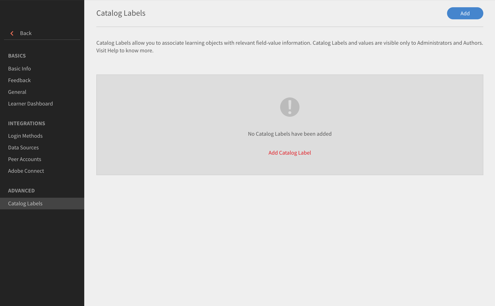
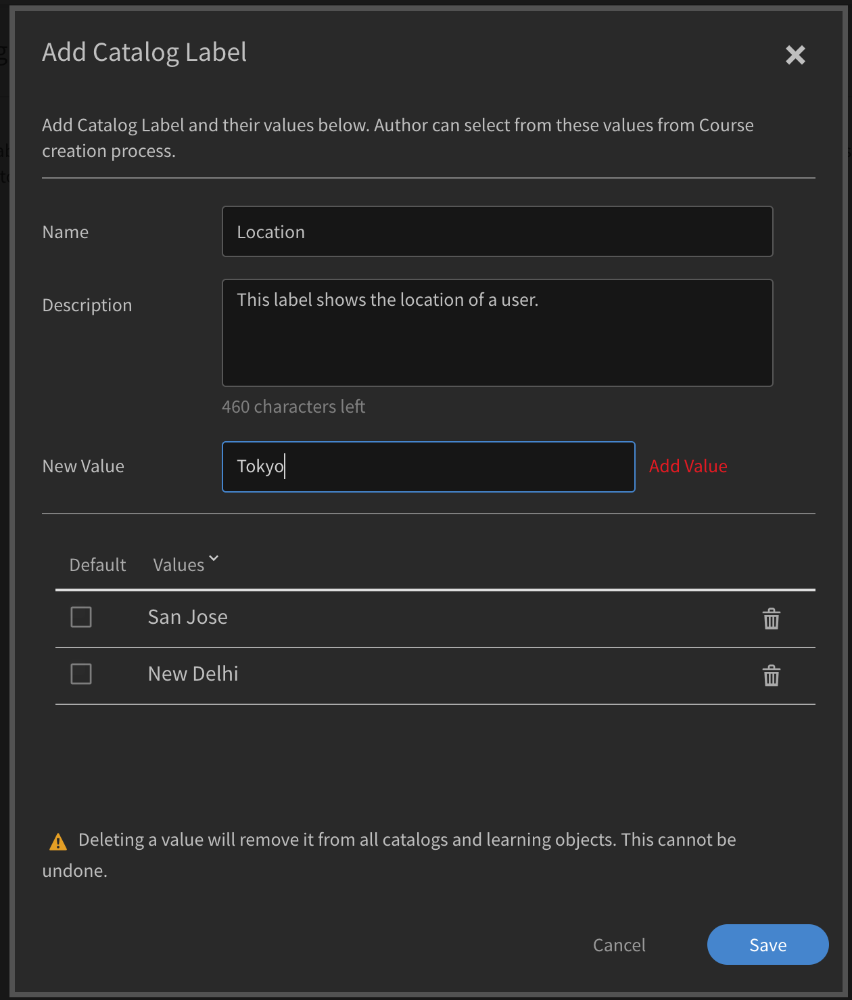
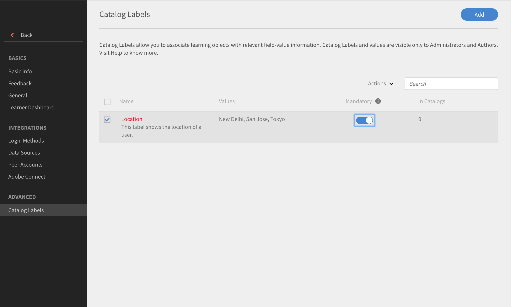

# 目錄標籤

目錄標籤可讓您使用特定欄位來標籤學習物件，並套用一或多個值。 啟用後，管理員和作者可以設定目錄標籤和值，並將其連結至學習物件。

使用此功能可輕鬆分類資料。 例如，如果您要根據學習物件的位置、部門或技能來分類學習物件。 您可以套用這些欄位並篩選資料。

若要啟用目錄標籤，請執行下列步驟：

* 以系統管理員身分，開啟&#x200B;**[!UICONTROL Settings]** > **[!UICONTROL General]** > **[!UICONTROL Show catalog label]**。
* 使用核取方塊來啟用標籤。

## 新增目錄標籤 {#addcataloglabels}

若要新增目錄標籤，請遵循此步驟：

1. 在&#x200B;**[!UICONTROL Advanced]**&#x200B;選項下開啟&#x200B;**[!UICONTROL Settings]** > **[!UICONTROL Catalog Labels]**。 [!UICONTROL Catalog Labels]頁面隨即開啟。

   

1. 按一下右上角的&#x200B;**[!UICONTROL Add Catalog Label]**&#x200B;或&#x200B;**[!UICONTROL Add]**。 **[!UICONTROL Add Catalog Label]**&#x200B;對話方塊就會顯示。
1. 在欄位中新增目錄標籤及其值。 一個自訂欄位可以有多個值。 作者可在課程建立過程中選取這些值。

   

1. 按一下&#x200B;**[!UICONTROL Save]**。
1. 儲存標籤時，標籤會顯示在「目錄標籤」頁面上。 您可以選擇是否要讓它成為強制值。

   

## 將標籤套用至目錄 {#applylabelstocatalogs}

建立目錄標籤後，您可以依照下列步驟將它們套用至特定目錄：

1. 從左窗格開啟&#x200B;**[!UICONTROL Catalogs]**。 「目錄」頁面隨即開啟，顯示「目錄」清單。
1. 選取「目錄」並套用至標籤。
1. 從左窗格開啟目錄標籤。
1. 按一下右上角的&#x200B;**[!UICONTROL Edit]**。 此頁面會顯示可用目錄標籤的清單。
1. 若要新增標籤至目錄，請按一下&#x200B;**[!UICONTROL Add to Catalog]**。
1. 若要移除新增到目錄中的現有標籤，請按一下&#x200B;**[!UICONTROL Remove]**。

將自訂欄位新增至目錄後，該欄位會套用至屬於目錄一部分的所有「學習物件」。
