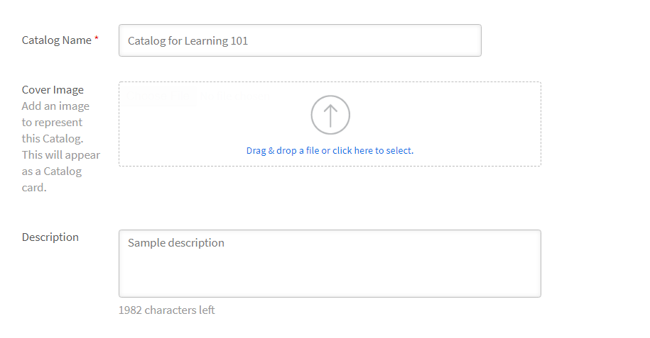
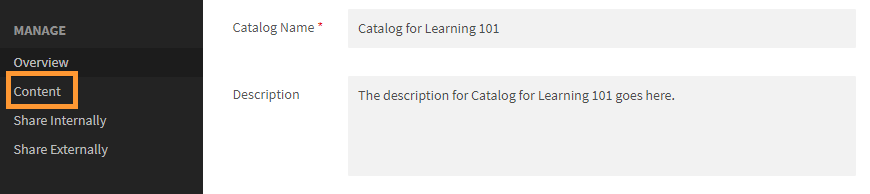
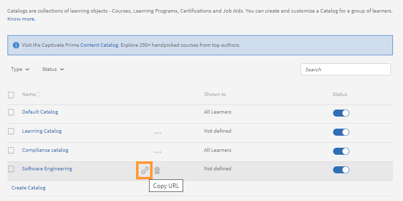
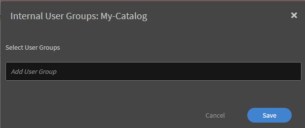
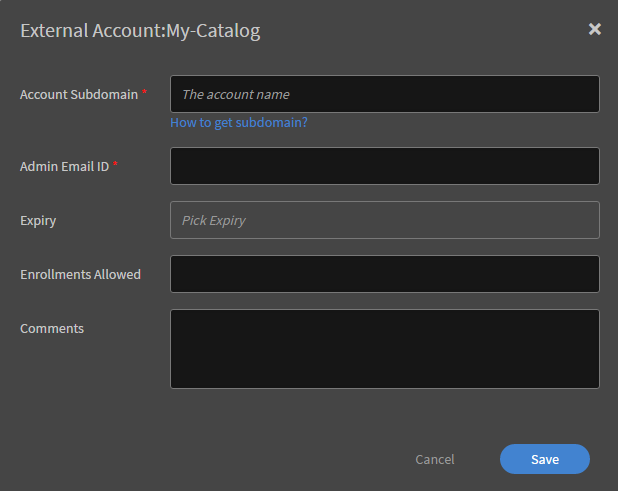

# 目錄

目錄是學習的集合 - 課程、學習計劃和認證。 使用目錄為學習者提供對自定義學習集的訪問許可權。 您可以在建立新目錄期間將學習與目錄相關聯。

作為管理員，如果您想為帳戶或跨帳戶的不同學習者提供選擇性課程，您可以創建自定義目錄。

## 目錄簡介

在本次訓練中，您將學習如何建立和管理目錄。

如果您無法啟動訓練，請寫信到<almacademy@adobe.com>。

## 建立目錄 {#createacatalog}

若要建立目錄，請執行下列步驟：

1. 以管理員身分，在左窗格中按一下「目錄」。 此頁面會提供一個預設目錄，當您建立Learning Manager帳戶時會自動建立此目錄。 根據預設，目錄中的所有學習物件會與所有學習者共用。
1. 若要建立目錄，請按一下頁面右上角的&#x200B;**[!UICONTROL Create]**。 您也可以選擇按一下位於目錄清單下方的&#x200B;**[!UICONTROL Create Catalog]**。
1. 在&#x200B;**[!UICONTROL Create Catalog]**&#x200B;頁面上，輸入您要建立之目錄的名稱和描述。

   

   若要繼續，請按一下&#x200B;**[!UICONTROL Next]**。

   縮圖只能在沈浸式UI中檢視，不能在Classic UI中檢視。

1. 在“目錄”頁面上，可以在新目錄中添加以下內容：

   * [課程](catalogs.md#course)
   * [學習計劃](catalogs.md#lp)
   * [認證](catalogs.md#cert)
   * [工作輔助](catalogs.md#job)

## 將課程添加到目錄 {#course}

1. 從課程清單中，選擇要添加到目錄中的課程。

   

   *建立目錄*

   您可以將多個課程添加到目錄中。
1. 您可以按技能、角色和語言篩選課程。 所選課程將推薦給對這些技能和角色感興趣的學習者。

   * **[!UICONTROL Skills]**：技能篩選器允許使用者查找聚焦特定技能的課程。
   * **[!UICONTROL Roles]**：角色篩選器説明使用者訪問根據不同角色的職責和要求量身定製的課程。
   * **[!UICONTROL Language]**：語言篩選器幫助用戶選擇他們首選或所需語言的課程

1. 儲存變更。 返回到目錄清單，然後按兩下清單中的新目錄。
1. 在新目錄的頁面左側窗格中，按兩下 **[!UICONTROL Content]**。

   

   *選擇要添加到目錄的課程*

   您添加的課程將显示在 **[!UICONTROL Courses]** 標籤中。

## 將學習計劃添加到目錄 {#lp}

1. 從學習計劃清單中，選擇要添加到目錄中的學習計劃。
1. 儲存變更。 返回到目錄清單，然後按兩下清單中的新目錄。
1. 在新目錄的頁面中，在左窗格上按一下&#x200B;**[!UICONTROL Content]**。

   您新增的學習計畫會顯示在&#x200B;**[!UICONTROL Learning Programs]**&#x200B;索引標籤中。

## 將認證新增至目錄 {#cert}

1. 從「認證」清單中，選擇要新增至目錄的「認證」。
1. 儲存變更。 返回目錄清單，然後按一下清單中的新目錄。
1. 在新目錄的頁面中，在左窗格上按一下&#x200B;**[!UICONTROL Content]**。

   您新增的認證會顯示在&#x200B;**[!UICONTROL Certifications]**&#x200B;標籤中。

## 將工作輔助新增至目錄 {#job}

1. 從工作輔助清單中，選擇要新增至目錄的工作輔助。
1. 儲存變更。 返回目錄清單，然後按一下清單中的新目錄。
1. 在新目錄的頁面中，在左窗格上按一下&#x200B;**[!UICONTROL Content]**。

   您新增的工作輔助會顯示在&#x200B;**[!UICONTROL Job Aids]**&#x200B;標籤中。

如果帳戶中已提供內容，則會顯示在這兩個標籤中的每一個中。 否則，您需要先建立內容。 例如，如果您尚未在Learning Manager應用程式中新增任何課程或學習計畫，則必須先開始建立它們。

## 大量移除課程、學習路徑或工作輔助

管理員或自訂管理員可以大量移除課程、學習路徑或工作輔助。 移至&#x200B;**[!UICONTROL Catalogs]**&#x200B;並選取目錄。 在 **[!UICONTROL Content]** 頁面上，選擇 **[!UICONTROL Edit Content]**。 然後，選取課程、學習路徑或工作輔助旁的&#x200B;**[!UICONTROL Remove]**&#x200B;選項，並選取&#x200B;**[!UICONTROL Save]**。

## 學習者目錄的深層連結 {#deep-link}

管理員可以產生目錄的深層連結，將學習者帶往特定目錄頁面。

在&#x200B;**[!UICONTROL Catalogs]**&#x200B;頁面上，將滑鼠移至您要深層連結的目錄上，然後按一下醒目提示的圖示。

*產生學習者的深層連結*

## 啟用目錄 {#enablethecatalog}

創建目錄並向其中添加學習物件后，要使目錄對學習者可見，您必須啟用該目錄。

若要啟用目錄，

1. 在目錄清單中，切換要啟用的目錄附近的選項。 或者，您可以選擇目錄附近的複選框，按下 **[!UICONTROL Actions]** 右上角，然後按下 **[!UICONTROL Enable]**。

1. 您也可以在清單中啟用多個目錄。 選取目錄，然後從&#x200B;**[!UICONTROL Action]**&#x200B;功能表選擇選項&#x200B;**[!UICONTROL Enable]**。

## 停用目錄 {#disablethecatalog}

若要停用目錄，請關閉目錄附近的選項。

或者，您可以選取目錄附近的核取方塊，按一下右上角的[動作]，然後按一下&#x200B;**[!UICONTROL Disable]**。

您也可以停用清單中的多個目錄。 選取目錄，然後從[動作]功能表選擇選項&#x200B;**[!UICONTROL Disable]**。

## 刪除目錄 {#deletethecatalog}

若要刪除目錄，請在清單中選取目錄。 按一下目錄附近的[刪除]按鈕，或按一下&#x200B;**[!UICONTROL Actions]** > **[!UICONTROL Delete]**。

您也可以刪除多個目錄。

## 共用目錄 {#shared}

管理員可與組織的內部使用者或任何外部使用者共用目錄。 但是，共用是專屬的。 換句話說，內部共享目錄不能與外部組共用，反之亦然。

課程、學習計劃、工作輔助和認證是目錄中要共用的受支持學習物件。

### 共享目錄

本培訓將教您如何與內部用戶組和外部Adobe Systems學習管理器帳戶共享目錄。

如果您無法啟動培訓，請寫信給 <almacademy@adobe.com>。

## 在內部共享目錄 {#int}

選擇要在內部共享的目錄。

在左窗格中，按兩下 **[!UICONTROL Share Internally]**。

如果沒有群組，則必須新增內部消費者群組。

要新增內部使用者群組，請按下 **[!UICONTROL Add User Groups]**。

*在內部共享目錄*

沒有可用於啟用/停用共用使用者群組的選項。 若要停用，您必須刪除使用者群組。 要刪除，請將滑鼠懸停在三重點上，然後按兩下刪除圖示。 或者，單擊頁面右上角的作下拉功能表，然後單擊刪除。

## 在外部共享目錄 {#ext}

在“目錄”頁面中，按兩下要共享的目錄。 在左方面板中， 按下 **[!UICONTROL Share Externally]**。

*在外部共享目錄*

輸入與您的Learning Manager帳戶相關聯的子網域。 按一下&#x200B;**[!UICONTROL How to get subdomain?]**&#x200B;瞭解子網域使用情況。 您也可以按一下管理員首頁左窗格中的&#x200B;**[!UICONTROL Branding]**，以檢視與您的組織帳戶相關聯的子網域。

**註冊限制**

您可以在&#x200B;**允許註冊欄位**&#x200B;中新增數字，以設定共用目錄上每個課程的註冊數限制。 共用目錄的接收者無法使用學習計畫中擁有註冊限制的課程。

**到期**

您可以在&#x200B;**[!UICONTROL Expiry]**&#x200B;欄位中設定到期日，以設定共用目錄的有效性。 共用目錄到期日後，課程將不允許註冊。 現有學習者仍可存取內容。 學習物件已淘汰，但徽章和技能處於活動狀態。 在此狀態下，共用目錄接收者無法取消淘汰的學習物件。

新增所有必要資訊後，請按一下&#x200B;**[!UICONTROL Save]**。 按一下頁面右上角的&#x200B;**[!UICONTROL Actions]**&#x200B;下拉式清單，然後按一下&#x200B;**[!UICONTROL Share]**&#x200B;以與外部帳戶共用目錄。

共用帳戶擁有者擁有的目錄只允許與外部帳戶共用。 您無法共用其他帳戶已與您共用的目錄。

外部共用帳戶的管理員會在應用程式中收到通知並傳送電子郵件。 接收者必須按一下電子郵件中提供的唯一URL，或按一下通知訊息並接受共用目錄請求。 在應用程式中，接收者可以選擇按一下「接受」或「拒絕」。 接收者在接受共用目錄之前，可以檢視目錄詳細資訊，例如，誰共用、共用日期、到期日等。

共用目錄會顯示在接收者帳戶中。 與共用目錄相關聯的學習物件會顯示在應用程式的個別管理員與作者角色中。 您可以找到針對您取得的目錄所顯示的&lt; — 箭頭圖示，來區別您收到的共用目錄。

具有開放/使用中註冊狀態的學習物件只會新增至共用目錄。

**取消共用目錄**

取消共用目錄會停用應用程式中的外部帳戶。 若要取消共用目錄，請按一下頁面右上角的&#x200B;**[!UICONTROL Actions]**&#x200B;並按一下&#x200B;**[!UICONTROL Unshare]**。 您可以隨時取消共用目錄。 取消共用目錄時，該共用目錄中的所有學習物件都會移至已淘汰狀態。 停用的目錄會在接收者的應用程式中顯示為已淘汰。

您只能在接收者接受請求之前，從共用清單中移除外部帳戶。

**刪除目錄**

若要刪除共用目錄，請按一下&#x200B;**[!UICONTROL Actions]**&#x200B;下拉式清單，然後按一下&#x200B;**[!UICONTROL Delete]**。

* 您無法與外部帳戶共用預設目錄。
* 您無法刪除已與您外部共用的目錄。
* 您無法刪除從其他帳戶共用給您的目錄。

## 啟用共享目錄的完全控制 {#enablefullcontrolofsharedcatalog}

您可以向外部帳戶授予目錄的完全存取許可權。 然後，帳戶管理員可以接受目錄，並可以相應地添加或刪除學習或模組。

有關詳細資訊，請參閱 [完全控制共享目錄](shared-catalog-full-control.md)。

## 共用目錄學習物件屬性 {#sharedcataloglearningobjectsproperties}

在擁有者應用程式中對學習物件執行的任何修改都會轉至共用目錄接收者。 接收者應用程式中所反映的學習物件屬性清單如下所示：

<table>
 <tbody>
  <tr>
   <td>
    
<strong>課程</strong>
</td>
   <td>
    
課程物件上的名稱、說明和其他欄位，但遊戲化點、徽章ID除外
</td>
  </tr>
  <tr>
   <td>
    
<strong>學習計畫</strong>
</td>
   <td>
    
名稱、說明和LP物件上除badgeId以外的其他欄位，正在退出
</td>
  </tr>
  <tr>
   <td>
    
<strong>認證</strong>
</td>
   <td>
    
憑證物件的所有屬性，badgeId除外，憑證已棄用
</td>
  </tr>
  <tr>
   <td>
    
<strong>徽章</strong>
</td>
   <td>
    
徽章的名稱與處分
</td>
  </tr>
  <tr>
   <td>
    
<strong>類別 </strong>
</td>
   <td>
    
名稱、說明、顏色和類別淘汰，新增層級
</td>
  </tr>
  <tr>
   <td>
    
<strong>工作輔助</strong>
</td>
   <td>
    
jobAid 物件的所有屬性
</td>
  </tr>
  <tr>
   <td>
    
<strong>模組</strong>
</td>
   <td>
    
模組物件的所有屬性
</td>
  </tr>
 </tbody>
</table>

## 接收方應用程式中的共享目錄功能 {#sharedcatalogfeaturesinreceiverapplication}

* 共享目錄中的學習對象顯示在作者和管理應用程式中，但未列出模組。 他們是隱藏。
* 共用的學習物件可用於接收者帳戶中的所有工作流程。 例如，新增共用課程至學習計畫、認證、目錄，但無法再次共用這些學習計畫、認證和目錄（因為它們已有來自其他帳戶的共用學習物件）。
* 與課程/學習計畫/認證相關聯但不是目錄一部分的所有工作輔助都會複製到接收者的帳戶中。
* 共用目錄接收者不可將學習物件新增至共用目錄。
* 共用目錄接收者無法修改共用學習物件的模組。
* 共用目錄接收者無法將課程新增至共用學習計畫/認證。
* 不允許重複或重新共用共用的學習物件。
* 接收者會自動看到共用目錄中新新增的資產。
* 與「學習」物件關聯的技能會複製到共用的目錄接收者帳戶。

* 如果共用的目錄接收者帳戶已有相同的技能名稱，則會建立新技能，在名稱后面新增&#42;。
* 課程和學習計畫預設執行個體中的資料（例如徽章、L1、L3、通知）也會連同課程和學習計畫複製到接收者的帳戶。

循環認證不能是外部共用目錄的一部分。 如果目錄中已設定註冊限制或到期日期，接收者就無法在循環認證中使用已取得的學習物件。

## 傳播共用目錄功能 {#propagation}

組織中的跨帳戶管理員可將目錄共用至多個帳戶。 共用目錄的接收者可取得與共用目錄相關聯的學習物件。 除了此功能以外，接收者還可以從2016年11月發行的Learning Manager中，取得透過Catalogs共用的學習物件屬性。

共用目錄後，如果帳戶管理員對學習物件進行變更，則相同的變更會傳播至共用目錄接收者所取得的所有學習物件。

此傳輸功能支援的學習物件如下：

* 技能
* 課程
* 學習計畫
* 認證
* 工作輔助
* 課程和學習計畫的預設例項

如果共用目錄的接收者修改任何在Learning Manager應用程式中接收的學習物件欄位，則不會針對這類學習物件將更新進一步傳播至這些欄位。 例如，如果接收者編輯課程欄位（例如「課程名稱」或「簡短說明」），則當擁有者變更這些欄位時，不會發生傳輸。 換句話說，這類編輯的學習物件欄位會成為接收者Learning Manager帳戶的本機欄位。

## 常見問題 {#frequentlyaskedquestions}

+++如何將課程、LP和認證新增至目錄？

若要新增課程、認證和學習計畫至目錄，請參閱[步驟](catalogs.md#q1)將這些專案納入目錄。

+++

+++如何從外部和內部共用目錄？

若要在內部或外部共用目錄，請參閱下列章節：

* [內部共用](catalogs.md#int)
* [在外部共用](catalogs.md#ext)

+++

+++如何讓學習者檢視他們所屬的所有目錄？

您可以使用使用者群組，與組織內的學習者共用目錄。 若要讓學習者或學習者檢視所屬目錄，請遵循下列步驟：

1. 開啟目錄並按一下&#x200B;**[!UICONTROL Share Internally]**。
1. 若要新增學習者，請按一下頁面右上角的&#x200B;**[!UICONTROL Add]**。
1. 在&#x200B;**[!UICONTROL User Groups]**&#x200B;對話方塊中，開始新增學習者。
1. 按兩下 **[!UICONTROL Save]**。

當學習者登錄到學習管理器時，他/她已視圖與他/她共享的目錄。

+++

+++如何創建和使用目錄標籤？

目錄標籤允許您將學習對象與相關的欄位值資訊相關聯。 目錄標籤和值僅對管理員和作者可見。 有關詳細資訊，請參閱 [***目錄標籤***](/help/migrated/administrators/feature-summary/catalog-labels.md)。

建立目錄標籤後，您可以依照下列步驟將它們套用至特定目錄：

1. 從左窗格開啟目錄。
1. 選取「目錄」並套用至標籤。
1. 從左窗格開啟目錄標籤。
1. 按一下右上角的&#x200B;**[!UICONTROL Edit]**。 此頁面會顯示可用目錄標籤的清單。
1. 若要新增標籤至目錄，請按一下&#x200B;**[!UICONTROL Add to Catalog]**。
1. 若要移除新增到目錄中的現有標籤，請按一下&#x200B;**[!UICONTROL Remove]**。

+++

+++如何為新建立的外部使用者提供特定目錄的存取權？

1. 以管理員身分，選取您要提供外部使用者設定檔存取權的目錄。
1. 內部共用>新增更多>選取個別外部使用者設定檔
1. 切換以啟用目錄。

+++

+++如何將使用者限製為只能檢視特定目錄？

停用預設目錄，並僅啟用已建立且已授予外部使用者存取權的目錄。

+++
