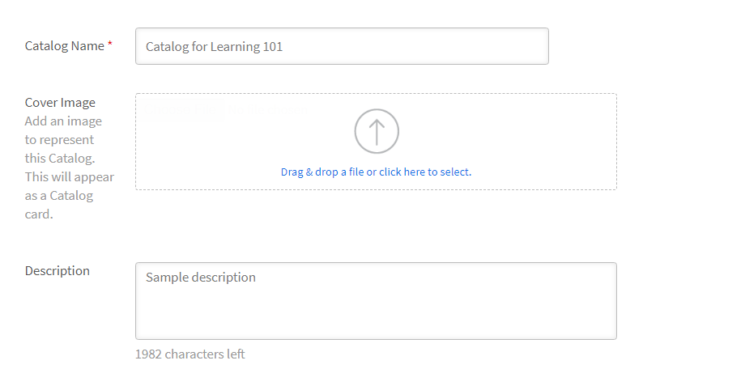
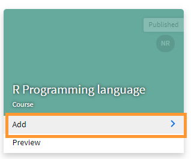
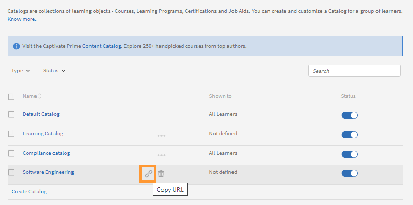

# 目錄

目錄是學習內容的集合——課程、學習計畫和認證。 利用目錄為學習者提供客製化學習資源。 你可以在建立新目錄時，將學習與目錄關聯起來。

作為管理員，你可以建立自訂目錄，讓你的課程能在帳號內或跨帳號中為不同學習者提供選擇性課程。

## 目錄導論

在這場訓練中，你將學習如何建立和管理目錄。

如果你無法啟動訓練，請寫信至 <almacademy@adobe.com>。

## 建立目錄 {#createacatalog}

要建立目錄，請執行以下步驟：

1. 作為管理員，在左側窗格點選目錄。 在這個頁面上，有一個預設目錄，當你建立學習管理員帳號時會自動建立。 而且預設情況下，這個目錄中的所有學習對象都會與所有學習者共享。
1. 要建立目錄，請在頁面右上角點擊 **[!UICONTROL Create]**。 您也可以選擇點擊 **[!UICONTROL Create Catalog]**&#x200B;位於目錄列表下方的 。
1. 在頁面 **[!UICONTROL Create Catalog]** 上，輸入你想建立的目錄名稱和描述。

   

   繼續請點擊 **[!UICONTROL Next]**。

   縮圖只能在沉浸式介面中查看，經典版介面無法查看。

1. 在目錄頁面，你可以在新目錄中新增以下內容：

   * [課程](catalogs.md#course)
   * [學習計畫](catalogs.md#lp)
   * [認證](catalogs.md#cert)
   * [工作輔助工具](catalogs.md#job)

## 將課程加入課程目錄 {#course}

1. 從課程清單中選擇一門你想加入課程目錄的課程。

   

   *建立目錄*

   你可以把多門課程加入目錄。
1. 你可以依技能、角色和語言篩選課程。 所選課程將推薦給對這些技能與角色有興趣的學習者。

   * **[!UICONTROL Skills]**&#x200B;技能篩選器讓使用者能找到專注於特定技能的課程。
   * **[!UICONTROL Roles]**：角色篩選器幫助使用者存取符合不同職務職責與需求的課程。
   * **[!UICONTROL Language]**：語言篩選器協助使用者選擇以偏好或必修語言提供的課程

1. 儲存變更。 回到目錄清單，點擊列表中的新目錄。
1. 在新目錄頁面左側窗格，點擊 **[!UICONTROL Content]**。

   

   *選擇課程加入課程目錄*

   你新增的課程會出現在分 **[!UICONTROL Courses]** 頁中。

## 將學習程式加入目錄 {#lp}

1. 從學習計畫清單中，選擇一個你想加入目錄的學習計畫。
1. 儲存變更。 回到目錄清單，點擊列表中的新目錄。
1. 在新目錄頁面左側窗格，點擊 **[!UICONTROL Content]**。

   你新增的學習程式會出現在分 **[!UICONTROL Learning Programs]** 頁中。

## 在目錄中新增認證 {#cert}

1. 從認證清單中選擇一個你想加入目錄的認證。
1. 儲存變更。 回到目錄清單，點擊列表中的新目錄。
1. 在新目錄頁面左側窗格，點擊 **[!UICONTROL Content]**。

   您新增的認證會顯示在分 **[!UICONTROL Certifications]** 頁中。

## 將工作輔助工具加入目錄 {#job}

1. 從工作輔助工具清單中，選擇你想加入目錄的一份工作輔助工具。
1. 儲存變更。 回到目錄清單，點擊列表中的新目錄。
1. 在新目錄頁面左側窗格，點擊 **[!UICONTROL Content]**。

   你新增的工作輔助工具會出現在分 **[!UICONTROL Job Aids]** 頁中。

如果帳號裡已經有內容，這些分頁裡的內容都會出現。 否則，你必須先創造內容。 例如，如果你還沒有在 Learning Manager 應用程式中新增任何課程或學習程式，那你就必須先開始建立它們。

## 課程、學習路徑或工作輔助工具的批量移除

管理員或自訂管理員可以批量移除課程、學習路徑或工作輔助工具。 前往 **[!UICONTROL Catalogs]** 並選擇目錄。 在頁面 **[!UICONTROL Content]** 上，選擇 **[!UICONTROL Edit Content]**。 接著，選擇 **[!UICONTROL Remove]** 課程、學習路徑或工作輔助工具旁的選項，並選擇 **[!UICONTROL Save]**。

## 學習者目錄深度連結 {#deep-link}

管理員可以產生一個深層連結，讓學習者能直接進入特定的目錄頁面。

在頁面 **[!UICONTROL Catalogs]** 上，將滑鼠移到你深層連結的目錄上，然後點擊高亮的圖示。

*為學習者建立深層連結*

## 啟用目錄 {#enablethecatalog}

一旦你建立目錄並加入學習物件，要讓學習者能看到目錄，你必須啟用該目錄。

為了啟用目錄，

1. 在目錄清單中，切換你想啟用的目錄附近的選項。 或者，您也可以選擇目錄附近的勾選框，點擊 **[!UICONTROL Actions]** 右上角，然後點擊 **[!UICONTROL Enable]**。

1. 你也可以在清單中啟用多個目錄。 選擇目錄，然後從 **[!UICONTROL Action]** 選單中選擇 **[!UICONTROL Enable]**&#x200B;選項。

## 停用目錄 {#disablethecatalog}

要停用目錄，請關閉目錄附近的選項。

或者，你也可以選擇目錄附近的勾選框，點選右上角的「動作」，然後點選 **[!UICONTROL Disable]**。

你也可以在清單中停用多個目錄。 選擇目錄，然後在行動選單中選擇 **[!UICONTROL Disable]**&#x200B;選項。

## 刪除目錄 {#deletethecatalog}

要刪除目錄，請在列表中選擇目錄。 點擊目錄附近的刪除按鈕或點擊 **[!UICONTROL Actions]** > **[!UICONTROL Delete]**。

你也可以刪除多個目錄。

## 分享目錄 {#shared}

管理員可以與組織內部使用者或任何外部使用者分享目錄。 不過，分享是排他的。 換句話說，內部共享的目錄無法與外部群組共享，反之亦然。

課程、學習計畫、工作輔助工具和認證，都是你想分享的目錄中支援的學習對象。

### 分享目錄

此培訓將教您如何與內部使用者群組及外部 Adobe Learning Manager 帳號共享目錄。

如果你無法啟動訓練，請寫信至 <almacademy@adobe.com>。

## 內部分享目錄 {#int}

選擇一個你想內部分享的目錄。

在左側窗格，點擊 **[!UICONTROL Share Internally]**。

如果沒有群組存在，你必須新增一個內部使用者群組。

若要新增內部使用者群組，請點擊 **[!UICONTROL Add User Groups]**。

*內部共享目錄*

沒有啟用或停用共享使用者群組的選項。 要停用，必須刪除使用者群組。 要刪除的話，將滑鼠移到三點圖示上，然後點擊刪除圖示。 或者，點擊頁面右上角的動作下拉選單，然後點擊刪除。

## 對外分享目錄 {#ext}

在目錄頁面，點擊你想分享的目錄。 在左側面板點擊 **[!UICONTROL Share Externally]**。

*外部共享目錄*

輸入與你的 Learning Manager 帳戶相關的子網域。 點擊 **[!UICONTROL How to get subdomain?]** 了解子網域的使用情況。 您也可以點擊 **[!UICONTROL Branding]** 管理員首頁左側窗格，查看與您組織帳號相關的子網域。

**招生上限**

你可以在共享目錄中加入 **「允許報名」欄位**&#x200B;的數字，設定每門課程的報名人數上限。 共享目錄的接收者無法將有註冊限制的課程納入學習計畫。

**到期**

你可以在欄位設定有效期限 **[!UICONTROL Expiry]** 來設定共享目錄的有效性。 共享課程過期後，課程不再被允許註冊。 現有學習者仍可存取內容。 學習道具會被淘汰，但徽章和技能仍然有效。 在此狀態下，共享目錄接收器無法將已退休的學習物件重新退休。

填寫所有必要資訊後點擊 **[!UICONTROL Save]** 。 點擊 **[!UICONTROL Actions]** 頁面右上角的下拉選單，然後點擊 **[!UICONTROL Share]** 與外部帳戶分享該目錄。

共享帳號持有人擁有的目錄只能與外部帳號共享。 你不能將已經由其他帳號分享的目錄分享給你。

外部共享帳號的管理員會在應用程式和電子郵件中收到通知。 收件人必須點擊電子郵件中提供的唯一網址，或點擊通知訊息並接受共享目錄請求。 在應用程式中，接收者可以選擇點擊接受或拒絕。 在接受共享目錄前，接收者可查看目錄細節，如分享者、分享日期、有效期限等。

共享目錄會出現在接收帳戶中。 與共享目錄相關的學習物件會顯示在應用程式的管理員與作者角色中。 您可以透過定位 &lt;-- arrow icon displayed for the catalogs acquired by you.

具有開放/活躍狀態的學習物件只會被加入共享目錄。

**Unshare 目錄**

取消分享目錄就是在應用程式中停用外部帳號。 要取消分享目錄，請點擊 **[!UICONTROL Actions]** 頁面右上角並點選 **[!UICONTROL Unshare]**。 你隨時都可以取消分享目錄。 當目錄未被共享時，該共享目錄中的所有學習物件都會進入退休狀態。 失效目錄在接收人申請中顯示為已退休。

你只能在接收方接受請求前，從共享清單中移除外部帳號。

**刪除目錄**

若要刪除共享目錄，請點擊 **[!UICONTROL Actions]** 下拉選單並點選 **[!UICONTROL Delete]**。

* 你不能和外部帳號共用預設目錄。
* 你無法刪除你對外分享的目錄。
* 你無法刪除從其他帳號分享給你的目錄。

## 啟用對共享目錄的完全控制 {#enablefullcontrolofsharedcatalog}

你可以授權外部帳號完整存取你的目錄。 帳號管理員接著可以接受該目錄，並相應地新增或刪除學習模組。

欲了解更多資訊，請參閱 [共享目錄](shared-catalog-full-control.md)的完全控制。

## 共享目錄學習物件屬性 {#sharedcataloglearningobjectsproperties}

在擁有者應用程式中對學習物件所做的任何修改都會被傳遞到共享目錄接收器。 以下列出反映在接收器應用中的學習物件屬性：

<table>
 <tbody>
  <tr>
   <td>
    
<strong>河道</strong>
</td>
   <td>
    
課程物件上的名稱、描述及其他欄位，除了遊戲化點數、徽章
</td>
  </tr>
  <tr>
   <td>
    
<strong>學習計畫</strong>
</td>
   <td>
    
名稱、描述及 LP 物件上的欄位，除了 badgeId，正在退休
</td>
  </tr>
  <tr>
   <td>
    
<strong>認證</strong>
</td>
   <td>
    
認證物件的所有屬性，除了 badgeId，認證的退休
</td>
  </tr>
  <tr>
   <td>
    
<strong>徽章</strong>
</td>
   <td>
    
名稱與徽章退役
</td>
  </tr>
  <tr>
   <td>
    
<strong>類別 </strong>
</td>
   <td>
    
名稱、描述、顏色及分類的退役、新增關卡
</td>
  </tr>
  <tr>
   <td>
    
<strong>就業援助</strong>
</td>
   <td>
    
jobAid 物件的所有屬性
</td>
  </tr>
  <tr>
   <td>
    
<strong>模組</strong>
</td>
   <td>
    
模組物件的所有性質
</td>
  </tr>
 </tbody>
</table>

## 接收器應用程式中的共享目錄功能 {#sharedcatalogfeaturesinreceiverapplication}

* 來自共享目錄的學習物件會出現在作者與管理應用程式中;然而，模組並未被列出，因為它們是隱藏的。
* 共享學習物件可用於接收者帳號中的所有工作流程。 例如，將共享課程加入學習對象，如認證（包括永久與重複認證）、學習路徑及目錄;然而，這些學習物件無法再次分享（因為它們已經有來自其他帳號的共享學習物件）。
* 所有與課程/學習計畫/認證相關但不包含在目錄中的工作輔助工具，都會被複製到收件人帳戶中。
* 共享目錄接收器不得將學習物件加入共享目錄。
* 共享目錄接收器無法修改共享學習物件的模組。
* 共享目錄接收器無法將課程加入共享學習計畫/認證。
* 不允許重複或重新分享共享的學習物件。
* 新加入共享目錄的資產會自動對接收者可見。
* 與學習對象相關的技能會被複製到共享的目錄接收帳戶。

* 如果共用的目錄接收帳號已經有相同的技能名稱，那麼會在名稱後面新增 &#42; 新的技能。
* 課程與學習程式預設實例中的資料（例如徽章、L1、L3、通知）也會連同課程及學習程式一併複製至接收者帳戶。

重複認證不能成為外部共享目錄的一部分。 若目錄上有註冊限制或到期日，接收者不得在重複認證中使用已取得的學習對象。

## 共享目錄特徵的傳播 {#propagation}

組織內跨帳號的管理員可以將目錄分享給多個帳號。 共享目錄的接收者可以取得與共享目錄相關的學習物件。 除了此功能外，自 2016 年 11 月 Learning Manager 版本起，接收者可取得透過目錄共享的學習物件屬性。

在分享目錄後，若帳號管理員對學習物件做出任何變更，相同的變更也會同步傳遞至所有由共享目錄接收者取得的學習物件。

此傳播功能所支援的學習物件如下：

* 技能
* 課程
* 學習計畫
* 認證
* 工作輔助工具
* 課程與學習計畫的預設實例

如果共享目錄的接收者修改了學習管理器應用程式中收到的任何學習物件欄位，則這些學習物件不會再對這些欄位進行進一步的更新。 例如，如果接收方編輯課程欄位如課程名稱或簡短說明，當擁有者更改這些欄位時，則不會發生傳播。 換句話說，這些編輯過的學習物件欄位會成為接收者的學習管理員帳號本地。

## 常見問題 {#frequentlyaskedquestions}

+++如何將課程、LP 和認證加入目錄？

若要將課程、認證及學習計畫加入目錄，請參閱 [將這些內容納入目錄的步驟](catalogs.md#q1) 。

+++

+++如何對外和內部共享目錄？

欲內部或外部分享目錄，請參閱以下章節：

* [內部分享](catalogs.md#int)
* [外部分享](catalogs.md#ext)

+++

+++如何讓學習者看到他們所屬的所有目錄？

目錄可透過使用者群組與組織內的學習者分享。 為了讓學習者查看他們所屬的目錄，請遵循以下步驟：

1. 打開目錄並點擊 **[!UICONTROL Share Internally]**。
1. 要新增學習者，請在頁面右上角點擊 **[!UICONTROL Add]**。
1. 在對話中 **[!UICONTROL User Groups]** ，開始加入學習者。
1. 點擊 **[!UICONTROL Save]**。

當學習者登入學習管理員時，他/她必須查看與他/她分享的目錄。

+++

+++如何建立和使用目錄標籤？

目錄標籤讓你能將學習對象與相關的欄位值資訊關聯起來。 目錄標籤與數值僅對管理員與作者可見。 欲了解更多資訊，請參閱 [***目錄標籤***](/help/migrated/administrators/feature-summary/catalog-labels.md)。

建立目錄標籤後，您可以依照以下步驟將其套用到特定目錄上：

1. 從左側窗格開啟目錄。
1. 選擇目錄並申請標籤。
1. 從左側窗格開啟目錄標籤。
1. 點擊 **[!UICONTROL Edit]** 右上角。 該頁面顯示可用的目錄標籤清單。
1. 若要在目錄中新增標籤，請點擊 **[!UICONTROL Add to Catalog]**。
1. 若要移除已加入目錄的標籤，請點擊 **[!UICONTROL Remove]**。

+++

+++我該如何向新建立的外部使用者提供特定目錄的存取權限？

1. 作為管理員，選擇你想提供存取外部使用者設定檔的目錄。
1. 內部分享 > 新增更多 > 選擇相應的外部使用者設定檔
1. 切換以啟用目錄。

+++

+++我該如何限制使用者只能看到特定的目錄？ 

停用預設目錄，只啟用已建立並授權外部使用者存取的目錄。

+++
