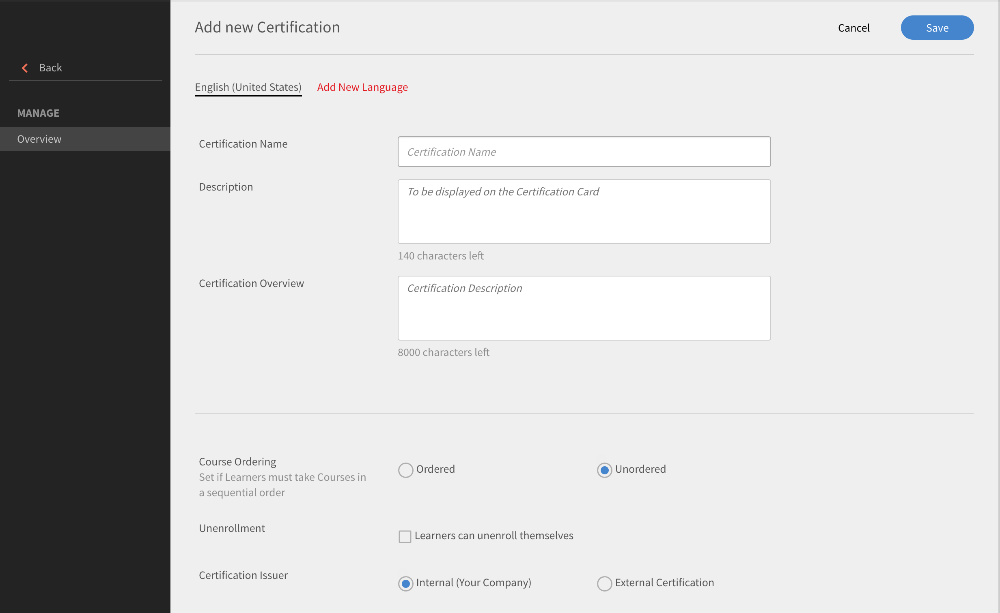
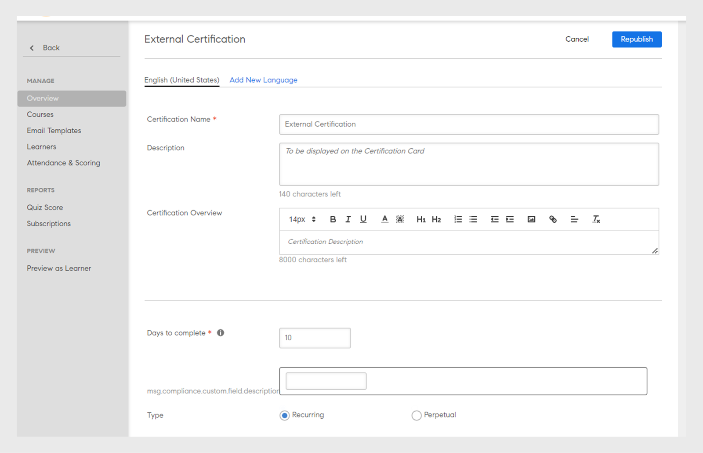

# 認證

瞭解如何建立認證、註冊學習者及編輯已發佈的認證。

使用此功能以一次性或循環時間範圍來對學習者進行認證。 只有管理員可以為學習者定義認證。

身為管理員，您可以建立內部託管或由第三方管理的認證計畫。 若為內部認證，請定義學習者需完成才能取得認證的課程。 Publish程式，然後將其指派給學習者。

## 建立認證 {#createacertification}

1. 按一下左窗格上的&#x200B;**[!UICONTROL Certification]**。\
   此時會出現一個頁面，其中包含所有草稿和已發佈認證狀態的清單。

1. 以各種模式檢視認證：

   1. 按一下「**[!UICONTROL Draft]**」標籤，檢視所有處於草稿狀態的認證。 您需要完成建立。
   1. 按一下&#x200B;**[!UICONTROL Published]**&#x200B;檢視您發佈的所有認證。
   1. 按一下&#x200B;**[!UICONTROL All]**&#x200B;以檢視所有狀態的認證。
   1. 以遞增順序、遞減順序或根據更新日期來排序和檢視認證清單。

1. 按一下&#x200B;**[!UICONTROL Add]**。

   新憑證頁面隨即顯示。

*檢視頁面以新增認證*

1. 新增憑證名稱和說明。

<table>
 <tbody>
  <tr>
   <th>欄位</th>
   <th>說明</th>
  </tr>
  <tr>
   <td>完成天數</td>
   <td>認證的截止日期。 輸入數值。</td>
  </tr>
  <tr>
   <td>型別</td>
   <td>
    
憑證型別：

    <ul>
     <li><b>週期性</b> — 如果認證需要在每年、兩年或三年後進行，請選擇此選項。</li>
     <li><b>永久</b> — 如果認證需要是一次性要求，請選擇此選項。</li>
    </ul></td>
  </tr>
  <tr>
   <td>重新指派</td>
   <td>選擇您要根據完成日期或註冊日期重新指派憑證。 </td>
  </tr>
  <tr>
   <td>有效性（月數）  </td>
   <td>指定認證的有效期。</td>
  </tr>
  <tr>
   <td>課程排序 </td>
   <td>決定學習者應以有序或無序的方式參加課程。 </td>
  </tr>
  <tr>
   <td>取消註冊 </td>
   <td>啟用或停用讓學習者自行取消註冊的選項。</td>
  </tr>
  <tr>
   <td>憑證核發者 </td>
   <td>
    
選擇<b>內部</b> （如果屬於您的組織），或選擇<b>外部</b>以取得外部組織認證。

    
當您選擇<b>外部認證</b>時，您會看到另外兩個選項 — 

    <ul>
     <li>與核准日期相同 </li>
     <li>由學習者提交 </li>
    </ul>
    
學習者可指定外部認證的正確完成日期。 在舊版中，完成日期由Prime根據經理的核准日期預設設定。 學習者提供的完成日期應晚於憑證建立日期。
</td>
  </tr>
  <tr>
   <td>持續時間</td>
   <td>如果您已選擇外部認證，則以分鐘為單位指定持續時間。</td>
  </tr>
  <tr>
   <td>標記</td>
   <td>輸入您要與憑證關聯的標籤。 當您想要搜尋憑證時，標籤會很有幫助。</td>
  </tr>
  <tr>
   <td>選取目錄 </td>
   <td>選擇憑證所屬的目錄。</td>
  </tr>
 </tbody>
</table>

從&#x200B;**[!UICONTROL Recommend for]**&#x200B;區段選取產品、角色和角色層級，將此學習路徑建議給對這些產品和角色表示感興趣的使用者。

*建議*

從&#x200B;**[!UICONTROL Courses]** > **[!UICONTROL Catalog]**&#x200B;標籤選擇要新增至認證的課程。

將滑鼠停留在每個課程圖磚上，按一下「+」以將它們新增至認證。 按一下&#x200B;**[!UICONTROL Preview]**&#x200B;以學習者身分檢視課程後再新增它。

1. 按一下&#x200B;**[!UICONTROL Curriculum]**&#x200B;標籤以檢視/驗證您新增的課程清單。
1. 按一下&#x200B;**[!UICONTROL Publish]**。

## 認證的課程執行個體對應 {#courseinstancemappingforcertifications}

若要對應課程與認證執行個體，請執行下列動作：

1. 從左窗格按一下「認證」。
1. 從認證清單中，選取檢視您要對應課程與執行個體的認證認證。
1. 從左窗格中，按一下[課程]。 隨即顯示認證的課程。 按一下「編輯」。
1. 將游標停留在您要設定例項對應的課程上，選取「課程例項對應」。
1. 從出現的快顯視窗中，選取您要針對所選認證交付的課程例項。
1. 按一下「儲存」。

管理員可以將教室和虛擬教室型別課程新增至學習計畫。 作者在建立課程期間提供的任何工作階段都會成為預設例項。 管理員新增課程至學習計畫時，預設會對映至所有課程的預設執行個體，但管理員可變更執行個體對映。 新增至學習計畫的課程數也會顯示在例項頁面中，如下所示。

## 啟用完整的目錄控制項 {#catalog}

就像授與學習或模組](shared-catalog-full-control.md)的完整[目錄控制項一樣，您也可以啟用認證的完整目錄控制項。

## 將學習者註冊或取消註冊至認證 {#enrollorunenrolllearnerstothecertification}

如需註冊學習者及遵循步驟的詳細資訊，請參閱[註冊學習者](courses.md#main-pars_header_1058138132)。

## 取消學習者註冊 {#unenrollmentforlearners}

建立認證時，管理員可以選擇學習者是否可以從認證中自行取消註冊。 如果管理員選取選項，則學習者可自行取消註冊。

*選擇取消學習者註冊*

## 標籤完成 {#markcompletion}

管理員可以使用他們可用的選項標籤憑證完成。 若要標示憑證已完成，請使用下列步驟。

1. 開啟&#x200B;**[!UICONTROL Certification]** > **[!UICONTROL Learners]**。

   「學習者」頁面隨即開啟，內含已註冊學習者清單。

1. 使用每個學習者可用的核取方塊，選取一位/多位/所有學習者以標籤憑證完成。
1. 按一下&#x200B;**[!UICONTROL Action]** > **[!UICONTROL Mark completion.]**

   請注意，如果認證包含多個課程，則所有課程都會標示完成。

## 外部認證的必修課程 {#mandatory}

在舊版Learning Manager中，學習者在外部認證中完成課程並非必須完成認證。

您現在可以在編輯認證時，啟用[課程]索引標籤中的選項&#x200B;**[!UICONTROL Set required courses as Mandatory for Certificate Completion]**，讓課程成為必修課程。

## 編輯已發佈的認證 {#editingapublishedcertification}

憑證可由處於已發佈狀態的管理員進行編輯。 在此狀態下，管理員可以編輯憑證的所有區段並重新發佈。

若要編輯已發佈的憑證，請按一下憑證卡並按一下頁面右上角的&#x200B;**[!UICONTROL Edit]**。

編輯認證的區段時，如果您必須移出頁面，則需要重新發佈認證。 您會收到要求您重新發佈憑證的對話方塊確認。

*編輯憑證*

## 訂閱 {#subscription}

管理員可擷取測驗分數和學習者狀態報表。 他們可以設定報告頻率、電子郵件主旨和收件者電子郵件ID。 根據設定的頻率，收件者會收到一封包含附加報告的電子郵件。

*設定報告頻率和其他屬性*
