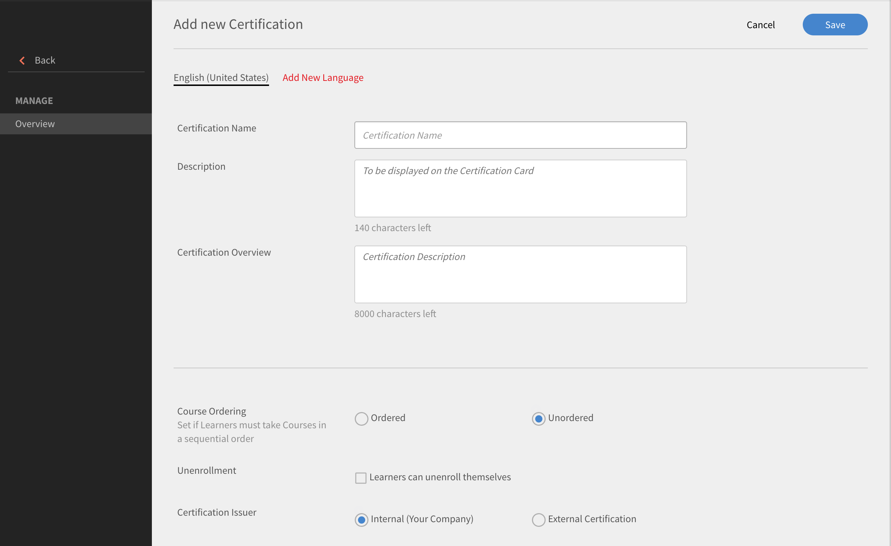
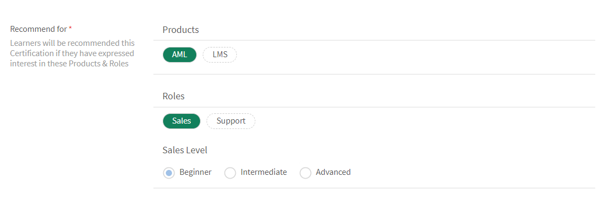
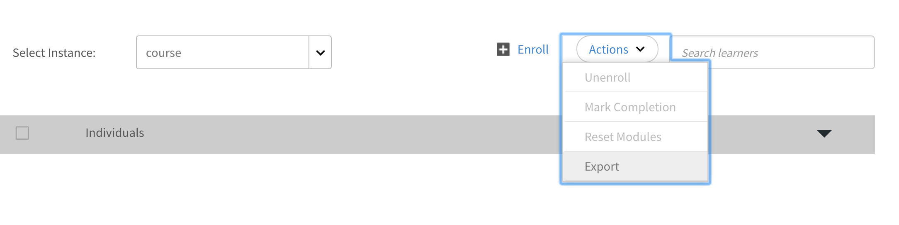
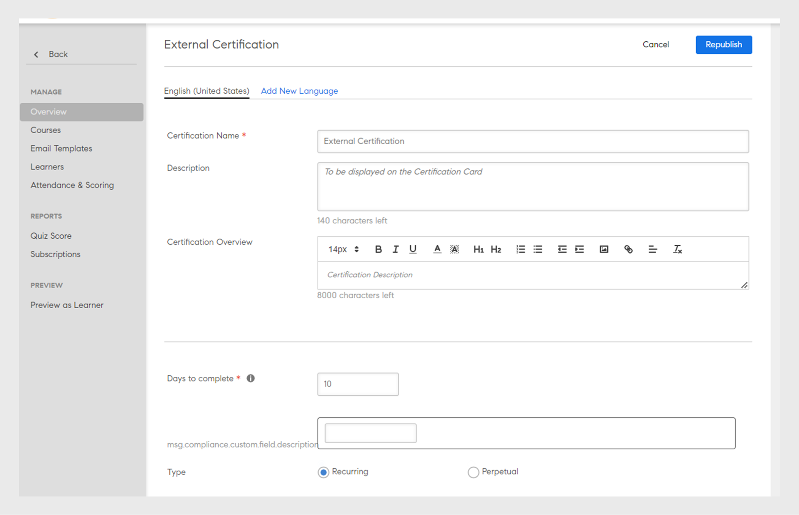
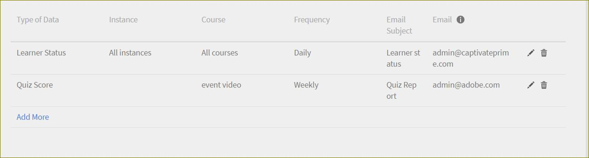

# 認證

學習如何建立認證、招募學習者，以及編輯已發表的認證。

使用此功能可一次性或定期認證您的學員。 只有管理者能為學習者定義認證。

作為管理員，你可以建立一個由內部主辦或第三方主辦的認證計畫。 在內部認證的情況下，請定義學習者必須完成哪些課程才能取得認證。 先發佈程式，然後指派給學習者。

## 建立認證 {#createacertification}

1. 點擊 **[!UICONTROL Certification]** 左側窗格。\
   會出現一頁列出所有草案及已公布的認證狀態。

1. 查看各種認證模式：

   1. 點擊 **[!UICONTROL Draft]** 分頁查看所有正在草案狀態的認證。 你需要完成它們的創造。
   1. 點擊 **[!UICONTROL Published]** 查看您所頒布的所有認證。
   1. 點擊 **[!UICONTROL All]** 查看所有州的認證。
   1. 請依照更新日期排序並查看認證清單，或依照你更新的日期從高到低排序。

1. 點擊 **[!UICONTROL Add]**。

   新的認證頁面會出現。

*查看頁面以新增認證*

1. 請加上證書名稱和說明。

<table>
 <tbody>
  <tr>
   <th>場地</th>
   <th>說明</th>
  </tr>
  <tr>
   <td>完成天數</td>
   <td>認證的截止日期。 輸入一個數字值。</td>
  </tr>
  <tr>
   <td>類型</td>
   <td>
    
認證類型：

    <ul>
     <li><b>定期認證</b>——若認證需每一年、兩年或三年後完成，請選擇此選項。</li>
     <li><b>永久性——</b>如果認證需要一次性要求，請選擇此選項。</li>
    </ul></td>
  </tr>
  <tr>
   <td>調任</td>
   <td>請選擇您希望依照完成日期或註冊日期重新分配證書。 </td>
  </tr>
  <tr>
   <td>有效期（以月份計）  </td>
   <td>請明確說明認證有效期有多長。</td>
  </tr>
  <tr>
   <td>課程順序 </td>
   <td>決定學習者應以有序還是無序的方式修課。 </td>
  </tr>
  <tr>
   <td>退學 </td>
   <td>請啟用或關閉讓學習者自行退學的選項。</td>
  </tr>
  <tr>
   <td>認證發行機構 </td>
   <td>
    
如果屬於你的組織，請選擇 <b>內部認證</b> ;若有外部組織認證，則選擇 <b>外部</b> 認證。

    
當你選擇 <b>外部認證</b>時，你會看到另外兩個選項——

    <ul>
     <li>和核准日期一樣 </li>
     <li>由學習者提交 </li>
    </ul>
    
學員可指定外部認證的正確完成日期。 在先前版本中，完成日期由 Prime 預設設定，依據經理核准日期。 學習者提供的完成日期應大於證書製作日期。
</td>
  </tr>
  <tr>
   <td>持續時間</td>
   <td>如果你選擇了外部認證，請指定所需時間（分鐘）。</td>
  </tr>
  <tr>
   <td>標記</td>
   <td>輸入你想與證書關聯的標籤。 標籤在你想搜尋證書時很有幫助。</td>
  </tr>
  <tr>
   <td>精選目錄 </td>
   <td>選擇該證書所屬的目錄。</td>
  </tr>
 </tbody>
</table>

從該區塊選擇產品、角色及職缺層級 **[!UICONTROL Recommend for]** ，向對這些產品與角色表達興趣的使用者建議此學習路徑。

*推薦*

從 **[!UICONTROL Courses]** > **[!UICONTROL Catalog]** 標籤中選擇要加入認證的課程。

將滑鼠移至每個課程圖塊，點擊 + 即可將其加入認證。 在新增課程前，請點擊 **[!UICONTROL Preview]** 以學習者身份查看課程。

1. 點擊 **[!UICONTROL Curriculum]** 分頁查看/驗證你新增的課程清單。
1. 點擊 **[!UICONTROL Publish]**。

## 認證課程實例映射 {#courseinstancemappingforcertifications}

為了規劃課程和認證實例：

1. 從左側窗格點選「認證」。
1. 在認證清單中，選擇「檢視該認證」，並設定課程與實例。
1. 從左側窗格點選「課程」。 認證課程會顯示出來。 點擊編輯。
1. 將滑鼠移到你想設定實例映射的賽道上，選擇「賽道實例映射」。
1. 從跳出的視窗中，選擇你所選擇的認證課程範例。
1. 點擊儲存。

管理員可以將教室和虛擬教室類型的課程加入學習計畫。 作者在課程創建過程中所提供的課程內容，將成為預設實例。 當管理員將課程加入學習程式時，預設會映射到所有課程的預設實例，但管理員可以更改實例的映射。 新增到學習計畫的課程數量也會在實例頁面中顯示，如下所示。

## 啟用完整目錄控制 {#catalog}

就像授予學習或模組[&#128279;](shared-catalog-full-control.md)的完整目錄控制權一樣，你也可以啟用認證的完整目錄控制。

## 報名或取消註冊學習者 {#enrollorunenrolllearnerstothecertification}

欲了解更多關於招募學習者及應遵循的步驟，請參閱 [「註冊學習者](courses.md#main-pars_header_1058138132)」。

## 學習者退學 {#unenrollmentforlearners}

在建立認證時，管理員可選擇學習者是否能自行退學。 如果管理員選擇了這個選項，學習者就可以自行退選。

*選擇退學*

## 標記完成 {#markcompletion}

管理員可透過可用選項標記認證完成。 要標記認證完成，請遵循以下步驟。

1. 打開 **[!UICONTROL Certification]** > **[!UICONTROL Learners]**。

   學習者頁面會以已註冊學習者的名單開啟。

1. 請選擇一位、多位或全部學習者，並使用每位學習者的勾選框標記「認證完成」。
1. 點擊  **[!UICONTROL Action]** > **[!UICONTROL Mark completion.]**

   請注意，若認證包含多門課程，所有課程的完成紀錄都會被記為完成。

## 外部認證必修課程 {#mandatory}

在早期的學習管理版本中，外部認證學習者完成課程並非完成證書的必要條件。

你現在可以在編輯認證時，在課程分頁啟用這個選項 **[!UICONTROL Set required courses as Mandatory for Certificate Completion]** ，讓課程成為必修。

## 編輯已發表的認證 {#editingapublishedcertification}

認證可由已公布州的管理員編輯。 在此狀態下，管理員可以編輯認證的所有章節並重新發布。

要編輯已發表的認證，請點擊認證卡片並點擊 **[!UICONTROL Edit]** 頁面右上角。

在編輯認證章節時，如果你必須離開該頁面，就需要重新發布該認證。 你會收到對話確認，要求你重新發布認證。

*編輯憑證*

## 訂閱 {#subscription}

管理員可以取得測驗分數和學習者狀態報告。 他們可以設定舉報頻率、電子郵件主題及收件人電子郵件 ID。 根據設定的頻率，收件人會收到附有報告的電子郵件。

*設定報告頻率及其他屬性*
