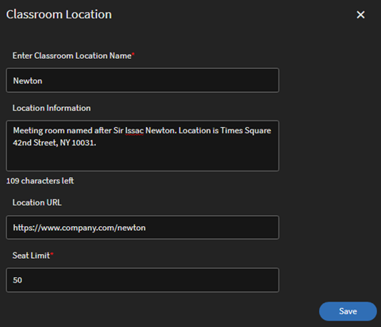
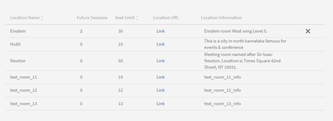
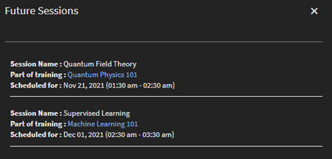
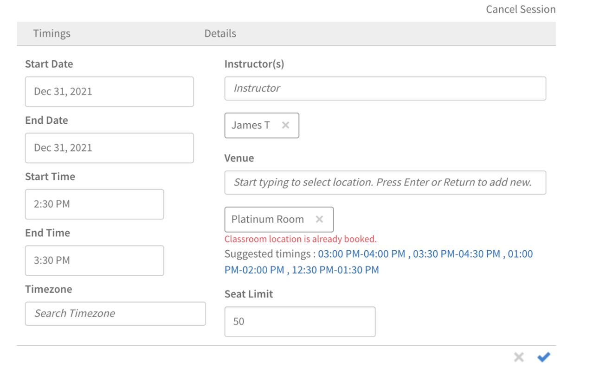
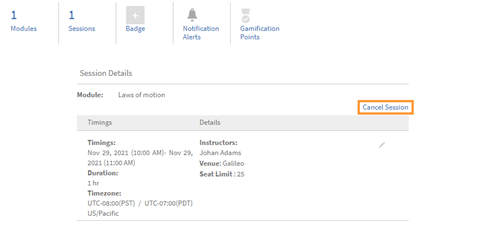

# 教室

## 概觀

管理員現在可以設定教室位置的資料庫。 管理員可針對每個教室位置設定中繼資料，包括位置名稱、座位限制以及位置URL等其他資訊。 作者與管理員隨後可使用這些預先設定的教室位置，設定由講師授課的訓練活動（教室模組）。

您可以使用以下兩種方式新增教室位置。

## 使用UI新增教室

您可以使用UI新增教室位置：

1. 在管理員應用程式（管理員角色的UI）中，按一下 **[!UICONTROL Settings]** > **[!UICONTROL Classroom Locations]**.

1. 按一下 **[!UICONTROL Add]** > **[!UICONTROL New Location]**.

1. 在 **[!UICONTROL Classroom Location]** 對話方塊中，輸入下列詳細資料：

   * 輸入 **[!UICONTROL Location Name]**. 使用唯一的名稱。 否則，Learning Manager會顯示錯誤訊息。
   * 在「 」中輸入位置說明 **[!UICONTROL Location Information]** 欄位。 此欄位為選用。
   * 輸入 **[!UICONTROL Location URL]**. 學習者可在教室詳細資訊中檢視此資訊。 如果需要，該URL也可以是地圖位置URL。 此為選用欄位。
   * 輸入並選取 **[!UICONTROL Location Region]**. 此欄位是選用欄位。
   * 輸入中的可用座位數 **[!UICONTROL Seat Limit]** 欄位。 這表示教室座位容量。 此值可在建立實際的由講師授課的訓練活動時變更。

   

   *新增教室位置*

新增位置後， **[!UICONTROL Settings]** > **[!UICONTROL Classroom Locations]** 頁面列出會議室：

*檢視所有會議室*

此清單包含下列欄位：

**[!UICONTROL Location Name]**  — 教室位置名稱。

**[!UICONTROL Future Sessions]**  — 對應位置將發生的事件數。 按一下數字以在對話方塊中檢視詳細資訊。

*檢視未來的工作階段*

此對話方塊會顯示每個工作階段的詳細資訊，包括工作階段名稱、包含工作階段的訓練名稱，以及工作階段排程。 顯示的時間會與學習者的系統時區一致。

此 **[!UICONTROL Future Sessions]** 欄位顯示 **零** 教室未用於任何工作階段或教室與過去的工作階段相關聯時。

**[!UICONTROL Seat Limit]**  — 顯示教室座位容量。

**位置URL**  — 您建立教室位置時提供的URL。

**位置資訊**  — 您在建立教室時提供的教室資訊。

### 編輯教室位置

若要編輯教室位置，請遵循下列步驟：

1. 在管理員應用程式（管理員角色的UI）中，選取 **[!UICONTROL Settings]** > **[!UICONTROL Classroom Locations]**.

1. 將滑鼠停留在您要編輯的教室位置。

1. 選取 **[!UICONTROL Edit Classroom Location]** 圖示。

1. 修改教室位置並選取 **[!UICONTROL Save]**.

## 使用CSV新增教室

或者，您可以匯入包含教室資訊的CSV來新增一或多個教室位置。

在 **[!UICONTROL Admin app]** > **[!UICONTROL Settings]** > **[!UICONTROL Classroom Locations]** > **[!UICONTROL Add]**，按一下 **[!UICONTROL Bulk import locations]** 按鈕。 瀏覽至包含CSV檔案的位置，然後選取檔案。

CSV檔案使用這些欄位來儲存一或多個教室位置的詳細資訊：

* 名稱
* 資訊
* url
* 區域
* seatlimit

您可以自訂標頭。

CSV檔案必須包含所有採用此處指定之相同順序的欄。

系統匯入CSV檔案後，位置會新增到資料庫中。

## 搜尋教室

若要搜尋教室，請選取虛擬教室課程，然後前往 **[!UICONTROL Instances]** > **[!UICONTROL Sessions]**. 作者或管理員可以開始輸入位置名稱，以檢視開始出現的相關結果。 接著，他們便可從顯示的結果中選取位置。 如果預先輸入結果中未顯示任何位置，使用者仍可新增教室位置名稱。 請注意，使用工作階段建立工作流程建立的此位置名稱，不會新增至管理員建立的位置資料庫。

新增教室時，學習平台也會指出是否在提及的時段內已預訂教室。 它甚至提供替代時隙作為建議。 因此，如果作者決定使用相同的教室位置，這可讓作者調整會議時間。

*搜尋教室*

## 管理員

身為管理員，您可以管理講師和課程例項。

### 設定講師：

在管理員應用程式中的底下 **[!UICONTROL Settings]** > **[!UICONTROL General]**，管理員可以找到 **[!UICONTROL Instructor Management]** 選項。 此功能可確保只有指派為講師的預先核准使用者才能加入進行工作階段。

若要指派講師，請遵循下列步驟：

1. 前往 **[!UICONTROL Getting Started]** 頁面，然後選取 **[!UICONTROL Users]** 在左窗格中。

1. 選取您想要的使用者。

1. 透過選取「 」將講師角色指派給使用者 **[!UICONTROL Actions]** > **[!UICONTROL Assign Role]**.

### 取消工作階段：

在 **[!UICONTROL Course Instance]** 頁面，管理員可以取消一或多個階段作業。 取消工作階段時，系統會移除所有工作階段詳細資料，但會保留名額限制。

此外，管理員可以：

* **[!UICONTROL View Enrollment]**：取得每個工作階段的已註冊和輪候學習者資訊。
* **[!UICONTROL Unenroll Learners]**：將學習者從含有已取消工作階段的課程中移除，而不變更其註冊狀態。
* **[!UICONTROL Attendance Management]**：標籤工作階段的出席情況，即使工作階段已取消。
* **[!UICONTROL Course Completion]**：即使工作階段已取消，管理員仍可將課程標示為完成。
* **[!UICONTROL Rescheduling]**：為較晚的日期排程已取消的工作階段，並在重新排程期間新增講師。

請注意，取消後，學習者會繼續註冊培訓例項。 他們的註冊狀態（例如已確認的註冊、輪候和等待經理核准）保持不變。 這很有幫助，因為管理員將來可以設定和重新排程已取消的工作階段。

## 作者

如果管理員選取 **[!UICONTROL Instructor Management]** 選項，作者只能搜尋具有講師角色的使用者，並將其新增至教室工作階段、虛擬教室工作階段、檢查清單和檔案提交模組。

此外，作者可以：

* 在現有工作階段中新增和移除講師。
* 將講師新增至已有一或多個講師的現有工作階段。

因此，在管理員啟用 **[!UICONTROL Instructor Management]** 選項，只有具有講師角色的使用者才能新增為講師。

>[!NOTE]
>
>使用工作階段CSV檔案移轉工作階段時，則不適用。 在這種情況下，沒有講師角色的使用者可以新增為講師。

在 **[!UICONTROL Course Instance]** 頁面，作者可以取消一或多個工作階段。 取消工作階段時，系統會移除所有工作階段詳細資料，但會保留名額限制。

因此，作者可以使用 **[!UICONTROL Cancel Session]** 取消相同或不同課程例項中一或多個教室工作階段或虛擬教室工作階段的連結。

## 僅限於預先確定的講師清單

目前，使用者在建立教室或虛擬教室工作階段時，可將任何註冊使用者新增為講師。 此版本中的此功能維持不變。

但是，管理員現在有另一個選項，可進一步控制誰在學習平台上被指派為講師。 這可防止在建立工作階段時意外增加新的講師。

## 取消現有工作階段

如有需要，作者或管理員可以取消工作階段並重新排程。

當使用者取消工作階段時，系統會傳送電子郵件給所有已註冊的學習者和講師，以取消會議。 電子郵件包含更新的工作階段詳細資訊。

有一個範本稱為 **[!UICONTROL Session Cancellation]** 這有助於取消工作階段。

在 **[!UICONTROL Course Instance]** 頁面，課程例項下列出的每個工作階段都包含取消工作階段的選項。

*取消現有工作階段*

當您按一下 **[!UICONTROL Cancel Session]** 連結，會出現警告訊息。

在警告訊息對話方塊中，如果按一下 **[!UICONTROL Proceed]**，系統會取消工作階段。

在取消工作階段後，系統也會清除下列詳細資訊：

* 工作階段開始日期
* 工作階段結束日期
* 工作階段的開始時間
* 工作階段的結束時間
* 講師已新增至工作階段
* 虛擬教室URL
* 新增至工作階段的地點/地點
* 講師新增的輪候表限制
