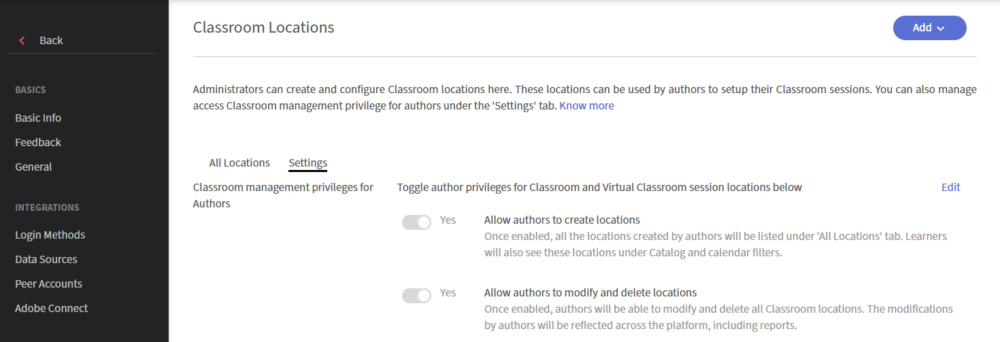

# 新增教室地點

管理員可以建立並管理教室地點庫，以便在設置由教師主導的教室與虛擬教室模組中重複使用。 對於每個地點，你可以定義詳細資訊，例如地點名稱、座位限制及其他資訊，包括地點網址。 作者在建立課程時可選擇這些預先定義的地點。

預設情況下，Adobe Learning Manager 採用單一欄位的地點格式。 對於跨國多語言管理教室地點的組織，Learning Manager 也支援結構化的四欄位格式，包括 **國家**、州/ **省/地區**、 **城市**&#x200B;及 **地點名稱**。 此格式提供額外功能，如基於位置的篩選及個別地點的語言支援。 管理員可透過一次性遷移轉換為四欄位格式。

>[!NOTE]
>
>若未啟用四欄位地點格式，作者與學習者仍可照常使用教室地點。 現有的單一場地格式仍然可用，無需更改。 欲了解更多資訊，請參閱 [遷移至四欄位方法](#migrate-classroom-locations-to-the-four-field-format) 。

## 配置教室位置設定

管理員可以控制作者是否能建立和管理教室地點。 請使用 **教室位置** 設定來定義作者可使用的存取權限。

要設定 **教室位置** 設定：

1. 以管理員&#x200B;**身份登入 Adobe Learning Manager**。
1. 選擇&#x200B;**教室地點**>**設定**。

   這會顯示 **教室位置** 頁面。

1. 選擇設定&#x200B;****&#x200B;標籤。

   

   *從設定&#x200B;**標籤中啟用教室與虛擬教室的**作者權限。*

1. 選擇 **編輯**。

   切換鍵可編輯，讓你能更新以下設定：

   | **背景設定** | **描述** |
   |---|---|
   | **允許作者建立地點** | 啟用此選項，讓作者在建立由講師主導的培訓課程時，能建立教室與虛擬教室模組的位置。 |
   | **允許作者修改和刪除位置** | 啟用此選項，允許作者編輯或刪除教室及虛擬教室位置。 |

1. 選擇 **儲存**。

## 建立並管理教室地點

管理員可以建立並管理教室地點，作者可在建立教室與虛擬教室訓練課程時重複使用。 Adobe Learning Manager 支援兩種地點格式：

* **單一欄位格式**：每個教室地點以單一 **地點名稱** 欄位識別。 查看 [使用單一欄位格式](#add-a-classroom-location-using-a-single-field-format) 新增教室地點以獲取更多資訊。
* **四場格式**：每個教室地點依國家&#x200B;**、州/**&#x200B;省/地區&#x200B;**、**&#x200B;城市&#x200B;****&#x200B;及地點名稱&#x200B;**組織**，方便跨區域管理地點。如果您的帳戶目前使用單一欄位格式，請先完成一次性遷移後再切換到四欄位格式。 欲了解更多資訊，請參閱 [遷移至四欄位方法](#migrate-classroom-locations-to-the-four-field-format) 。

### 使用單一欄位格式新增教室地點

您可以使用單一欄位格式新增教室地點：

1. 以管理員&#x200B;**身份登入 Adobe Learning Manager**。
1. 選擇&#x200B;**教室地點**>**設定**。
1. 選擇 **新增** > **新地點**。
1. 請在 **教室地點** 對話框輸入以下細節：

   1. 輸入 **地點名稱**。 使用獨特的名字。 否則，學習管理員會顯示錯誤訊息。
   1. 請在 **位置資訊** 欄位輸入地點描述。 此欄位為選填。
   1. 輸入 **地點網址**。 學習者可以在教室細節中查看這些資訊。 如果需要，網址也可以是地圖位置的 URL。 這是可選欄位。
   1. 輸入並選擇 **「地點區域**」。 此欄位為選填。
   1. 請輸入座位限制&#x200B;**欄位中可用座位**&#x200B;數。這表示教室的座位容量。此數值可在實際由講師主導的訓練活動中更改。      
      *使用單一欄位格式新增教室地點。*

### 將教室地點遷移為四場制

如果您的帳號使用舊有的單一欄位教室地點格式，請先遷移現有的教室地點，再啟用四欄位格式。 四欄位格式將位置資料組織成 **國家**、州/ **省/地區**、 **城市**&#x200B;及 **地點名稱**，方便跨區域管理位置。

這次遷移是一次性的。 切換到四欄格式後，帳戶無法恢復為單欄格式。

遷移現有地點：

1. 請前往 **管理員** > **教室地點** ，並選擇 **設定** 標籤。
1. 在&#x200B;**位置格式遷移**&#x200B;區塊選擇&#x200B;**匯出**。

   會下載包含您現有教室位置的 CSV 檔案。 以下欄位可供參考：

   1. **room_id**：位置的唯一識別碼。
   1. **地點**：翻譯後的地點名稱與地點資訊所在地。
   1. **名稱**：教室名稱。
   1. **國家**：教室所在的國家。
   1. **州**：教室所在的州、省或地區。
   1. **城市**：教室所在的城市。
   1. **資訊**：額外細節，如建築名稱、樓層或房號。
   1. **URL**：與地點相關的網址，例如地圖連結。
   1. **座位限制**：教室最大座位數。

   >[!NOTE]
   >
   >匯出後的 CSV 總是包含四欄位位置格式欄位，即使未啟用四欄位格式。

   

   *在切換到四場地點格式前，請先檢查遷移進度。*

1. 對於每個欄位名稱，更新 CSV 檔案，加入所需資訊，如國家、州、城市，以及其他必要資訊。
1. 選擇 **匯入** ，然後上傳更新後的 CSV 檔案。

   Adobe Learning Manager 會驗證資料並更新遷移進度。

1. 當遷移進度條達到 100% 時，選擇 **切換到新的四欄位格式**。 **位置格式遷移**&#x200B;狀態更新為&#x200B;**遷移完成**。

   

   *位置格式遷移更新至遷移完成狀態。*

## 使用四欄位格式新增教室地點

完成一次性遷移後，管理員可以建立四欄位格式的教室地點。 作者可在創建由講師主導的培訓課程時重複使用這些地點。 管理員可以單獨新增教室地點，或從 CSV 檔案匯入多個教室地點。

### 新增教室地點

利用教室地點來標準化訓練場地，並簡化作者的課程排程。

新增教室地點：

1. 在管理應用程式中，選擇&#x200B;**教室位置**>**設定**。

   

   *選擇&#x200B;**「所有地點」**標籤以新增教室地點。*

1. 從右上角選擇 **新增** > **新地點** 。

   **教室位置**&#x200B;彈出視窗會出現。

   

   *請在教室地點彈出視窗中輸入詳細資訊。*

1. 在 **教室地點** 彈出視窗中，請輸入以下細節：

   | **場地** | **描述** |
   |---|---|
   | **鄉村** | 選擇教室所在的國家。 |
   | **州/省/地區** | 選擇州、省或地區。 |
   | **城市** | 選擇教室所在的城市。 |
   | **地點名稱** | 輸入教室或教室名稱。 |
   | **地點資訊** | 輸入額外細節，例如建築物名稱、樓層或房號。 |
   | **地點網址** | 輸入地點網址，例如地圖連結。 |
   | **席次限制** | 這時教室的最大座位數。 |

1. 選擇 **儲存**。

   教室地點已儲存並列於 **「所有地點」** 標籤中。

### 大量進口教室地點

使用批量匯入來新增多個教室地點，或使用 CSV 檔案更新現有地點。

要大量匯入教室地點：

1. 在管理應用程式中，選擇&#x200B;**教室位置**>**設定**。
1. 從&#x200B;**「所有地點」標籤中選擇**&#x200B;下載&#x200B;**CSV**。

   會下載包含您現有教室位置的 CSV 檔案。 以下欄位可供參考：

   1. **room_id**：位置的唯一識別碼。
   1. **地點**：翻譯後的地點名稱與地點資訊所在地。
   1. **名稱**：教室名稱。
   1. **國家**：教室所在的國家。
   1. **州**：教室所在的州、省或地區。
   1. **城市**：教室所在的城市。
   1. **資訊**：額外細節，如建築名稱、樓層或房號。
   1. **URL**：與地點相關的網址，例如地圖連結。
   1. **座位限制**：教室最大座位數。

1. 對於每個欄位名稱，更新 CSV 檔案，加入所需資訊，如國家、州、城市，以及其他必要資訊。
1. 從右上角選擇 **新增** > **批量匯入地點** 。

   **匯入地點的 CSV** 彈出視窗會出現。

   

   *拖放包含最新資訊的 CSV。*

1. 將更新後的 CSV 檔案拖放到上傳區。
1. 選擇 **匯入**。

   教室位置已更新。

## 為教室地點新增翻譯

在地點名稱&#x200B;**和**&#x200B;地點資訊&#x200B;**欄位新增翻譯**，以學習者偏好的語言顯示教室位置細節。

為教室地點新增翻譯：

1. 從教室地點中選擇&#x200B;**所有地點**>**新增****。**
1. 選擇 **新地點**。

   **教室位置**&#x200B;彈出視窗會出現。

1. 選擇 **新增語言**。

   **新增語言**&#x200B;彈窗會跳出。

   

   *從「新增語言」彈窗選擇語言。*

1. 選擇 **儲存**。

   翻譯內容會被儲存並展示給使用者。

>[!NOTE]
>
>只有 **地點名稱** 和 **位置資訊** 欄位支援翻譯。 地點細節&#x200B;**如國家**、州/**省/地區****及城市**&#x200B;未被翻譯。

## 編輯教室位置

要編輯教室位置，請遵循以下步驟：

1. 在管理應用程式中，選擇&#x200B;**教室位置**>**設定**。
1. 將滑鼠移到你想編輯的教室位置上。

   

   *將滑鼠移到指定的教室位置，並選擇編輯圖示。*

1. 選擇 **編輯教室位置** 圖示。

   教室位置彈出視窗會出現。

1. 修改教室位置並選擇 **儲存**。

## 刪除教室位置

要刪除教室位置，請依照以下步驟操作：

1. 在管理應用程式中，選擇&#x200B;**教室位置**>**設定**。
1. 將滑鼠移到你想刪除的教室位置上。
1. 選擇 **刪除教室位置** 圖示。

   「確認需求」彈出視窗會顯示。

   

   *選擇刪除以確認刪除教室位置。*

1. 選擇 **刪除**。

## 常見問題

1. **遷移完成後，現有的教室地點會發生什麼事？** 
只有在所有現有地點都已遷移後，可以手動或透過 CSV 上傳，才能啟用四欄位位置格式。啟用四欄位格式後，所有使用教室地點的現有課程都會以新格式顯示位置。

1. **我需要手動重新整理匯出的 CSV 以符合四欄位的地點格式嗎？** 
不會。匯出後的 CSV 檔案總是使用四欄位位置格式，不論目前是否啟用。你只需要在匯入檔案前更新缺失值。

1. **遷移會影響 Adobe Learning Manager 的報表嗎？** 
是的。遷移後，包含教室位置資訊的報告會以以下格式顯示位置：

   **國家>州/省/地區>城市>地點名稱**

   此格式取代了先前的單一欄位位置值。

1. **如果我不啟用四欄位位置格式會怎樣？** 
對作者或學習者而言，情況不會改變。教室地點仍維持現今的樣貌，使用現有的單一欄位格式，直到管理員完成遷移並啟用四欄位格式。
