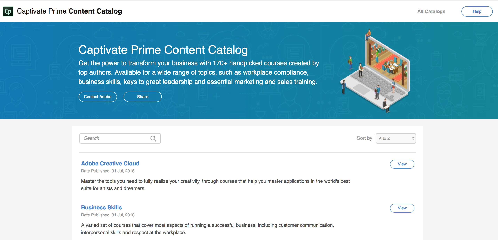

# Learning Manager內容目錄

<!--Learning Manager introduces Content Catalog-->

Learning Manager的Azure執行個體不支援內容目錄。

* **課程** 是指將特定主題上的工作和電子學習模組進行單一整合，這些模組是使用AdobeLearning Manager建立並提供給客戶的。
* **內容貢獻者** 是課程的專屬擁有者，已授權Adobe在Adobe Learning Manager上展示和轉授此類課程。

Learning Manager匯入了內容目錄，這是一組可供您購買的可立即使用的內容庫。 您可以購買現成的課程，例如商務技能、工作場所合規性、AdobeCreative Cloud和策劃的內容市場中的技術課程。

在左窗格中，按一下「內容市集」，然後按一下 **[!UICONTROL Creative Cloud Training]**.

<!---->

若要檢視每個目錄中的目錄詳細資訊和課程，請按一下 **[!UICONTROL View]**. 新視窗會顯示所有課程。

<!---->

若要檢視課程的詳細資訊，請按一下 **[!UICONTROL Visit]**. 使用核取方塊選取您感興趣的課程。

* 您可以選取「 」，將選取的課程與同業分享  **[!UICONTROL Share]**.
* 您可以選取「 」以聯絡Adobe  **[!UICONTROL Contact Adobe]**.

<!---->

您的電子郵件使用者端預設會在這兩個執行個體中開啟。 如果您已使用核取方塊選取特定課程，則會自動將其URL新增至電子郵件內文。

如果您的電子郵件使用者端預設為未開啟，您可以透過電子郵件將您的興趣傳送至 `learningmanagercontentcontentadmin@adobe.com`.

您必須登入Learning Manager才能存取內容目錄。
