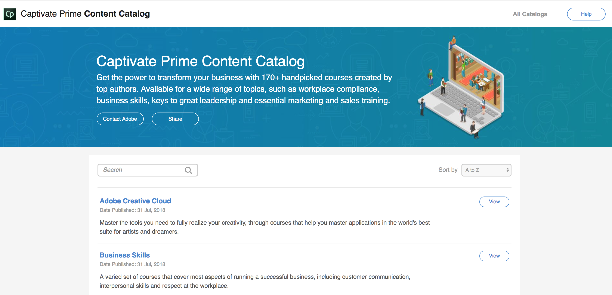

# 學習經理內容目錄

<!--Learning Manager introduces Content Catalog-->

Azure 的 Learning Manager 實例中不支援內容目錄。

* **課程** 是指針對特定主題的單一工作與電子學習模組整合，並透過Adobe Learning Manager提供給客戶。
* **內容貢獻者** 是課程的專有擁有者，授權 Adobe 在 Adobe Learning Manager 上展示及再授權這些課程。

Learning Manager 引入了內容目錄，這是一套你可以購買的現成型內容庫。 你可以在我們精心策劃的內容市集購買現成課程，如商業技能、職場合規、Adobe 創意雲端及科技課程。

在左側窗格，點選內容市集，然後點選 **[!UICONTROL Creative Cloud Training]**。

<!---->

欲查看各課程目錄中的詳細資料與課程，請點擊 **[!UICONTROL View]**。 新視窗顯示所有賽道。

<!---->

欲查看課程詳情，請點擊 **[!UICONTROL Visit]**。 請使用勾選框選擇你感興趣的課程。

* 您可以選擇  **[!UICONTROL Share]**&#x200B;與同儕分享所選課程。
* 您可以選擇  **[!UICONTROL Contact Adobe]** Adobe。

<!---->

你的電子郵件客戶端在兩種情況下預設都是開啟的。 如果你透過勾選框選擇了特定課程，這些課程的網址會自動加入電子郵件內容。

如果您的電子郵件客戶端預設無法開啟，您可以將您的興趣寄信至 `learningmanagercontentcontentadmin@adobe.com`。

你必須登入學習管理員才能存取內容目錄。
