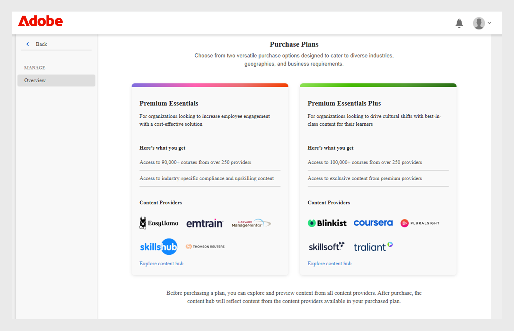
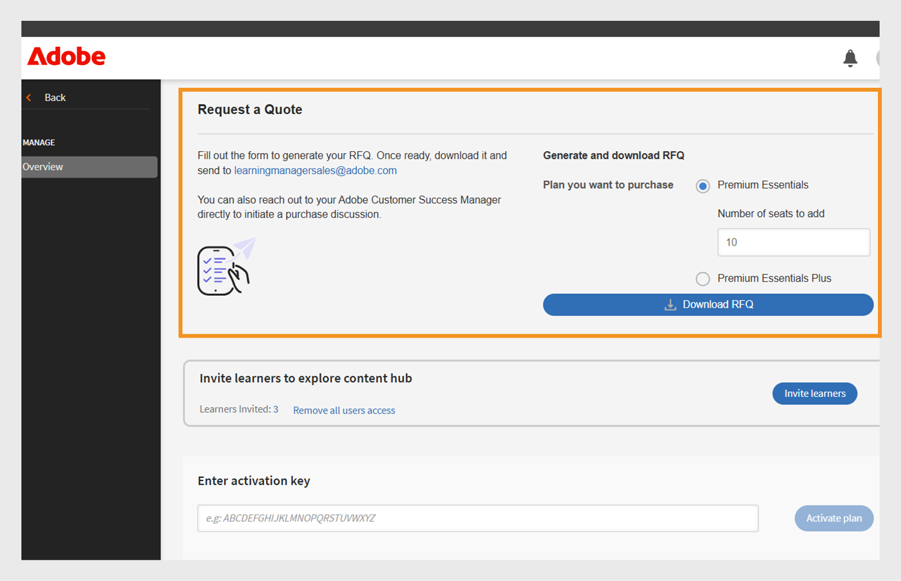
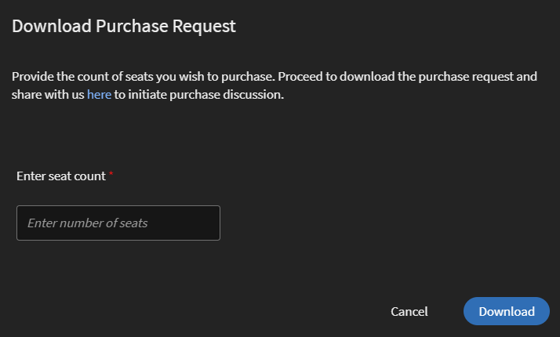
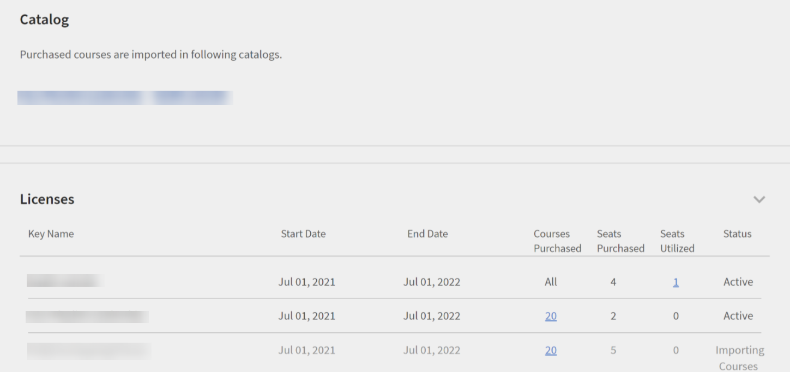
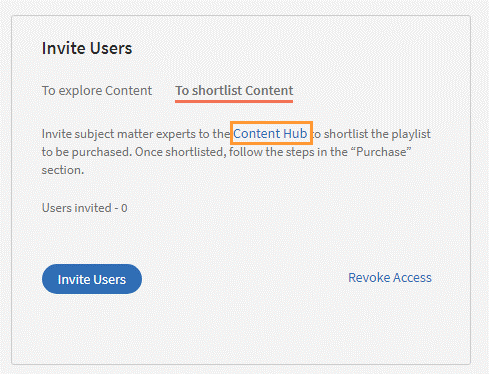
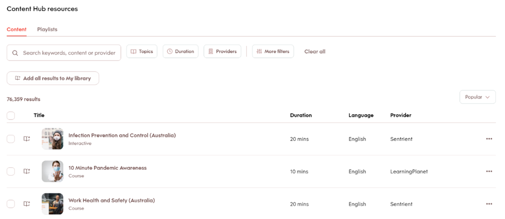
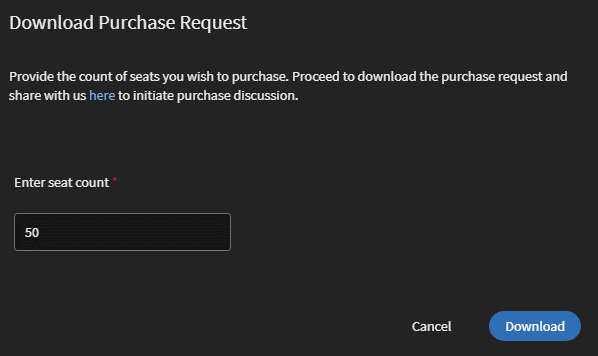

# 內容市集

學習管理員經常面臨外包和上傳高品質內容的挑戰。 Adobe Learning Manager中的內容市集透過允許由信任的提供者授權付費課程來簡化這項作業，實現更快速、可擴充的學習傳遞。 使用Content Marketplace，管理員可以瀏覽、預覽和授權提供者的協力廠商課程。

「內容市集」提供下列獲取內容的計畫：

* **[!UICONTROL Premium Essentials]**
* **[!UICONTROL Premium Essentials Plus]**

| **[!UICONTROL Premium Essentials]** | **[!UICONTROL Premium Essentials Plus]** |
|---|---|
| 存取超過90,000門課程 | 存取超過100,000門課程 |
| 來自250多家提供者的內容 | 包含所有Premium Essentials內容 |
| 來自受信任提供者的專屬內容，例如：<li>依拉瑪</li><li>Skillshub</li><li>湯森路透集團</li><li>啟用</li><li>Harvard ManageMentor</li> | 頂級提供者的專屬課程，例如： <li>閃爍</li><li>Pluralsight</li>Skillsoft</li><li>字元</li><li>Coursera</li> |

<!--**[!UICONTROL Premium Essentials]**:
A cost-effective solution designed to enhance employee engagement. 

* Access to over 90,000 courses
* Content from more than 250 providers
* Focus on compliance and skill improvement
* Exclusive content from trusted providers such as:
   * EasyLlama
   * Skillshub
   * Thomson Reuters
   * Emtrain
   * Harvard ManageMentor

**[!UICONTROL Premium Essentials Plus]**:

* Access to more than 100,000 courses
* Includes all Premium Essentials content
* Exclusive courses from top providers like:
   * Blinkist
   * Pluralsight
   * Skillsoft
   * Traliant
   * Coursera

Select the plan that best meets your organization's learning goals and budget.-->

## 從提供者取得內容

若要瀏覽並取得內容提供者的內容，請遵循下列步驟：

1. 從管理員首頁中選取&#x200B;**[!UICONTROL Content Marketplace]**。 **[!UICONTROL Content Marketplace]**&#x200B;頁面隨即顯示。

   
   _在內容市集頁面上檢視購買計畫_

2. 管理員可以預覽和探索&#x200B;**[!UICONTROL Premium Essentials]**&#x200B;和&#x200B;**[!UICONTROL Premium Essentials Plus]**&#x200B;計畫的Content Hub。

內容提供者可管理過時內容的移除作業，確保不會在未事先通知的情況下將任何學習資料終止服務。

<!--Learning Manager now offers Content Marketplace for you to explore and purchase trainings. Explore 70,000+ courses that cover a wide range of topics, available in multiple formats. Choose from curated playlists that cater to a vast variety of roles and meet your learning and upskilling needs.

In the Administrator app, there is a new option **[!UICONTROL Content Marketplace]**, which you'll find on the left panel.

Users can purchase from curated playlists covering various topics or purchase the entire catalog. 

On the page, you can see two tiles, Enterprise Training and Creative Cloud Training. The first tile launches the marketplace, using which you can acquire courses for your learners. The latter launches the content catalog.

The Enterprise Training page in the Administrator app enables you to invite users and download the Express Interest report, and also purchase the entire catalog or curated playlist.-->

## 要求報價

管理員可以選取計畫，例如Premium Essentials或Premium Essentials Plus，指定所需的名額數，並產生可下載的「報價請求」表單。 完成後，此表單會傳送給Adobe Learning Manager銷售團隊處理。 「報價請求」流程也可讓Adobe根據組織的需求提供自訂的定價。

若要下載詢價，請遵循下列步驟：

1. 從管理員首頁中選取&#x200B;**[!UICONTROL Content Marketplace]**。

2. 選取授權型別，並在&#x200B;**[!UICONTROL Request a Quote]**&#x200B;區段中鍵入要產生報價的座位數。

3. 選取&#x200B;**[!UICONTROL Download RFQ]**&#x200B;以下載報價。

_選擇計畫後下載詢價單_

將報價傳送至[learningmanagersales@adobe.com](mailto:learningmanagersales@adobe.com)以啟用您的授權。 您也可以聯絡Adobe客戶成功案例經理，以便展開購買程式。

## 邀請學習者加入Content Hub

邀請學習者前往Content Marketplace探索內容並表達興趣。 身為管理員，您可以邀請帳戶中的所有學習者或邀請選取的學習者。 必須先邀請學習者，他們才能探索內容。 檢視[文章](/help/migrated/administrators/feature-summary/content-marketplace.md#content-hub)以取得Content Hub的相關資訊。

若要邀請學習者：

1. 從管理員首頁中選取&#x200B;**[!UICONTROL Content Marketplace]**。
2. 選取&#x200B;**[!UICONTROL Invite learners]**&#x200B;並選取必要的學習者。
3. 選取&#x200B;**[!UICONTROL Invite learners]**。

管理員也可以選取&#x200B;**[!UICONTROL Content Hub]**&#x200B;連結，以撤銷對&#x200B;**[!UICONTROL Remove all users access]**&#x200B;的存取權。 撤銷存取權後，學習者將無法再在其學習者應用程式中看到Content Hub頁面。

_邀請使用者存取Content Hub_

依預設，此選項會針對所有新帳戶啟用。 若為現有帳戶，管理員必須手動邀請學習者存取Content Marketplace。

<!--## Purchase

You get unlimited access to the entire library of courses. Click the **[!UICONTROL Purchase]** button to download a Purchase Request form.

*Enter the number of seats to purchase*

Specify the number of seats for which you want to purchase the courses for. Download the purchase request form and then send the form to the sales team of Learning Manager.

The team will then validate the information and then generate a key, which will be provided to you. This is the activation key using which you'll grant access to your users to the content offering.

After the key is generated by the CSAM team, the Administrator can use the key to import the courses, and migrate the courses into the existing catalog or the new catalog.

During migration of courses, the status displays as **[!UICONTROL Importing Courses]**. Once the migration completes, the Administrator gets a notification that migration is complete and successful.

The **[!UICONTROL Licenses]** section then displays all the licenses that are acquired for the account.

The Administrator can see the links of the purchased catalogs in the Catalog Overview page.

Once the courses are added to the catalog, the Administrator can then grant access to the trainings to various user or user groups.

*Grant access to training to users and user groups*-->

<!--## Express interest report

When a learner clicks Express interest to Catalog in the Learner app, the interest is recorded in an Express interest report. The Administrator can download the report. The report (csv) contains the following fields:

* Name of the catalog
* Number of users expressing interest
* Email of the user expressing interest-->

## Content Hub

管理員可以直接在Adobe Learning Manager中存取Go1平台。 前往&#x200B;**[!UICONTROL Content Marketplace]**，然後選取&#x200B;**[!UICONTROL Content Hub]**。

Content Hub會複製Go1平台，讓管理員可瀏覽課程、建立多個播放清單及探索內容，在Adobe Learning Manager中提供順暢的Go1體驗。

## 電子郵件範本

Adobe Learning Manager提供預先設定的電子郵件範本，通知管理員和學習者內容購買、系統更新和學習活動。

您可使用三個電子郵件範本：

1. **[!UICONTROL Content Activation Successful]：**&#x200B;在成功購買協力廠商內容後傳送給管理員。 此通知會確認啟動已完成，且系統中現在提供購買的內容供學習者指派。
2. **[!UICONTROL Automated User Upload Failure]：**&#x200B;當透過CSV自動匯入使用者失敗時觸發。 此警示可協助管理員快速識別排程使用者更新中的問題，以便採取修正動作。
3. **[!UICONTROL Invite Users to Explore Content]：**&#x200B;管理員從市集購買內容後，會傳送給學習者的邀請電子郵件。 之後，使用者可以立即開始其學習歷程。

<!--Purchased courses cannot be added in recurring certificates.
Purchased courses cannot be shared to peer accounts.
Purchased courses can be consumed by all users who get access to it. Configure the catalog visibility to restrict the visibility of purchased courses to limited users.
Purchased courses cannot be consumed once the activation key expires. Please purchase/activate another key to allow consumption.-->

<!--## Content Hub in Content Marketplace

Content Hub allows Administrators and Subject Matter Experts (SMEs) to shortlist required playlists from learner app. Once shortlisted, Admins can download the Purchase Request Form and share it with the Adobe Sales agent.

An Admin can invite SMEs to shortlist the playlist which they are interested in. 

*Launch Content Hub from the marketplace*

Content Hub is available in Learner role for all Administrators. Administrators allow SMEs to shortlist the playlist which they are interested in purchasing.

The Content Hub page is visible to Administrators in their learner role all the time as it allows them to shortlist playlists easily. To help you in shortlisting the right playlist, Admins can make this page accessible to limited Subject matter experts in their account. Just visit the Enterprise Training page on Admin side and take steps to provide access.  

*View resources in the Content hub*

Learning Manager also enables Administrators to download a shortlisted playlist and share it with Adobe Sales team. Before downloading the shortlist, visit the Content Hub and shortlist a playlist by adding a playlist to your library. 

Then as Administrator, click **[!UICONTROL Content Marketplace]** > **[!UICONTROL Enterprise Training]** > **[!UICONTROL Purchase section]** > **[!UICONTROL Curated Playlists]**. Click the **[!UICONTROL Purchase]** button to download the Purchase request form which contains the details of your shortlisted playlist.

*Download the Purchase Request form*

The courses and Playlist which you see in the Content Hub are the same as what you see in the Content Marketplace. Content Hub simply provides an ability for Administrators and limited SMEs to shortlist playlist easily for purchase.-->
