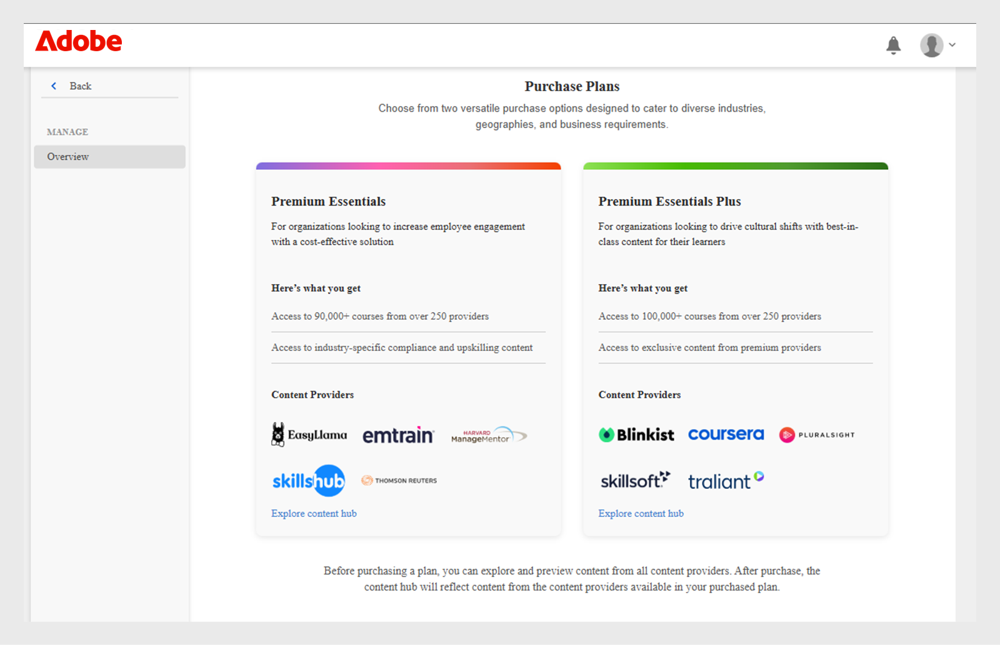
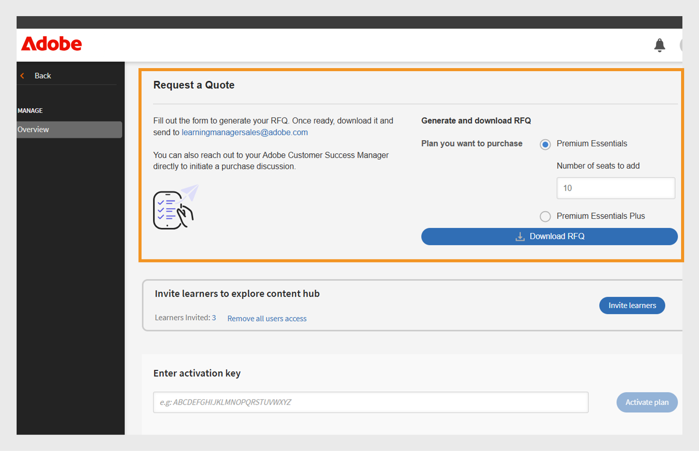
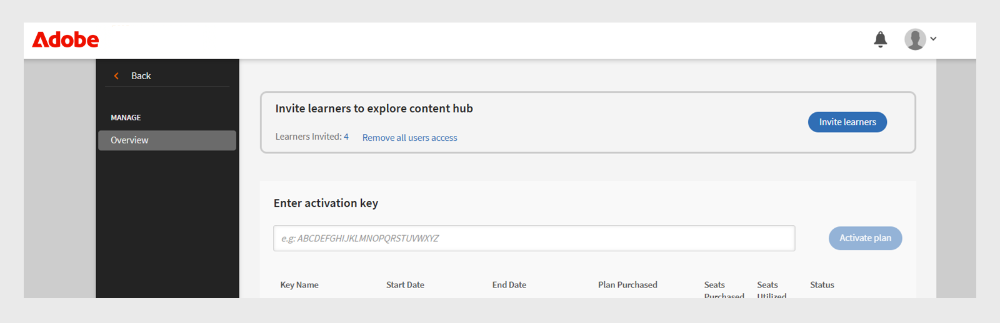
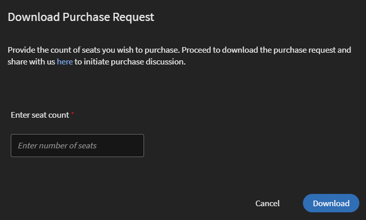
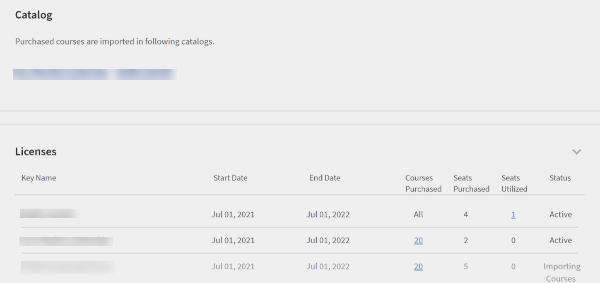
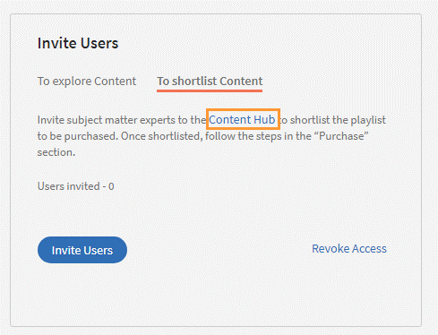
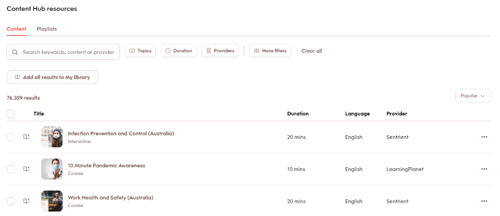
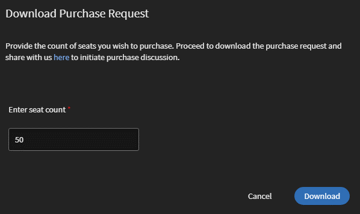

# 內容市集

學習管理員經常面臨尋找與上傳高品質內容的挑戰。 Adobe Learning Manager 的內容市集透過允許從可信賴的供應商授權優質課程，簡化此過程，實現更快速且可擴展的學習交付。 透過內容市集，管理員可以瀏覽、預覽並從供應商那裡取得廣告授權的第三方課程。

內容市場提供以下內容獲取方案：

* **[!UICONTROL Premium Essentials]**
* **[!UICONTROL Premium Essentials Plus]**

| **[!UICONTROL Premium Essentials]** | **[!UICONTROL Premium Essentials Plus]** |
|---|---|
| 超過90,000門課程的存取權 | 超過10萬門課程的存取 |
| 來自超過 250 家供應商的內容 | 包含所有 Premium Essentials 內容 |
| 來自可信賴供應商的獨家內容，例如：<li>EasyLlama</li><li>技能中心</li><li>湯森路透</li><li>Emtrain</li><li>哈佛管理導師</li> | 來自頂尖供應商的獨家課程，例如： <li>閃爍者</li><li>複數視覺</li>Skillsoft</li><li>特拉利安特</li><li>Coursera</li> |

<!--
**[!UICONTROL Premium Essentials]**:
A cost-effective solution designed to enhance employee engagement. 

* Access to over 90,000 courses
* Content from more than 250 providers
* Focus on compliance and skill improvement
* Exclusive content from trusted providers such as:
   * EasyLlama
   * Skillshub
   * Thomson Reuters
   * Emtrain
   * Harvard ManageMentor

**[!UICONTROL Premium Essentials Plus]**:

* Access to more than 100,000 courses
* Includes all Premium Essentials content
* Exclusive courses from top providers like:
   * Blinkist
   * Pluralsight
   * Skillsoft
   * Traliant
   * Coursera

Select the plan that best meets your organization's learning goals and budget.
-->

## 從供應商獲取內容

要瀏覽並取得內容提供者的內容，請遵循以下步驟：

1. 請從管理員首頁選擇 **[!UICONTROL Content Marketplace]** 。 **[!UICONTROL Content Marketplace]**&#x200B;頁面出現了。

   
   _請在內容市集頁面查看購買計畫_

2. 管理員可以預覽並探索內容中心的兩項&#x200B;**[!UICONTROL Premium Essentials]**&#x200B;**[!UICONTROL Premium Essentials Plus]**&#x200B;計畫。

內容提供者負責移除過時內容，確保沒有學習材料在未經通知的情況下被停用。

<!--
Learning Manager now offers Content Marketplace for you to explore and purchase trainings. Explore 70,000+ courses that cover a wide range of topics, available in multiple formats. Choose from curated playlists that cater to a vast variety of roles and meet your learning and upskilling needs.

In the Administrator app, there is a new option **[!UICONTROL Content Marketplace]**, which you'll find on the left panel.

Users can purchase from curated playlists covering various topics or purchase the entire catalog. 

On the page, you can see two tiles, Enterprise Training and Creative Cloud Training. The first tile launches the marketplace, using which you can acquire courses for your learners. The latter launches the content catalog.

The Enterprise Training page in the Administrator app enables you to invite users and download the Express Interest report, and also purchase the entire catalog or curated playlist.
-->

## 請索取報價

管理員可以選擇方案，如 Premium Essentials 或 Premium Essentials Plus，指定所需座位數，並產生可下載的報價請求表單。 完成後，表單會送交 Adobe Learning Manager 銷售團隊處理。 報價請求流程也讓 Adobe 能根據組織需求提供客製化價格。

要下載徵求意見書，請依照以下步驟操作：

1. 從管理員首頁選擇。**[!UICONTROL Content Marketplace]**

2. 選擇駕照類型並輸入座位數，即可在該 **[!UICONTROL Request a Quote]** 區段產生報價。

3. 選擇 **[!UICONTROL Download RFQ]** 下載報價。

_選擇方案後下載RFQ_

把報價寄給 [learningmanagersales@adobe.com](mailto:learningmanagersales@adobe.com) 以啟用你的駕照。 您也可以聯絡您的 Adobe 客戶成功經理，開始購買流程。

## 邀請學習者加入內容中心

邀請學習者到內容市集探索內容並表達興趣。 作為管理員，你可以邀請帳號中的所有學習者，或邀請指定的學習者。 學習者必須先被邀請，才能探索內容。 請參閱 [文章](/help/migrated/administrators/feature-summary/content-marketplace.md#content-hub) 以獲取更多關於 Content Hub 的資訊。

邀請學習者：

1. 從管理員首頁選擇。**[!UICONTROL Content Marketplace]**
2. 選擇 **[!UICONTROL Invite learners]** 並挑選所需的學習者。
3. 選擇 **[!UICONTROL Invite learners]**。

管理員也可以透過選擇連結&#x200B;**[!UICONTROL Remove all users access]**&#x200B;來撤銷存取權限&#x200B;**[!UICONTROL Content Hub]**。一旦存取權限被撤銷，學習者將不再在學習者應用程式中看到內容中心頁面。

_邀請使用者存取內容中心_

預設情況下，所有新帳號都會啟用此選項。 對於現有帳號，管理員必須手動邀請學習者進入內容市集。

<!--
## Purchase

You get unlimited access to the entire library of courses. Click the **[!UICONTROL Purchase]** button to download a Purchase Request form.

*Enter the number of seats to purchase*

Specify the number of seats for which you want to purchase the courses for. Download the purchase request form and then send the form to the sales team of Learning Manager.

The team will then validate the information and then generate a key, which will be provided to you. This is the activation key using which you'll grant access to your users to the content offering.

After the key is generated by the CSAM team, the Administrator can use the key to import the courses, and migrate the courses into the existing catalog or the new catalog.

During migration of courses, the status displays as **[!UICONTROL Importing Courses]**. Once the migration completes, the Administrator gets a notification that migration is complete and successful.

The **[!UICONTROL Licenses]** section then displays all the licenses that are acquired for the account.

The Administrator can see the links of the purchased catalogs in the Catalog Overview page.

Once the courses are added to the catalog, the Administrator can then grant access to the trainings to various user or user groups.

*Grant access to training to users and user groups*
-->

<!--
## Express interest report

When a learner clicks Express interest to Catalog in the Learner app, the interest is recorded in an Express interest report. The Administrator can download the report. The report (csv) contains the following fields:

* Name of the catalog
* Number of users expressing interest
* Email of the user expressing interest
-->

## 內容中心

管理員可直接在 Adobe Learning Manager 中存取 Go1 平台。 前往 ， **[!UICONTROL Content Marketplace]** 然後選擇 **[!UICONTROL Content Hub]**。

內容中心複製了 Go1 平台，讓管理員能瀏覽課程、建立多個播放清單並探索內容，在 Adobe Learning Manager 中提供無縫的 Go1 體驗。

## 電子郵件範本

Adobe Learning Manager 提供預先設定的電子郵件範本，通知管理員和學習者有關內容購買、系統更新及學習活動的資訊。

你可以使用三種電子郵件範本：

1. **[!UICONTROL Content Activation Successful]：** 在成功購買第三方內容後發送給管理員。 此通知確認啟動完成，且已購買的內容現已在系統中可供學習者指派。
2. **[!UICONTROL Automated User Upload Failure]：** 當透過 CSV 自動匯入用戶匯入失敗時觸發。 此警示幫助管理員快速識別排程使用者更新中的問題，從而採取糾正措施。
3. **[!UICONTROL Invite Users to Explore Content]：** 一封邀請郵件，管理員在購買市場內容後會發送給學習者。 之後，使用者即可立即開始學習旅程。

<!--
Purchased courses cannot be added in recurring certificates.
Purchased courses cannot be shared to peer accounts.
Purchased courses can be consumed by all users who get access to it. Configure the catalog visibility to restrict the visibility of purchased courses to limited users.
Purchased courses cannot be consumed once the activation key expires. Please purchase/activate another key to allow consumption.
-->

<!--
## Content Hub in Content Marketplace

Content Hub allows Administrators and Subject Matter Experts (SMEs) to shortlist required playlists from learner app. Once shortlisted, Admins can download the Purchase Request Form and share it with the Adobe Sales agent.

An Admin can invite SMEs to shortlist the playlist which they are interested in. 

*Launch Content Hub from the marketplace*

Content Hub is available in Learner role for all Administrators. Administrators allow SMEs to shortlist the playlist which they are interested in purchasing.

The Content Hub page is visible to Administrators in their learner role all the time as it allows them to shortlist playlists easily. To help you in shortlisting the right playlist, Admins can make this page accessible to limited Subject matter experts in their account. Just visit the Enterprise Training page on Admin side and take steps to provide access.  

*View resources in the Content hub*

Learning Manager also enables Administrators to download a shortlisted playlist and share it with Adobe Sales team. Before downloading the shortlist, visit the Content Hub and shortlist a playlist by adding a playlist to your library. 

Then as Administrator, click **[!UICONTROL Content Marketplace]** > **[!UICONTROL Enterprise Training]** > **[!UICONTROL Purchase section]** > **[!UICONTROL Curated Playlists]**. Click the **[!UICONTROL Purchase]** button to download the Purchase request form which contains the details of your shortlisted playlist.

*Download the Purchase Request form*

The courses and Playlist which you see in the Content Hub are the same as what you see in the Content Marketplace. Content Hub simply provides an ability for Administrators and limited SMEs to shortlist playlist easily for purchase.
-->
