# 組織Go1課程至學習路徑

管理員通常需要從多個存放庫或目錄策劃課程，因此很難找出最佳選項。 這對Go1來說尤其具有挑戰性，因為有數千個課程可供使用。 為簡化這項作業，我們直接在學習路徑建立流程中提供AI支援的組織功能。 這可幫助管理員快速探索並選取最相關的課程

直接將Go1課程新增至學習路徑與認證。 建立包含Go1課程的學習路徑，讓學習者能夠存取選取的Go1課程作為培訓的一部分。

>[!INFO]
>
>您需要有效的Go1授權，才能將Go1課程新增至學習路徑或認證。 檢視此[文章](/help/migrated/administrators/feature-summary/content-marketplace.md)以進一步瞭解Go1授權詳細資料。

## 建立學習路徑

若要使用Go1課程建立學習路徑：

1. 以管理員身分登入Adobe Learning Manager。
2. 在左側導覽窗格中選取&#x200B;**[!UICONTROL Learning Paths]**。
3. 選取&#x200B;**[!UICONTROL Add]**。

   
   _選取「學習路徑」區段中的「新增」，為學習者建立及組織新的結構化訓練計畫_

4. 輸入必要的詳細資料，並選取&#x200B;**[!UICONTROL Save]**。 檢視此[文章](/help/migrated/administrators/feature-summary/learning-paths.md)以取得詳細資訊。
5. 您可以透過下列方式將課程新增至學習路徑：

   * **[!UICONTROL Add Courses or Learning Paths]**：新增Adobe Learning Manager中可用的現有課程或學習路徑。
   * **[!UICONTROL Curate content from Go1]**：從Go1平台新增課程。
6. 選取&#x200B;**[!UICONTROL Curate content from Go1]**。

   
   _將Go1課程新增至您的銷售工程師技能發展播放清單，以透過精選的協力廠商內容擴充學習選項_
7. 管理員可透過下列方式建立播放清單：

   * 使用&#x200B;**[!UICONTROL Go1 AI Assistant]**。 檢視[Go1 AI助理](/help/migrated/administrators/feature-summary/content-marketplace/curate-go1-playlist.md#go1-ai-assistant)以取得詳細資訊。
   * 在&#x200B;**[!UICONTROL Library]**&#x200B;中，選取&#x200B;**[!UICONTROL Create playlist]**&#x200B;並從下列選項中選擇：
a. **[!UICONTROL with AI]**：藉助AI建立播放清單。 如需詳細資訊，請檢視此[區段](/help/migrated/administrators/feature-summary/content-marketplace/curate-go1-playlist.md#create-a-playlist-with-ai)。
b. **[!UICONTROL by myself]**：手動新增課程以建立播放清單。 如需詳細資訊，請檢視此[區段](/help/migrated/administrators/feature-summary/content-marketplace//curate-go1-playlist.md#create-a-playlist-manually)。

### Go1 AI助理

Adobe Learning Manager提供AI支援的協助，讓管理員更容易策劃課程。 透過Content Hub頁面上提供的AI助理，管理員可以提出問題、獲得個人化建議，並立即建立播放清單。 此外，AI支援已整合至學習路徑建立流程，協助管理員從大型目錄（例如Go1）中快速找出最相關的課程。 這些功能可簡化組織流程、節省時間，並確保學習者獲得最佳內容。

若要使用AI建立播放清單：

1. 在Go1 Content Hub上選取&#x200B;**[!UICONTROL Chat with AI]**&#x200B;選項。

   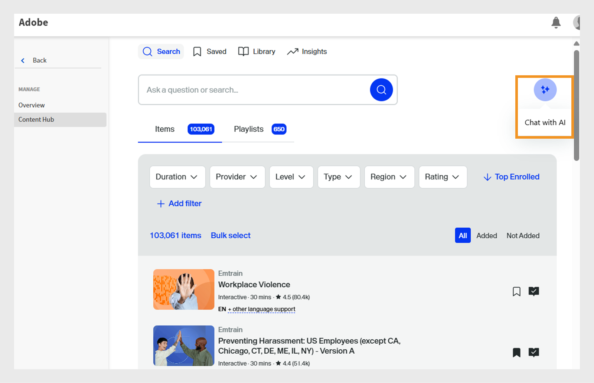
   _顯示[與AI聊天]選項的Content Hub畫面，管理員可在此與AI助理互動以提出問題_

2. 輸入問題並選取&#x200B;**[!UICONTROL Send]**。

   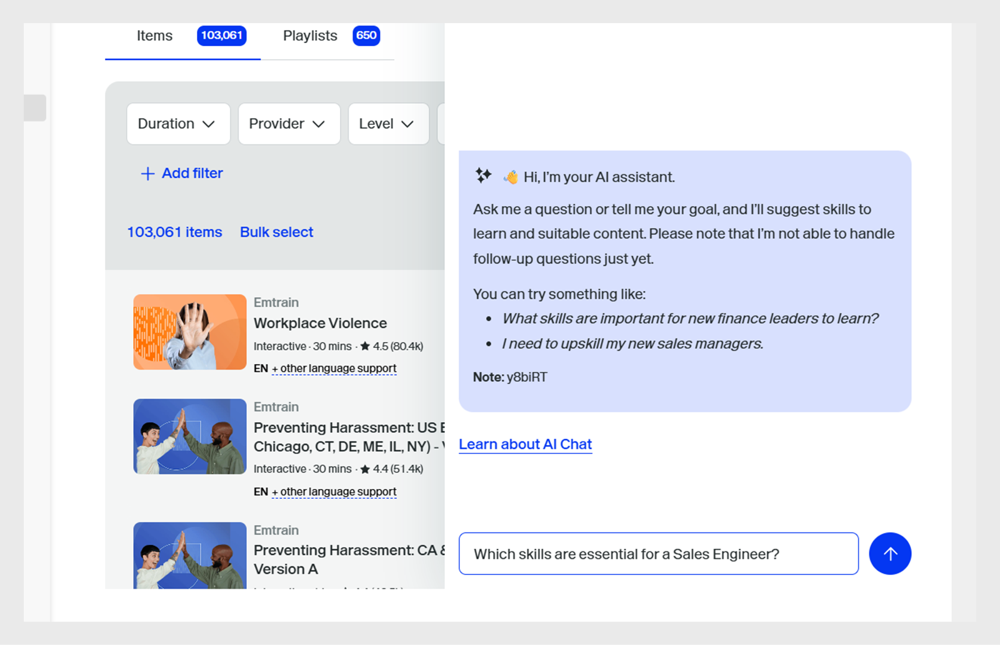
   _AI Assistant熒幕，管理員可在此輸入問題、取得課程建議，並立即建立符合其需求的播放清單_
3. 選取技能，然後選取&#x200B;**[!UICONTROL Compile into one list]**。

   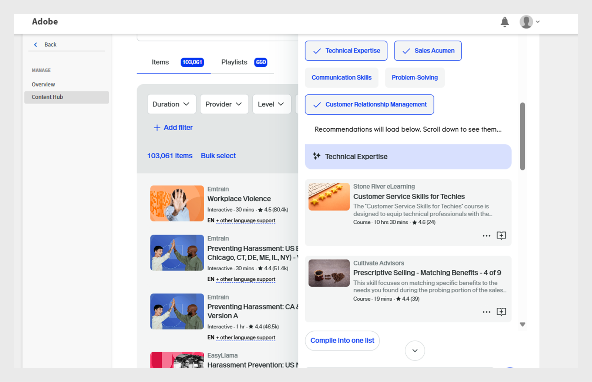
   _AI小幫手畫面，顯示選取並編譯成播放清單的相關技能_
4. 選取&#x200B;**[!UICONTROL Convert to Playlist]**。

   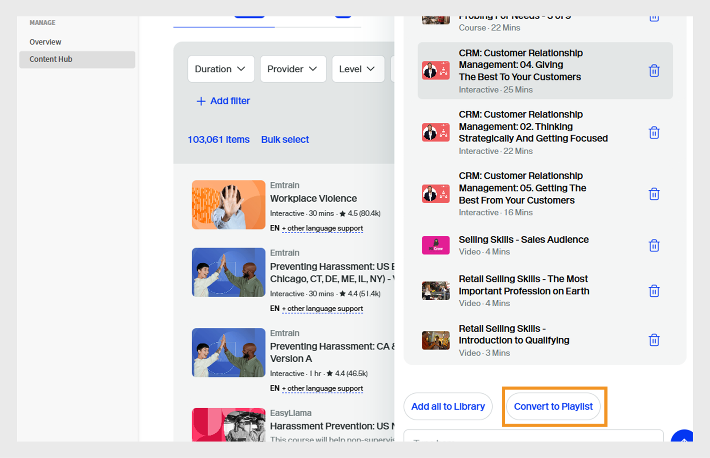
   _AI助理畫面顯示[轉換為播放清單]選項，可將所有課程編譯成播放清單_

5. 選取&#x200B;**[!UICONTROL View Playlist]**。

   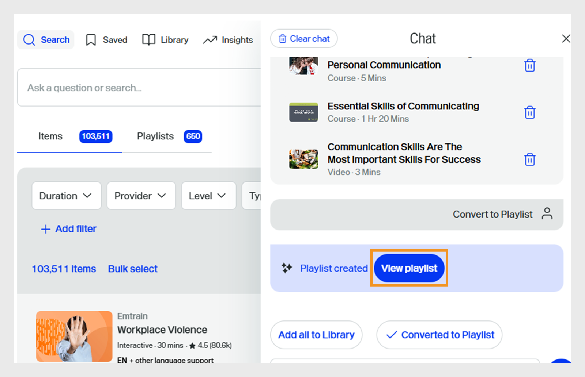
   _AI助理畫面顯示[檢視播放清單]選項，以發佈並匯入播放清單至學習路徑_

6. 選取&#x200B;**[!UICONTROL Publish]**&#x200B;以建立播放清單。 您可以在Go1中建立其他播放清單，並將其新增至學習路徑。
7. 在確認提示中選取&#x200B;**是**。
8. 從&#x200B;**[!UICONTROL Select playlist to import prompt]**&#x200B;選取播放清單。

   
   _從Adobe Learning Manager的Go1資料庫中選取並匯入銷售工程師技能增強播放清單_

9. 選取&#x200B;**[!UICONTROL Add Playlists to Learning Path]**，然後選取&#x200B;**[!UICONTROL Publish]**。

播放清單中的課程將新增至學習路徑。 管理員隨後可註冊學習者，這些學習者可以立即開始參加課程。

### 使用AI建立播放清單

管理員可以在AI提示中輸入播放清單說明。 AI將會組織相關課程，並根據需求建立播放清單。 AI透過解譯學習目標或使用者提供的提示來產生播放清單。 建立播放清單時，管理員可以選擇使用AI組織內容，讓系統使用大型語言模型來瞭解指定的學習目標和內容偏好設定，例如持續時間和型別。 然後，AI會在內容庫中搜尋符合這些條件的相關學習物件。

1. 選取&#x200B;**[!UICONTROL Create playlist]**，然後選取&#x200B;**[!UICONTROL with AI]**。

   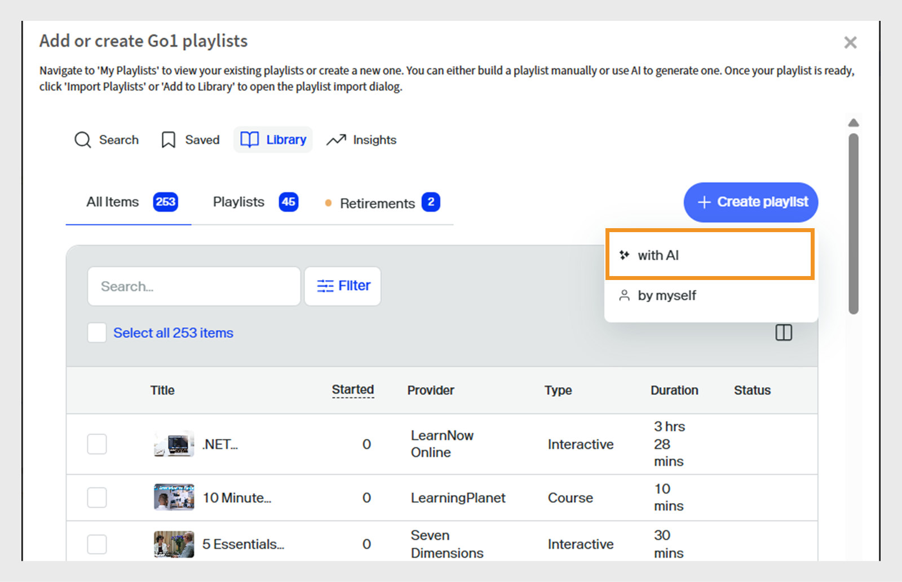
   _使用AI建立已組織的播放清單，如此可啟用根據學習者需求量身打造的自動化課程推薦_

2. 在&#x200B;**[!UICONTROL Enter your learning goal]**&#x200B;文字欄位中輸入有關播放清單的簡短說明。 例如，_建立銷售工程師的精選學習播放清單，著重於增強產品知識、技術通訊、客戶參與和解決方案銷售_。

   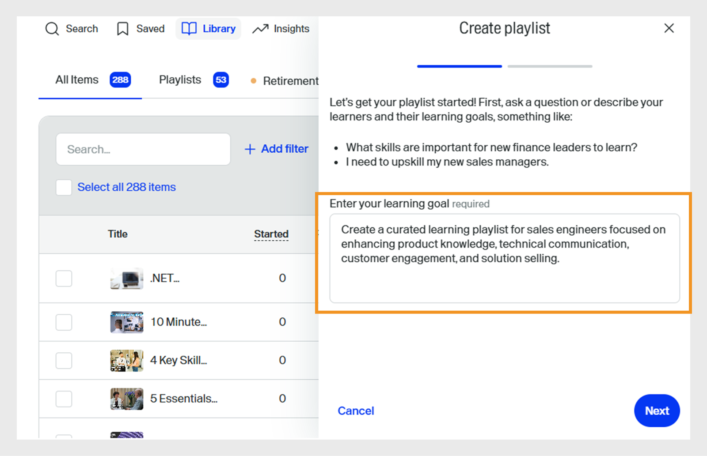
   _輸入您的學習目標以建立自訂播放清單，協助Adobe Learning Manager根據學習者的需求推薦目標課程_

3. 選取&#x200B;**[!UICONTROL Next]**。 提示會顯示選取所需的技能、課程持續時間及課程型別。
4. 選取所需技能。

   
   _從清單中選擇技能，為銷售工程師策劃課程_

5. 選取課程期間和播放清單型別。
   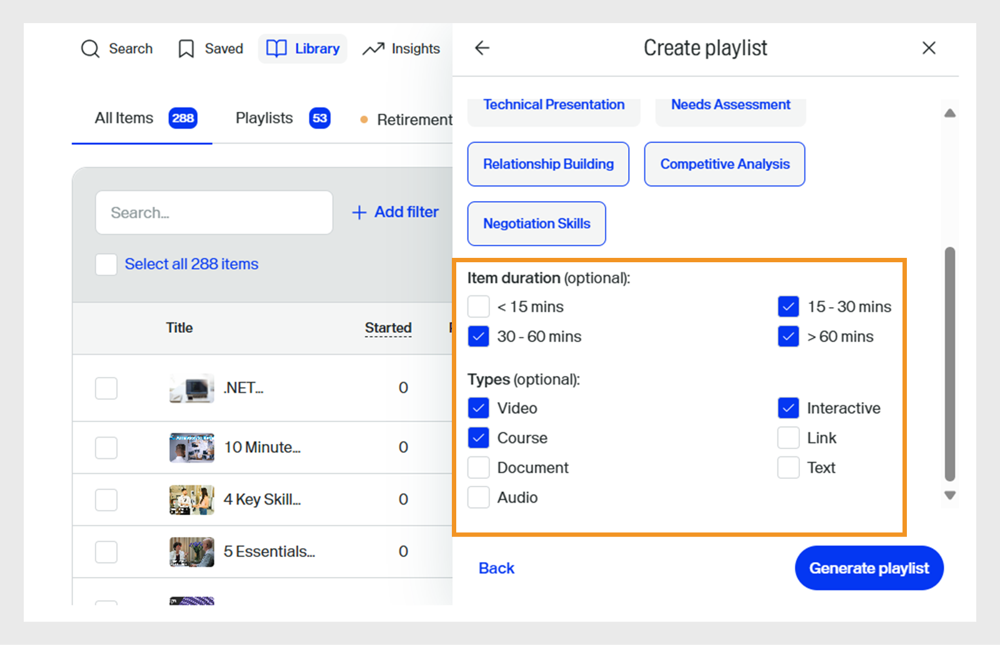
   _選擇要為銷售工程師策劃課程的期間和課程型別_

6. 選取&#x200B;**[!UICONTROL Generate playlist]**。 播放清單是以2個頁面上的10個課程所建立，管理員可使用此清單建立學習路徑。

   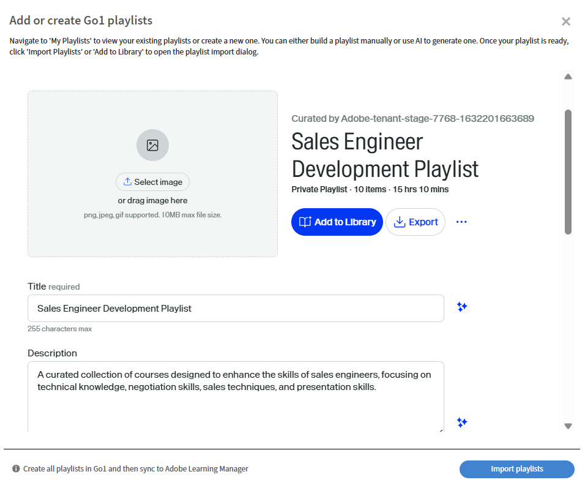
   _檢閱您在Adobe Learning Manager中策劃的銷售工程師技能增強播放清單_

7. 選取&#x200B;**[!UICONTROL Select Image]**，瀏覽並新增影像至播放清單。
8. 使用可用的AI選項變更標題：

   * **[!UICONTROL Improve writing]**：調整現有標題，使其更清楚。
   * **[!UICONTROL Generate title]**：根據內容或內容自動建立新標題。

   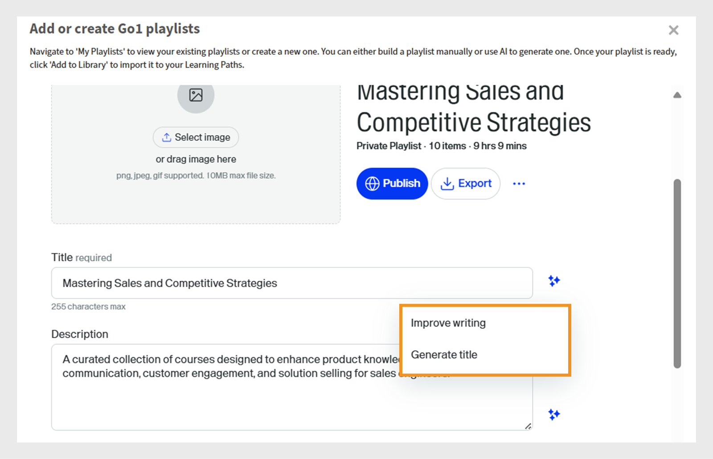
   _使用AI選項建立Go1播放清單畫面，以增強播放清單標題_

9. 使用可用的AI選項變更說明：
   * **[!UICONTROL Improve writing]**：調整現有的說明，使其更清楚。
   * **[!UICONTROL Generate description]**：根據內容或內容自動建立新描述。
   * **[!UICONTROL &#x200B; Make it shorter]**：縮短文字或標題，同時保留主要概念。

   
   _使用AI選項建立Go1播放清單畫面，以增強播放清單描述_

10. 選取&#x200B;**[!UICONTROL Add item]**&#x200B;以新增更多課程至播放清單。

11. 選取&#x200B;**[!UICONTROL Publish]**&#x200B;以建立播放清單。 您可以在Go1中建立其他播放清單，並將其新增至學習路徑。
12. 在確認提示中選取&#x200B;**是**。
13. 從&#x200B;**[!UICONTROL Select playlist to import prompt]**&#x200B;選取播放清單。

    
    _從Adobe Learning Manager的Go1資料庫中選取並匯入銷售工程師技能增強播放清單_

14. 選取&#x200B;**[!UICONTROL Add Playlists to Learning Path]**，然後選取&#x200B;**[!UICONTROL Publish]**。

播放清單中的課程將新增至學習路徑。 管理員隨後可註冊學習者，這些學習者可以立即開始參加課程。

>[!NOTE]
>
>管理員也可以直接從Content Hub頁面建立播放清單。 檢視[Content Hub](/help/migrated/administrators/feature-summary/content-marketplace.md#content-hub)以取得詳細資訊。

## 手動建立播放清單

手動選取最符合學習者需求的課程，並組織其他相關課程。

若要手動建立播放清單：

1. 選取&#x200B;**[!UICONTROL Create playlist]**，然後選取&#x200B;**[!UICONTROL by myself]**。

   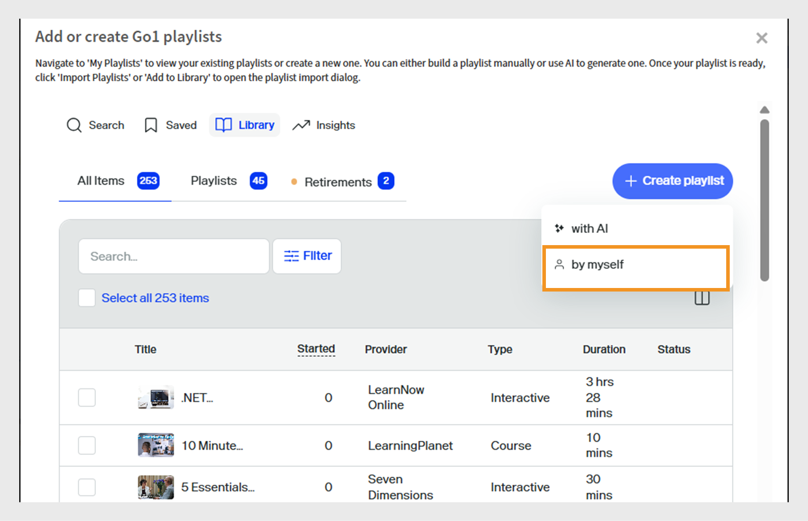
   _手動建立播放清單，讓管理員完全根據特定學習者需求策劃課程_

2. 選取&#x200B;**[!UICONTROL Select Image]**，瀏覽並新增影像至播放清單。
3. 輸入播放清單的標題和說明。

   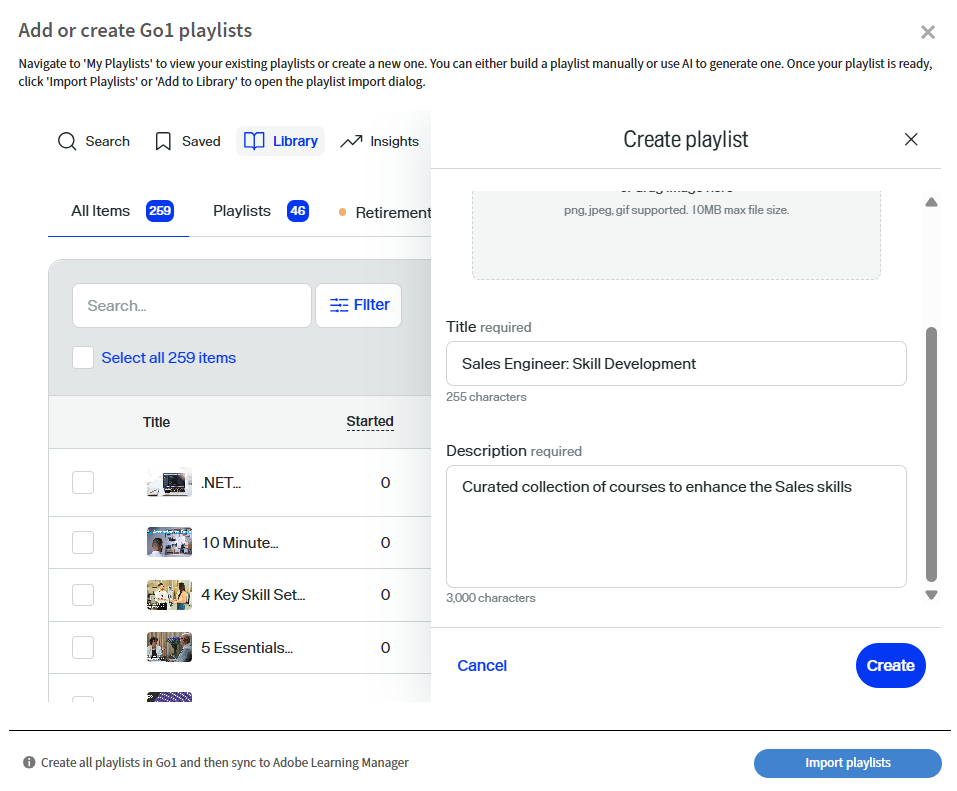
   _在Adobe Learning Manager中為您的播放清單新增標題和說明，以清楚定義其用途，並幫助引導學習者進行目標性的技能發展_

4. 選取&#x200B;**[!UICONTROL Create]**。
5. 選取&#x200B;**[!UICONTROL Add item]**&#x200B;以新增相關課程。

   
   _在Adobe Learning Manager中將專案新增至您的銷售工程師技能發展播放清單，以組織目標課程_

6. 搜尋並選取所需課程。
7. 選取&#x200B;**[!UICONTROL Publish]**。 已建立播放清單以及相關課程。
8. 在確認提示中選取&#x200B;**是**。
9. 從&#x200B;**[!UICONTROL Select playlist to import prompt]**&#x200B;選取播放清單。
10. 選取&#x200B;**[!UICONTROL Add Playlists to Learning Path]**，然後選取&#x200B;**[!UICONTROL Publish]**。

播放清單中的課程將新增至學習路徑。 管理員隨後可註冊學習者，這些學習者可以立即開始參加課程。

## 管理Go1播放清單

管理員可以管理已建立的Go1播放清單，方法是複製、共用或刪除它們。

### 復製播放清單

復製播放清單：

1. 以管理員身分登入Adobe Learning Manager。
2. 選取&#x200B;**[!UICONTROL Content Marketplace]**。
3. 選取&#x200B;**[!UICONTROL Content Hub]**，然後選取&#x200B;**[!UICONTROL Library]**。
4. 選取播放清單，然後選取&#x200B;**[!UICONTROL Edit]**。
   
   _Go1播放清單畫面顯示編輯播放清單的選項_
5. 選取省略符號，然後選取&#x200B;**[!UICONTROL Duplicate]**。
   
   _播放清單管理畫面，醒目提示[重複]選項_

選取的播放清單會複製並新增至Go1內容庫

### 刪除播放清單

若要刪除播放清單：

1. 以管理員身分登入Adobe Learning Manager。
2. 選取&#x200B;**[!UICONTROL Content Marketplace]**。
3. 選取&#x200B;**[!UICONTROL Content Hub]**，然後選取&#x200B;**[!UICONTROL Library]**。
4. 選取播放清單，然後選取&#x200B;**[!UICONTROL Edit]**。
   
   _Go1播放清單畫面顯示編輯播放清單的選項_
5. 選取省略符號，然後選取&#x200B;**[!UICONTROL Delete playlist]**。
   
   _播放清單管理畫面，醒目提示[刪除播放清單]選項_

選取的播放清單將會從Go1資料庫刪除。

### 共用播放清單

Go1與Adobe Learning Manager的整合不支援「共用播放清單」選項。 此選項將在下一個版本中從UI移除。

## 超過課程限制

將Go1課程新增至學習路徑時，如果新新增的課程尚未同步至Adobe Learning Manager，管理員可能會看到錯誤。 這些課程將在48到72小時內提供。

如果您現在新增播放清單，則只會包含已同步的課程。

若要包含所有課程，建議您將播放清單新增至學習路徑前先等到同步處理完成。

## 認證中的Go1課程

管理員可以在Adobe Learning Manager的認證方案中新增Go1課程。 建立認證時，管理員可以從Go1內容目錄中搜尋及選取課程。 所有透過Go1計畫匯入的Go1課程都可在認證工作流程中進行選擇。

包含Go1課程的認證可設定為永久或週期性。 若是循環認證，則認證會在定義的時間間隔後自動更新，讓學習者可重新參加Go1課程並保持其認證狀態。

檢視[認證](/help/migrated/administrators/feature-summary/certifications.md)以取得建立憑證的詳細資訊。
