# 策劃Go1課程，打造學習路徑

管理員經常需要從多個資料庫或目錄中策劃課程，這使得辨識最佳方案變得困難。 這在Go1上尤其具有挑戰性，因為有數千種課程可供選擇。 為了簡化流程，我們在學習路徑創建流程中直接提供 AI 驅動的策展功能。 這有助於管理員快速發現並選擇最相關的課程

直接將 Go1 課程加入學習路徑與認證課程。 建立包含 Go1 課程的學習路徑，讓學習者能在訓練中取得部分 Go1 課程。

>[!INFO]
>
>你需要持有有效的 Go1 執照，才能將 Go1 課程加入學習路徑或認證。 請參閱本文[&#128279;](/help/migrated/administrators/feature-summary/content-marketplace.md)以了解更多關於 Go1 授權細節的資訊。

## 建立學習路徑

要建立 Go1 課程的學習路徑：

1. 以管理員身份登入 **Adobe Learning Manager** 。
2. 在左側導覽窗格選擇 **[!UICONTROL Learning Paths]** 。
3. 選擇 **[!UICONTROL Add]**。

   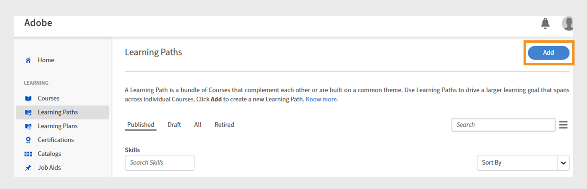
   _選擇「新增學習路徑」區塊，為學習者建立並組織新的結構化訓練課程_

4. 輸入所需資料並選擇 **[!UICONTROL Save]**。 欲了解更多資訊，請參閱本文[&#128279;](/help/migrated/administrators/feature-summary/learning-paths.md)。
5. 你可以透過以下方式將課程加入學習路徑：

   * **[!UICONTROL Add Courses or Learning Paths]**： 新增 Adobe Learning Manager 中現有的課程或學習路徑。
   * **[!UICONTROL Curate content from Go1]**：從 Go1 平台新增課程。
6. 選擇 **[!UICONTROL Curate content from Go1]**。

   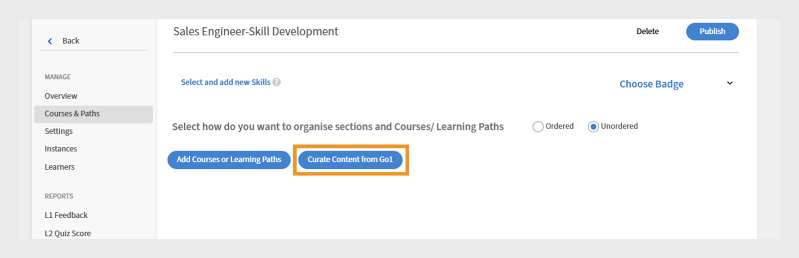
   _將 Go1 課程加入您的銷售工程師技能發展播放清單，透過精選第三方內容擴展學習選項_
7. 管理員可以透過以下方式建立播放清單：

   * 使用 **[!UICONTROL Go1 AI Assistant]**。 欲了解更多資訊，請參閱 [Go1 AI 助理](/help/migrated/administrators/feature-summary/content-marketplace/curate-go1-playlist.md#go1-ai-assistant) 。
   * 在 **[!UICONTROL Library]**&#x200B;中，選擇 **[!UICONTROL Create playlist]** 並從以下之一中選擇：a. **[!UICONTROL with AI]**：在 AI 協助下建立播放清單。 請參閱本 [節](/help/migrated/administrators/feature-summary/content-marketplace/curate-go1-playlist.md#create-a-playlist-with-ai) 以獲取更多資訊。
     b. **[!UICONTROL by myself]**： 手動新增課程來建立播放清單。 請參閱本 [節](/help/migrated/administrators/feature-summary/content-marketplace//curate-go1-playlist.md#create-a-playlist-manually) 以獲取更多資訊。

### Go1 AI 助理

Adobe Learning Manager 提供 AI 驅動的協助，讓管理員更容易策劃課程。 透過內容中心頁面上的 AI 助理，管理員可以提問、獲得個人化推薦，並即時建立播放清單。 此外，AI 支援整合進學習路徑創建流程，幫助管理員快速從大型目錄如 Go1 中找出最相關的課程。 這些功能簡化了策展流程，節省時間，並確保學習者獲得最佳內容。

要用 AI 建立播放清單：

1. 在 Go1 內容中心&#x200B;**選擇&#x200B;**&#x200B;[!UICONTROL Chat with AI]&#x200B;**選項**。

   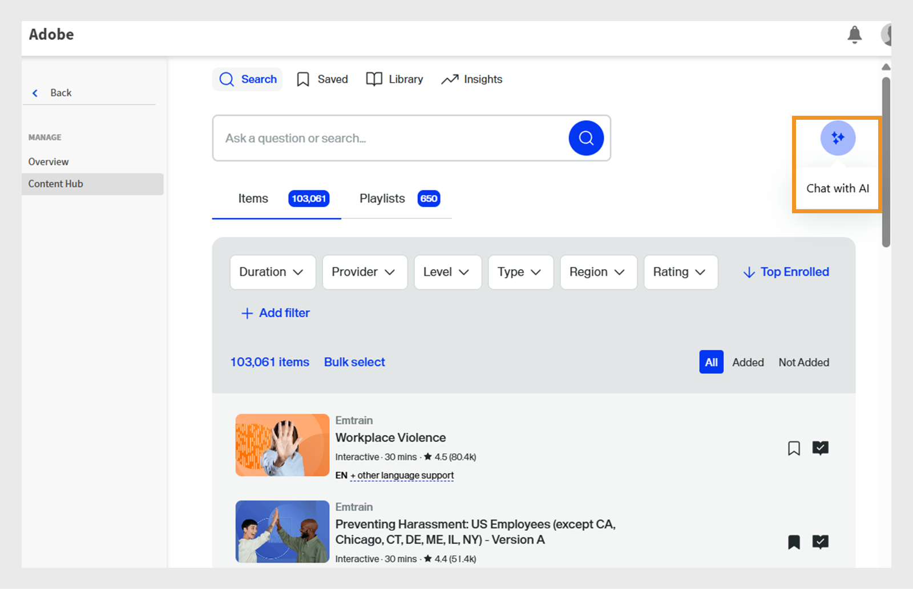
   _內容中心畫面顯示「與 AI 聊天」選項，管理員可與 AI 助理互動提問_

2. 輸入問題並選擇 **[!UICONTROL Send]**。

   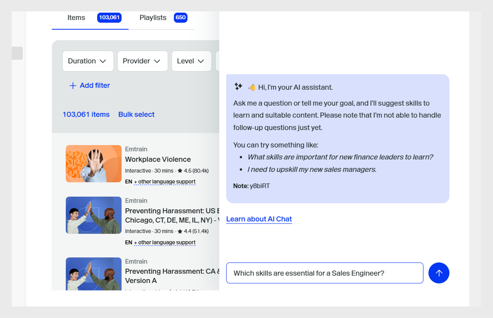
   _AI 助理畫面，管理員可以在那裡輸入問題、獲得課程推薦，並即時建立符合需求的播放清單_
3. 選擇技能，然後選擇 **[!UICONTROL Compile into one list]**。

   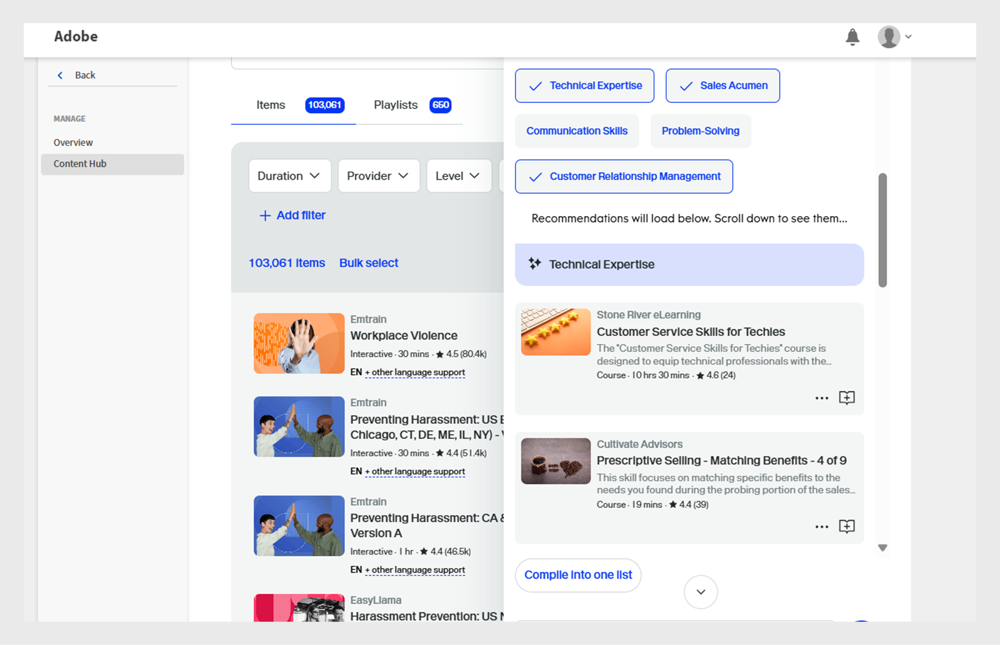
   _AI 助理畫面顯示可選擇並編譯成播放清單的相關技能_
4. 選擇 **[!UICONTROL Convert to Playlist]**。

   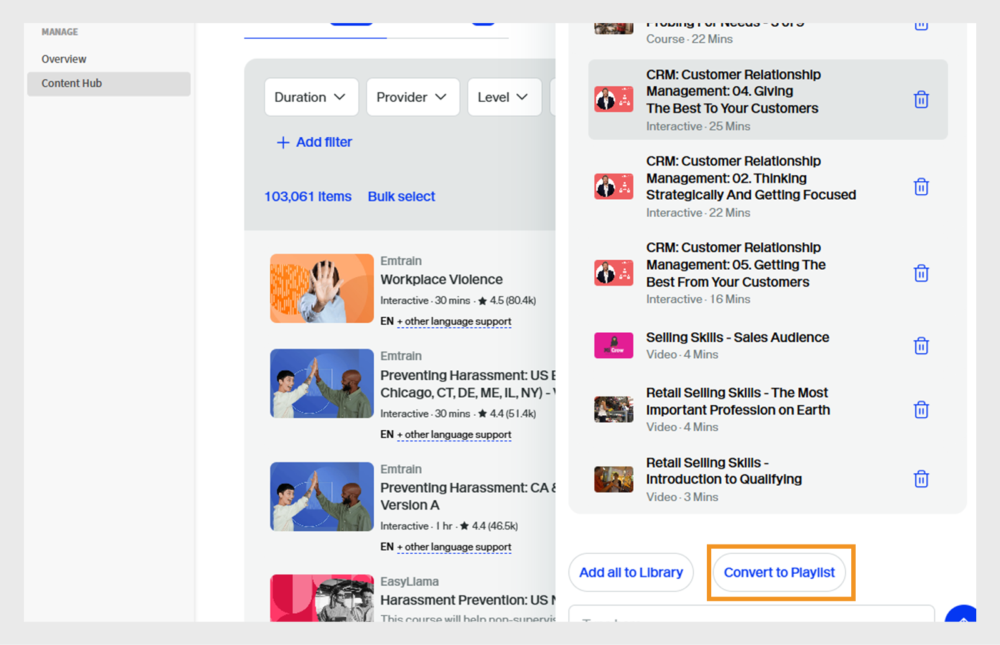
   _AI 助理畫面顯示「轉換為播放清單」選項，將所有課程彙整成播放清單_

5. 選擇 **[!UICONTROL View Playlist]**。

   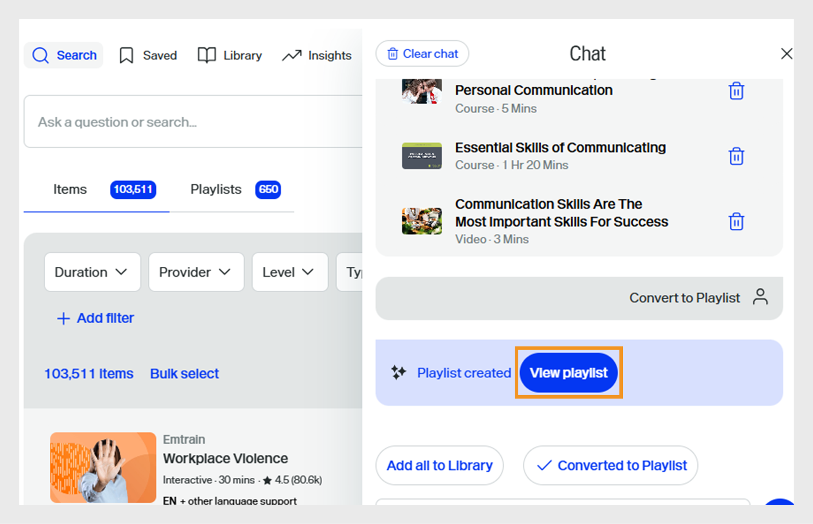
   _AI 助理畫面顯示「檢視播放清單」選項，以便發佈並匯入播放清單到 Learning Path。_

6. 選擇 **[!UICONTROL Publish]** 建立播放清單。 你可以在 Go1 裡建立額外的播放清單，並將它們加入學習路徑。
7. 在確認提示中選擇 **「是** 」。
8. 從 . 中選擇播放清單 **[!UICONTROL Select playlist to import prompt]**。

   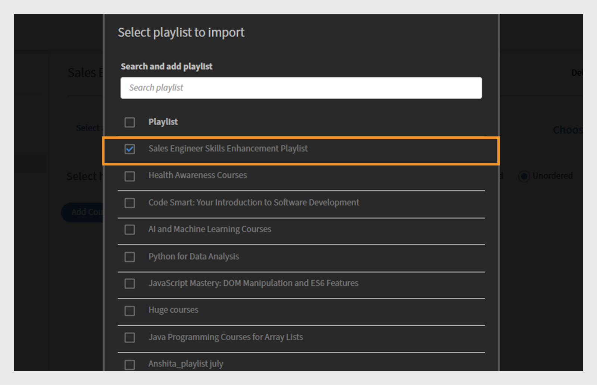
   _在 Adobe Learning Manager 的 Go1 函式庫中選取並匯入銷售工程師技能增強播放清單_

9. 選擇， **[!UICONTROL Add Playlists to Learning Path]** 然後 **[!UICONTROL Publish]**。

播放清單中的課程將被加入學習路徑。 管理者接著可以註冊學習者，讓他們立即開始修課。

### 用 AI 建立播放清單

管理員可以在 AI 提示中輸入播放清單描述。 AI 會根據需求策劃相關課程並建立播放清單。 AI 會根據使用者提供的學習目標或提示來生成播放清單。 在建立播放清單時，管理員可以選擇「用 AI 策劃內容」，讓系統能利用大型語言模型來理解指定的學習目標與內容偏好，如時長與類型。 接著，AI 會搜尋符合這些條件的內容庫相關學習對象。

1. 選擇 **[!UICONTROL Create playlist]** ，然後選擇 **[!UICONTROL with AI]**。

   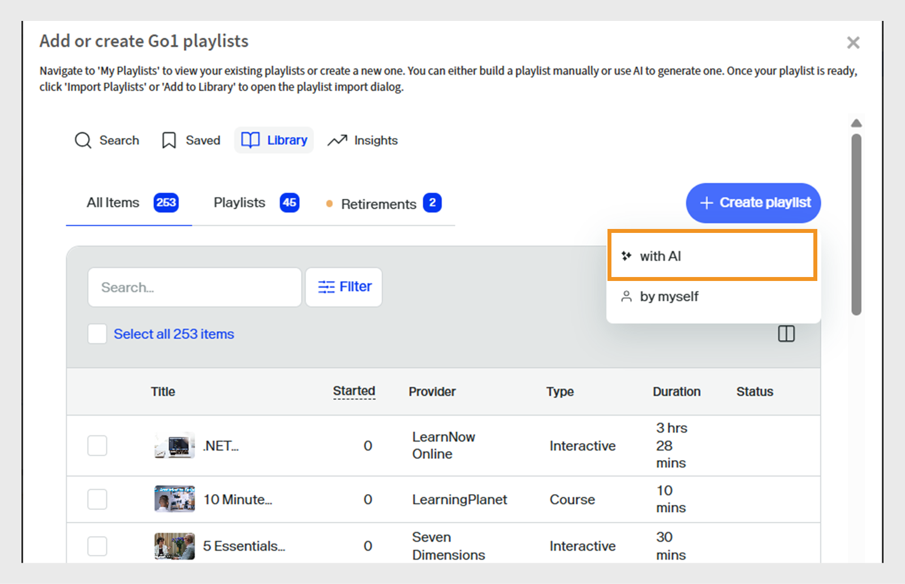
   _利用 AI 建立精選播放清單，能自動推薦符合學習者需求的課程_

2. 在文字欄位輸入關於你的播放清單 **[!UICONTROL Enter your learning goal]** 的簡短說明。 例如，為 _專注於提升產品知識、技術溝通、客戶互動及解決方案銷售_&#x200B;的銷售工程師打造精選學習播放清單。

   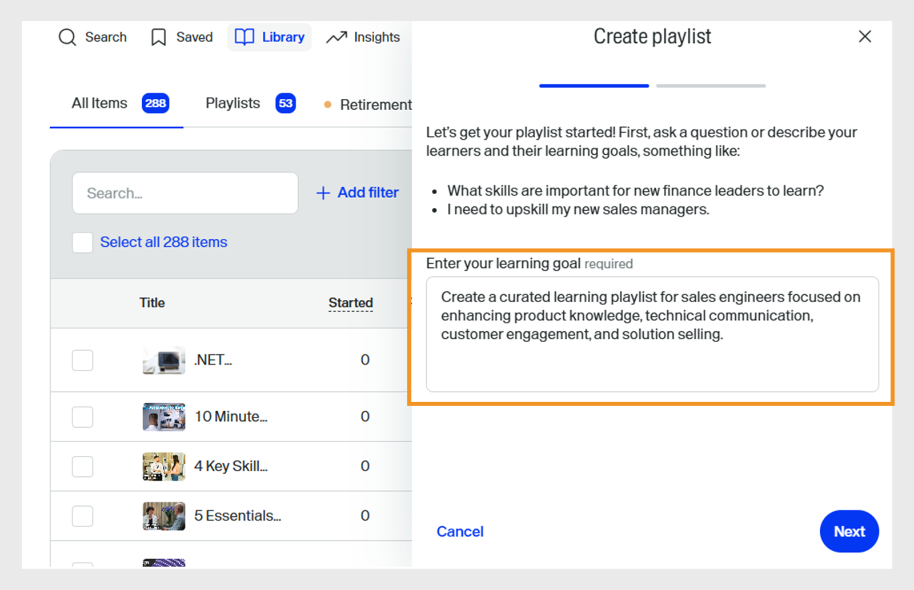
   _輸入您的學習目標以建立自訂播放清單，協助 Adobe Learning Manager 推薦符合學習者需求的精準課程_

3. 選擇 **[!UICONTROL Next]**。 提示會顯示所需技能、課程長度及課程類型供選擇。
4. 選擇所需技能。

   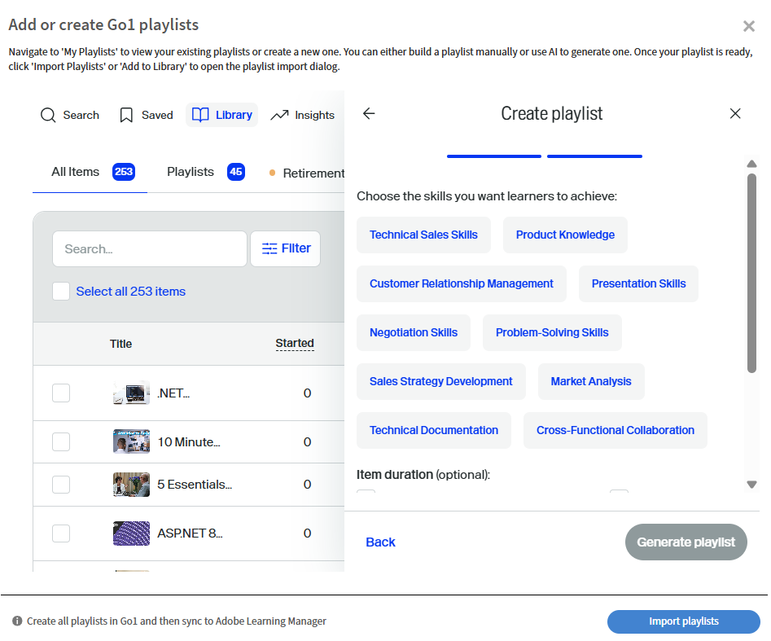
   _從清單中選擇技能，為銷售工程師策劃課程_

5. 選擇課程長度與類型，即可選擇播放清單。
   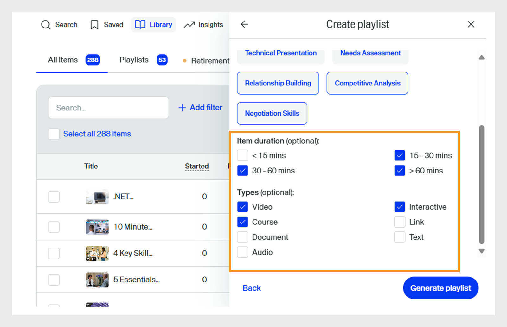
   _選擇課程的時長與類型，為銷售工程師策劃課程_

6. 選擇 **[!UICONTROL Generate playlist]**。 播放清單包含 10 門課程，分布在兩個頁面，管理員可以使用它來建立學習路徑。

   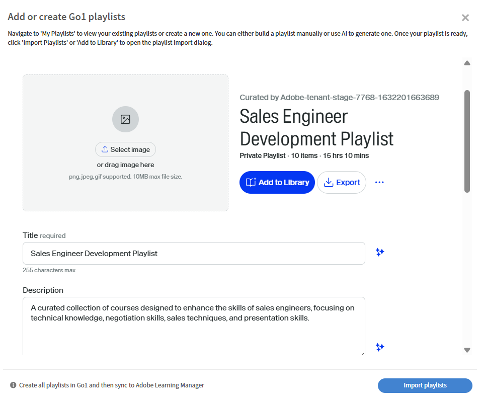
   _在 Adobe Learning Manager 中檢視您精心策劃的銷售工程師技能提升播放清單_

7. 瀏覽並透過選擇 **[!UICONTROL Select Image]**&#x200B;將圖片加入播放清單。
8. 使用可用的 AI 選項更改標題：

   * **[!UICONTROL Improve writing]**：將現有標題精煉以使其更清楚。
   * **[!UICONTROL Generate title]**：根據內容或上下文自動建立新標題。

   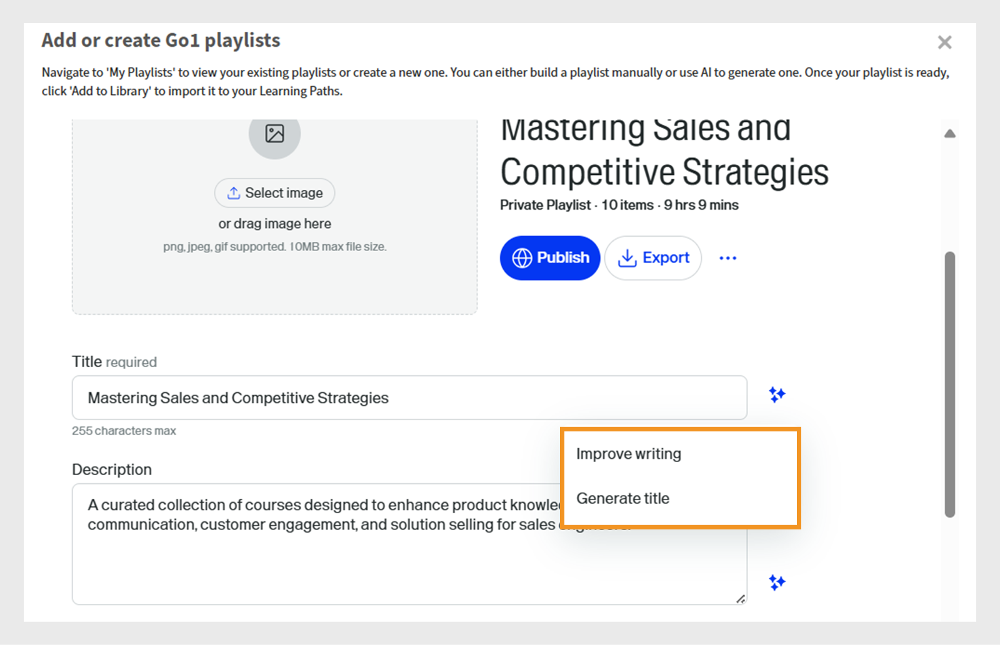
   _Go1 播放清單建立畫面，搭配 AI 選項以強化播放清單標題_

9. 利用可用的 AI 選項更改描述：
   * **[!UICONTROL Improve writing]**：細化現有的描述以使其更清楚。
   * **[!UICONTROL Generate description]**：根據內容或上下文自動建立新的描述。
   * **[!UICONTROL &#x200B; Make it shorter]**：縮短文字或標題，同時保留主要思想。

   
   _Go1 播放清單建立畫面，搭配 AI 選項以強化播放清單描述_

10. 選擇 **[!UICONTROL Add item]** 新增更多課程到播放清單。

11. 選擇 **[!UICONTROL Publish]** 建立播放清單。 你可以在 Go1 裡建立額外的播放清單，並將它們加入學習路徑。
12. 在確認提示中選擇 **「是** 」。
13. 從 . 中選擇播放清單 **[!UICONTROL Select playlist to import prompt]**。

    
    _在 Adobe Learning Manager 的 Go1 函式庫中選取並匯入銷售工程師技能增強播放清單_

14. 選擇， **[!UICONTROL Add Playlists to Learning Path]** 然後 **[!UICONTROL Publish]**。

播放清單中的課程將被加入學習路徑。 管理者接著可以註冊學習者，讓他們立即開始修課。

>[!NOTE]
>
>管理員也可以直接從內容中心頁面建立播放清單。 欲了解更多資訊，請參閱 [內容中心](/help/migrated/administrators/feature-summary/content-marketplace.md#content-hub) 。

## 手動建立播放清單

手動選擇最符合學習者需求的課程，並策劃更多相關課程。

要手動建立播放清單：

1. 選擇 **[!UICONTROL Create playlist]** ，然後選擇 **[!UICONTROL by myself]**。

   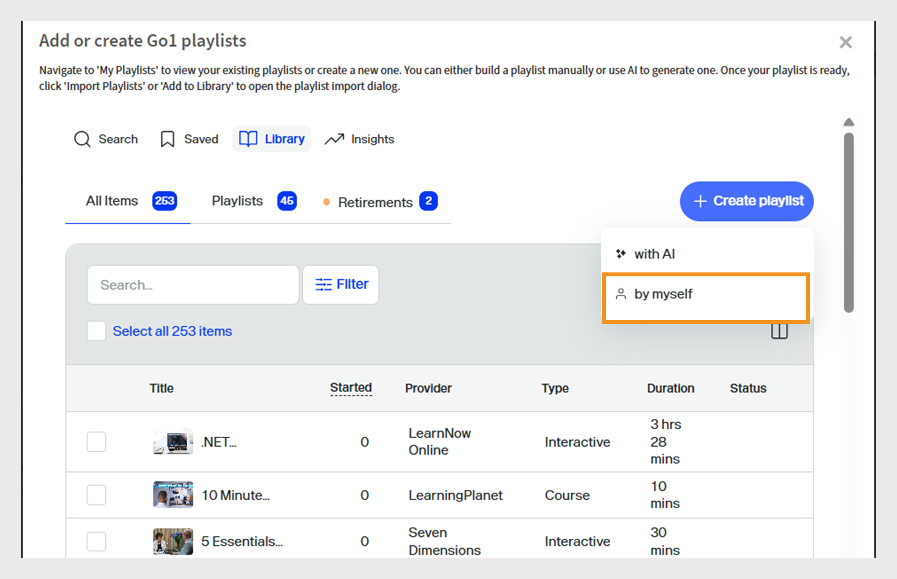
   _手動建立播放清單，讓管理員能完全掌控根據特定學習者需求策劃課程_

2. 瀏覽並透過選擇 **[!UICONTROL Select Image]**&#x200B;將圖片加入播放清單。
3. 輸入你的播放清單標題和描述。

   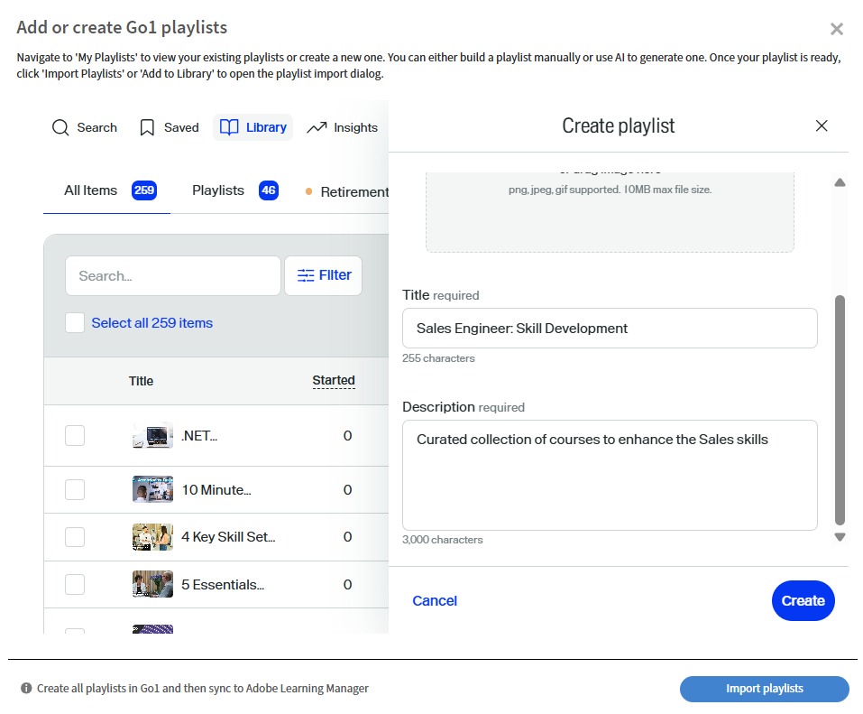
   _在 Adobe Learning Manager 的播放清單中新增標題與描述，以明確定義其目的，並引導學習者達成目標技能發展_

4. 選擇 **[!UICONTROL Create]**。
5. 選擇 **[!UICONTROL Add item]** 新增相關課程。

   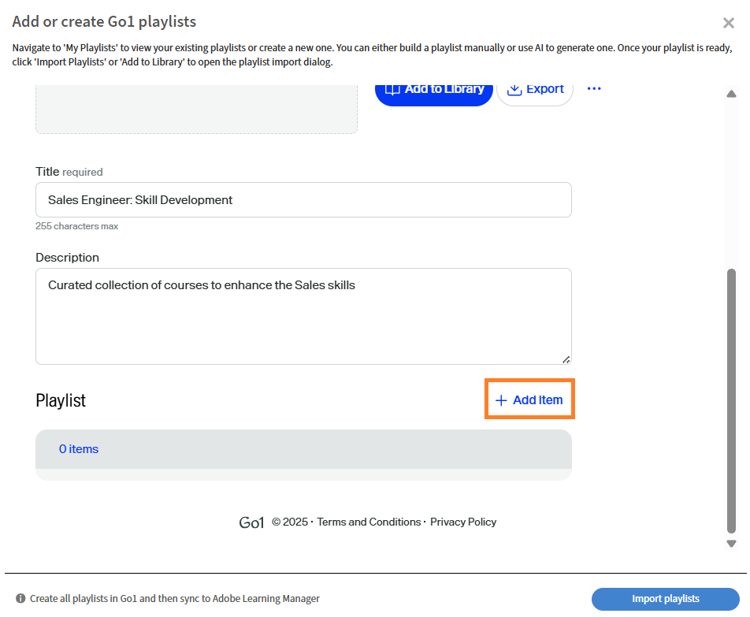
   _在 Adobe Learning Manager 中將項目加入您的銷售工程師技能發展播放清單，以策劃目標課程_

6. 搜尋並選擇必修課程。
7. 選擇 **[!UICONTROL Publish]**。 播放清單已建立，包含相關課程。
8. 在確認提示中選擇 **「是** 」。
9. 從 . 中選擇播放清單 **[!UICONTROL Select playlist to import prompt]**。
10. 選擇， **[!UICONTROL Add Playlists to Learning Path]** 然後 **[!UICONTROL Publish]**。

播放清單中的課程將被加入學習路徑。 管理者接著可以註冊學習者，讓他們立即開始修課。

## 管理 Go1 播放清單

管理員可以透過複製、分享或刪除來管理已建立的 Go1 播放清單。

### 複製播放清單

要複製播放清單：

1. 以管理員身份登入 Adobe Learning Manager。
2. 選擇 **[!UICONTROL Content Marketplace]**。
3. 選擇 **[!UICONTROL Content Hub]** ，然後選擇 **[!UICONTROL Library]**。
4. 選擇播放清單，然後選擇 **[!UICONTROL Edit]**。
   
   _Go1 播放清單畫面顯示編輯播放清單的選項_
5. 選擇省略號，然後選擇 **[!UICONTROL Duplicate]**。
   
   _播放清單管理畫面，重點顯示重複選項_

選定的播放清單將被複製並加入 Go1 內容庫

### 刪除播放清單

刪除播放清單：

1. 以管理員身份登入 Adobe Learning Manager。
2. 選擇 **[!UICONTROL Content Marketplace]**。
3. 選擇 **[!UICONTROL Content Hub]** ，然後選擇 **[!UICONTROL Library]**。
4. 選擇播放清單，然後選擇 **[!UICONTROL Edit]**。
   
   _Go1 播放清單畫面顯示編輯播放清單的選項_
5. 選擇省略號，然後選擇 **[!UICONTROL Delete playlist]**。
   
   _播放清單管理畫面，標示刪除播放清單選項_

所選播放清單將從 Go1 資料庫中刪除。

### 分享播放清單

Go1 與 Adobe Learning Manager 的整合中不支援分享播放清單選項。 這個選項會在下一個版本中從使用者介面中移除。

## 課程超過限制

當將 Go1 課程加入學習路徑時，若新加入的課程尚未同步至 Adobe Learning Manager，管理員可能會看到錯誤。 這些課程將於48至72小時內開放。

如果你現在新增播放清單，只有已經同步的課程會被包含在內。

若要包含所有課程，建議等同步完成後再將播放清單加入學習路徑。

## Go1 認證課程

管理員可以在 Adobe Learning Manager 的認證課程中新增 Go1 課程。 在建立認證時，管理員可從 Go1 內容目錄中搜尋並選擇課程。 所有透過 Go1 計畫匯入的 Go1 課程，皆可在認證流程中選擇。

包含Go1課程的認證可設定為永久或定期。 對於重複認證，證書會在規定時間後自動更新，讓學習者能重修 Go1 課程並維持認證狀態。

請參閱 [認證以](/help/migrated/administrators/feature-summary/certifications.md) 獲取更多關於建立證書的資訊。
