# 建立課程例項和學習路徑

本檔案包含建立課程模組、例項及管理員角色課程的說明。

作者建立課程。 學習者可以參加課程，管理員可以根據課程使用情況追蹤學習者的成效。

## 概觀 {#overview}

作者建立課程。 然後，學習者參加課程，管理員可以根據課程使用情況追蹤學習者的成效。 管理員可檢視作者建立的課程並執行本節中說明的某些活動。 身為管理員，您可以為學習者建立具有預先定義課程集的獨特學習計畫。

## 建立課程例項 {#createinstanceofacourse}

### 設定執行個體

在本培訓中，您將瞭解如何設定執行個體預設值、新增執行個體、淘汰和重新開啟執行個體，以及設定執行個體的電子郵件範本。

如果您無法啟動訓練，請寫信到<almacademy@adobe.com>。

### 如何建立執行個體

作者建立課程後，您就可以建立課程例項。 建立課程例項，即可在不同時段向學習者提供相同課程。 學習者可選擇任何例項並註冊。 您可以設定每個執行個體都有自己的徽章、意見回饋和其他設定。

若要建立例項，

1. 在管理員網頁應用程式上，按一下左窗格上的&#x200B;**[!UICONTROL Courses]**。
1. 在課程清單中，選擇所需課程，然後按一下&#x200B;**[!UICONTROL View Course]**。

   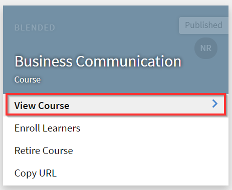

   *檢視課程*

1. 若要建立執行個體，請按一下左窗格上的&#x200B;**[!UICONTROL Instances]**。 依預設，每個課程都有一個例項。 您可以修改預設例證或新增例證。 您無法刪除此課程例項。
1. 若要建立執行個體，請按一下課程資訊右上角的&#x200B;**[!UICONTROL Add New Instance]**。 隨即顯示課程的新例項。
1. 輸入執行個體的屬性：

   * 在&#x200B;**[!UICONTROL Instance Name]**&#x200B;欄位中，輸入您要與課程建立關聯的執行個體名稱。 請確定您為執行個體使用唯一名稱。
   * 指定執行個體的完成期限。 學習者必須在此日期前達到課程完成狀態。
   * 按一下&#x200B;**[!UICONTROL Show More Options]**&#x200B;以顯示其他截止日期選項。
   * **[!UICONTROL Enrollment Deadline]：**&#x200B;這是預期學習者註冊學習物件的日期，以備自助註冊。
   * **[!UICONTROL Unenrollment Deadline]：**&#x200B;您可以選擇透過取消註冊截止日期限制學習者自行取消註冊。
   * **[!UICONTROL Timezone]：**&#x200B;搜尋，然後從下拉式清單中選取&#x200B;**[!UICONTROL Timezone]**。

   管理員可以根據需求決定課程或學習計畫的完成截止日期。 不過，建議您將它用於教室/虛擬教室式培訓。

   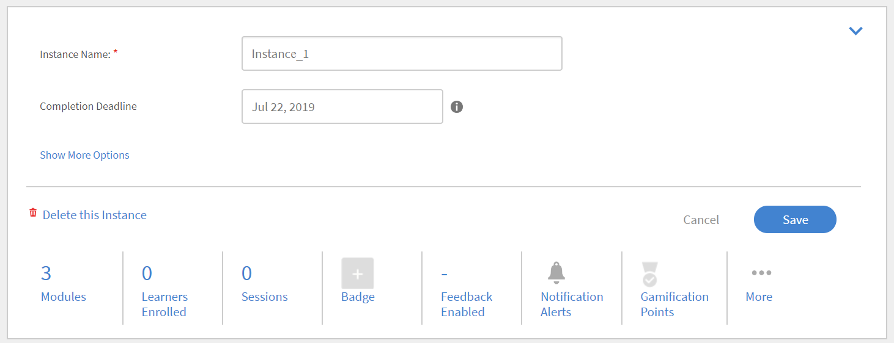

   *設定完成期限*

### 檢視執行個體的屬性 {#viewpropertiesoftheinstance}

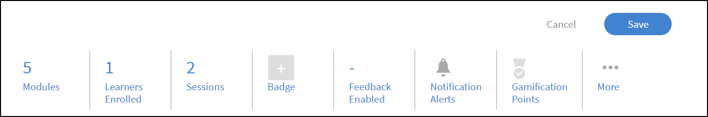

*檢視執行個體的屬性*

1. **模組：**&#x200B;課程作者建立的模組數目
1. **已註冊的學習者：**&#x200B;管理員已註冊課程的學習者數。
1. **工作階段：**&#x200B;課程中的虛擬教室和教室模組數目。
1. **已啟用意見回應：**&#x200B;顯示是否為此課程啟用L1、L2和L3意見回應。

>[!NOTE]
>
>管理員可前往「例項>工作階段」並選取「取消工作階段」來取消工作階段。

### 管理執行個體

>[!INFO]
>
>在本次訓練中，您將瞭解如何編輯執行個體詳細資訊和執行個體屬性。    

如果您無法啟動訓練，請寫信到<almacademy@adobe.com>。

### 淘汰執行個體 {#retireaninstance}

若要淘汰執行個體，請執行下列步驟：

1. 在執行個體上，選取下拉式功能表，然後選擇選項&#x200B;**[!UICONTROL Retire instance]**。

   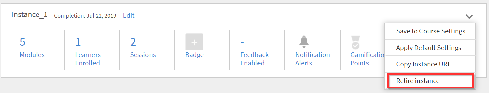

   *淘汰執行個體*

1. 若要搜尋所有淘汰的執行個體，請按一下[執行個體]頁面上的&#x200B;**[!UICONTROL Retired]**&#x200B;索引標籤。

### 還原執行個體 {#restoreaninstance}

若要將已淘汰的執行個體還原為啟動狀態，請執行下列步驟：

1. 在執行個體上，按一下下拉式功能表，然後選擇選項&#x200B;**[!UICONTROL Reopen instance]**。

   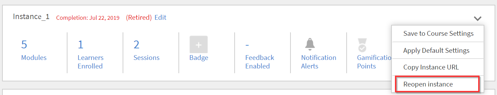

   *還原執行個體*

1. 執行個體現在會還原為作用中模式。

### 刪除執行個體

管理員可以在建立後立即使用&#x200B;**刪除此執行個體**&#x200B;選項來刪除執行個體。 如果有工作階段連結至執行個體，或任何學習者已註冊該執行個體，您就無法刪除。

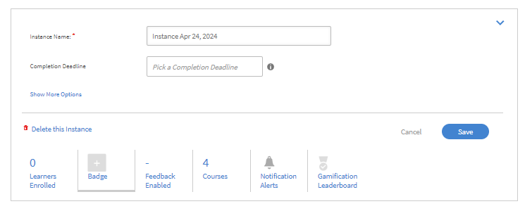

*刪除執行個體*

>[!NOTE]
>
>您無法刪除預設的執行個體。

### 傳送執行個體層級的電子郵件

若要傳送執行個體層級的電子郵件給已註冊的學習者：

1. 在&#x200B;**[!UICONTROL Instances]**&#x200B;頁面上，選取任何執行個體上的選項，然後按一下&#x200B;**[!UICONTROL Email Enrolled Learners]**。

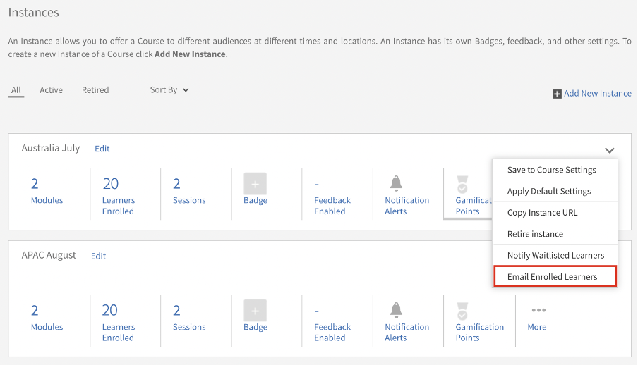

*電子郵件學習者已註冊執行個體*

1. 在&#x200B;**[!UICONTROL Create Announcement]**&#x200B;對話方塊中，選取[型別]作為電子郵件。 指定主旨、輸入郵件，然後按一下&#x200B;**[!UICONTROL Save]**。 系統會自動選取訓練。

   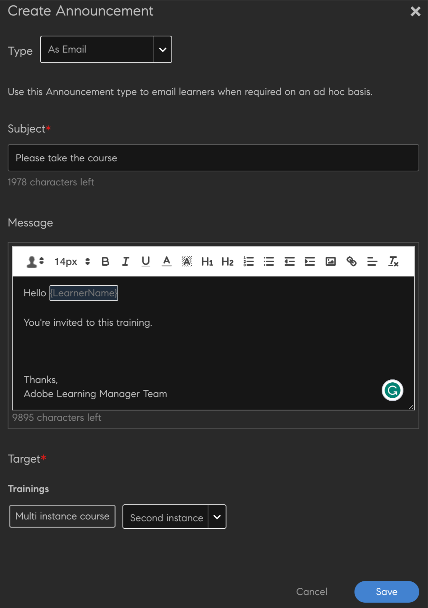

   *將宣告建立為電子郵件*

1. 按一下&#x200B;**[!UICONTROL Save]**&#x200B;後，您會看到成功建立宣告的確認訊息。 若要發佈宣告，請按一下&#x200B;**[!UICONTROL Publish Now]**。

   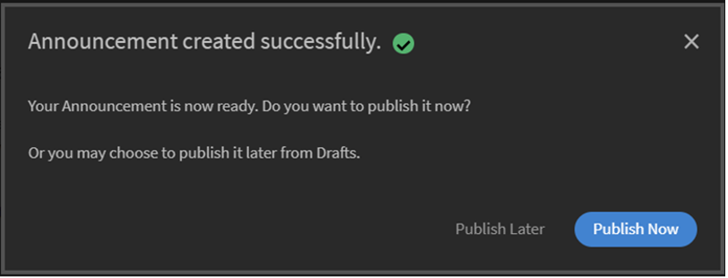

## 將學習者註冊至課程

在本次訓練中，您將學習如何註冊、取消註冊及重新註冊學習者。

如果您無法啟動訓練，請寫信到<almacademy@adobe.com>。

### 為學習者註冊各種例項

1. 從課程清單中選取課程。
1. 在左側面板上選取&#x200B;**[!UICONTROL Learners]**。
1. 選取&#x200B;**[!UICONTROL Enroll]**。

   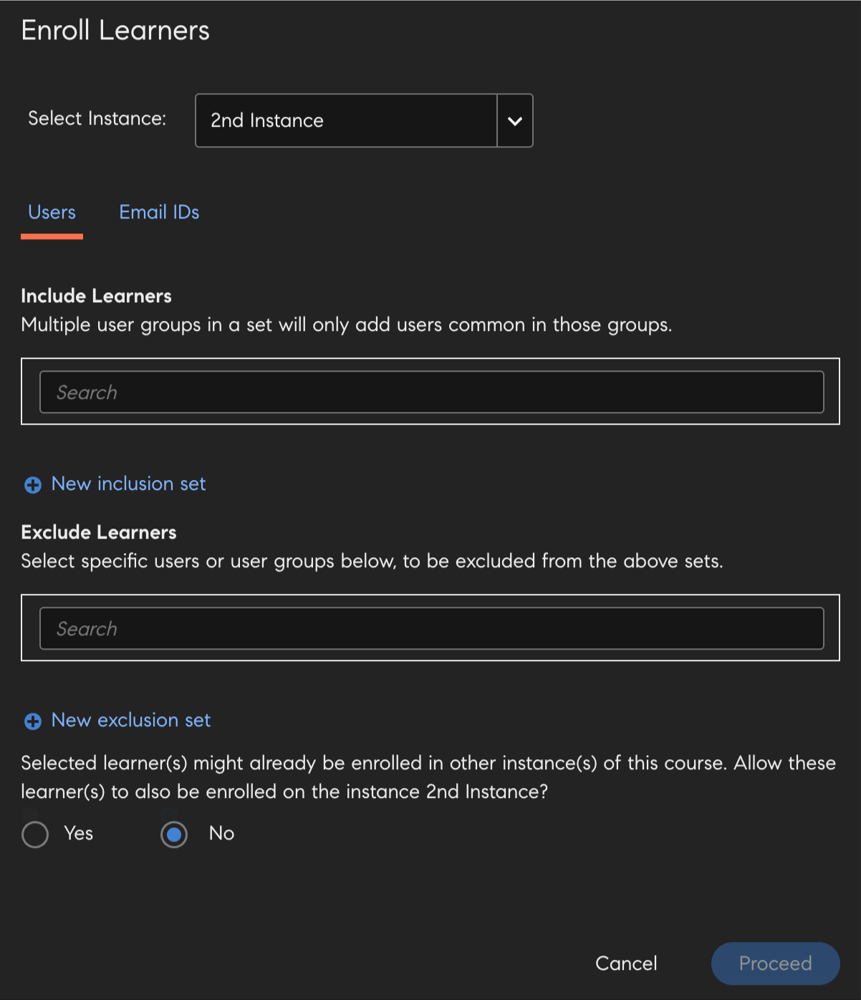

   *發佈課程*

1. 在&#x200B;[!UICONTROL **註冊學習者**]&#x200B;對話方塊中，您可以：

   * 從「選取執行個體」下拉式清單中選取要註冊學習者的執行個體。
   * 在「包含學習者」欄位中選取使用者或使用者群組，或兩者同時選取。
   * 在排除學習者欄位中，選取您要從例項中排除的學習者。
   * 如果您要讓學習者註冊所選例項，請在對話方塊底部選取「是」。

1. 選取&#x200B;**[!UICONTROL Proceed]**。

   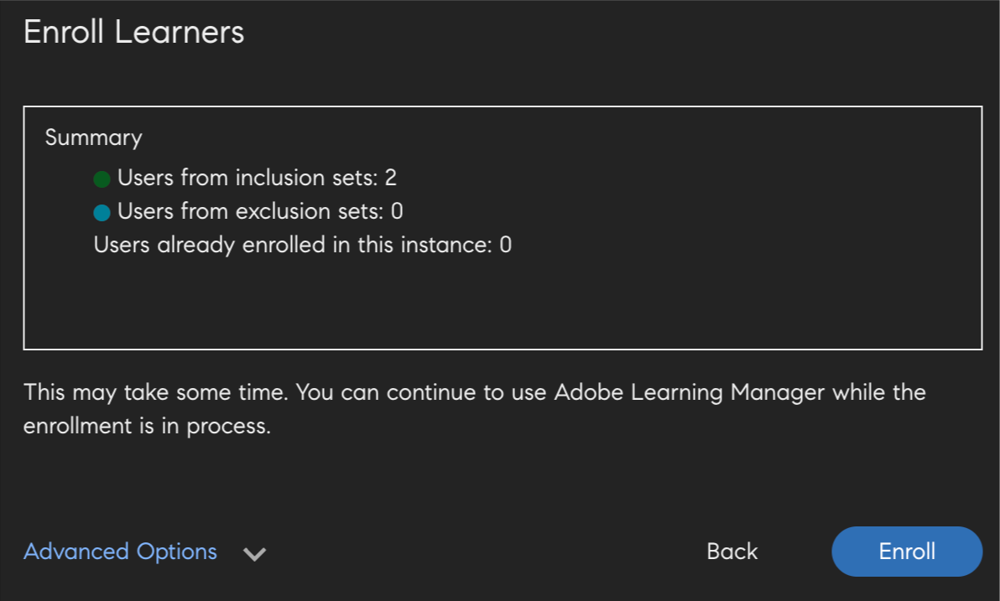

   *繼續註冊學習者*

### 檢視執行個體的註冊報告

1. 從課程清單中選取課程。
1. 在左側面板上選取&#x200B;**[!UICONTROL Learners]**。
1. 選取&#x200B;**[!UICONTROL Actions]** > **[!UICONTROL Export]**。

Excel檔案包含每個例證的工作表。 工作表包含下列欄位：

* 學習者
* 電子郵件
* 使用者唯一ID
* 課程名稱
* 學習對象唯一識別碼
* 狀態
* 選取條件
* 註冊日期/取消註冊日期（UTC時區）
* 完成日期（UTC時區）
* 到期日期（UTC時區）
* 開始日期（UTC時區）
* 測驗分數
* 管理員名稱
* 地址
* userState
* 專業領域
* 註解
* 造訪次數
* 造訪日期
* 時間戳記（UTC時區）
* 逗留時間（分鐘）

>[!NOTE]
>
>啟用多註冊後，每個課程的「學習者成績單」報表會新增多列（每個例項各一列）。
>
>若您已將報表自動化設定為每門課程僅預期一列，則您必須對報表自動化進行必要的調整，才能啟用「多重註冊」功能。

### 管理課程的學習者清單 {#managelearnerslistforacourse}

1. 按一下課程縮圖上的課程名稱。
1. 從左窗格，按一下&#x200B;**[!UICONTROL Learners]**。

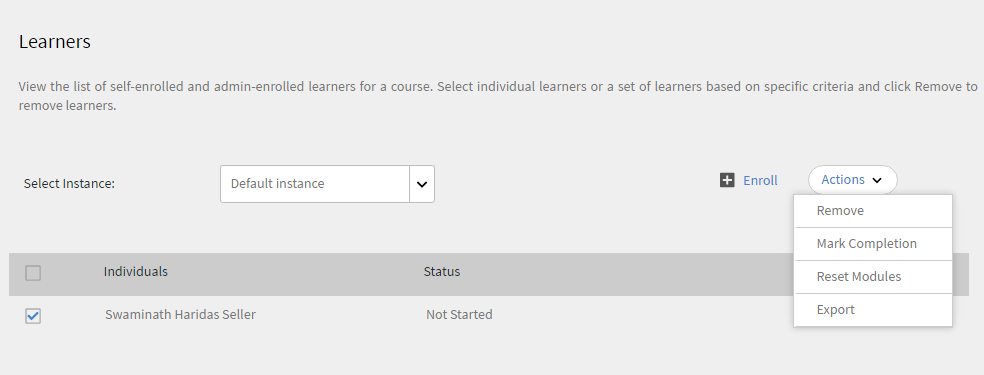

*選取課程中的學習者*

您可以從學習者頁面執行下列動作：

* 選取您要移除的學習者，然後按一下&#x200B;[!UICONTROL **動作**] > [!UICONTROL **移除**]。
* 選取您要標示出席的學習者，然後按一下&#x200B;[!UICONTROL **動作**] > [!UICONTROL **標示完成**]。

若要允許學習者重設模組並再次使用模組，請按一下[重設]。[!UICONTROL ****] 在彈出式對話方塊中，按一下「是」以確認「重設」。 無法重設已完成的模組。 只能重設失敗或不完整的模組。

您也可以匯出Excel工作表中的學習者清單。 若要匯出學習者清單，請按一下&#x200B;[!UICONTROL **動作**] > [!UICONTROL **匯出**]。

>[!NOTE]
>
>如果課程有多個例項，每個標籤會個別提供Excel中的學習者清單。 學習者清單包含學習者名稱、狀態和選取條件。 學習者狀態可以是&#x200B;**未開始**、**進行中**&#x200B;或&#x200B;**已完成**。

### 匯出處於未決核准狀態的學習者

管理員、經理或自訂管理員可匯出處於未決核准註冊狀態的學習者資料。 您可以透過&#x200B;**課程>學習者**&#x200B;索引標籤，然後按一下「動作」下拉式清單來匯出資料。

如果沒有學習者註冊/未決核准經理核准的課程，則會顯示選項，並產生空白報表。 學習者處於未決核准狀態、已註冊狀態、未決狀態和已取消註冊狀態時，您也可以匯出。

此報表包含作用中、已刪除和已暫停使用者（如果使用者處於未決核准）的資料。 此外，此報表也包含處於未決核准狀態的內部和外部使用者的資料。

如果先前處於未決核准狀態的學習者取消註冊，則其記錄將不會出現在報告中。 此外，如果先前處於未決核准狀態的學習者透過管理員/經理/自訂管理員註冊註冊了課程，則其記錄會顯示在報表中。

## 大量管理學習者註冊、出席和完成 {#bulk-enrollment}

使用Adobe Learning Manager的大量註冊功能，管理員可以上傳CSV檔案，有效率地將大量學習者群組註冊到課程、認證或學習計畫中。 此程式可節省時間、確保一致性，並支援組織擴充能力。 此外，管理員和講師可透過CSV上傳大量更新學習者資訊、出勤和完成，儘量減少手動工作並確保資料準確性。

您可以使用相同的CSV檔案格式來註冊、出席和完成。 在「電子郵件」欄下輸入學習者電子郵件ID，並根據動作使用名稱儲存檔案，例如bulk_enrollment.csv、bulk_auditor.csv或bulk_completion.csv。 僅支援CSV格式。 不支援UTF-8格式。 在此下載範例csv 。

### 使用csv大量註冊學習者

管理員可以上傳CSV檔案來同時註冊最多100,000名使用者，而不是一次新增一個學習者。 檔案必須包含標示為&#x200B;**userEmail**&#x200B;的欄，內含要註冊的學習者的電子郵件地址。

若要使用CSV註冊大量學習者：

1. 以管理員身分登入。
2. 從&#x200B;**[!UICONTROL Courses]**&#x200B;區段選取課程。
3. 在&#x200B;**[!UICONTROL Course Overview]**&#x200B;頁面中選取&#x200B;**[!UICONTROL Learners]**。
4. 選取&#x200B;**[!UICONTROL Enroll]**，然後選取&#x200B;**[!UICONTROL Upload a CSV]**。\
   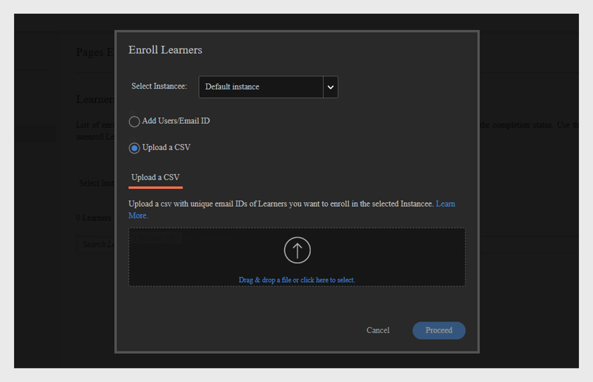
   _使用CSV上傳註冊學習者_
5. 上傳CSV並選取&#x200B;**[!UICONTROL Proceed]**。

CSV檔案包含標籤為「使用者電子郵件」的欄。 在此欄位中輸入使用者的電子郵件地址。

### 大量標示課程完成

管理員可透過上傳包含學習者電子郵件地址的CSV檔案，一次快速標籤許多學習者的課程完成。 相較於分別更新每個學習者，這麼做可節省時間。 CSV的userEmail欄會顯示要更新的學習者。 您一次上傳最多可將10,000個學習者標示為完成。

若要標籤大量完成，請執行下列動作：

1. 從&#x200B;**[!UICONTROL Courses]**&#x200B;區段選取課程。
2. 在&#x200B;**[!UICONTROL Course Overview]**&#x200B;頁面中選取&#x200B;**[!UICONTROL Learners]**。
3. 選取&#x200B;**[!UICONTROL Actions]**，然後選取&#x200B;**[!UICONTROL Mark Completion]**。
4. 選取&#x200B;**[!UICONTROL Bulk]**。
5. 上傳內含userEmail欄的CSV檔案，該欄會列出完成課程的學習者。

   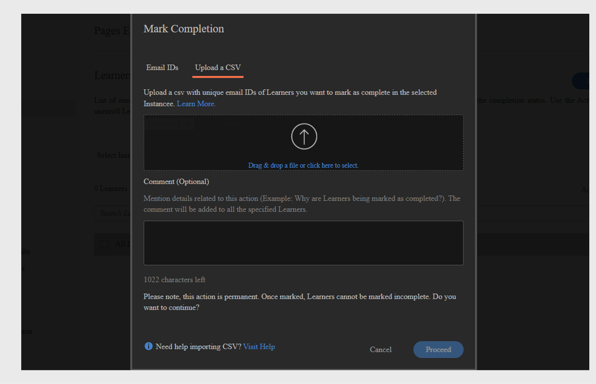
   _使用CSV標籤大量完成_

### 大量標示出席情況

管理員可使用大量出勤功能，一次為許多學習者標籤出勤情況。 管理員可以上傳包含學習者電子郵件地址的CSV檔案，而不是個別更新每個學習者的出席情況。 CSV中的userEmail欄可識別要記錄的學習者出勤率。 此程式在單次上傳中可處理最多10,000個學習者，讓出席標籤更快更有效率。

若要標籤大量出席，請執行下列動作：

1. 從&#x200B;**[!UICONTROL Courses]**&#x200B;區段選取課程。
2. 在&#x200B;**[!UICONTROL Course Overview]**&#x200B;頁面中選取&#x200B;**[!UICONTROL Attendance & Scoring]**。
3. 選取&#x200B;**[!UICONTROL Actions]**，然後選取&#x200B;**[!UICONTROL Mark Bulk Attended]**。
4. 上傳包含使用者電子郵件欄的CSV檔案，該欄含有您要更新其出席情況的學習者的電子郵件地址。

   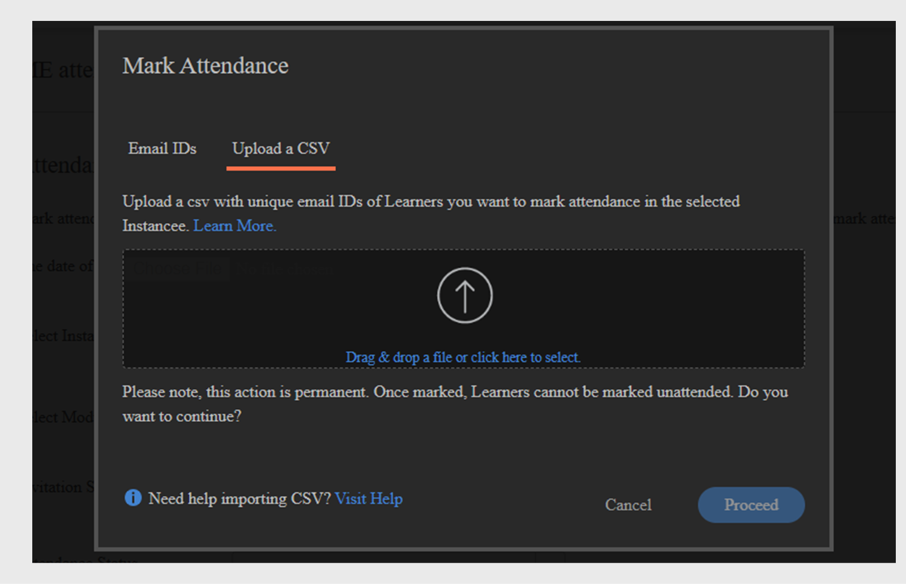
   _使用CSV標籤大量出席_

>[!NOTE]
>
>您可以使用CSV大量標示最多10,000名使用者的出勤率。

### 常見的CSV上傳錯誤

* CSV中的學習者電子郵件不存在Adobe Learning Manager使用者目錄。
* 檔案格式不正確。
* 檔案包含額外的欄或無效的資料。

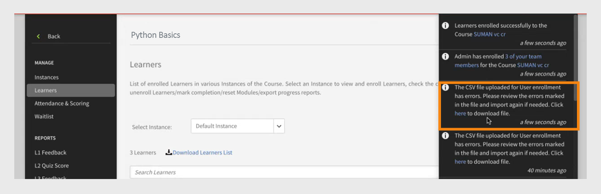
_錯誤通知_

您可以在列層級下載並檢視列出失敗使用者錯誤的CSV檔案，以方便識別。

## 輪候表

當名額有限時，輪候表區段可讓學習者根據其註冊順序輪候教室課程。 管理員可以透過選擇輪候學習者並分配超過初始限制的名額來管理此專案。 管理員分配名額後，學習者會立即註冊課程。

### 輪候表報告

Adobe Learning Manager可讓管理員下載課程所有執行個體的輪候學習者清單。 管理員可以從&#x200B;**[!UICONTROL Course Overview]**&#x200B;頁面上的輪候表區段存取此報告。

依照輪候表報表中的可用欄執行：

* 課程名稱
* 執行個體名稱
* 執行個體ID
* 執行個體狀態
* 使用者名稱
* 電子郵件
* 使用者唯一ID
* 註冊日期（UTC時區）
* 狀態
* 輪候表編號
* 輪候表限制
* 名額限制

若要從管理員區段下載報表：

1. 以&#x200B;**[!UICONTROL Admin]**&#x200B;登入。
2. 前往&#x200B;**[!UICONTROL Course]**&#x200B;區段並選取必要的課程。
3. 在&#x200B;**[!UICONTROL Course overview]**&#x200B;頁面中選取&#x200B;**[!UICONTROL Waitlist]**&#x200B;選項。
4. 選取&#x200B;**[!UICONTROL Actions]** > **[!UICONTROL Export Report]**&#x200B;以下載&#x200B;**[!UICONTROL Waitlist]**&#x200B;報告。

   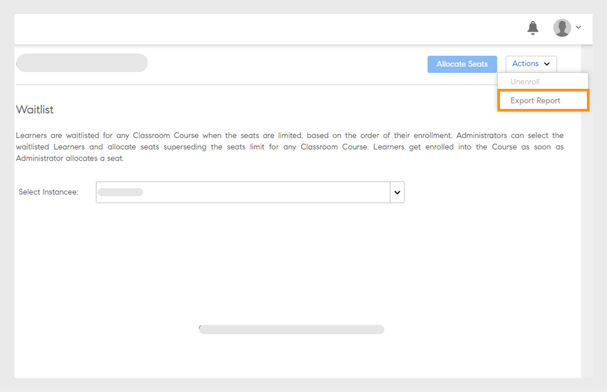
   _匯出報告_

## 匯出學習者的出席情況 {#attendance}

任何教室和VC課程，您都可以下載已參加此課程的學習者清單（任何例項）。

在課程詳細資訊頁面上，按一下右窗格上的&#x200B;**[!UICONTROL Attendance and Scoring]**。

在頁面的右上角，按一下&#x200B;**[!UICONTROL Actions]**&#x200B;下拉式清單。 然後按一下選項&#x200B;**[!UICONTROL Export Learner List (PDF)]**。

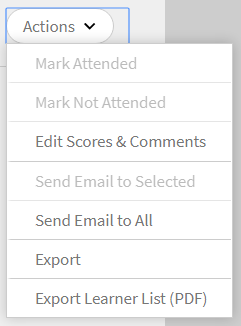

*將學習者清單匯出為PDF*

在PDF上，您可以檢視和講師相同的學習者集。

下載PDF時，您可以看到建立課程時使用的時區(UTC)。

## 新增L1和L3意見回饋 {#addl1andl3feedback}

建立課程時，您可以新增L1和L3意見回饋選項：

1. 以管理員身分登入後，請按一下左窗格中的「課程」 。 所有課程的清單會顯示在右側頁面。
1. 按一下您要新增L1或L3意見回饋的課程圖磚。
1. 按一下左窗格中的執行個體預設值。
1. 按一下L1或L3意見旁的圓切換按鈕以啟用它。
1. 在L3問題下方的文字區域中新增L3意見問題。

### 強制L1意見反應 {#mandatory-l1-feedback}

您可以在L1意見反應中將所有問題或第一個問題設為必答問題。

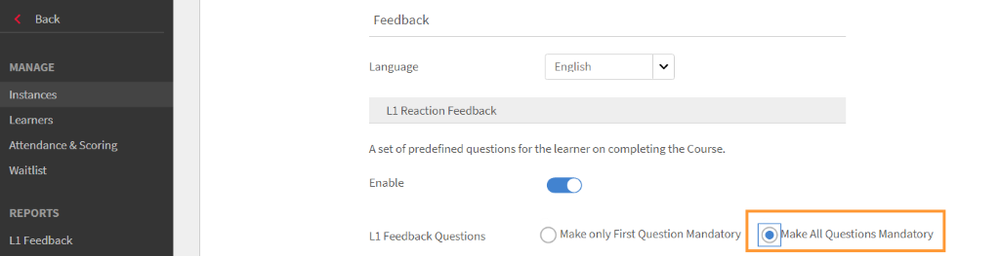

*在L1意見反應中將所有問題或第一個問題設為必答問題*

現在，您可以建立問題，這些問題現在成為強制問題。

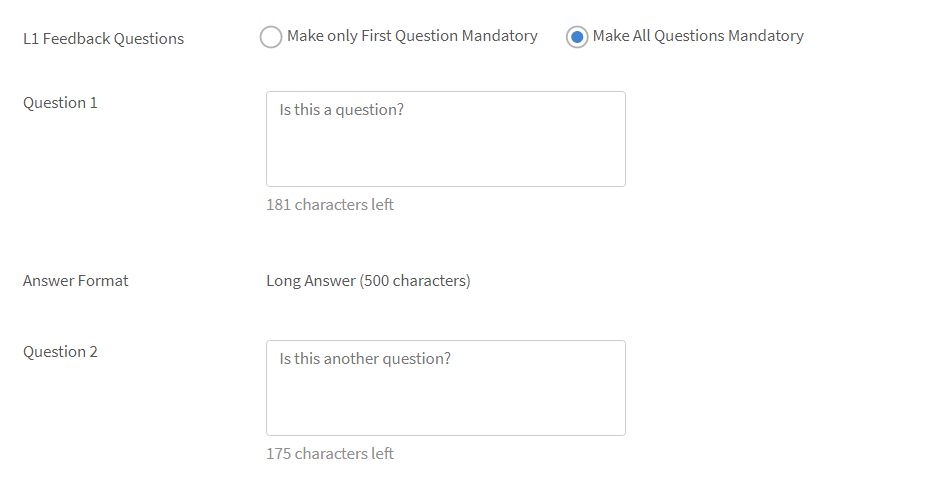

*建立問題*

如果由於某些原因，兩個必要問題沒有任何文字，則問題不會出現在意見表單中。

>[!NOTE]
>
>您在學習計畫執行個體啟用這些設定還不夠。 您也必須針對學習計畫中的每門課程，在課程例項層級啟用這些設定。

在「執行個體預設值」頁面中，如果您啟用&#x200B;**[!UICONTROL Make All Questions Mandatory]**，則之後建立的所有新執行個體都將繼承這些設定。

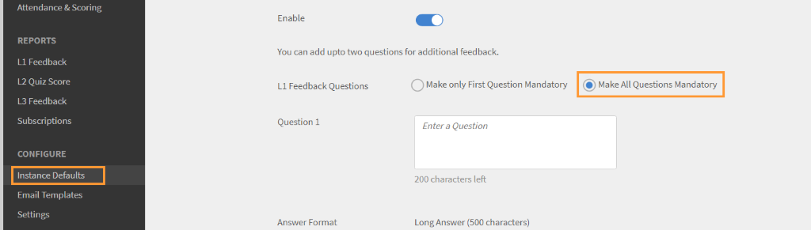

*檢視執行個體預設值頁面*

### 課程層級的L1意見反應 {#l1-feedback-course-level}

在舊版Learning Manager中，管理員可以為學習計畫啟用L1意見回饋。

在此版本的Learning Manager中，管理員可以傳送學習計畫中所有課程的L1意見回饋。 管理員必須確保在課程執行個體層級的所有課程啟用L1意見回饋。

1. 若要針對每個課程啟用L1意見回饋，請在Admin App中按一下&#x200B;**[!UICONTROL Learning Programs]** > **[!UICONTROL View Learning Program]**。

1. 按一下&#x200B;**[!UICONTROL Instances]** > **[!UICONTROL L1 Feedback Enabled]**。

1. 啟用選項&#x200B;**[!UICONTROL Enable for Each Course]**。

   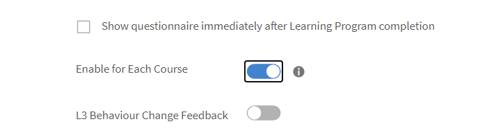

   *啟用課程意見回饋*

   只有在學習計畫層級啟用此切換功能，不會觸發此計畫內課程的L1意見回饋。 若要啟用L1意見回饋，請前往學習計畫中的每個課程並啟用L1意見回饋切換開關。

   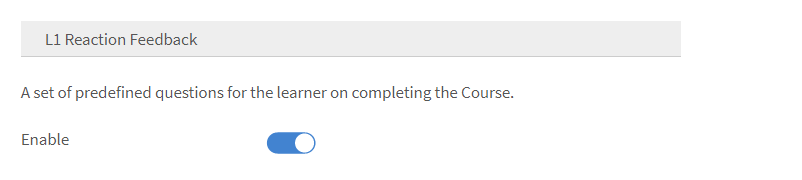

   *為每個課程啟用L1意見回饋*

   如果所有課程已啟用L1意見回饋，但在學習計畫例項中停用，則不會觸發課程的L1意見回饋。

### 特定語言的測驗報告

測驗報告有助於評估學習者完成學習計畫或課程後的表現。

Learning Manager目前協助您學習13種介面語言和32種內容語言。 雖然此選項對學習者有利，也便於支援全域學習者，但管理員在不同地區設定中擷取嘗試的報告時，工作量很大。

測驗報告，以不同語言顯示資料，前提是課程提供多種語言版本。 到目前為止，管理員產生的報告只顯示一個答案，而不管測試使用何種語言。 **例如**，如果使用者以荷蘭文參加測驗，管理員一次只能檢視使用者嘗試的測驗報告。 選擇英文作為介面語言的管理員無法一次檢視所有使用者的報告，無論嘗試在哪個地區設定。

現在已修正此問題，因為管理員現在能夠以學習者一次嘗試的個別語言檢視所有報告，而無論選擇的內容地區設定為何。 嘗試不同語言的測驗將作為其他欄新增到測驗報告中。

### 啟用帳戶層級的L1意見回饋 {#l1-feedback-account-level}

*啟用帳戶層級*&#x200B;的L1意見回應

管理員可在帳戶層級開啟此設定，為新建立的課程和學習計畫啟用L1意見回饋。 但是，開啟此設定不會影響現有的課程和學習計畫

如已啟用，所有新培訓與新執行個體預設都會啟用意見回饋。 如果作者/管理員造訪執行個體，執行個體會預設並手動將其關閉，然後才會接受。

若要啟用L1意見回饋，請在Admin App中按一下&#x200B;**[!UICONTROL Settings]** > **[!UICONTROL Feedback]**。

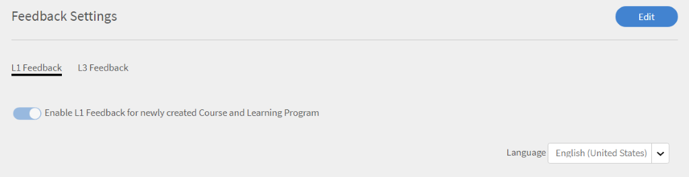

*檢視意見設定頁面*

按一下右上角的&#x200B;**[!UICONTROL Edit]**&#x200B;並切換啟用L1意見回饋的選項。

當作者建立課程時，在管理員應用程式的執行個體頁面上，**[!UICONTROL L1 feedback]**&#x200B;會自動為新課程啟用。

<!--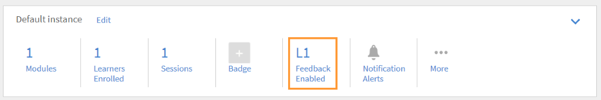-->

您也可以切換&#x200B;**[!UICONTROL Enable]**&#x200B;選項以停用L1意見回饋，如下所示：

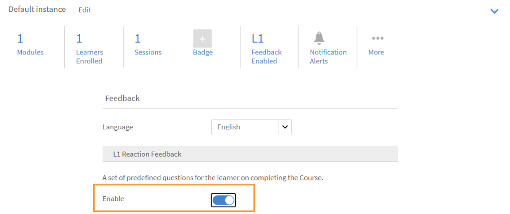

*啟用或停用L1意見回應*

### 新增L1和L3回饋的描述性問題 {#descriptive}

在Learning Manager 11月發行版本中，已提供新增描述性問題的選項。 管理員可以選擇向學習者新增這些問題。 除了Learning Manager提供的預設問題集外，此布建還額外提供。 如有需要，您也可以選擇問題下方的選項，將其設為必要。

您可以針對L1意見新增兩個描述性問題，並針對L3意見新增一個描述性問題。

啟用L1意見回饋後，即可檢視下列快照中所示的選項。

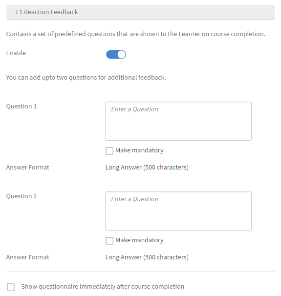

*新增L1與L3意見回饋的描述性問題*

如果您希望課程完成後，立即向學習者顯示問卷，則可相應地選擇選項。

以下提供L1問卷的範例輸出以供您參考。 學習者可檢視以下格式的問卷。 Test-1和Test-2是描述性問題。

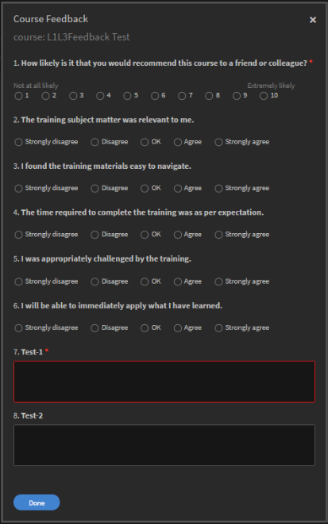

*課程回饋意見問題範例*

啟用L3意見回饋後，您就可以檢視下列快照所示的選項：

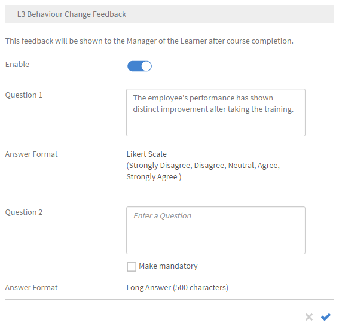

*啟用L3意見反應*

問題2是L3回饋意見的描述性問題。 您可以按一下問題下方的相應選項，使其成為強制性的。

以下提供L3問卷的範例輸出以供您參考。 學習者可檢視以下格式的問卷。

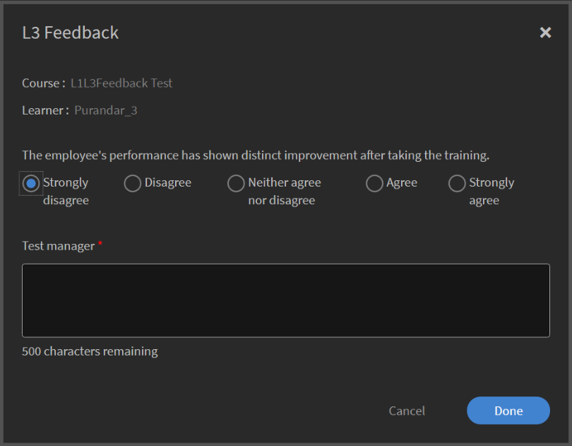

*檢視L3意見輸出*

### 設定L1與L3意見調查表 {#setupl1andl3feedbackquestionnaire}

您可以設定L1與L3意見調查表，也可以在帳戶層級設定提醒。

1. 以系統管理員身分登入後，按一下&#x200B;**[!UICONTROL Settings]**，然後在左窗格上按一下&#x200B;**[!UICONTROL Feedback]**。\
   意見設定頁面會顯示兩個索引標籤： **[!UICONTROL L1 Feedback]**&#x200B;和&#x200B;**[!UICONTROL L3 Feedback]**。\
   **[!UICONTROL L1 Feedback]**&#x200B;索引標籤包含教室和自訂進度課程的預設&#x200B;**[!UICONTROL L1 feedback]**&#x200B;問卷清單以及提醒設定。 在&#x200B;**[!UICONTROL L3 Feedback]**&#x200B;索引標籤中，您可以檢視L3回饋預設陳述和提醒設定。

1. 按一下頁面右上角的「編輯」 ，修改現有的問卷。\
   在&#x200B;**[!UICONTROL L1 Feedback]**&#x200B;索引標籤中，您可以按一下[是/否]切換按鈕來啟用/停用每個問題。\
   在&#x200B;**[!UICONTROL L3 Feedback]**&#x200B;索引標籤中，您可以修改預設意見反應宣告。\
   按一下頁面底部的&#x200B;**[!UICONTROL Add New Reminder]**，然後選擇何時傳送提醒。

1. 按一下頁面右上角的&#x200B;**[!UICONTROL Save]**。

在L1意見反應中，您可以看到兩組問卷以及一個預設問題。 第一組問卷是指自學課程，也可用於活動型課程。 第二組問卷可用於教室和虛擬教室型別的課程。

## 檢視L1和L3意見反應 {#viewl1andl3feedback}

您可以檢視學習者針對課程提供的L1意見以及經理針對學習者提供的L3意見。

1. 按一下「課程」清單中的任何課程圖磚。
1. 按一下左窗格中的「L1意見回饋」或「L3意見回饋」 ，以檢視收到的意見回饋。
1. 從下拉式清單中選取執行個體，以檢視該特定執行個體的意見回饋。

## 討論區

「討論區」功能可讓學習者檢視課程討論。 身為管理員，您可以視需要刪除任何評論。 管理員可在課程設定下啟用此選項。

## 課程稽核 {#coursemoderation}

每當作者新增、更新或刪除模組並重新發佈課程時，所有管理員都會收到通知。 身為管理員，您可以檢視變更、透過按一下連結來比較舊內容與新內容，並據此核准或拒絕變更。

若要啟用課程稽核，請按一下&#x200B;**[!UICONTROL Settings]** > **[!UICONTROL General]**。 選取&#x200B;**[!UICONTROL Course Moderation]**&#x200B;核取方塊以啟用此功能。

*啟用課程稽核*

按一下通知即可檢視作者對課程所做的變更。 然後，核准或拒絕作者所做的變更。 如果您選擇核准，則會重新發佈課程。 如果您拒絕更新，先前版本的課程會繼續存在。 在任一情況下，都會傳送通知給作者。

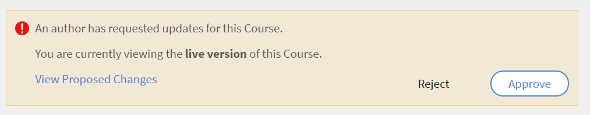

*課程更新的作者請求*

如果有多位作者正在更新同一個課程，則最新或上次執行的變更將會反映在管理員的通知中。 然後您可以核准或拒絕最新變更。

## 匯出檢查清單資料 {#export-checklist-data}

從課程清單中，開啟包含檢查清單的課程。 在左窗格中，您會看到選項&#x200B;**[!UICONTROL Checklist]**。

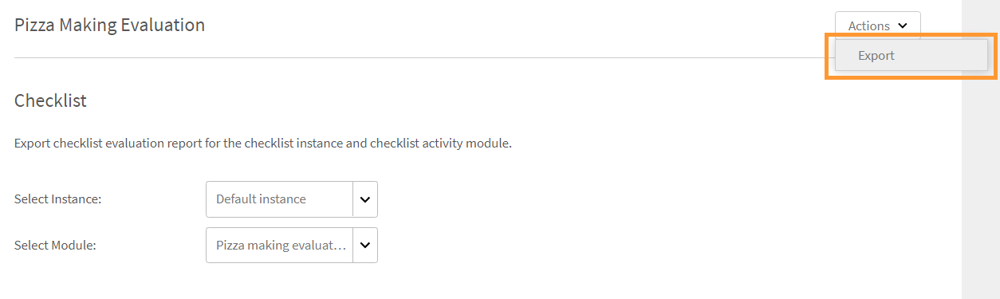

*匯出檢查清單資料*

按一下選項，然後在課程頁面上，執行下列動作：

1. 選取執行個體和模組。
1. 按一下「**[!UICONTROL Actions]** > **[!UICONTROL Export]**」，然後匯出學習者檢查清單報告。

在&#x200B;**[!UICONTROL Checklist]**&#x200B;頁面上，講師可以從&#x200B;**[!UICONTROL Actions]**&#x200B;下拉式清單匯出檢查清單報告。

CSV報表包含以下欄位：

* 使用者名稱
* 使用者電子郵件
* 經理姓名及電子郵件
* 訓練名稱
* 訓練例項
* 講師姓名及電子郵件
* 提交時間
* 評估狀態
* 問題 — 實際文字
* 使用者狀態
* 個人資料
* 作用中欄位

當您在選取狀態篩選後下載報表時，下載的學習者成績單報表會根據套用的狀態篩選包含學習者資料。 新增的篩選器也會顯示給自訂管理員和經理，當他們即將產生學習者成績單時。

## 檢視課程 {#viewingcourses}

身為管理員，您可以檢視所有可用課程的清單。   按一下左窗格上的&#x200B;**[!UICONTROL Courses]**&#x200B;以檢視包含搜尋和篩選選項的課程清單。 您也可以在課程縮圖上檢視每個課程的課程效果百分比。

>[!NOTE]
>
>當課程被學習者使用後，或發佈後想要保留任何特定課程時，您可以停用課程。 您只能在課程處於已發佈狀態時將其淘汰。 按一下&#x200B;**[!UICONTROL Retired]**&#x200B;標籤，即可檢視所有已淘汰課程的清單。

## 檢視測驗分數 {#viewquizscores}

1. 按一下課程縮圖上的課程名稱。
1. 按一下左窗格中的「測驗分數」。

您可以根據使用者名稱或每個問題來檢視任何特定課程的測驗分數。 請根據使用者或問題選擇相應的標籤。

從下拉式清單中選擇執行個體型別，以檢視每個課程執行個體的分數。

## 預設例項

管理員可以在&#x200B;**[!UICONTROL Default Instance]**&#x200B;頁面中設定預設徽章、gamification設定和提醒。 若要修改預設的執行個體設定，請選取&#x200B;**[!UICONTROL Default Instance]** > **[!UICONTROL Edit]**。

* **[!UICONTROL Badge]**：從下拉式選單中選取預設徽章。
* **[!UICONTROL Gamification]**：設定遊戲化設定，包括完成點、提早完成點和即時完成點。 管理員可以選擇選取帳戶層級設定或自訂此執行個體的gamification點。
* **[!UICONTROL L1 Reaction Feedback]**：在課程完成後，為學習者意見啟用預先定義的問題，並附上讓問題成為必要問題的選項。
***[!UICONTROL  L3 Behaviour Change Feedback]**：在課程完成後，為學習者的經理啟用意見回饋問題。
***[!UICONTROL  Reminder Settings]**：設定並管理截止日期的提醒，並附上升級選項。

### 設定向上呈報級別 {#escalation}

在傳送電子郵件通知時，管理員必須明確選擇提升層級以：

* 經理
* 經理與略過層級經理

*設定提升層級*

## 完成註解

當管理員將任何學習者的課程、學習路徑或認證標籤為完成時，可能會留下註解。 這些註解有助於規範遵循與稽核目的。 管理員可輕鬆一次為一個或多個學習者新增註解。

### 新增完成註解

請依照下列步驟新增完成註解：

1. 以&#x200B;**[!UICONTROL Admin]**&#x200B;登入。
2. 前往&#x200B;**[!UICONTROL Courses]**&#x200B;頁面並選取課程。
3. 在課程頁面上選取&#x200B;**[!UICONTROL Learners]**。
4. 選擇個別或多個學習者。
5. 選取&#x200B;**[!UICONTROL Actions]**，然後選取&#x200B;**[!UICONTROL Mark Completion]**。
6. 在對話方塊中輸入完成註解。

   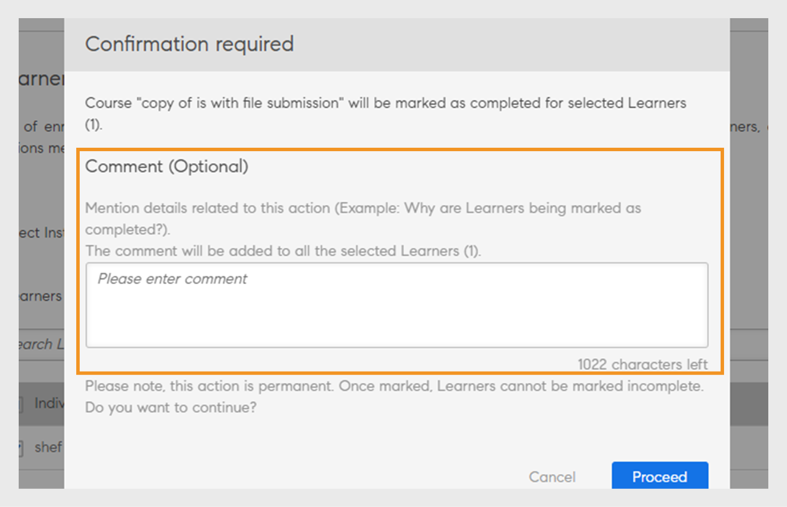
   _完成註解_

此程式與學習路徑與認證程式相同。 對於學習路徑，您可以篩選以選取所有課程，或僅選取個別課程以標籤為完成。

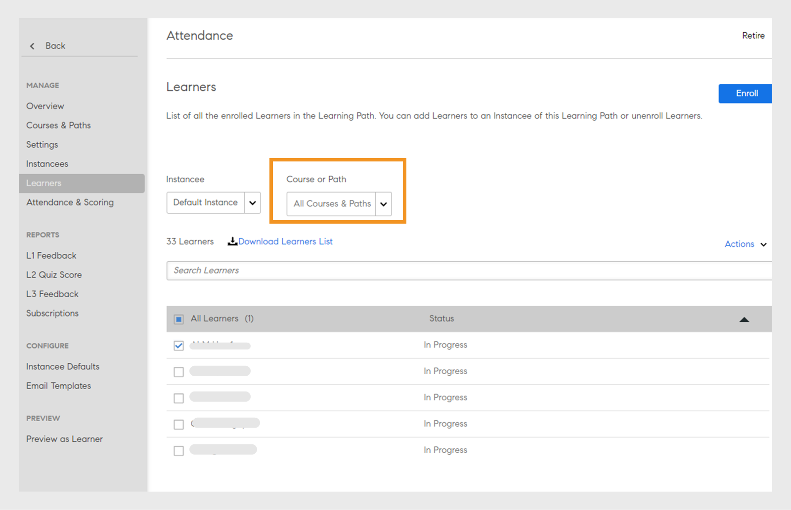
_選取多個課程以完成_

註解將顯示在[學習者成績單](/help/migrated/administrators/feature-summary/reports.md#learner-transcripts)報告中。

## 預覽課程 {#previewcourses}

管理員可以在檢視課程模組時按一下&#x200B;**[!UICONTROL Preview as learner]**&#x200B;選項以預覽課程。

1. 以系統管理員身分登入後，請按一下左窗格上的&#x200B;**[!UICONTROL Courses]**。
1. 從頁面上的課程清單按一下任何課程圖磚。
1. 從左窗格中按一下學習者身分預覽，然後按一下頁面上的模組名稱，即可在播放器中預覽課程模組。

## 課程效果 {#courseeffectiveness}

課程效果評估旨在瞭解課程對學習者的有用性。 這是學習者對課程內容的意見反應、學習者的課程測驗結果，以及經理根據課程學習情況評估學習者的意見反應所形成的組合。

管理員可以在課程縮圖上檢視課程有效程度評等，如下圖快照所示。 您可以看到此課程的評等為100。

<!--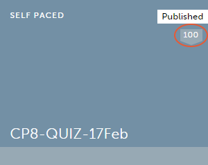-->

課程效果評等值是根據L1、L2和L3的意見值得出的。 若要檢視每個意見回饋的分解，請按一下課程效果值。 此時會出現快顯視窗，如下所示。

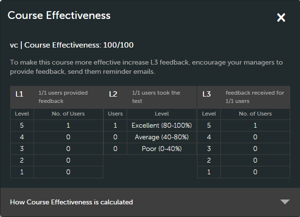

*檢視L1、L2和L3回饋意見的課程成效*

在此範例快照中，每1位使用者會收到所有這三個回應，因此分數為100/100。 從這個表格中，您可以瞭解如果課程未提供這三個意見中的任何一個意見（L1、L2和L3），會對整體效益產生負面影響。 按一下快顯視窗右下角的向下箭頭，檢視課程效果計算的完成方式。

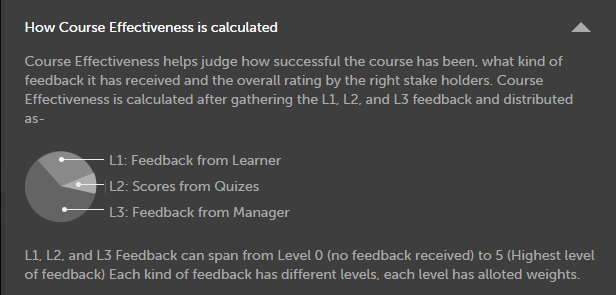

*課程效果計算*

如上圖所示，經理為L3意見反應賦予了更大的權重。

## 搜尋課程和學習計畫 {#searchingcoursesandlearningprograms}

Adobe Learning Manager讓您更容易快速找到您選擇的課程/學習計畫。 搜尋課程有兩種方式：

1. 使用搜尋欄位。 按一下右上角顯示的搜尋圖示。 搜尋欄位隨即顯示。 輸入課程名稱或與課程相關聯的任何關鍵字，以找出您的課程/學習計畫。 您也可以使用預先定義的標籤進行搜尋，例如Captivate、C、Java和HTML。 標籤可在「搜尋」欄位內搜尋，這表示當您輸入時，標籤會顯示在搜尋欄位中。
1. 使用篩選器篩選課程/學習計劃清單。 您可以依狀態篩選課程，例如「全部」、「已發佈」、「草稿」和「已淘汰」。 在管理員模式中，草稿篩選器未出現。

您可以按一下「能力」並選擇它們，根據能力進行搜尋。 身為管理員，您可以透過四種方式排序課程，以便更妥善地找到所需課程。 按一下「排序依據」 ，然後選擇按字母遞增順序、按字母遞減順序、課程更新日期或課程的成效。

<!--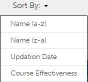-->

學習計畫可依三種方式排序：字母遞增順序、字母遞減順序以及根據更新日期。

## 註冊學習者 {#enrollinglearners}

您可以依照相同步驟，將學習者註冊至課程、學習計畫及認證。 經理也可以透過以下步驟將學習者註冊到其下。

管理員會根據組織要求，為部分學習者註冊必修課程：

1. 將滑鼠移至任何已發佈的課程圖磚上，然後按一下「註冊學習者」 。\
   或者，按一下任何已發佈的課程圖磚，然後按一下左窗格中的學習者。 系統會顯示一個頁面，內含學習者清單。 按一下「註冊」。\
   註冊學習者對話方塊隨即顯示。

1. 從「選取執行處理」下拉式清單中選取執行處理。 下拉式清單會列出所有執行個體，包括使用中、已淘汰和過期的執行個體。

>[!NOTE]
>
>管理員可以按一下學習者頁面上的下拉式箭頭並按一下&#x200B;**[!UICONTROL Actions]** > **[!UICONTROL Remove]**，移除任何已註冊的課程學習者。

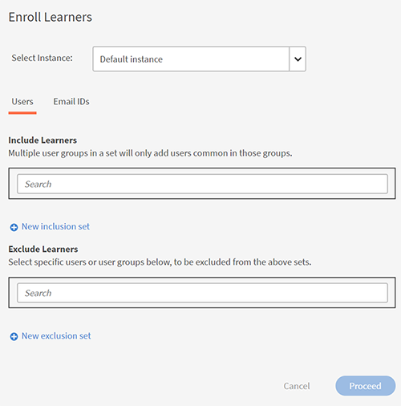

註冊學習者時&#x200B;*新增註解*

*註冊學習者*

## 使用者

+++包含學習者

選取您想要包含的使用者群組和個別學習者（使用電子郵件ID或名稱）。 在同一組下新增交集中的所有使用者群組。 若要在聯合中新增另一個使用者群組，請使用新的包含集。

+++

+++排除學習者

選取您要排除的使用者群組和個別學習者（使用電子郵件ID或名稱）。 在同一組下新增交集中的所有使用者群組。 若要在聯合中新增另一個使用者群組，請使用新的包含集。

+++

## 使用者電子郵件ID

+++電子郵件ID

複製並貼上您想要註冊的學習者的電子郵件ID，以分號、逗號或行距分隔。 使用&#x200B;**[!UICONTROL Validate Email Ids]**&#x200B;選項來驗證專案。 所有無效的專案都會標示為紅色。 移除或修正這些專案，然後按一下&#x200B;**[!UICONTROL Proceed.]**&#x200B;以繼續

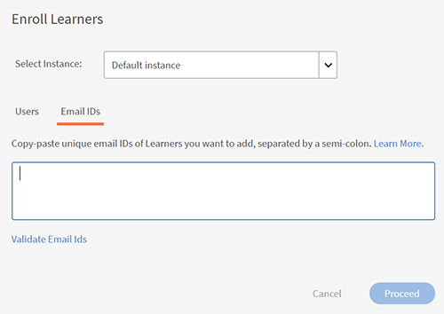

*註冊學習者*

「摘要」對話方塊隨即顯示，顯示包含集、排除集的使用者人數，以及已註冊課程例項的使用者人數。

+++

### 註冊學習者時新增註解 {#enroll-comments}

<!---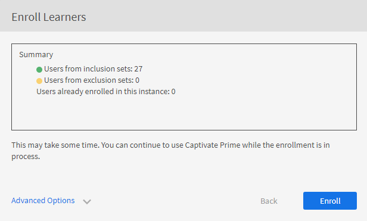-->

身為管理員或經理，您可以在註冊課程學習者時新增註解。 您可以提及關於已註冊使用者同類群組的其他資訊。 此資料會匯出至課程報表。

註解顯示給學習者&#x200B;**not**。

當管理員產生學習者的課程報告時，任何註釋（如果新增）都會顯示在報告中。 「摘要」對話方塊隨即顯示，顯示包含集、排除集的使用者人數，以及已註冊課程例項的使用者人數。

在&#x200B;**[!UICONTROL Enroll Learners]**&#x200B;對話方塊上，展開選項&#x200B;**[!UICONTROL Advanced Options]**。 在&#x200B;**[!UICONTROL Additional Comment]**&#x200B;欄位中輸入必要的註解。

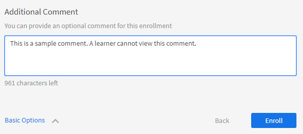

*為學習者新增註解*

## 搜尋已註冊的使用者 {#searchforusers}

使用預先輸入搜尋功能，在學習物件的學習者區段中搜尋已註冊的使用者。 使用預先輸入搜尋，您可使用名稱、電子郵件ID和UUID逐步搜尋已註冊的使用者。

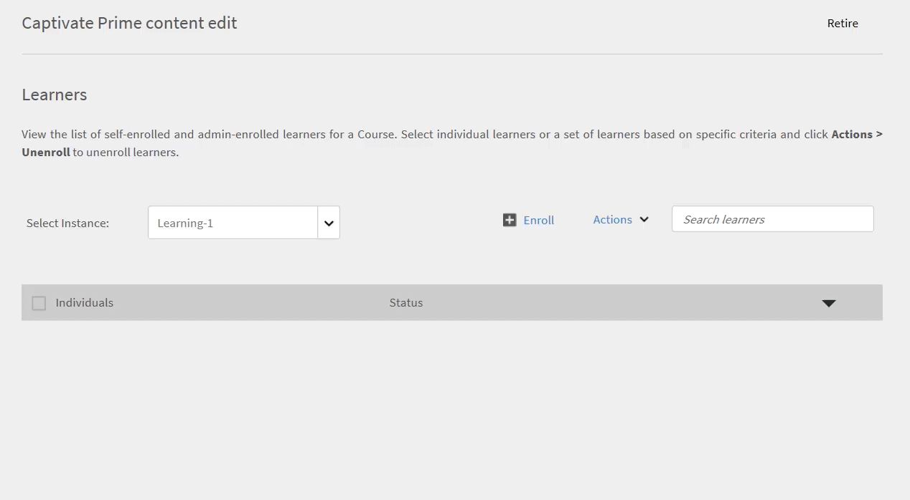

*搜尋已註冊使用者的逐步解說*

這類搜尋有時也稱為自動完成、增量搜尋、「隨型別搜尋」、內嵌搜尋或立即搜尋。

當您在搜尋欄位中輸入學習者或使用者群組時，系統會找到一或多個符合搜尋字詞的專案，並立即顯示給您。

此程式可讓您以比連續執行數次搜尋更快且更輕鬆的方式找到所要尋找的內容。

搜尋後會顯示所有執行個體的學習者或使用者群組。 對於每個學習者，學習者註冊的執行個體會顯示在&#x200B;**[!UICONTROL Instance]**&#x200B;欄中。

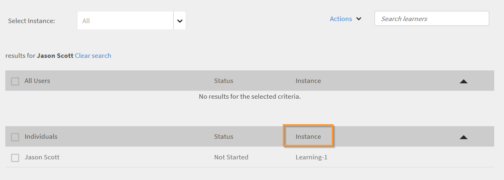

*檢視搜尋結果*

使用預先輸入查閱，您可以：

* 檢視已註冊的所有使用者（無論執行個體為何）。
* 檢視有一或多個已註冊使用者的所有使用者群組。

執行搜尋後，您就無法依例項篩選學習者。 從&#x200B;**[!UICONTROL Select Instance]**&#x200B;下拉式清單中選取執行個體的選項已停用。

此外，您也可以使用搜尋結果，選擇學習者或使用者群組，然後執行下列動作：

* 取消註冊
* 標籤完成
* 重設模組

執行搜尋時，「動作」下拉式清單中的「取消註冊>批次」選項會針對課程/學習計畫停用。

## 與學習者共用二維碼以註冊、完成或兩者 {#shareqrcodewithlearnerstoenrollcompleteorboth}

Adobe Learning Manager的管理員可與學習者共用二維碼，以便快速註冊課程。 這三個不同的QR碼可用來標示課程的「註冊」、「完成」或「註冊與完成」。

學習者只需使用Adobe Learning Manager裝置應用程式掃描個別二維碼即可。

**若要下載QR碼，請執行下列動作**：

1. 按一下左側導覽面板中學習區段的&#x200B;**[!UICONTROL Courses]**。
1. 選取課程> **[!UICONTROL View course]**。
1. 按一下&#x200B;**[!UICONTROL Instances]** > **[!UICONTROL More]** > **[!UICONTROL QR code]**。

   <!--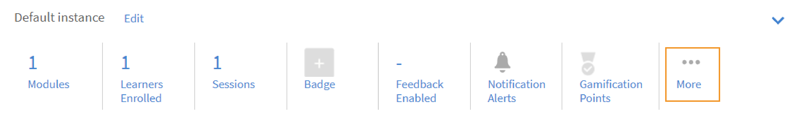-->

1. 啟用二維碼，然後按一下「註冊」、「完成」和「註冊並完成」下載圖示，下載包含每個人的二維碼的pdf。 管理員可與學習者共用二維碼。

   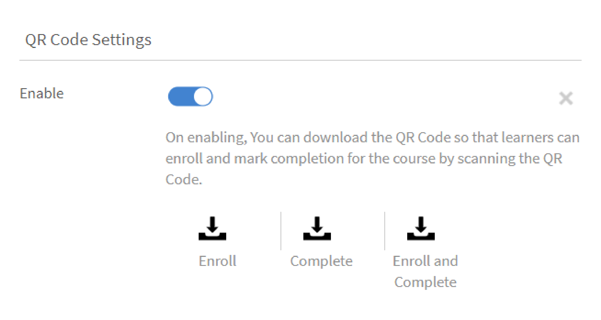

   *與階層連結共用QR碼*

## 課程生命週期 {#courselifecycle}

典型的課程生命週期如下所示：

**草稿** — 作者完成建立課程並儲存時。 在此狀態下，課程尚無法供學習者使用。 您可以刪除處於此狀態的課程。

**已發佈** — 作者完成發佈課程時。 在此狀態，此課程可供學習者註冊。

**已淘汰** — 發佈課程後，如果作者不希望課程出現在學習者的課程目錄中，可以將課程移至淘汰狀態。 您可以在此狀態下重新發佈或刪除課程。

**已刪除** — 處於已刪除狀態的課程是從Adobe Learning Manager應用程式中完全移除的課程。 課程只有在處於草稿狀態時才能由作者刪除。 您也可以從已淘汰狀態刪除課程。

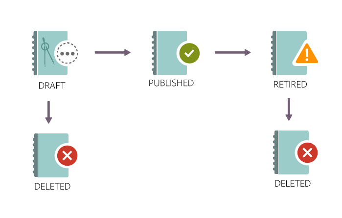

*課程生命週期的工作流程*

## 通知設定 {#notificationsettings}

作為管理員，您可以調整通知設定。 如需詳細資訊，請參閱[通知。](user-notifications.md)

## 常見問題 {#frequentlyaskedquestions}

+++如何將模組重設為管理員？

在課程的學習者頁面上，選擇學習者或學習者或群組，按一下&#x200B;**[!UICONTROL Actions]** > **[!UICONTROL Reset Modules]**。

*檢視重設模組的選項*

按一下選項後，所有選定學習者的模組狀態都會重設。 完成的模組將不會重設。

+++

+++如何新增課程URL，讓學習者直接重新導向課程？

將滑鼠移到課程卡上，然後按一下&#x200B;**[!UICONTROL Copy URL]**。 在您複製URL後，學習者可以直接使用URL存取課程。

+++

+++如何重新開啟執行個體？

若要重新開啟已淘汰的執行個體，請按一下執行個體中的下拉式功能表，然後按一下&#x200B;**[!UICONTROL Reopen instance]**。

+++
