# 建立課程實例與學習路徑

本文件包含協助建立管理員角色的課程模組、實例與課程。

作者會創建課程。 學習者可以選擇修課，管理員則可根據課程使用量追蹤學習者的表現。

## 概觀 {#overview}

作者會創建課程。 學習者隨後修課，管理者可根據課程使用量追蹤學習者的表現。 管理員可查看作者所創建的課程，並依本節說明執行部分活動。 作為管理員，你可以為學習者設計獨特的學習計畫，並預設課程組合。

## 建立課程範例 {#createinstanceofacourse}

### 設置實例

在這場訓練中，你將學習如何設定實例預設值、新增實例、退休並重新開啟實例，以及為實例設定電子郵件範本。

如果你無法啟動訓練，請寫信至 <almacademy@adobe.com>。

### 如何建立實例

作者建立課程後，你可以建立課程的實例。 透過建立課程實例，你可以在不同時間段向學習者提供同一課程。 學習者可選擇任何實例並註冊。 你可以設定每個實例擁有自己的徽章、回饋和其他設定。

要建立一個實例，

1. 在管理員網頁應用程式中，點擊 **[!UICONTROL Courses]** 左側窗格。
1. 在課程列表中，選擇必修課程，然後點擊 **[!UICONTROL View Course]**。

   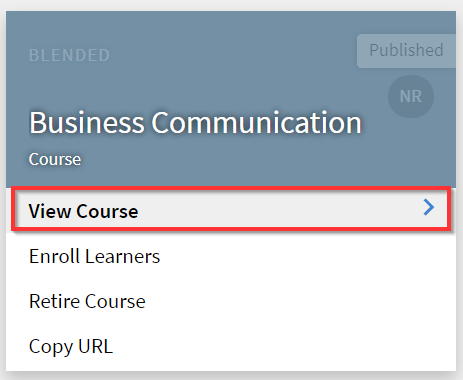

   *查看課程*

1. 要建立實例，請點擊 **[!UICONTROL Instances]** 左側窗格。 每個課程預設都有一個實例。 你可以修改預設實例或新增實例。 你無法刪除這個課程實例。
1. 要建立實例，請點擊 **[!UICONTROL Add New Instance]** 賽道資訊的右上角。 會顯示一個新的課程實例。
1. 進入實例的屬性：

   * 在欄位 **[!UICONTROL Instance Name]** 中輸入你想與該課程關聯的實例名稱。 務必為該事件使用獨特的名稱。
   * 指定該實例的完成截止日期。 學員必須在此日期前完成課程。
   * 點擊 **[!UICONTROL Show More Options]** 以顯示其他截止日期選項。
   * **[!UICONTROL Enrollment Deadline]：** 這是學習者在自我註冊時預期註冊學習對象的日期。
   * **[!UICONTROL Unenrollment Deadline]**：你可以選擇限制學習者自己取消登記，並設定退學截止日期。
   * **[!UICONTROL Timezone]搜尋**&#x200B;後從下拉選單中選擇。**[!UICONTROL Timezone]**

   管理員可根據需求決定課程或學習計畫的完成期限。 不過，建議設置教室/虛擬教室訓練的課程。

   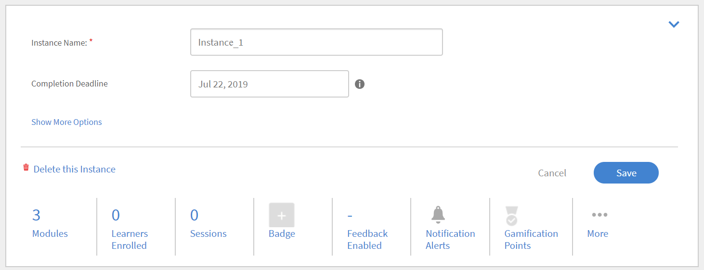

   *設定完成期限*

### 查看實例的屬性 {#viewpropertiesoftheinstance}

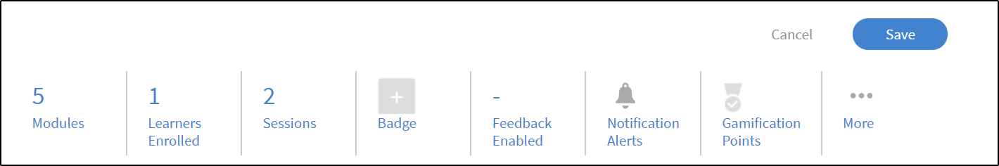

*查看實例的屬性*

1. **模組：** 課程作者所創建的模組數量
1. **註冊學習者數：** 由管理員註冊課程的學習人數。
1. **課程時段：** 課程中虛擬教室與教室模組的數量。
1. **啟用回饋：** 顯示本課程是否啟用 L1、L2 和 L3 回饋。

>[!NOTE]
>
>管理員會透過到 Instances > Sessions 並選擇取消 Sessions 來取消會話。

### 管理實例

>[!INFO]
>
>在這套訓練中，你將學習如何編輯實例細節與實例屬性。    

如果你無法啟動訓練，請寫信至 <almacademy@adobe.com>。

### 退休一個實例 {#retireaninstance}

要退休一個實例，請執行以下步驟;

1. 在實例中，選擇下拉選單並選擇 **[!UICONTROL Retire instance]**&#x200B;選項。

   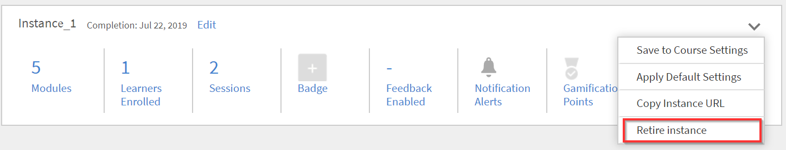

   *退休一個實例*

1. 要搜尋所有已退休的實例，請點擊實例頁面的分頁 **[!UICONTROL Retired]** 。

### 還原一個實例 {#restoreaninstance}

要將已退休的實例恢復為啟用狀態，請執行以下步驟：

1. 在實例中，點擊下拉選單並選擇選項 **[!UICONTROL Reopen instance]**。

   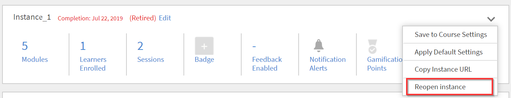

   *還原一個實例*

1. 實例會被恢復為主動模式。

### 刪除實例

管理員可以在實例建立後立即使用 **「刪除此實例** 」選項刪除實例。 如果有連結的實例，或有學習者註冊，你就無法刪除實例。

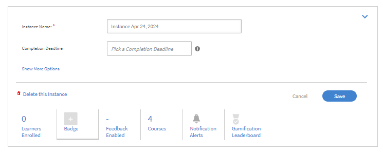

*刪除實例*

>[!NOTE]
>
>你無法刪除預設實例。

### 發送實例層級電子郵件

要向已註冊學習者發送實例層級電子郵件：

1. 在頁面 **[!UICONTROL Instances]** 上，選擇任一實例的選項，然後點擊 **[!UICONTROL Email Enrolled Learners]**。

*電子郵件：註冊於實例的學習者*

1. 在對話框中 **[!UICONTROL Create Announcement]** ，選擇「輸入為電子郵件」。 請指定主旨，輸入訊息，然後點擊 **[!UICONTROL Save]**。 培訓內容會自動選擇。

   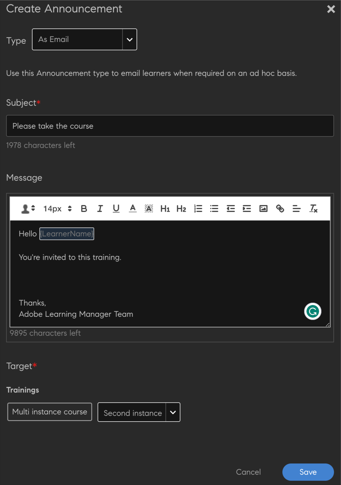

   *建立電子郵件公告*

1. 點擊 **[!UICONTROL Save]**&#x200B;後，你會看到公告成功建立的確認訊息。 若要發布公告，請點擊 **[!UICONTROL Publish Now]**。

   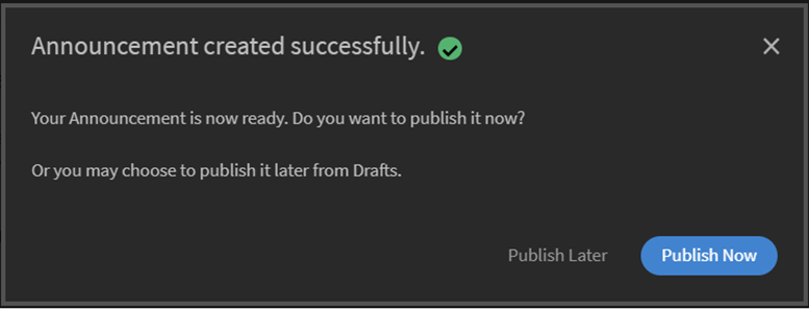

## 為學習者報名課程

在本次培訓中，您將學習如何註冊、退選及重新註冊學員。

如果你無法啟動訓練，請寫信至 <almacademy@adobe.com>。

### 在不同情況下為學生報名

1. 從課程列表中選擇一門課。
1. **[!UICONTROL Learners]**&#x200B;選擇左側面板。
1. 選擇 **[!UICONTROL Enroll]**。

   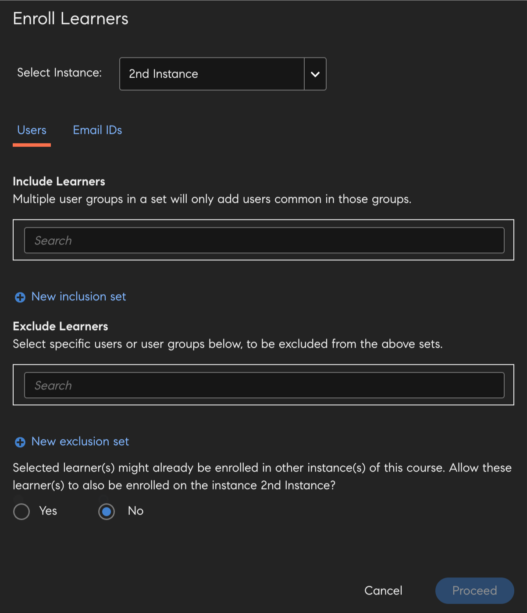

   *發布課程*

1. 在 [!UICONTROL **「註冊學習者**] 」對話框中，您可以：

   * 從「選擇實例」下拉選單選擇一個實例以註冊學習者。
   * 在「包含學習者」欄位中選擇使用者或使用者群組，或兩者皆可選擇。
   * 在「排除學習者」欄位中選擇你想排除的學習者。
   * 在對話框底部，若你希望某個學習者或多個學習者註冊在所選實例中，請選擇「是」。

1. 選擇 **[!UICONTROL Proceed]**。

   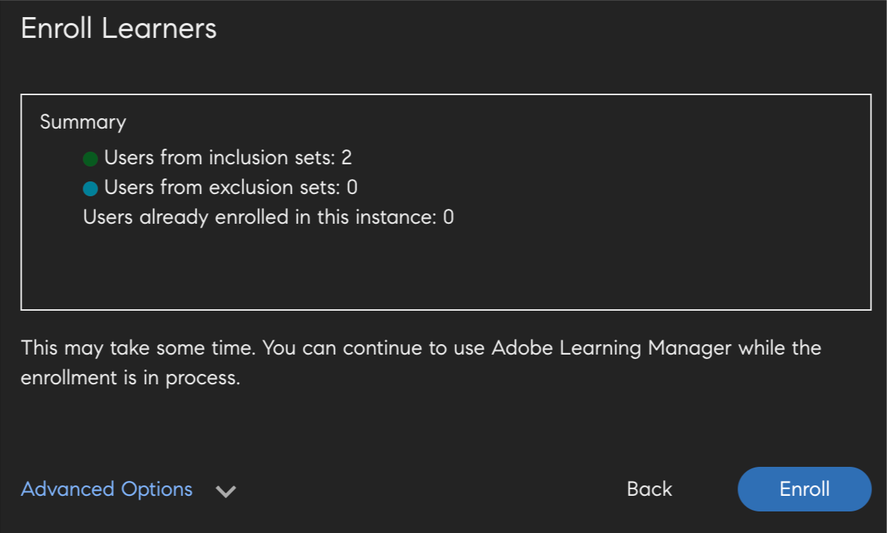

   *接著開始招收學員*

### 查看實例的註冊報告

1. 從課程列表中選擇一門課。
1. **[!UICONTROL Learners]**&#x200B;選擇左側面板。
1. 選擇 **[!UICONTROL Actions]** > **[!UICONTROL Export]**。

Excel 檔案包含每個實例的工作表。 工作表包含以下欄位：

* 學習者
* 電子郵件
* 使用者唯一識別碼
* 課程名稱
* LO 唯一識別碼
* 現況
* 納入標準
* 註冊日期 / 退選日期（UTC時區）
* 完工日期（UTC時區）
* 預產期（UTC時區）
* 開始日期（UTC時區）
* 測驗分數
* 經理人姓名
* 地址
* 使用者狀態
* 專業領域
* 留言
* 參觀次數
* 參觀日期
* 時間戳記（UTC時區）
* 花費時間（分鐘）

>[!NOTE]
>
>啟用多重選課後，每門課程的學習者成績單報告會新增多列（每個實例一列）。
>
>如果你設定的報表自動化預設每門課只包含一列，必須先對報表自動化做必要的調整，才能啟用多重報名功能。

### 管理課程學習者名單 {#managelearnerslistforacourse}

1. 點擊課程縮圖上的課程名稱。
1. 從左側窗格點擊 **[!UICONTROL Learners]**。

*課程中的部分學習者*

你可以從學習者頁面執行以下操作：

* 選擇你想移除的學習者，然後點擊 [!UICONTROL **「動作**] 」> [!UICONTROL **「移除**]」。
* 選擇你想標記的學習者，並點選 [!UICONTROL **「動作**] 」> [!UICONTROL **「標記完成**]」。

若要讓學習者重置模組並再次使用該模組，請點擊 [!UICONTROL **「重置**]」。 從彈出視窗中，點選「是」以確認重置。 已完成的模組無法重置。 只有失敗或不完整的模組才能被重置。

你也可以把學習者名單匯出成 Excel 表格。 要匯出學習者清單，請點擊 [!UICONTROL **「動作**] 」> [!UICONTROL **「匯出**]」。

>[!NOTE]
>
>若同一課程有多個實例，Excel 中的學習者名單會分別在每個分頁中提供。 學習者名單包含學習者姓名、狀態及選拔標準。 學習者狀態可為 **未開始**、 **進行中**&#x200B;或 **完成**。

### 待核准狀態的出口學習者

管理員、經理或自訂管理員可以匯出處於待核准註冊狀態的學習者資料。 你可以透過 **課程>學習者** 標籤匯出資料，並點擊動作下拉選單。

當沒有學習者註冊/尚未核准經理核准課程時，該選項會出現，且會產生空白報告。 你也可以匯出學習者處於待審核狀態、已登記狀態、待審核狀態和未登記狀態。

報告包含活躍、已刪除及暫停用戶的資料（若用戶正等待核准）。 報告中還包含處於待審核狀態的內部及外部使用者資料。

如果先前處於待核准州的學習者退學，他的紀錄將不會出現在報告中。 此外，如果先前處於待審核狀態的學員，透過管理員/經理/自訂管理員註冊註冊，他的紀錄也會出現在報告中。

## 批量管理學員註冊、出席及完成 {#bulk-enrollment}

利用 Adobe Learning Manager 的批量註冊功能，管理員能透過上傳 CSV 檔案，有效為大量學習者註冊課程、證照或學習計畫。 此流程節省時間、確保一致性，並支持組織的可擴展性。 此外，管理員與講師可透過 CSV 上傳批量更新學習者資訊、出席狀況及完成紀錄，減少人工作業並確保資料準確性。

你可以使用相同的 CSV 檔案格式來登記、出席和完成。 只要在「Email」欄位輸入學習者的電子郵件 ID，並根據動作名稱儲存檔案，例如 bulk_enrollment.csv、bulk_attendance.csv 或 bulk_completion.csv。 只支援 CSV 格式。 不支援 UTF-8 格式。 下載 [範例 csv](assets/Sample-Bulk-Action-CSV.csv)。

### 使用 CSV 批量註冊學習者

管理員可透過上傳 CSV 檔案，同時註冊最多 100,000 名使用者，而非一次新增學習者。 檔案必須包含一個標示 **為 userEmail** 的欄位，內含待註冊學習者的電子郵件地址。

使用 CSV 招募大量學習者：

1. 以管理員身份登入。
2. 從該 **[!UICONTROL Courses]** 區段選擇一門課程。
3. 在頁面中&#x200B;**[!UICONTROL Course Overview]**&#x200B;選擇&#x200B;**[!UICONTROL Learners]**。
4. 選擇 **[!UICONTROL Enroll]** ，然後選擇 **[!UICONTROL Upload a CSV]**。\
   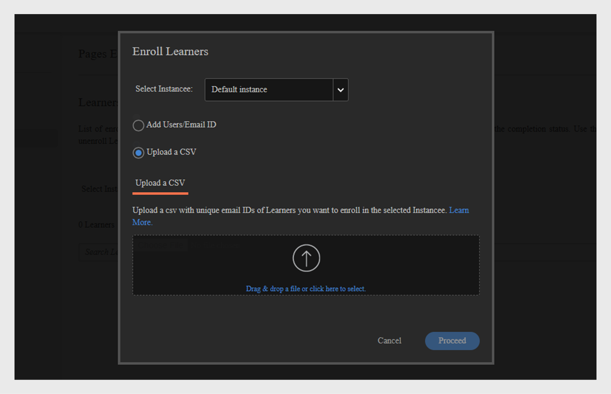
   _使用 CSV 上傳的學習者註冊_
5. 上傳 CSV 並選擇 **[!UICONTROL Proceed]**。

CSV 檔案中包含一個標示為「使用者電子郵件」的欄位。 請在此欄位輸入您用戶的電子郵件地址。

### 批量完成標記課程

管理員可透過上傳包含多位學習者的電子郵件地址 CSV 檔案，快速標記多位學員的課程完成紀錄。 這比逐一更新每位學習者節省了時間。 CSV 的 userEmail 欄位顯示需要更新的學習者。 你可以在一次上傳中標記多達 10,000 名學習者為完成。

為了標示整體完成：

1. 從該 **[!UICONTROL Courses]** 區段選擇一門課程。
2. 在頁面中&#x200B;**[!UICONTROL Course Overview]**&#x200B;選擇&#x200B;**[!UICONTROL Learners]**。
3. 選擇， **[!UICONTROL Actions]** 然後 **[!UICONTROL Mark Completion]**。
4. 選擇 **[!UICONTROL Bulk]**。
5. 上傳一個 CSV 檔案，並附上 userEmail 欄位，列出已完成課程的學習者。

   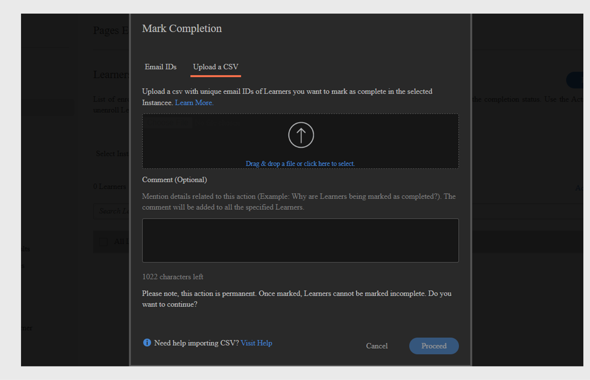
   _使用 CSV 標記批量完成_

### 大量出席

管理員可利用大量出勤功能同時為多位學習者標記出勤。 管理員不必逐一更新每位學員的出席情況，而是可以上傳包含學員電子郵件地址的 CSV 檔案。 CSV 中的 userEmail 欄位會標示要記錄哪些學習者的出席情況。 此流程可一次上傳處理多達 10,000 名學習者，使出勤評分更快速且更有效率。

為了標示整體出席人數：

1. 從該 **[!UICONTROL Courses]** 區段選擇一門課程。
2. 在頁面中&#x200B;**[!UICONTROL Course Overview]**&#x200B;選擇&#x200B;**[!UICONTROL Attendance & Scoring]**。
3. 選擇 **[!UICONTROL Actions]** ，然後選擇 **[!UICONTROL Mark Bulk Attended]**。
4. 上傳包含 userEmail 欄位的 CSV 檔案，裡面有你想更新出勤狀況的學習者的電子郵件地址。

   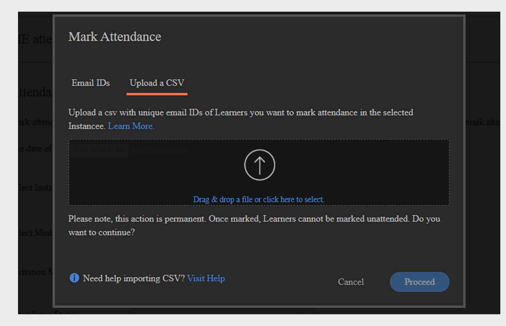
   _使用 CSV 標記大量出勤_

>[!NOTE]
>
>你可以使用 CSV 批量標記最多 10,000 名用戶的出席。

### 常見的 CSV 上傳錯誤

* 學習者在 CSV 中的電子郵件不存在於 Adobe Learning Manager 使用者目錄中。
* 檔案格式不正確。
* 檔案包含額外的欄位或無效資料。

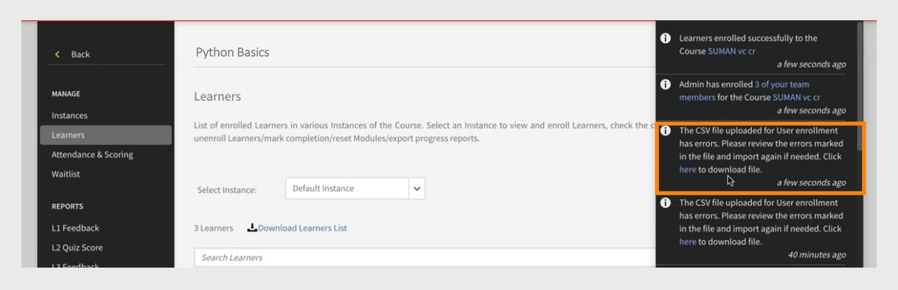
_錯誤通知_

你可以下載並查看包含錯誤的 CSV 檔，方便辨識錯誤。

## 候補名單

候補名單區允許學生在名額有限時，依選課順序被列入候補名單。 行政人員可透過選擇候補學員並分配超出初始限制的名額來管理此事。 一旦管理員分配名額，學員即立即註冊該課程。

### 候補名單報告

Adobe Learning Manager 允許管理員下載所有課程實例的候補學習者名單。 管理員可從頁面的 **[!UICONTROL Course Overview]** 候補名單區段存取此報告。

以下是候補名單報告中的欄位：

* 課程名稱
* 實例名稱
* 實例識別碼
* 實例狀態
* 使用者名稱
* 電子郵件
* 使用者唯一識別碼
* 註冊日期（UTC時區）
* 現況
* 候補名單號碼
* 候補名單限制
* 席次限制

從管理員區下載報告：

1. 登入為 **[!UICONTROL Admin]**。
2. 到該 **[!UICONTROL Course]** 區塊選擇必修課程。
3. 在頁面中選擇該 **[!UICONTROL Waitlist]** 選項 **[!UICONTROL Course overview]** 。
4. 選擇&#x200B;**[!UICONTROL Actions]**>**[!UICONTROL Export Report]**&#x200B;下載報告。**[!UICONTROL Waitlist]**

   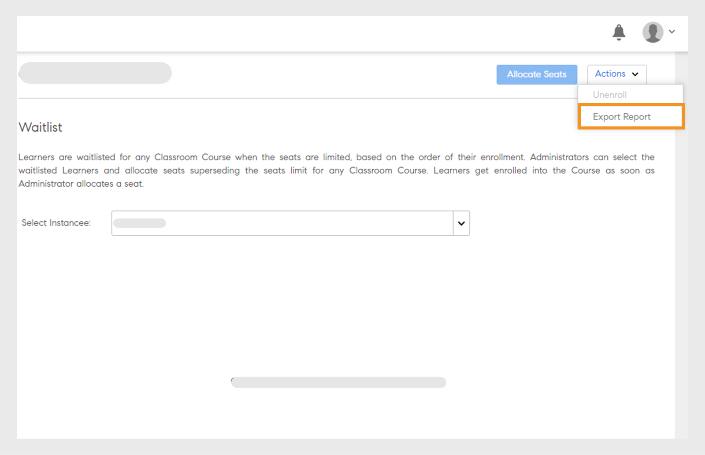
   _出口報告_

## 出口學習者的出席率 {#attendance}

對於任何教室和VC課程，你都可以下載曾參加過此課程的學習者名單。

在課程詳情頁面，點擊 **[!UICONTROL Attendance and Scoring]** 右側窗格。

在頁面右上角，點擊 **[!UICONTROL Actions]** 下拉選單。 然後點選 **[!UICONTROL Export Learner List (PDF)]**。

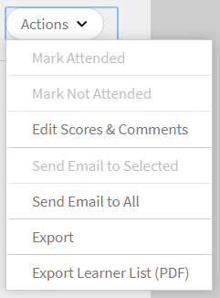

*學習者名單匯出為 PDF*

在 PDF 中，你可以查看與講師相同的學習者集合。

下載 PDF 後，你可以看到創建課程時使用的時區（UTC）。

## 加入 L1 和 L3 反饋 {#addl1andl3feedback}

>[!NOTE]
>
>如果你的帳戶中沒有顯示這個回饋選項，代表你的帳戶已經升級到新的 L1 回饋表單。 欲了解更多資訊，請參閱 [L1回饋表](/help/migrated/administrators/feature-summary/l1-feedback-form.md) 單。

你可以在創建課程時新增 L1 和 L3 的回饋選項：

1. 登入後，請在左側窗格點選「課程」。 所有課程列表顯示在右側頁面。
1. 點選你想新增 L1 或 L3 回饋的課程圖塊。
1. 點選左側窗格的實例預設。
1. 點擊 L1 或 L3 反饋旁邊的圓形開關按鈕即可啟用。
1. 在「L3 問題」下方的文字區新增 L3 回饋問題。

### 強制性的 L1 回饋 {#mandatory-l1-feedback}

你可以把所有問題或第一題設為 L1 回饋的必修。

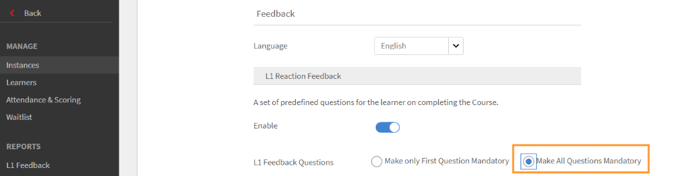

*把所有問題或第一題都設為L1回饋的必修*

現在，你可以創建這些問題，這些問題現在成為必須的。

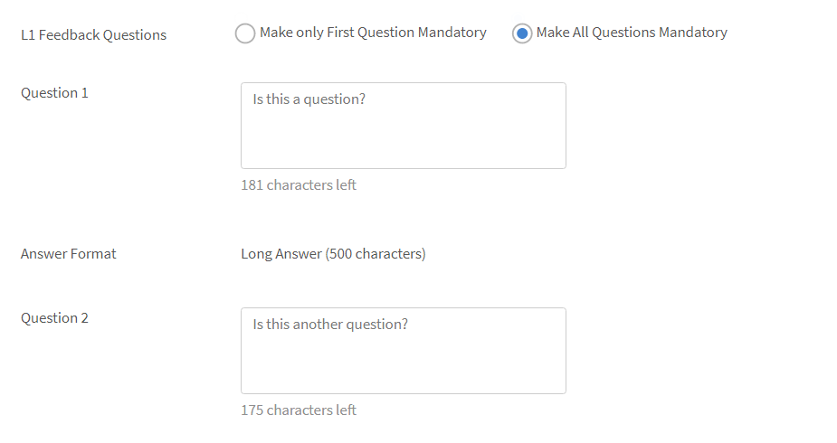

*創造問題*

如果這兩題必修題目因某些原因沒有文字，這些問題就不會出現在回饋表單中。

>[!NOTE]
>
>僅僅在學習程式實例中啟用這些設定是不夠的。 你也必須在學習程式中每門課程的課程實例層級啟用這些設定。

在實例預設頁面，如果你啟用 **[!UICONTROL Make All Questions Mandatory]**，之後所有新建立的實例都會繼承這些設定。

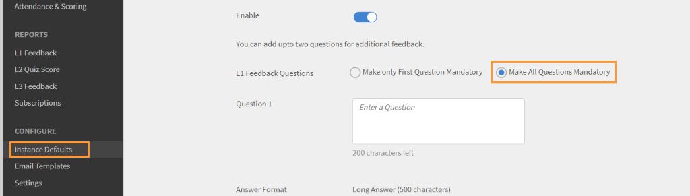

*查看實例預設頁面*

### 課程層級的母語回饋 {#l1-feedback-course-level}

在先前版本的學習管理員中，管理員可以啟用學習程式的 L1 回饋。

在此版本的學習管理員中，管理員可對所有屬於學習計畫的課程發送 L1 回饋。 管理員必須確保所有課程在課程實例層級啟用 L1 回饋。

1. 要啟用每門課程的 L1 回饋，請在管理應用程式中點擊 **[!UICONTROL Learning Programs]** > **[!UICONTROL View Learning Program]**。

1. 點擊 **[!UICONTROL Instances]** > **[!UICONTROL L1 Feedback Enabled]**。

1. 啟用這個選項 **[!UICONTROL Enable for Each Course]**。

   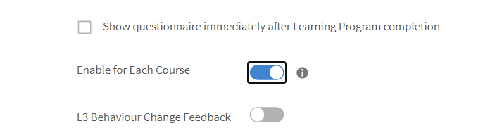

   *啟用課程回饋*

   只有在學習程式層級啟用此開關，不會觸發該程式內課程的 L1 回饋。 要啟用 L1 回饋，請進入學習程式中的每門課程並啟用 L1 回饋切換。

   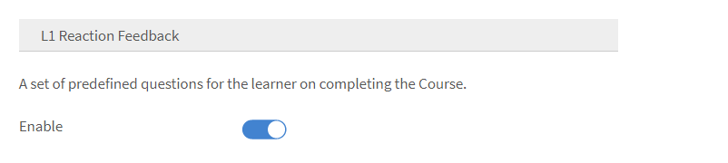

   *為每門課程啟用 L1 回饋*

   如果所有課程都啟用了 L1 回饋，但在學習程式實例中卻被關閉，那麼該課程就不會觸發 L1 回饋。

### 語言專屬測驗報告

測驗報告有助於評估學習者完成學習計畫或課程後的表現。

Learning Manager 目前支援 13 種介面語言及 32 種內容語言的學習。 雖然此選項對學習者友善且便利，有助於支持全球學習者，但管理者在不同地點查詢報告仍相當費力。

測驗報告，若課程以多種語言提供，則可顯示不同語言的資料。 直到現在，管理員產生的報告會依序顯示答案，無論測驗語言為何。 **例如**，如果使用者用荷蘭語做過測驗，管理員一次只能查看用戶嘗試的荷蘭語測驗報告。 選擇英文作為介面語言的管理員，無法同時查看所有使用者的報告，無論嘗試進入哪個地點。

此問題現已解決，管理員現在能一次查看學習者嘗試的所有報告，無論選擇哪種內容地點。 嘗試不同語言的測驗將作為測驗報告中的額外欄位加入。

### 在帳號層級啟用 L1 回饋 {#l1-feedback-account-level}

*在帳號層級啟用 L1 回饋*

管理員可以透過在帳號層級開啟此設定，啟用新建立課程和學習程式的 L1 回饋。 然而，開啟此設定不會影響現有課程與學習計畫

若啟用，所有新訓練和新實例都會預設啟用回饋功能。 如果作者或管理員造訪該實例，實例會自動預設並手動關閉，然後才會被尊重。

要啟用 L1 回饋，請在管理應用程式中點擊 **[!UICONTROL Settings]** > **[!UICONTROL Feedback]**。

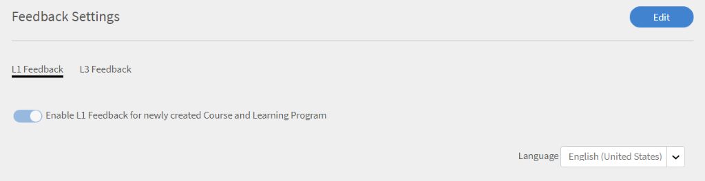

*查看回饋設定頁面*

點擊 **[!UICONTROL Edit]** 右上角，切換啟用 L1 回饋的選項。

當作者建立課程時，在管理應用程式的實例頁面，該 **[!UICONTROL L1 feedback]** 課程會自動啟用。

<!--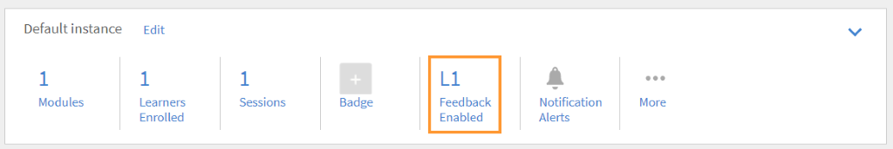-->

你也可以透過切換 **[!UICONTROL Enable]** 選項來關閉 L1 回饋，如下所示：

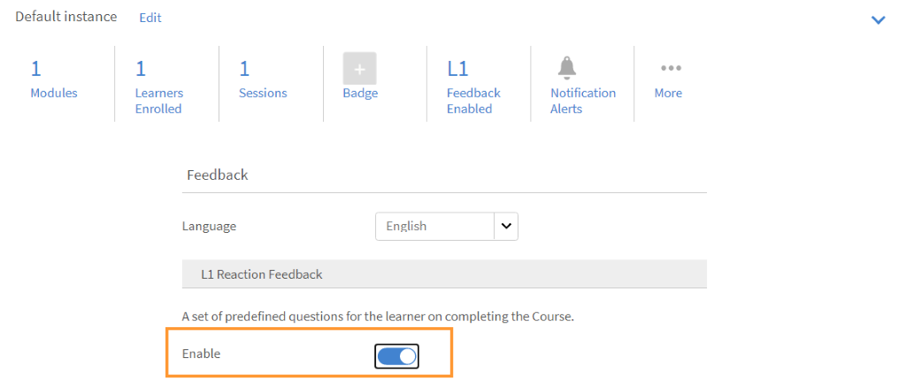

*啟用或停用 L1 反饋*

### 為第一語言和第三語言的 feeedback 加入描述性問題 {#descriptive}

作為 Learning Manager 十一月版本的一部分，新增了描述性問題的選項。 管理員可以選擇向學習者新增這些問題。 此規定是 Learning Manager 預設問題集的補充。 如果需要，你也可以選擇問題下方的選項，將這些設定為強制性。

你可以新增兩個描述性問題給第一語言回饋，一個描述性問題給第三語言回饋。

啟用 L1 回饋後，你可以如以下快照所示查看選項。

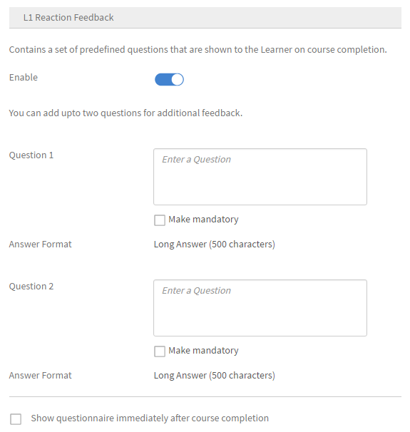

*為第一語言和第三語言回饋加入描述性問題*

如果你希望問卷在課程結束後立即顯示給學習者，可以依此選擇。

以下提供第一語言問卷的範例輸出供參考。 學習者可依以下格式查看問卷。 Test-1 和 Test-2 是描述性問題。

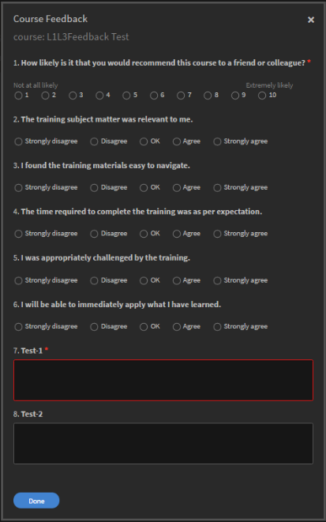

*範例課程回饋問題*

啟用 L3 回饋後，您可以查看以下快照所示的選項：

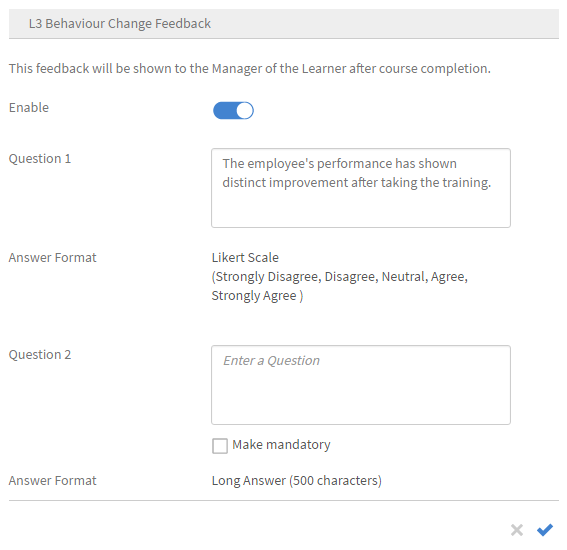

*啟用 L3 反饋*

問題2是L3回饋的描述性問題。 你可以點擊問題下方的選項，將此設定為強制性。

以下提供L3問卷的範例輸出供參考。 學習者可依以下格式查看問卷。

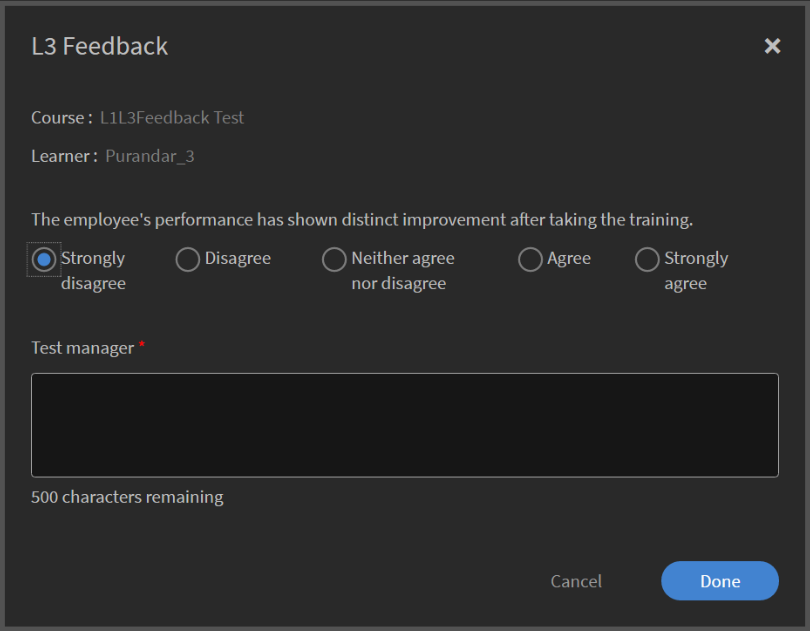

*查看 L3 反饋輸出*

### 設置第一語言和第三語言回饋問卷 {#setupl1andl3feedbackquestionnaire}

你可以設定 L1 和 L3 的回饋問卷，也可以在帳號層級設定提醒。

1. 登入管理員後點選&#x200B;**[!UICONTROL Settings]****[!UICONTROL Feedback]**&#x200B;左窗格。\
   回饋設定頁面會出現兩個分頁： **[!UICONTROL L1 Feedback]** 和 **[!UICONTROL L3 Feedback]**。\
   **[!UICONTROL L1 Feedback]** 分頁包含課堂與自學課程的預設 **[!UICONTROL L1 feedback]** 問卷清單及提醒設定。 在分頁中 **[!UICONTROL L3 Feedback]** ，你可以查看 L3 反饋的預設語句和提醒設定。

1. 點擊頁面右上角的編輯，以修改現有問卷。\
   在 **[!UICONTROL L1 Feedback]** 分頁中，你可以點擊是/否切換按鈕來啟用或停用每個問題。\
   在 Tab 裡 **[!UICONTROL L3 Feedback]** ，你可以修改預設的回饋語句。\
   點擊 **[!UICONTROL Add New Reminder]** 頁面底部，選擇何時發送提醒。

1. 點擊 **[!UICONTROL Save]** 頁面右上角。

在第一語言回饋中，你會看到兩組問卷和一個預設問題。 第一組問卷指的是自學課程，也可用於活動型課程。 第二組問卷可用於教室及線上教室類型的課程。

## 查看 L1 與 L3 回饋 {#viewl1andl3feedback}

您可以查看學習者為課程提供的 L1 回饋，以及經理為學習者提供的 L3 回饋。

1. 點擊課程列表中的任何課程圖塊。
1. 點擊左側面板的 L1 回饋或 L3 回饋，即可查看收到的回饋。
1. 從下拉選單中選擇該實例，即可查看該實例的回饋。

## 討論區

討論區功能允許學習者查看課程討論。 作為管理員，你可以隨時刪除任何留言。 管理員可以在課程設定中啟用此選項。

## 課程管理 {#coursemoderation}

每當作者新增、更新或刪除模組並重新發布課程時，所有管理員都會收到相關通知。 作為管理員，你可以查看變更，點擊連結比較舊內容與新內容，並依此批准或拒絕變更。

要啟用課程管理，請點擊 **[!UICONTROL Settings]** > **[!UICONTROL General]**。 勾選 **[!UICONTROL Course Moderation]** 勾選方塊以啟用此功能。

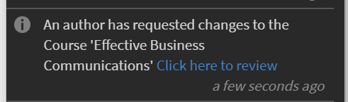

*啟用課程管理*

點擊通知以查看作者對課程所做的變更。 接著，可以批准或拒絕作者所做的修改。 如果您選擇批准，課程將重新發布。 如果你拒絕更新，舊版本的課程仍會繼續存在。 無論哪種情況，都會向作者發送通知。

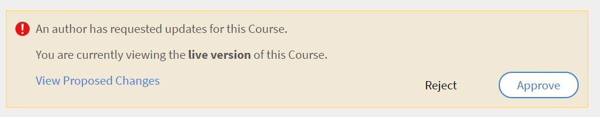

*作者課程更新請求*

若有多位作者同時更新同一課程，最新或最後執行的變更會反映在管理員通知中。 接著你可以批准或拒絕最新的變更。

## 出口檢查清單資料 {#export-checklist-data}

從課程清單中開啟包含檢查清單的課程。 在左側窗格，你會看到一個選項 **[!UICONTROL Checklist]**。

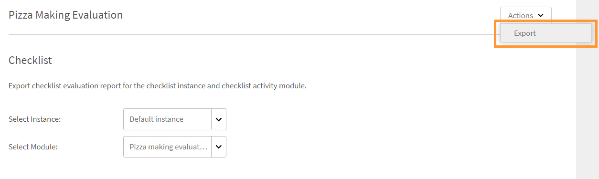

*出口檢查清單資料*

點擊選項，在課程頁面執行以下操作：

1. 選擇實例和模組。
1. 點擊 **[!UICONTROL Actions]** > **[!UICONTROL Export]**，然後匯出學習者檢查清單報告。

在該 **[!UICONTROL Checklist]** 頁面上，講師可以從下拉選單匯出檢查清單報告 **[!UICONTROL Actions]** 。

CSV 報告包含以下欄位：

* 使用者名稱
* 使用者電子郵件
* 經理姓名與電子郵件
* 訓練名稱
* 訓練實例
* 講師姓名與電子郵件
* 提交於
* 評估狀態
* 問題-附文字
* 使用者狀態
* 簡介
* 活躍領域

當您選擇狀態篩選器下載報告時，下載的學習者成績單報告會包含根據該狀態篩選器所設定的學習者資料。 這個新增的篩選器也會顯示給自訂管理員和經理，當他們準備產生學習者成績單時。

## 觀賞課程 {#viewingcourses}

作為管理員，您可以查看所有可用課程的清單。   點擊 **[!UICONTROL Courses]** 左側窗格查看課程清單，並可搜尋與篩選選項。 你也可以在課程縮圖上查看每門課程的效能百分比。

>[!NOTE]
>
>你可以在課程完成後退休，或在課程發佈後暫停。 只有課程已公開州份，才能退休。 所有退役課程的清單可點擊 **[!UICONTROL Retired]** 標籤查看。

## 查看測驗分數 {#viewquizscores}

1. 點擊課程縮圖上的課程名稱。
1. 點擊左側面板的測驗分數。

你可以根據使用者名稱或每個問題查看任何特定課程的小測驗分數。 請依序選擇「依使用者」或「依問題」分頁。

從下拉選單選擇實例類型，即可查看每個實例的分數。

## 預設實例

管理員可以在頁面中設定預設徽章、遊戲化設定和提醒 **[!UICONTROL Default Instance]** 。 若要修改預設實例設定，請選擇 **[!UICONTROL Default Instance]** > **[!UICONTROL Edit]**。

* **[!UICONTROL Badge]**：從下拉選單選擇預設徽章。
* **[!UICONTROL Gamification]**：配置遊戲化設定，包括完成點數、提前完成點數及及時完成點數。 管理員可以選擇帳號層級設定或自訂此事件的遊戲化點數。
* **[!UICONTROL L1 Reaction Feedback]**：啟用預定義問題，供課程結束後的學習者回饋，並可選擇將問題設為必修。
***[!UICONTROL  L3 Behaviour Change Feedback]**：課程結束後，啟用學習者經理的回饋問題。
***[!UICONTROL  Reminder Settings]**：設定並管理截止日期提醒，並提供升級選項。

### 設定升級等級 {#escalation}

管理員必須明確選擇升級等級至：

* 經理
* 經理與跳級級經理

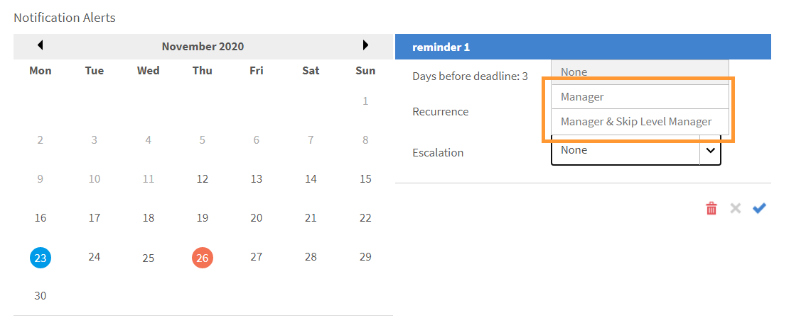

*設定升級等級*

## 完成評論

管理員在標記任何學習者為課程、學習路徑或認證完成時，可以留下留言。 這些意見有助於合規與稽核。 管理員可以輕鬆地同時為一位學習者或多位學習者新增評論。

### 新增完成註解

請依照以下步驟添加完成評論：

1. 以 . 登入。**[!UICONTROL Admin]**
2. 到頁面 **[!UICONTROL Courses]** 選擇課程。
3. 請在課程頁面選擇 **[!UICONTROL Learners]** 。
4. 選擇個別學習者或多位學習者。
5. 選擇 **[!UICONTROL Actions]** ，然後選擇 **[!UICONTROL Mark Completion]**。
6. 在對話框中輸入你的完成留言。

   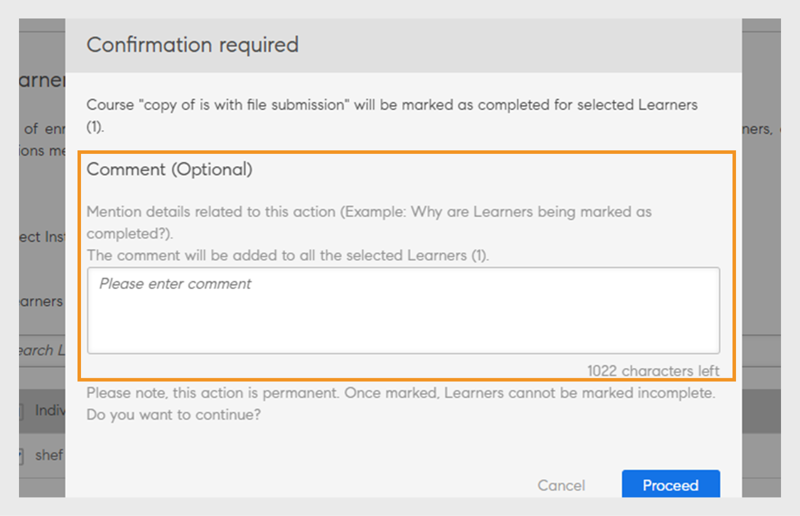
   _完成評論_

學習路徑和認證的流程也是一樣的。 學習路徑方面，你可以篩選出全部課程或只選單一課程標記為完成。

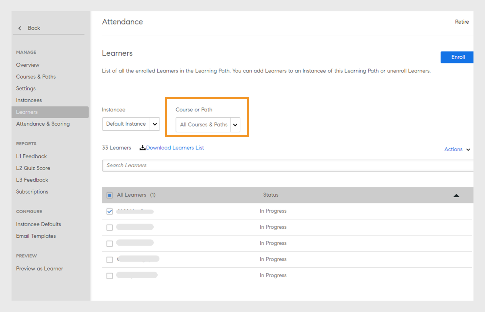
_選擇多門課程完成_

這些評論會在學習者成績單](/help/migrated/administrators/feature-summary/reports.md#learner-transcripts)報告中顯示[。

## 預覽課程 {#previewcourses}

管理員可在瀏覽課程模組時點擊 **[!UICONTROL Preview as learner]** 選項預覽課程。

1. **[!UICONTROL Courses]**&#x200B;登入後點擊左側窗格。
1. 從頁面上的課程列表中點擊任一課程磁貼。
1. 從左側窗格點擊「以學習者身份預覽」，並點擊頁面上的模組名稱，即可在播放器中預覽課程模組。

## 課程效能 {#courseeffectiveness}

課程效能評估用以了解課程對學習者的實用性。 它是結合學習者對課程內容的回饋結果、學習者的課程測驗結果，以及經理根據課程學習對學習者的回饋評估的綜合結果。

管理員可在課程縮圖上查看課程效能評分，如下圖所示。 你可以看到這門課的評分是100分。

<!---->

課程效能評分值是根據L1、L2及L3的反饋值得出。 要查看每項回饋的拆分，請點擊課程效能值。 下方會顯示一個彈出視窗。

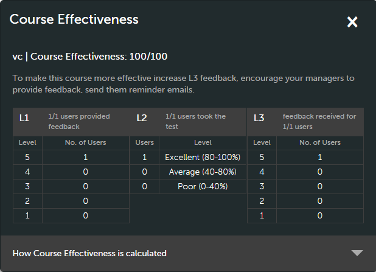

*查看課程成效，以獲取L1、L2及L3回饋*

在這個範例快照中，每1位用戶就有1位收到了全部三個回饋，因此分數是100/100。 從這張表你可以理解，如果課程中沒有提供任何三項回饋（L1、L2 和 L3），會對整體效能產生負面影響。 點擊彈出視窗右下角的下箭頭，即可查看球場效能的計算方式。

*路徑效能計算*

如上圖所示，管理層的回饋權重較高。

## 搜尋課程與學習計畫 {#searchingcoursesandlearningprograms}

Adobe Learning Manager 讓你更容易快速找到心儀的課程和學習程式。 你可以用兩種方式搜尋你的課程：

1. 使用搜尋欄位。 點擊右上角顯示的搜尋圖示。 會出現一個搜尋欄位。 輸入課程名稱或與課程相關的關鍵字，即可找到你的課程或學習計畫。 你也可以用預設標籤搜尋，如 Captivate、C、Java 和 HTML。 標籤可以在搜尋欄位內搜尋，也就是說，當你輸入時，標籤會顯示在搜尋欄位。
1. 透過篩選課程/學習程式清單來篩選。 你可以依州篩選課程，如全部、已出版、選秀和退休。 在管理員模式下，草稿過濾器不會出現。

你可以點擊「能力」並選擇，依能力搜尋。 作為管理員，你可以用四種方式分類課程，以便更好地找到你的必修課程。 點擊排序，選擇字母升序、字母降序、課程更新日期或課程成效。

<!--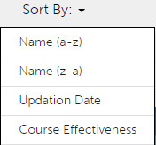-->

學習程式可以有三種排序方式：字母遞增順序、字母遞減順序，以及依更新日期排序。

## 招生學習者 {#enrollinglearners}

您也可以依照相同步驟為學習者報名課程、學習計畫及認證。 管理者也可以透過以下步驟將學員登記在他麾下。

管理者依組織要求為部分學員報名必修課程：

1. 將滑鼠移至任何已公布的課程圖塊，並點擊「註冊學習者」。\
   或者，點擊任何已發佈的課程磁貼，然後在左側窗格點選學習者。 會出現一頁學習者名單。 點擊註冊。\
   會跳出「註冊學習者」對話框。

1. 從選擇實例下拉選單中選擇實例。 下拉選單會列出所有實例，包括活躍、退休和過期實例。

>[!NOTE]
>
>管理員可點擊學習者頁面的下拉箭頭並點擊 **[!UICONTROL Actions]** > **[!UICONTROL Remove]**&#x200B;來移除課程中已註冊的學習者。

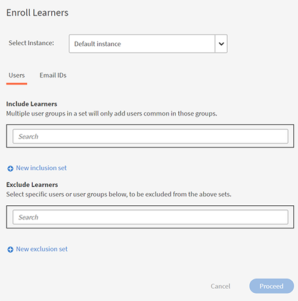

*註冊學習者時加入評論*

*註冊學習者*

## 使用者

+++納入學習者

選擇你想包含的使用者群組和個別學習者（使用電子郵件 ID 或姓名）。 將所有交集中的使用者群組都加入同一集合。 若要在 union 中新增另一個使用者群組，請使用新的包含集。

+++

+++排除學習者

選擇你想排除的使用者群組和個別學習者（使用電子郵件 ID 或姓名）。 將所有交集中的使用者群組都加入同一集合。 若要在聯合中新增另一個使用者群組，請使用新的包含集。

+++

## 使用者電子郵件識別碼

+++電子郵件 ID

複製貼上您想註冊學習者的電子郵件識別碼，並以分號、逗號或行距分隔。 使用 **[!UICONTROL Validate Email Ids]** 該選項來驗證這些條目。 所有無效條目都會以紅色標示。 刪除或更正那些條目，然後點擊 繼續 **[!UICONTROL Proceed.]**

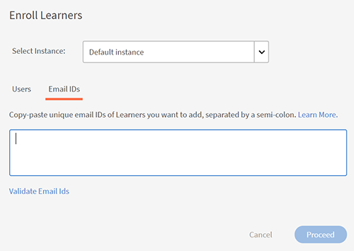

*註冊學習者*

摘要對話框顯示包含、排除設定及已註冊課程實例的使用者數量。

+++

### 註冊學習者時加入評論 {#enroll-comments}

<!--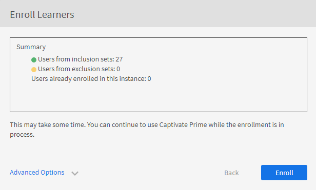-->

作為管理員或經理，您可以在為學習者報名課程時新增評論。 你可以補充即將註冊的用戶群的額外資訊。 這些資料會匯出到課程報告中。

該評論不會&#x200B;****&#x200B;顯示給學習者。

當管理員產生學習者的課程報告時，任何新增的評論都會出現在報告中。 摘要對話框顯示包含、排除設定及已註冊課程實例的使用者數量。

在對話框中 **[!UICONTROL Enroll Learners]** ，展開選項 **[!UICONTROL Advanced Options]**。 在欄位 **[!UICONTROL Additional Comment]** 中輸入所需的評論。

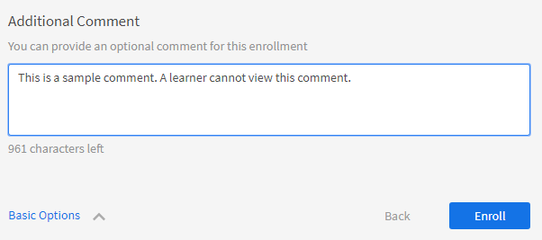

*為學習者新增評論*

## 搜尋已註冊使用者 {#searchforusers}

在學習物件的學習者區塊使用預先打字搜尋已註冊使用者。 透過預先打字搜尋，你可以逐步搜尋已註冊的使用者，使用姓名、電子郵件 ID 和 uuid。

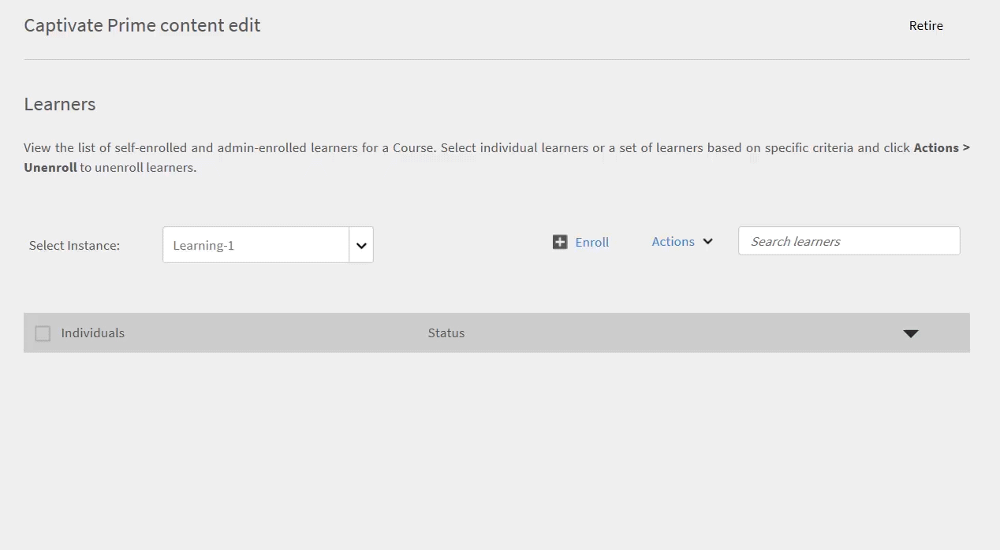

*搜尋已註冊用戶的攻略*

這種搜尋有時也被稱為自動補全、增量搜尋、隨輸入搜尋、內嵌搜尋或即時搜尋。

當你在搜尋欄中為學習者或使用者群組輸入時，會找到一個或多個該搜尋詞的匹配並立即呈現給你。

這個過程讓你能以比連續多次搜尋更快、更省事的方式找到你想要的東西。

所有實例的學習者或使用者群組會在搜尋後顯示。 對每位學習者，該學習者註冊的實例會顯示在欄位 **[!UICONTROL Instance]** 中。

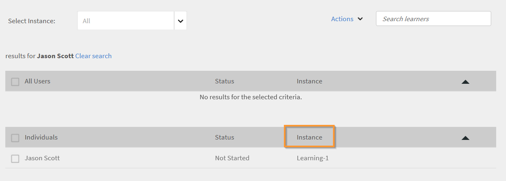

*查看搜尋結果*

使用預先打字查找，你可以：

* 查看所有已註冊的使用者，不論實例。
* 查看所有擁有一位或多位註冊使用者的使用者群組。

搜尋執行後，你無法依實例篩選學習者。 從下拉選單中選擇實例 **[!UICONTROL Select Instance]** 的選項已被停用。

此外，利用搜尋結果，你可以選擇學習者或使用者群組，並執行以下操作：

* 退學
* 標記完成
* 重置模組

在執行搜尋時，課程/學習計畫的動作下拉選單中「取消註冊>大量」選項被停用。

## 與學習者分享 QR 碼以報名、完成或兩者皆有 {#shareqrcodewithlearnerstoenrollcompleteorboth}

Adobe Learning Manager 的管理員可以將 QR 碼分享給學習者，快速註冊課程。 三種不同的 QR 碼用來標示課程的「註冊」、「完成」或「註冊與完成」。

學習者只需使用 Adobe Learning Manager 裝置應用程式掃描相應的 QR 碼即可。

**要下載 QR 碼，請執行以下**&#x200B;步驟：

1. 點擊 **[!UICONTROL Courses]** 左側導覽面板的「從學習」區塊。
1. 選擇課程> **[!UICONTROL View course]**。
1. 點擊 **[!UICONTROL Instances]** > **[!UICONTROL More]** > **[!UICONTROL QR code]**。

   <!--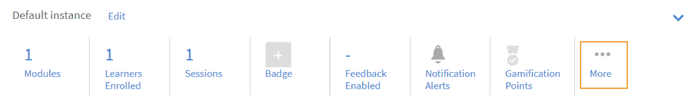-->

1. 啟用 QR 碼，然後點擊「註冊」、「完成」和「註冊並完成」下載圖示，即可下載包含每個 QR 碼的 PDF。 管理員接著可以將 QR 碼分享給學習者。

   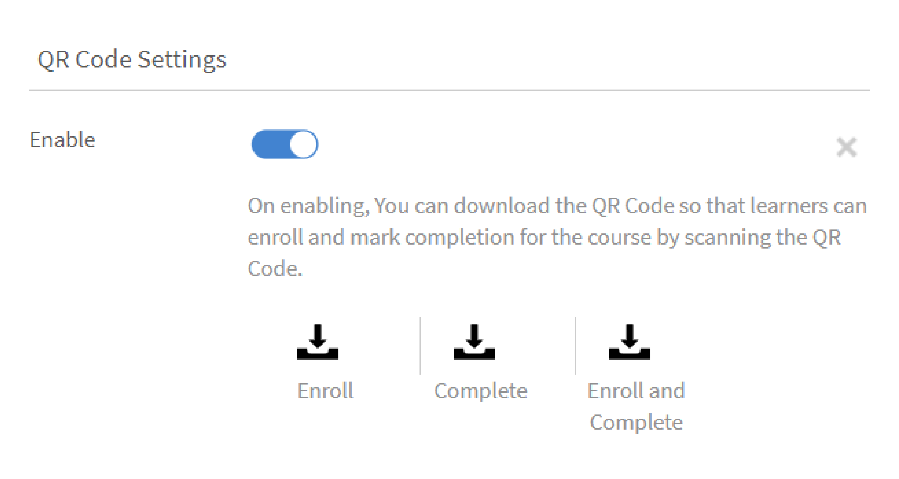

   *與學習者分享 QR 碼*

## 下載有興趣的學習者報告

查看 [註冊課程興趣](/help/migrated/learners/feature-summary/courses.md#register-interest-for-the-courses) ，了解學習者如何登記興趣。

管理員可從課程總覽頁面查看學習者興趣並下載有興趣學習者報告。

下載有興趣學習者報告：

1. 以管理員身份登入 Adobe Learning Manager。
2. 前往 **[!UICONTROL Courses]** 並選擇課程。
3. 選擇 **[!UICONTROL Interested Learners]**。

   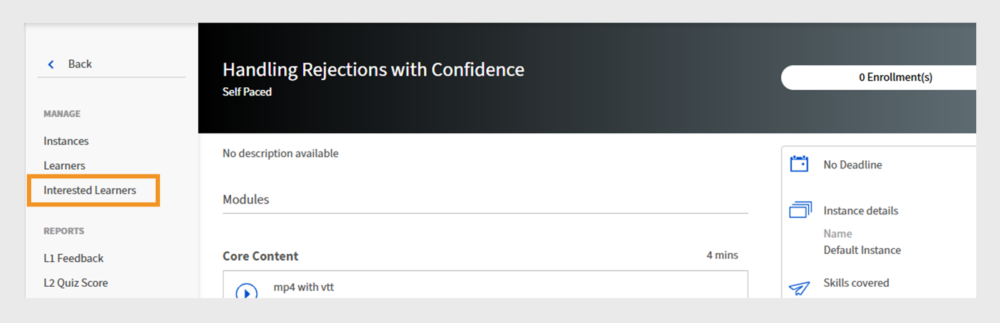
   _管理員介面的課程總覽頁面顯示有興趣學習者區塊，可查看及下載報告_
4. 選擇「動作」，然後選擇「匯出報告」。
包含有興趣學習者名單的報告將會被下載。 報告包含以下欄位：

   * 賽道編號
   * 學習者名稱
   * 電子郵件
   * 類型
   * 州
   * 註冊日期與時間（UTC）
   * 現役狀態

>[!NOTE]
>
>如果帳戶啟用了 UUID，報告中會包含學習者的 UUID。

## 賽道生命週期 {#courselifecycle}

典型的課程生命週期如下：

**草稿** ——作者完成課程建立並儲存的過程。 目前，課程尚未開放給學習者。 你可以在這個狀態刪除課程。

**已出版** - 作者完成課程出版。 在此州，課程對學習者開放報名。

**退休** - 課程出版後，作者若不希望課程出現在學習者的課程目錄中，可以將其移至退休狀態。 你可以在這個狀態下重新發布或刪除課程。

**已刪除** - 處於刪除狀態的課程是指該課程從 Adobe Learning Manager 應用程式中完全移除。 課程只有在草稿狀態下，作者才能刪除。 你也可以從退休州刪除課程。

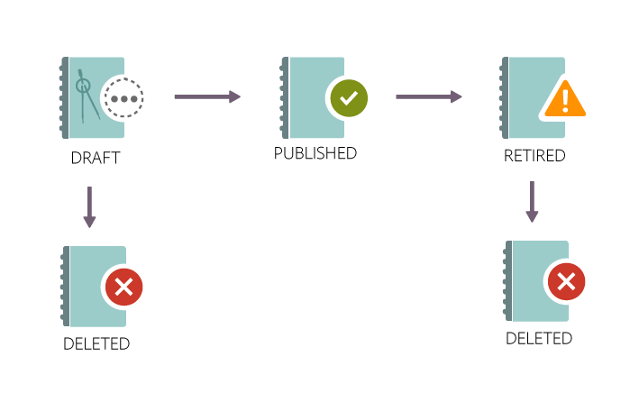

*課程生命週期的工作流程*

## 通知設定 {#notificationsettings}

作為管理員，你可以調整通知設定。 更多資訊請參閱 [通知。](user-notifications.md)

## 常見問題 {#frequentlyaskedquestions}

+++如何以管理員身份重置模組？

在課程的學習者頁面，選擇學習者或團體，點擊 **[!UICONTROL Actions]** > **[!UICONTROL Reset Modules]**。

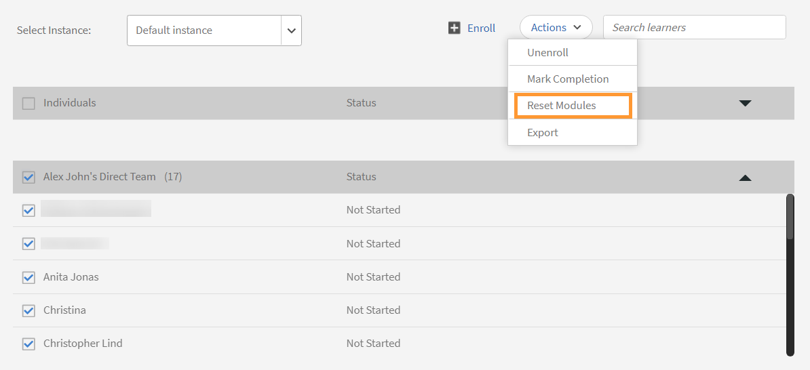

*檢視重設模組的選項*

點擊該選項後，所有被選中的學習者模組狀態將被重置。 完成的模組不會被重置。

+++

+++如何新增課程網址，讓學習者能直接被導向到課程？

將滑鼠移到課程卡上並點擊 **[!UICONTROL Copy URL]**。 複製網址後，學習者可以直接用網址存取課程。

+++

+++如何重新開啟實例？

要重新開啟已退休的實例，請點擊該實例的下拉選單，然後點選 **[!UICONTROL Reopen instance]**。

+++
