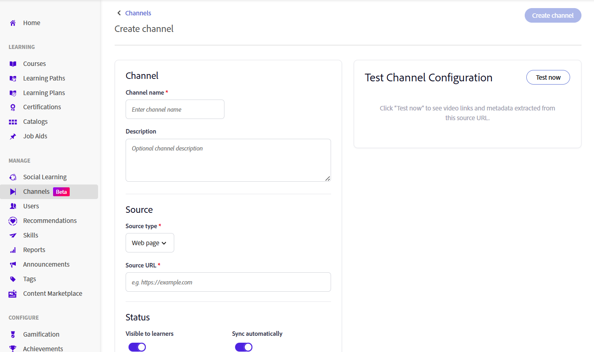
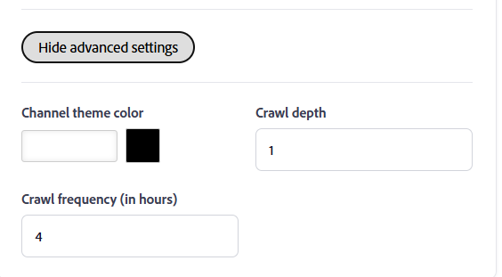
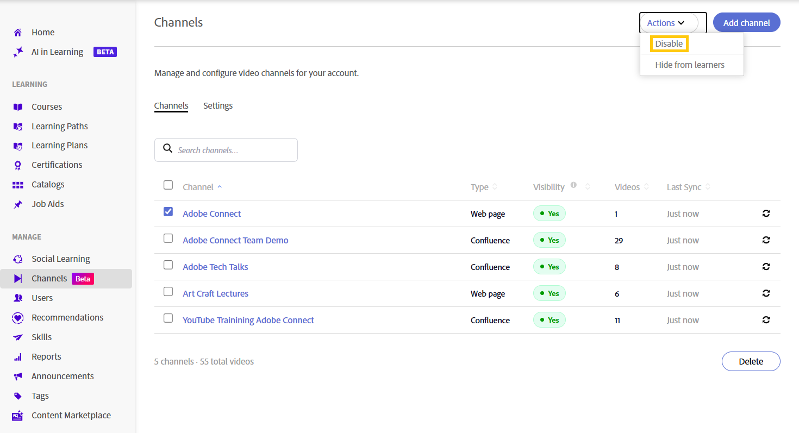
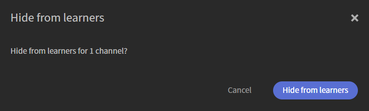
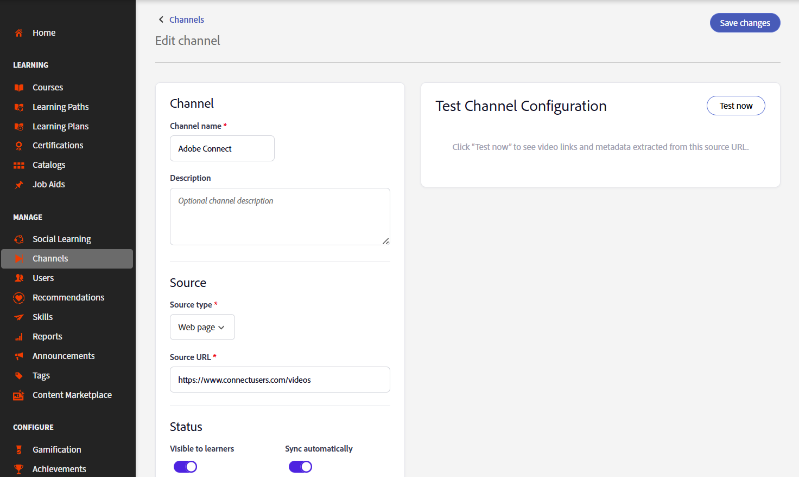

# 建立頻道

組織經常將知識分享課程、培訓錄影及其他影片內容儲存在非正式學習內容、精選的網頁及 Confluence Cloud 頁面上。 頻道將 Adobe Learning Manager 與這些內容來源連結，讓影片更容易被發現與觀看，無需學習者在多個系統間切換。 頻道幫助你在單一且可搜尋的地點，整理並分享企業網頁和 Confluence Cloud 頁面的影片學習內容。 學習者不必在多個內部網站間搜尋，而是能直接從 Adobe Learning Manager 發現並存取相關錄影。 請參閱 [「發現」並「互動」](../../learners/feature-summary/discover-and-engage-with-channels.md) 以獲取更多資訊。

作為管理員，你可以建立和管理頻道、設定可見性設定、同步內容與來源，並在讓頻道開放給學習者前確認影片是否可用。 本文將說明如何執行這些通路管理任務。

**主要優點**

- 將來自多個內部來源的影片學習內容整合於一處。
- 將多個內聯網地點的影片內容整理成網頁，然後在 ALM 中以頻道形式顯示。
- 讓學習者能在不需瀏覽多個網站的情況下，找到、遊玩並互動內容。
- 保持內容與原始來源同步。

## 啟用頻道

頻道是管理員為帳號開啟的功能。 啟用後，你可以建立連結企業網頁及包含影片內容的 Cloud Confluence 頁面的頻道。

頻道爬蟲能可靠地從以下格式呈現內容的來源頁面擷取影片：

- 表格
- 項目符號列表
- 文章

啟用 **頻道** 功能：

1. 以管理員身份登入 Adobe Learning Manager。

1. 從左側導覽中選擇 **頻道** 。    **&#x200B;**&#x200B;頻道頁面開啟。

1. 選擇設定&#x200B;**&#x200B;**&#x200B;標籤。

   

   *在設定&#x200B;**標籤中啟用頻道功能**，讓管理員為該帳號建立頻道。*

1. 啟用 **頻道功能**。

     該帳號的頻道已啟用。

## 建立頻道

建立一個頻道，定義 Adobe Learning Manager 掃描影片的內容來源，並自訂頻道與影片頁面的外觀。

1. 進入 **頻道標籤** ，選擇 **新增頻道**。    **Create 頻道**&#x200B;頁面開啟。

   

   *在建立頻道時，請定義內容來源，並設定可見性與同步選項。*

1. 在 **頻道** 區塊輸入 **頻道名稱** 與 **說明**。

1. 從下拉選單選擇來源 **類型** 。 以下選項可供選擇：

   1. **網頁**：選擇此選項可爬取網頁並匯入影片連結及其相關元資料。

   1. **Confluence 頁面**：選擇此選項以從 Confluence Cloud 頁面檢索影片連結與元資料。 要連接 Confluence Cloud，請提供以下資訊：
      - **Atlassian 電子郵件地址**：輸入與您 Atlassian 帳戶相關的電子郵件地址。
      - **Atlassian API 代幣**：輸入您從 Atlassian 帳戶產生的 API 代幣。 選擇 **如何建立 API 令牌，以取得產生 API 令牌** 的說明。 此令牌用於爬取來源時的認證，並以加密方式儲存。

      

      *輸入 Atlassian 電子郵件地址和用於 Confluence Cloud 認證的 API 令牌。*

1. 輸入 **所選來源類型的來源網址** 。

1. 在 **狀態** 區塊中，請設定以下選項：

   1. **對學習**&#x200B;者可見：啟用此選項，讓學習者能使用該頻道。 關閉它以隱藏頻道，同時繼續設定或測試。

   1. **自動**&#x200B;同步：啟用此選項，當新增影片到來源時自動更新頻道。 如果你想手動同步頻道，請關閉它。

1. （可選）選擇 **「顯示進階設定**」，然後依需求配置以下選項：

   1. **頻道主題顏色**：選擇一個顏色以自訂頻道的視覺外觀。

   1. **爬取深度**：輸入連結頁面的爬取深度以掃描影片內容。 它支援最大爬行深度為 **2**。

   1. **爬取頻率（小時計）：**&#x200B;輸入 Adobe Learning Manager 應該多久檢查一次原始碼是否有新內容或更新內容。

      

      *選擇「顯示進階設定」以設定頻道主題色彩、爬行深度和爬行頻率。*

1. 選擇 **「立即** 測試」以驗證來源。 範例影片會從設定的來源擷取並顯示。

   

   *在建立頻道前，請使用&#x200B;**「Test Now**」確認影片是否已從來源取得。*

1. 選擇 **建立頻道**。 該頻道會被建立並加入&#x200B;**&#x200B;**&#x200B;頻道列表。

## 搜尋頻道

使用搜尋框快速依名稱找到頻道。

1. 選擇 **頻道** 標籤。
1. 選擇 **搜尋頻道** 框。
1. 在 **搜尋頻道** 框輸入頻道名稱或其中一部分。     列表會篩選出只顯示符合你搜尋的頻道。

   

   *在&#x200B;**搜尋框輸入頻道名稱以篩選**&#x200B;頻道列表。*

## 管理頻道可見性

使用 **動作** 選單同時停用或隱藏一個或多個頻道。

### 停用通道

關閉一個或多個頻道，防止學習者在保留頻道設定的同時存取其內容。

要停用頻道：

1. 前往 **頻道**。
1. 選擇一個或多個頻道旁的勾選框，然後選擇 **「動作**」。

   
   *從動作選單中選擇「停用」以停用一個或多個選定頻道。*
1. 選擇 **停用**。  會跳 **出「停用頻道」** 視窗。
1. 選擇 **停用**。  所選頻道已停用。

### 隱藏通道不讓學習者看到

隱藏一個或多個頻道，讓學習者無法使用，但不會刪除它們。

要對學習者隱藏頻道：

1. 前往 **頻道**。
1. 選擇一個或多個頻道旁的勾選框，然後選擇 **「動作**」。
1. 選擇&#x200B;**「隱藏學習者」。**  **「隱藏學習者**」彈出視窗會顯示。

   
   *隱藏頻道，不刪除頻道設定。*

1. 選擇&#x200B;**「隱藏學習者」。**     所選頻道對學習者隱藏。

## 編輯頻道

你可以編輯現有頻道來更新設定和設定。

要編輯頻道：

1. 從 **頻道** 列表中選擇所需頻道。    **編輯頻道**&#x200B;頁面會開啟並顯示目前頻道設定。

1. 需要時更新頻道設定。

   

   *從編輯頻道&#x200B;**頁面更新頻道名稱、描述、來源和設定**。*

1. （選修）立即選擇 **測試**。

1. 選擇 **「儲存變更**」。     更新後的頻道設定已保存。

## 刪除頻道

你可以刪除一個或多個不再需要的頻道。

1. 請前往 **頻道** 標籤。

1. 在你想刪除的每個頻道旁邊勾選一個勾選框。

1. 從頻道列表右下角選擇 **刪除** 。   會跳出 **刪除頻道** 的視窗。

   

   *確認對話框會列出你選擇的頻道。*

1. 選擇 **刪除**。     所選頻道會永久刪除。 這種行為無法撤銷。
