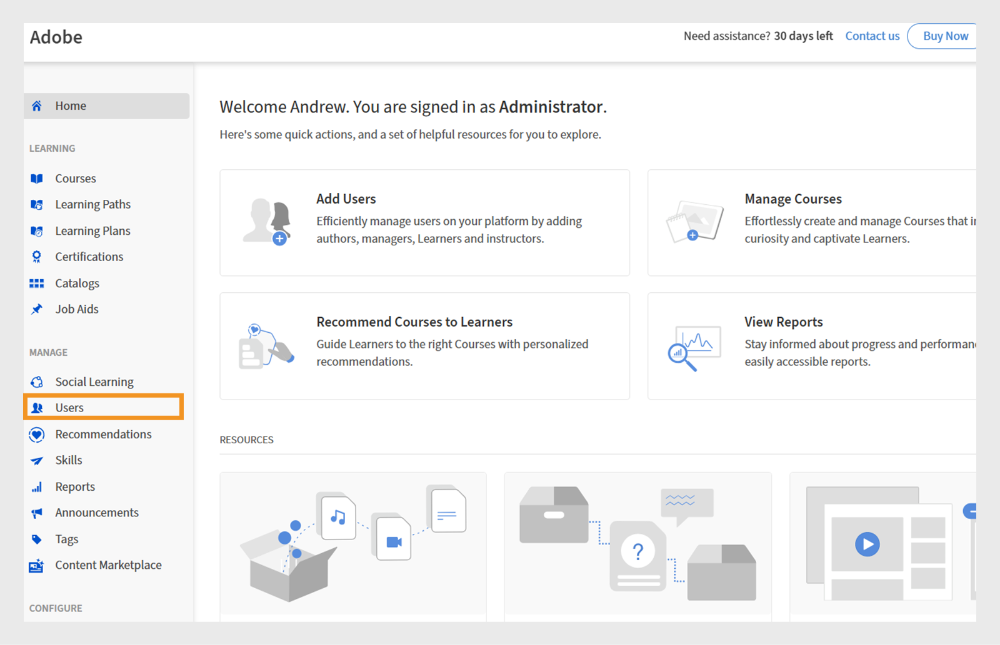
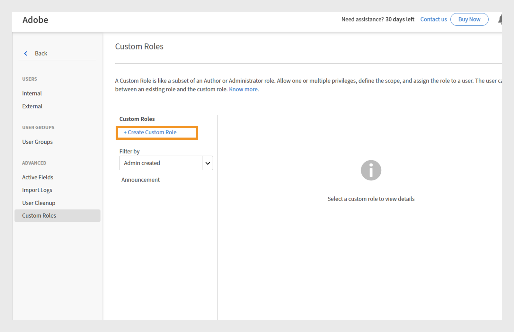
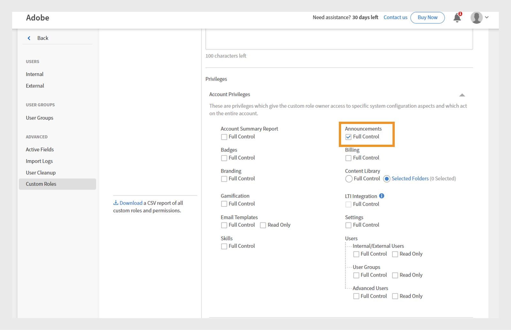
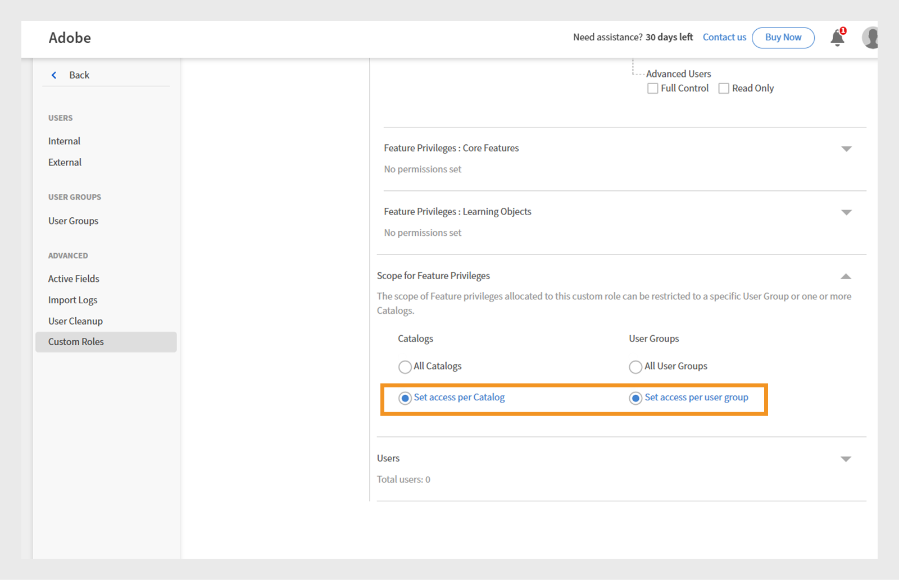

# 具有範圍宣告許可權的自訂角色

管理員可以建立具有限定於特定目錄和使用者群組之宣告許可權的自訂角色。 這可確保公告具有針對性、相關性，並僅對預期學習者可見。 限定範圍的公告可確保正確的使用者收到相關的公告，而不會將詳細資訊傳送給其他人。

## 建立具有特定範圍的自訂角色

管理員可以建立自訂角色，其宣告許可權僅限於特定目錄和使用者群組。

建立具有特定範圍的自訂角色：

1. 以管理員身分登入Adobe Learning Manager。
2. 在左側導覽窗格中選取&#x200B;**[!UICONTROL Users]**。

   
   _指派自訂角色給使用者，以取得Adobe Learning Manager中的目標許可權和責任_

3. 選取自訂角色。
4. 選取建立自訂角色。

   
   _指派自訂角色給使用者，以自訂許可權並簡化特定使用者群組或目錄的管理控制_

5. 輸入自訂角色的名稱和說明。
6. 選取「帳戶許可權」下的「宣告」。

   
   _在[帳戶許可權]下啟用宣告許可權，以允許自訂系統管理員管理範圍內的目標通訊_

7. 選取「功能許可權範圍」下的「為每個目錄設定存取權」，然後選取目錄。
8. 在同一區段中，選擇「為每個使用者群組設定存取權」 ，然後選取所需的
使用者群組。

   
   _設定使用者群組和目錄範圍，以確保自訂管理員只能在其指派的範圍內管理許可權和存取權_

9. 選取並新增您要指派此自訂角色的使用者。 指派的使用者可以為其範圍建立宣告。

自訂管理員可建立限定於其指派使用者群組和目錄的公告，確保訊息送達正確的對象並防止不必要的通知。 對於通知和電子郵件公告，管理員可以新增額外的使用者群組，但只有已定義範圍內的使用者會收到它們。 對於「建議」和「刊頭」公告，您只能在指派的範圍內選取使用者群組。

## 為指派的範圍建立宣告

自訂管理員可建立限定於其指派使用者群組和目錄的公告，確保訊息送達正確的對象並防止不必要的通知。

若要為指派的範圍建立宣告：

1. 以自訂管理員身分登入Adobe Learning Manager。
2. 在左側導覽窗格中選取&#x200B;**[!UICONTROL Announcement]**。
3. 選取&#x200B;**[!UICONTROL Add]**。

   
   在Adobe Learning Manager中的&#x200B;_公告頁面，管理員可以在其中建立和管理目標使用者群組的公告_

4. 從下拉式功能表中選取&#x200B;**[!UICONTROL Announcement Type]**。
a. **[!UICONTROL As Notification]**
b. **[!UICONTROL As Masthead]**
c. **[!UICONTROL As Recommendation]**
日期： **[!UICONTROL As Email]**
5. 選取&#x200B;**[!UICONTROL As Masthead]**。
6. 選取語言並上傳刊頭的影像。
7. 選擇性地為動作按鈕新增URL。

   
   _建立宣告畫面，讓系統管理員可以設定宣告型別、上傳附件，以及新增動作按鈕_

   指派的範圍已在&#x200B;**[!UICONTROL Scope]**&#x200B;區段中預先選取，且自訂管理員無法修改。

   >[!NOTE]
   >
   >**[!UICONTROL For Notification]**&#x200B;和&#x200B;**[!UICONTROL Email]**&#x200B;個宣告，如果這些宣告與其指派的範圍重疊，則可以包含其他使用者群組和目錄。

8. 選取&#x200B;**[!UICONTROL Save]**。

只有自訂管理員範圍內的學習者才能檢視宣告。 請參閱此[文章](/help/migrated/administrators/feature-summary/announcements.md)以瞭解如何建立多種型別的宣告。

## 由自訂管理員重設範圍

如果管理員已變更已發佈公告的範圍，自訂管理員可以重設其範圍。 範圍重設後，更新的範圍將套用至公告，只有新範圍內的學習者才能看到公告。

若要重設範圍：

1. 以自訂管理員身分登入Adobe Learning Manager。
2. 在左側導覽窗格中選取&#x200B;**[!UICONTROL Announcement]**。
3. 選取&#x200B;**[!UICONTROL Published]**&#x200B;標籤。
4. 選取任何宣告，然後選取設定圖示。
5. 選取&#x200B;**[!UICONTROL Edit]**。

   
   _顯示已發行公告的公告熒幕，其中包含編輯、發佈和其他選項_

6. 選取&#x200B;**重設**。

   
   _顯示範圍變更通知的宣告，其中包含自訂管理員重設和更新範圍選取以反映新存取許可權的選項_

範圍將會更新，只有更新範圍內的使用者才能檢視宣告。

## 透過管理員UI編輯宣告

管理員可以編輯和管理所有由自訂管理員建立的公告。 如果管理員嘗試編輯由具有特定範圍的自訂管理員建立的宣告，則宣告上會出現警告訊息，指出&#x200B;**[!UICONTROL Remove]**&#x200B;範圍。 管理員可以移除範圍，讓公告可供所有人使用。 在這種情況下，自訂管理員將會收到警告，指出宣告的範圍已變更。

若要透過管理員UI編輯宣告：

1. 以管理員身分登入Adobe Learning Manager。
2. 在左側導覽窗格中選取&#x200B;**[!UICONTROL Announcement]**。
3. 選取&#x200B;**[!UICONTROL Published]**&#x200B;標籤。
4. 選取任何宣告，然後選取設定圖示。
5. 選取&#x200B;**[!UICONTROL Edit]**。

   
   _顯示已發行公告的公告熒幕，其中包含編輯、發佈和其他選項_

6. 選取&#x200B;**[!UICONTROL Remove]**。

   
   _宣告畫面，指出必須移除範圍，讓系統管理員可以編輯為範圍使用者群組建立的宣告_

移除範圍後，管理員可以編輯宣告。
