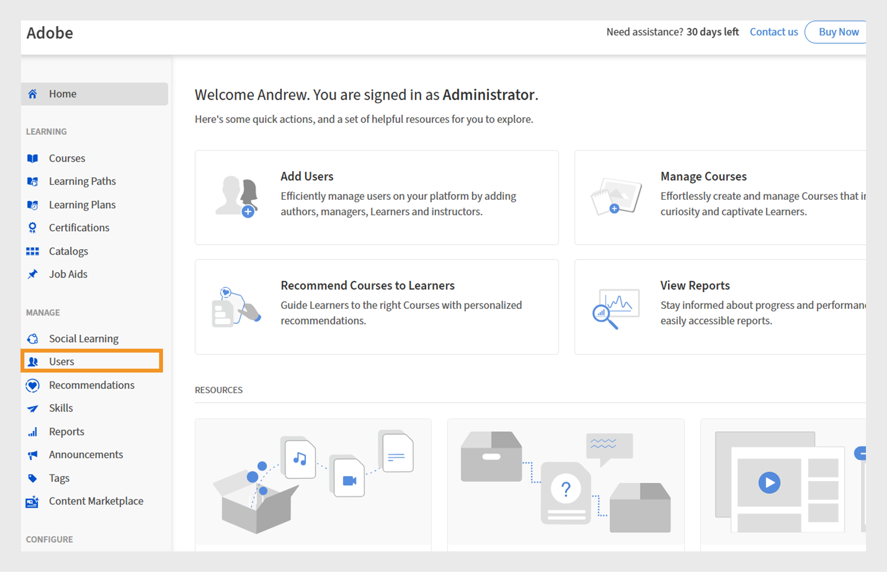
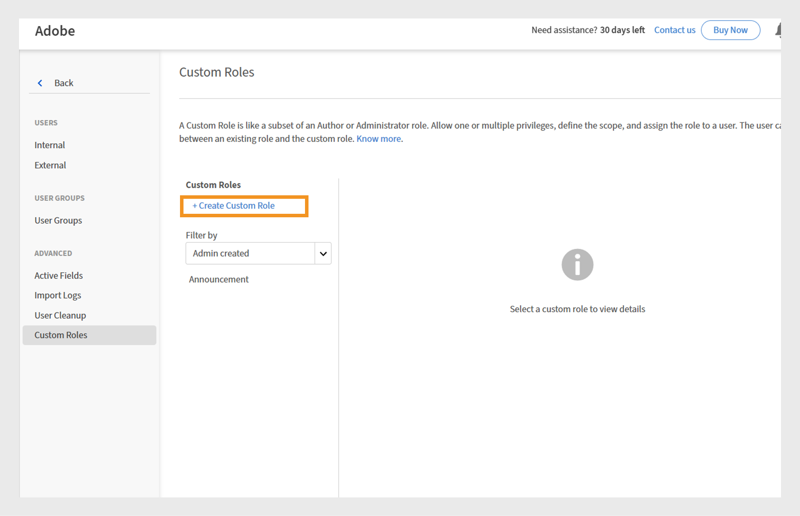
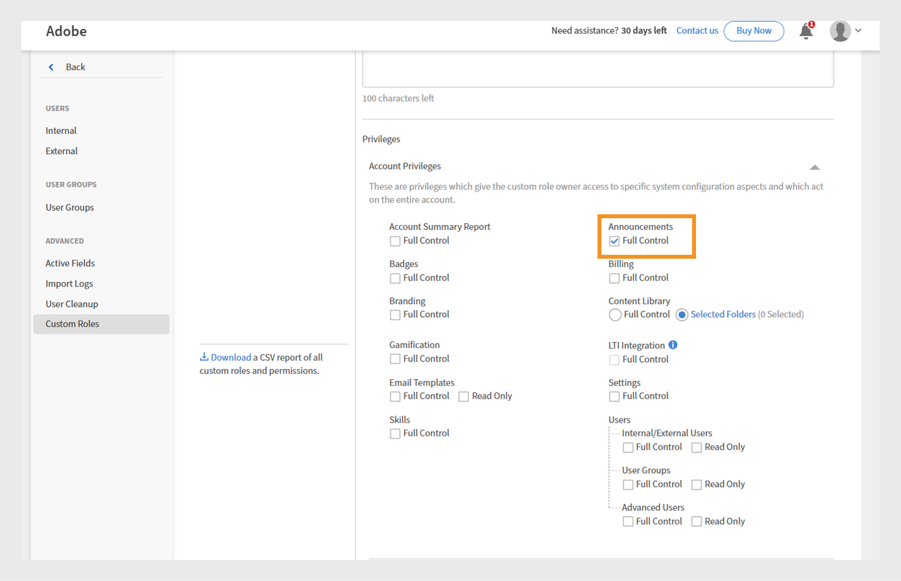
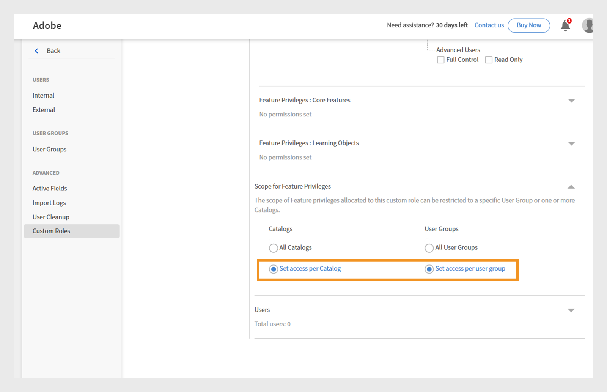

# 自訂角色，具有範圍的公告權限

管理員可以建立自訂角色，並限制其公告權限僅限於特定目錄和使用者群組。 這確保公告具有針對性、相關性，且僅對預期學習者可見。 範圍性公告確保正確的使用者收到相關公告，而不會將細節傳送給他人。

## 建立一個有特定範圍的自訂角色

管理員可以建立自訂角色，並限制公告權限至特定目錄與使用者群組。

要建立具有特定範圍的自訂角色：

1. 以管理員身份登入 Adobe Learning Manager。
2. 在左側導覽窗格選擇 **[!UICONTROL Users]** 。

   
   _在 Adobe Learning Manager 中為使用者指派自訂角色，以指定權限與責任_

3. 選擇自訂角色。
4. 選擇建立自訂角色。

   
   _為使用者指派自訂角色，以自訂權限並簡化特定使用者群組或目錄的管理控制_

5. 輸入自訂角色的名稱和描述。
6. 在帳戶權限下選擇公告。

   
   _在帳戶權限下啟用公告權限，讓自訂管理員能管理範圍內的目標通訊_

7. 在功能權限範圍中選擇「設定每個目錄存取權限」，並選擇目錄。
8. 在同一區塊中，選擇「依使用者群組設定存取權限」，並選擇所需使用者群組。

   
   _設定使用者群組與目錄範圍，確保自訂管理員只能在其指定範圍內管理權限與存取_

9. 選擇並新增你想指派這個自訂角色的使用者。 被指派的使用者可以為其範圍建立公告。

自訂管理員可以建立僅限於其指定使用者群組與目錄的公告，確保訊息觸及正確受眾，避免不必要的通知。 對於通知與電子郵件公告，管理員可以新增額外的使用者群組，但只有定義範圍內的使用者才能收到。 對於推薦與報頭公告，你只能選擇指定範圍內的使用者群組。

## 為指定範圍建立公告

自訂管理員可以建立僅限於其指定使用者群組與目錄的公告，確保訊息觸及正確受眾，避免不必要的通知。

要為指定範圍建立公告：

1. 以自訂管理員身份登入 Adobe Learning Manager。
2. 在左側導覽窗格選擇 **[!UICONTROL Announcement]** 。
3. 選擇 **[!UICONTROL Add]**。

   
   _Adobe Learning Manager 中的公告頁面，管理員可為目標使用者群組建立並管理公告_

4. 從下拉選單選擇。**[!UICONTROL Announcement Type]**
a. **[!UICONTROL As Notification]** b. **[!UICONTROL As Masthead]** c. **[!UICONTROL As Recommendation]** d. **[!UICONTROL As Email]**
5. 選擇 **[!UICONTROL As Masthead]**。
6. 選擇語言並上傳圖片給報頭。
7. 可選擇性地為動作按鈕加上網址。

   
   _建立公告畫面，讓管理員設定公告類型、上傳附件及新增動作按鈕_

   指定範圍在該 **[!UICONTROL Scope]** 區塊中預先選擇，且無法由自訂管理員修改。

   >[!NOTE]
   >
   >**[!UICONTROL For Notification]** 以及 **[!UICONTROL Email]** 公告，若這些群組與其指定範圍有重疊，則可包含額外的使用者群組與目錄。

8. 選擇 **[!UICONTROL Save]**。

只有在自訂管理員權限範圍內的學習者才能查看公告。 請參閱這篇文章，了解如何製作多種類型的公告。

## 由自訂管理員重設範圍

自訂管理員若管理員更改了公告範圍，則可重設已發佈公告的範圍。 一旦範圍重置，更新範圍將套用到公告上，只有新範圍內的學習者能看到公告。

要重設示波器：

1. 以自訂管理員身份登入 Adobe Learning Manager。
2. 在左側導覽窗格選擇 **[!UICONTROL Announcement]** 。
3. 選擇 **[!UICONTROL Published]** 分頁。
4. 選擇任何公告，然後選擇設定圖示。
5. 選擇 **[!UICONTROL Edit]**。

   
   _公告畫面顯示已發布公告，並有編輯、發佈及其他選項_

6. 選擇 **重置**。

   
   _公告顯示範圍變更通知，並提供自訂管理員重置及更新範圍選擇以反映新存取權限的選項_

範圍將會更新，只有更新範圍內的使用者才能查看公告。

## 透過管理員介面編輯公告

管理員可以編輯和管理所有由自訂管理員建立的公告。 若管理員嘗試編輯由自訂管理員建立的特定範圍公告，公告上會出現警告訊息，說明 **[!UICONTROL Remove]** 範圍。 管理員可以移除讓公告對所有人開放的權限。 此時，自訂管理員會收到公告範圍變更的警告。

透過管理員介面編輯公告：

1. 以管理員身份登入 Adobe Learning Manager。
2. 在左側導覽窗格選擇 **[!UICONTROL Announcement]** 。
3. 選擇 **[!UICONTROL Published]** 分頁。
4. 選擇任何公告，然後選擇設定圖示。
5. 選擇 **[!UICONTROL Edit]**。

   
   _公告畫面顯示已發布公告，並有編輯、發佈及其他選項_

6. 選擇 **[!UICONTROL Remove]**。

   
   _公告畫面顯示必須移除範圍，管理員才能編輯為範圍使用者群組建立的公告_

管理員可以在移除範圍後編輯公告。
