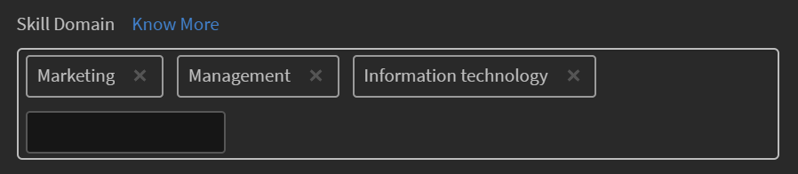
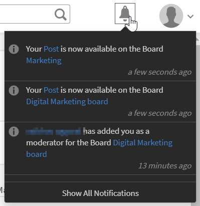

# 將技能與技能領域對應

若要自動組織使用者針對特定技能領域張貼的貼文（由啟用AI的組織引擎所提供），使用者的企業必須具備其自訂技能，才能對應至Learning Manager LMS中顯示的支援技能領域。

建立技能時，管理員可將其與Learning Manager支援的最相關技能網域對應。 這會在自動組織程式中進一步考慮。 Learning Manager LMS列出以下技能：

* 供應鏈管理
* 會計
* 科學研究與工程
* 電腦安全性
* 策略管理
* 社群媒體
* 醫學
* 財務
* 工作場所安全
* 軟性技能
* 商法
* 管理
* 人力資源管理
* 技術通訊
* 商業道德
* 客戶關係管理
* 資訊技術
* 生產與製造
* 行銷
* 品質管理
* 業務流程
* 學習
* 設計
* Analytics
* 銷售

若要新增技能領域，請遵循下列步驟：

1. 在管理員應用程式的左窗格中，按一下 **[!UICONTROL Skills]**.
1. 若要新增技能，請按一下 **[!UICONTROL Add]** ，位於頁面右上方。
1. 在 **[!UICONTROL Add Skill]** 對話方塊，新增技能及技能說明。
1. 在 **[!UICONTROL Skill Domain]** 區段，新增技能網域。 當您輸入網域時，網域會被新增。 這些網域會從上述清單中填入。

   

   *在技能領域區段中新增技能領域*

1. 若要儲存變更，請按一下 **[!UICONTROL Save]**.

當使用者在展示板上發佈內容時，內容會根據對應技能對展示板的信賴度分數，獲得監管，並被核准或拒絕。

<!---->

根據上傳的內容可信度分數是否超過50%，內容會上傳到展示板中。 如果您的內容符合條件，您就會看到通知，指出內容已成功組織，現在可在展示板中使用。

*根據可信度分數檢視通知*

