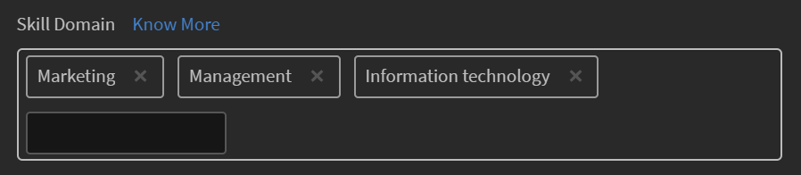

# 地圖技能與技能領域

若要自動策展用戶透過 AI 啟用的策展引擎發布的文章，針對特定技能領域，使用者的企業必須將其自訂技能對應至 Learning Manager LMS 中支援的技能領域。

在建立技能時，管理員可以將其與學習管理器支援的最相關技能領域對應。 這點將在自動策展過程中進一步考量。 Learning Manager LMS 列出以下技能：

* 供應鏈管理
* 會計
* 科學研究與工程
* 電腦安全
* 策略管理
* 社群媒體
* 醫學
* 財務
* 職場安全
* 軟實力
* 商業法
* 管理
* 人力資源管理
* 技術溝通
* 商業道德
* 客戶關係管理
* 資訊科技
* 生產與製造
* 行銷
* 品質管理
* 業務流程
* 學習
* 設計
* 分析
* 銷售

>[!NOTE]
>
>根據演算法，如果信賴分數低於50%，該內容將被標記為人工整理。

要新增技能領域，請遵循以下步驟：

1. 在管理員應用程式的左側窗格，點擊 **[!UICONTROL Skills]**。
1. 要新增技能，請點擊 **[!UICONTROL Add]** 頁面右上角。
1. 在對話框中 **[!UICONTROL Add Skill]** 加入一個技能和該技能的描述。
1. 在該 **[!UICONTROL Skill Domain]** 章節中，加入技能領域。 當你輸入網域時，網域就會被加入。 這些網域是從上述列表中填充的。

   

   *在技能領域區塊新增技能領域*

1. 要儲存變更，請點擊 **[!UICONTROL Save]**。

當使用者在看板上發布內容時，該內容會被策劃並根據對應技能的信心分數來審核或拒絕。

<!---->

根據上傳內容的信心分數是否超過 50%，該內容會被上傳到公告板。 如果你的內容符合標準，你會看到通知，表示該內容已成功策劃，現在可以在看板上使用。

*根據信心分數查看通知*
