# 自訂角色

此功能幫助您定義自訂角色，並將特定職責指派給一組使用者。 此功能允許您指派個人現有職務範圍之外的職責。

Adobe Learning Manager 允許完整管理員將自訂角色管理的職責委派給值得信賴的自訂管理員，包括建立、編輯及指派自訂角色，而無需授予他們完整的管理員憑證。 此功能讓自訂管理員能管理其他角色，而不會讓管理員負擔過重。 這可透過&#x200B;**自訂角色定義中使用者**&#x200B;區的進階&#x200B;**權限層**&#x200B;級來控制。更多資訊請參閱 [「進階使用者權限解鎖](#advanced-user) 了什麼」。

組織利用此功能將例行角色管理委派給指定的自訂管理員。 例如，允許專責團隊持續建立並指派出版人或作者角色，或讓營運團隊清理已離組織用戶的帳號。 這樣就避免了必須給予這些團隊完整管理員權限，因為管理員擁有的權限比他們職責所需的更廣泛。

你可以建立自訂角色，提供僅限特定目錄的創作功能。 你也可以建立一個專門負責管理報告的角色。 這些角色可以分配給應承擔這些特定責任的個人。

>[!NOTE]
>
>新增自訂角色不會影響現有的自訂使用者群組或任何基於角色的群組，如所有管理員、所有作者等。

管理員可以建立自訂管理員和自訂作者角色，並為每個角色設定權限。 以下是每個角色相關權限的概述：

**自訂作者角色權限**

自訂作者可執行以下任務：

* 存取內容庫以新增、編輯或刪除核心內容。
* 建立、編輯與刪除：
  * 課程
  * 工作輔助工具
  * 認證
  * 學習路徑
  * 學習計畫

管理員與作者，包括自訂管理員與自訂作者，將有能力將學習物件（LO）分享給外部共享的目錄。 管理員與作者在建立學習物件（LO）時，應能搜尋外部共享的目錄。

**自訂管理員角色權限**

自訂管理員角色會複製一組管理員職責，包括帳號層級權限的存取權。 自訂管理員被授予管理與學習活動相關關鍵功能的權限，例如：

* 學習計畫
* 目錄
* 報表
* 標記

此外，自訂管理員還能：

* 管理課程與工作輔助工具，包括註冊與刪除使用者。
* 建立、編輯並刪除證照、學習路徑和學習計畫。
* 存取所有學習對象（LO）的報告與註冊功能。

管理員現在可以在 Adobe Learning Manager 中查看 CSV 所建立的權限。 篩選選項會依照管理員建立的自訂角色，以及透過 CSV 匯入的自訂角色來篩選。 選擇自訂角色後，你可以看到它的權限。

_Filter 自訂角色_

## 建立自訂角色 {#create-role}

1. 以管理員身份登入。 打開 **[!UICONTROL Users]** > **[!UICONTROL Custom Role]**。
2. 選擇 **[!UICONTROL Create Role]**。 **[!UICONTROL Create New Role]**&#x200B;分頁打開了。

   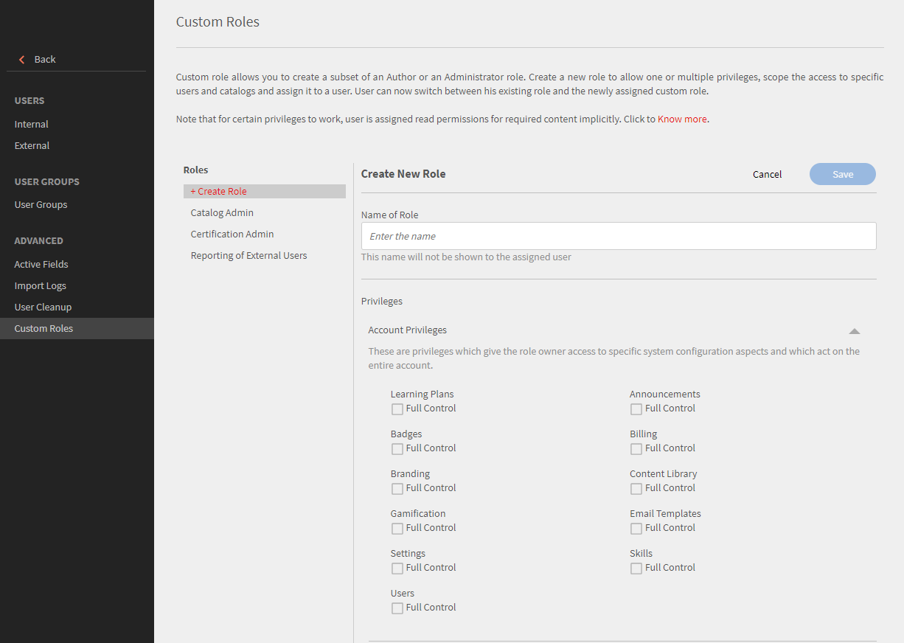

   *建立自訂角色*

3. 輸入欄位中的名字 **[!UICONTROL Name of the Role]** 。
4. **[!UICONTROL Account privileges]**&#x200B;這些權限讓角色擁有者能夠存取特定的系統設定面向，並能作用於整個帳戶。 選擇存取權限。 使用者可以完全控制所分配的權限。

   管理員可以授權使用者區塊的詳細權限，該區塊包含內部/外部使用者、使用者群組及進階使用者。

   >[!NOTE]
   >
   >   這些特權不適用範圍。

   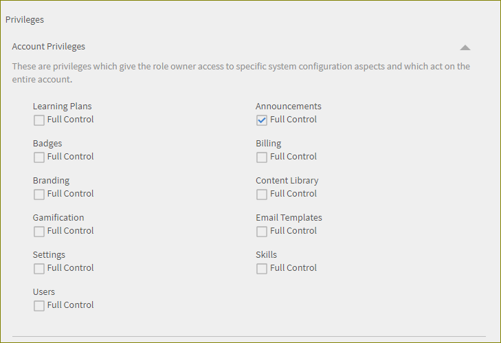

   *設定瞄準鏡*

5. **功能權限 - 核心功能**：用於授予管理學習活動的特定功能存取權。 使用此選項可獲得以下功能權限。

   管理員可為目錄提供詳細權限，如唯讀、建立、編輯及刪除權限。

   * 目錄
   * 報表
   * 標記

   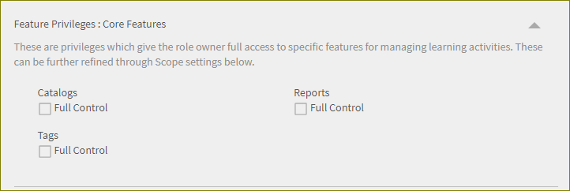

   *設定目錄、報告與標籤的範圍*

6. **功能權限-學習物件：**  使用此選項提供 LO 相關功能的存取權限。 管理員可以為所有學習物件提供詳細權限，包括課程、學習路徑、認證及工作輔助工具。 他們可以賦予使用者權限，例如建立、編輯、刪除或只讀。

   * 認證
   * 課程
   * 工作輔助工具
   * 學習計畫

   你也可以賦予學習物件特定的操作控制權限。 許可可為以下其中一種：

   * 唯讀
   * 創作
   * 編輯
   * 刪除
   * 招生情況
   * 賽事報導

   你也可以給LO完全控制權。

   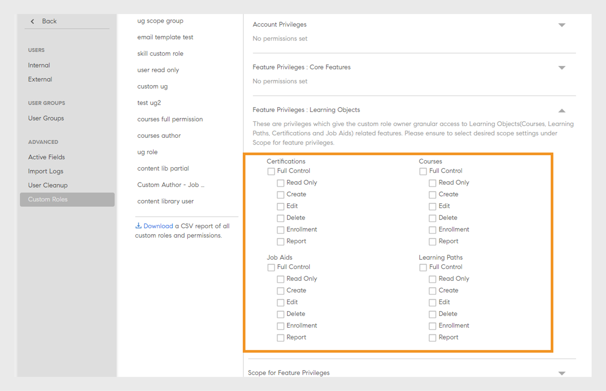

   *授予特定權限*

7. **功能權限範圍：** 此角色所分配的功能權限範圍可限制於特定使用者群組或一個或多個目錄。

   目錄：使用單選按鈕提供控制 **[!UICONTROL All catalogs]** 或 **[!UICONTROL Set access per Catalog]** 提供特定目錄存取權的選項。 你也可以選擇多個目錄。

   使用者群組：提供 **[!UICONTROL All User Groups]** 存取權限或使用 **[!UICONTROL Set access per user group]** 選項來存取特定使用者群組。 只能指定單一使用者群組。

   >[!NOTE]
   >
   >如果你在帳號權限中選擇了公告、遊戲化、電子郵件範本、技能和使用者，使用者群組的存取權限預設會提供給所有使用者群組，而此選項將被停用。

   如果你在帳戶權限中選擇了學習計畫，預設會提供所有目錄和使用者群組的存取權限，而範圍中的這些選項會被停用。

   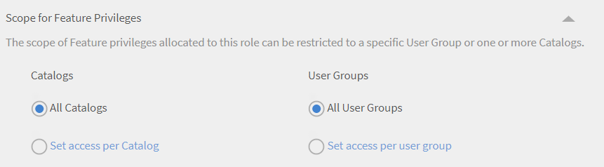

   *定義權限範圍*

>[!NOTE]
>
>   在 Learning Manager 27.6 中，你可以建立一個自訂角色，涵蓋多個目錄，每個目錄會被賦予不同的權限。

要授予目錄各種權限，請依照以下步驟操作：

1. 點選選項 **[!UICONTROL Set access per Catalog]**。
1. 選擇目錄，你可以看到每個目錄的權限等級。 授權如下：

   <table>
        <tbody>
        <tr>
          <td>
          
<b>允許</b>
</td>
          <td>
          
<b>說明</b>
</td>
        </tr>
        <tr>
          <td>
          
完全控制
</td>
          <td>
          
賦予對所有學習物件的完全控制權。 權限包括新增、編輯、刪除、閱讀、註冊及報告。 
</td>
        </tr>
        <tr>
          <td>
          
賽事報導
</td>
          <td>
          
僅允許存取學習物件的報告標籤。
</td>
        </tr>
        <tr>
          <td>
          
報名
</td>
          <td>
          
授權只註冊學習物件。
</td>
        </tr>
        <tr>
          <td>
          
僅讀
</td>
          <td>
          
授權僅存取目錄中的學習物件。
</td>
        </tr>
        </tbody>
      </table>

1. 根據你的需求啟用或停用權限。
1. 要儲存變更，請點擊 **[!UICONTROL OK]**。 然後，要儲存自訂角色的變更，請點擊 **[!UICONTROL Save]**。

舉例來說，考慮以下情境。

自訂使用者對學習物件所擁有的權限，是學習物件權限與目錄權限的交集。

自訂使用者對課程擁有完全權限，且僅在目錄 A 擁有唯讀權限，但對目錄 B 擁有完全權限。結果是目錄 A 課程僅讀權限，並完全控制目錄 B 課程。

擁有自訂角色的使用者可以：

* 只查看他/她能存取的目錄內容。
* 根據該學習物件所屬目錄的權限，存取任何學習物件。

  作為管理員，你可以：

* 為自訂角色選擇多個目錄。
* 隨時可以修改目錄的權限。
* 從你不想再授權的範圍移除目錄。
* 當你授權目錄時，隱含地授予目錄只讀權限。

  下表說明了授權的授予方式。

  <table>
    <tbody>
     <tr>
      <td>
       
<strong> </strong>
</td>
      <td>
       
<strong>目錄層級權限</strong>
</td>
     </tr>
     <tr>
      <td>
       
<strong>學習物件層級權限</strong>

       
<strong>（例如：課程）</strong>
</td>
      <td>
       
完全控制
</td>
      <td>
       
報名
</td>
      <td>
       
賽事報導
</td>
      <td>
       
僅讀
</td>
     </tr>
     <tr>
      <td>
       
完全控制
</td>
      <td>
       
完全控制
</td>
      <td>
       
報名
</td>
      <td>
       
賽事報導
</td>
      <td>
       
僅讀
</td>
     </tr>
     <tr>
      <td>
       
報名
</td>
      <td>
       
報名
</td>
      <td>
       
報名
</td>
      <td>
       
僅讀
</td>
      <td>
       
僅讀
</td>
     </tr>
     <tr>
      <td>
       
編輯與刪除
</td>
      <td>
       
編輯與刪除
</td>
      <td>
       
僅讀
</td>
      <td>
       
僅讀
</td>
      <td>
       
僅讀
</td>
     </tr>
     <tr>
      <td>
       
賽事報導
</td>
      <td>
       
賽事報導
</td>
      <td>
       
僅讀
</td>
      <td>
       
賽事報導
</td>
      <td>
       
僅讀
</td>
     </tr>
    </tbody>
   </table>

1. **使用者：** 使用此選項決定哪些使用者被指派此角色。 你可以透過搜尋框選擇一位或多位使用者。

   **新增使用者至自訂角色 CSV 上傳：** 若要透過上傳的 CSV 新增使用者，請在管理員用來匯入使用者的 .csv 檔案中新增 CustomRole 欄位。 在 CustomRole 欄位輸入使用者的角色，以指定你想指派自訂角色的使用者。 要上傳 CSV 檔案，請點擊  **[!UICONTROL Add > Upload a CSV]**。

   * 你無法搜尋使用者群組。
   * 你無法搜尋已經被分配為管理員角色的使用者。
   * 指派新的自訂角色給使用者會覆蓋使用者先前的自訂角色。

   <!--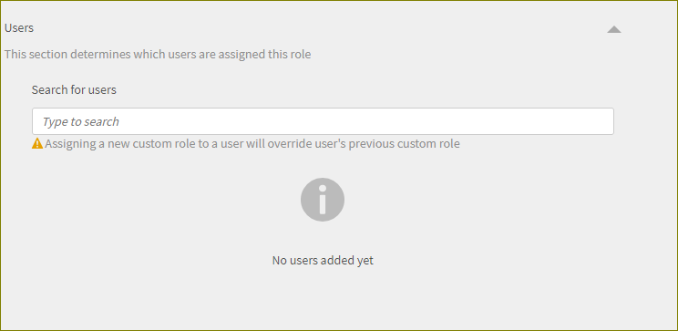-->

   * 擁有設定權限的自訂管理員，即使沒有權限使用使用者實體，也能設定從資料來源同步或同步使用者的排程。
   * 如果自訂管理員擁有使用者實體的權限，他們可以將管理員角色指派給自己，成為標準管理員。

## 進階使用者權限能解鎖什麼 {#whatadvanceduserpermissionunlocks}

當完整管理員在自訂角色中啟用&#x200B;**「使用者**」的進階&#x200B;**存取**&#x200B;權時，該自訂管理員可存取四個額外區塊：**自訂角色**、**匯入日誌**、**活動欄位**&#x200B;及&#x200B;**使用者清理**。

有兩個進出層級可供選擇：

* **唯讀**：自訂管理員可查看資訊並下載報告，但無法進行變更。
* **完全控制**&#x200B;權：自訂管理員可以建立、編輯和刪除自訂角色，匯入使用者，並清除已刪除的使用者。

### 許可與範圍繼承

當自訂管理員建立新的自訂角色或修改現有角色時，他們能指派的權限和範圍會限制在他們自己擁有的權限範圍內。 自訂管理員無法授予超出自身權限的角色權限，也無法將角色的權限擴展到自己指定的範圍之外。

這表示擁有特定目錄權限的自訂管理員只能建立與該目錄或其子集有關的角色。 同樣地，他們只能將自己個人擁有的權限分配給他們所建立的角色。

當你將使用者指派到你已建立的角色時，你可以搜尋並新增帳號中的任何使用者。 自訂角色中的使用者相關權限總是適用於完整的使用者群組範圍及完整目錄範圍。 當自訂角色包含使用者管理權限時，使用者群組或目錄範圍不適用。

如果正式管理員縮減你的權限範圍或移除你角色中的權限，你先前建立的角色不會立即受到影響。 這些角色會繼續以現有權限運作，直到完整管理員分別開啟並儲存。

## 授予自訂角色進階使用者權限

完整管理員完成此程序，以啟用自訂角色的擴充使用者管理。

1. 以管理員身份登入 Adobe Learning Manager。
2. 在左側導覽中選擇 **「使用者** 」，然後選擇 **「自訂角色**」。
3. 選擇 **「建立自訂角色** 」以建立新角色，或選擇現有角色來編輯。
4. 在帳戶權限&#x200B;**中**，找到&#x200B;**使用者**&#x200B;區塊。
5. 在 **進階使用者** 區，根據所需的存取權限選擇 **唯讀** 或 **完全控制** 。
6. 在 **使用者** 區塊中新增使用者到角色中。
7. 選擇 **儲存**。

被分配的使用者現在可以在登入後存取 **自訂角色**、 **活動欄位**、 **匯入日誌**&#x200B;和 **使用者清理** 區塊。

## 自訂管理員能用只讀權限做什麼

### 進口日誌

擁有唯讀權限的自訂管理員可以查看該帳號中的所有匯入日誌。 **新增**&#x200B;按鈕無法使用。無法啟動新的匯入。

### 使用者清理

**使用者清理**&#x200B;區塊以僅檢視模式提供。自訂管理員可以：

* 查看已刪除的使用者名單
* 搜尋特定使用者
* 依刪除月份篩選已刪除用戶
* 查看帳號中的其他使用者

在唯讀&#x200B;**存取中**，沒有任何操作（如清除）可用。

### 自訂角色

自訂管理員可以查看帳號中所有自訂角色定義，包括其分配的權限和使用者清單。 他們可以下載自訂角色報告。 他們無法編輯、建立或刪除任何角色。

## 自訂管理員在 Full Control 權限下能做什麼

**進口日誌**

擁有 Full Control 的自訂管理員可查看所有日誌，並透過 CSV 新增或匯入新使用者。

**使用者清理**

Full Control 可存取所有使用者清理操作：

* 查看、搜尋及依刪除月份篩選已刪除用戶
* 選擇個別使用者或全部
* 清除系統中刪除使用者
* 搜尋並清除其他使用者

**自訂角色**

擁有完全控制權的自訂管理員可以：

* 建立新的自訂角色，權限等於或低於自己的
* 編輯現有的自訂角色
* 刪除自訂角色
* 將使用者指派到自訂角色
* 移除自訂角色中的使用者
* 下載自訂角色報告
* 請依&#x200B;**照「全部****」、「從 UI** 建立」或&#x200B;**「從 CSV 建立」來篩選角色列表**

>[!NOTE]
>
>自訂管理員無法將自己加入其他角色，也無法以更高權限編輯自己的角色。

>[!IMPORTANT]
>
>由自訂管理員建立的角色可以包含自訂角色存取權，包括啟用自訂角色管理的進階使用者權限。 這表示擁有 Full Control 的自訂管理員可以建立角色，賦予其他使用者相同的自訂角色功能。 角色建立時可用的權限仍受標準委派模式約束。 自訂管理員只能指派他們個人擁有的權限，除非帳號啟用了擴展角色管理功能。

### 範例 - 作為自訂管理員建立有範圍的角色

完整管理員授予自訂管理員完全控制權，並可存取兩個產品目錄。 自訂管理員接著：

1. 建立一個針對第一個目錄的出版者角色，並指派作者到
1. 建立第二個出版者角色，範圍涵蓋第二個目錄，並指派不同的作者集合
1. 指派加入團隊的新作者擔任適當職務，無需正式管理員介入

自訂管理員建立的每個角色都會繼承自訂管理員權限的子集。 被指派擔任這些角色的作者可以在各自的目錄中存取並發表內容。 他們無法自行管理自訂角色，因為自訂角色區塊無法在自訂管理員建立的角色中提供。

## 能力比較

| 章節 | 僅讀 | 完全控制 |
|---|---|---|
| 匯入日誌：查看日誌 | ✓ | ✓ |
| 匯入日誌：透過 CSV 新增或匯入使用者 | — | ✓ |
| 使用者清理：檢視已刪除的使用者、搜尋、篩選 | ✓ | ✓ |
| 使用者清理：清除已刪除的使用者 | — | ✓ |
| 自訂角色：查看所有角色與定義 | ✓ | ✓ |
| 自訂角色：下載自訂角色報告 | ✓ | ✓ |
| 自訂角色：建立、編輯與刪除角色 | — | ✓ |
| 自訂角色：指派與移除使用者 | — | ✓ |

## 向下相容性

如果帳號已有啟用 **進階** 存取的自訂角色，這些角色在帳號更新時會自動包含匯入日誌的權限。 如果某角色目前關閉了進階存取，則不會有變動。 這個角色的行為依然如以前一樣。

>[!NOTE]
>
>若使用者啟用進階存取選項，請檢視哪些角色擁有此權限，並確認這些角色是否打算保留此權限。

## 自訂角色變更的稽核追蹤

所有自訂角色的變更，包括建立、編輯、刪除及使用者指派，都會記錄在自訂角色稽核報告中。 稽核報告現在顯示負責每次變更的自訂角色名稱，而非通用的管理員標籤。 啟用此行為不需要設定。

完整管理員可從 **報告** 區查閱審計報告。

## 實際應用案例

### 角色管理團隊

大型組織有專門團隊負責在數十個產品目錄中建立並指派內容作者角色。 過去，每個新角色都需要完整的管理員來創建。 擁有完全控制權後，角色管理團隊可以建立針對特定目錄的出版者與作者角色，指派新作者，並獨立管理這些角色，無需管理員全面參與日常作業。

### 人力資源運作與使用者生命週期管理

人資營運團隊負責在員工離職時清理帳戶。 他們需要定期清除已刪除的使用者，但不應該有課程內容、學習者資料或系統設定的存取權。 授予僅限使用者管理的進階全控權限，讓人力資源團隊擁有用戶清理與匯入所需的特定權限，且不會暴露其他管理功能。

### 合規與稽核團隊

內部稽核團隊需要定期檢視哪些自訂角色存在、包含哪些權限，以及每個角色由誰持有。 透過唯讀存取，稽核團隊可以查看所有角色定義並下載自訂角色報告以供審查，但無法修改任何內容。

## 自訂管理員能做什麼

以下程序適用於擁有 **完全控制** 權限的自訂管理員。 以自訂管理員身份登入，並先進入 **「使用者** > **自訂角色** 」開始。

### 檢視現有的自訂角色

1. 選擇 **使用者** > **自訂角色**。
1. 請使用篩選器下拉選單縮小範圍：

   * **全部**：帳戶中的所有角色
   * **從 UI** 建立：手動建立的角色
   * **由 CSV** 建立的角色：透過 CSV 匯入

1. 選擇角色名稱以開啟完整定義，包括權限、範圍及指派使用者。

### 建立一個新的自訂角色

1. 選擇>自訂角色&#x200B;**中的使用者**，然後選擇&#x200B;**建立角色**。 ****
1. 輸入該職位的名稱。
1. 在帳號權限&#x200B;**下**，設定權限。只有你自己範圍內的權限可供選擇。 超出你權限範圍的權限會顯示為停用。
1. 設定該角色的目錄與使用者群組範圍。
1. 在 **使用者** 區塊中，搜尋並新增將擔任此角色的使用者。
1. 選擇 **儲存**。

>[!NOTE]
>
>你無法將自己加入你建立的角色，也不能建立一個權限超過你自己的角色。 如果在角色建立時權限被停用，那它就不在你目前的權限範圍內。

### 編輯自訂角色

1. 選擇&#x200B;**>**&#x200B;自訂角色&#x200B;**中的使用者**，並開啟你想更新的角色。
1. 選擇 **編輯**。
1. 根據需要更新名稱、權限、範圍或使用者指派。
1. 選擇 **儲存**。

>[!NOTE]
>
>你無法編輯你自己自訂角色的權限。 若需更改自己的職務，請聯絡正式管理員。

### 將使用者指派到自訂角色

1. 從 **「使用者** > **自訂角色」開啟自訂角色**。
1. 在 **使用者** 區塊，搜尋你想新增的使用者。
1. 選擇使用者將他們加入角色。
1. 選擇 **儲存**。

### 移除自訂角色中的使用者

1. 從 **「使用者** > **自訂角色」開啟自訂角色**。
1. 在使用者&#x200B;**區**&#x200B;塊，找到你想移除的使用者。
1. 選擇他們名字旁邊的移除動作。
1. 選擇 **儲存**。

### 清除刪除用戶

1. 在左側導覽中選擇 **使用者** 。
1. 選擇 **使用者清理**。
1. 使用搜尋欄位或刪除月份篩選器來找到你想移除的使用者。
1. 選擇個別使用者旁的勾選框，或選擇 **全部選取** 以選取所有結果。
1. 選擇 **行動** > **清除使用者**。

## 為使用者指派多個自訂角色

您可以使用以下方式指派多個自訂角色給使用者：

* 使用使用者介面：你可以直接從 Adobe Learning Manager 介面指派多個自訂角色給使用者。
* 使用 CSV 上傳：你可以上傳 CSV 檔案，同時為多個使用者指派多個自訂角色。

這讓管理使用者存取和控制系統權限變得更容易。

### 透過使用者介面指派多個自訂角色

透過 Adobe Learning Manager 的管理控制台指派多個自訂角色，是一個快速且直覺的選擇，非常適合新手導入、權限調整或小幅更新。 角色可以視覺化分配，無需上傳 CSV，降低錯誤風險並提供即時可見性。 此方法支援職責轉移時的快速更新，並允許角色切換與委派。

要指派多個自訂角色給使用者，請遵循以下步驟：

1. 以管理員身份登入並選擇 **[!UICONTROL Users]**。
2. **[!UICONTROL Custom Roles]**&#x200B;選擇左側面板。
3. 建立新的自訂角色，並新增帳號權限、目錄、學習物件或範圍。 請參考 [此處](#create-a-custom-role)提及的步驟。
4. 新增使用者到自訂角色。

   
   _將使用者指派到自訂角色_

5. 選擇 **[!UICONTROL Save]**。

根據需要為使用者選擇多個自訂角色。 每位使用者最多可擁有 50 個自訂角色指派。 每個任務分配後，可選職位數量都會減少。

在將使用者指派到額外的自訂角色後，你可以查看每個使用者剩餘的可分配角色數量。

>[!NOTE]
>
>你可以為每個使用者指派最多 50 個角色，並為每個角色新增最多 500 個使用者。

### 用 CSV 指派多個自訂角色

在 Adobe Learning Manager 上傳 CSV 檔案，能有效地大量指派自訂角色。 此流程對於大量員工的入職、重組團隊或更新新培訓的存取權限特別有利。 CSV 匯入可節省人工作業，確保指派一致，並減少錯誤。 此方法在合併、部門更新或全球培訓推廣時特別有用。 此方法有助於管理員節省時間、標準化角色並維持治理。

你現在可以透過 CSV 匯入，將兩個檔案上傳到 Box 給使用者指派多個角色：

* [role.csv](assets/role.csv)
* [user_role.csv](assets/user_role.csv)

user_role.csv 檔案包含「自訂角色」和「使用者 ID」這兩個欄位。

role.csv檔案包含欄位、自訂角色、建立來源，以及目錄、使用者、課程、學習路徑等詳細資訊。

如果 CSV 檔案資料錯誤或超過限制（每位使用者 50 個角色，每個角色 500 個），就會跳出錯誤訊息。

_自訂角色錯誤通知_&#x200B;使用者在分配角色時會收到電子郵件通知，包括角色名稱。

### 管理自訂角色

管理員可以根據職責變動，在 Adobe Learning Manager 中更新、新增或移除使用者的自訂角色。 這確保存取權限與現有職務相符，不影響學習歷史或註冊資料。 管理員可從頁面 **[!UICONTROL Users]** 搜尋使用者、查看角色，並透過「管理自訂角色」選項調整。 此引導介面允許在維持治理與安全性的同時，輕鬆新增或移除角色。

>[!NOTE]
>
>自訂管理員無法管理自訂角色（新增或移除自訂角色）或自我晉升為管理員角色。

在你指派自訂角色給使用者後，你可以從頁面中新增或移除自訂角色 **[!UICONTROL Users]** 。

1. 在 **[!UICONTROL Users]** 頁面上搜尋使用者。

   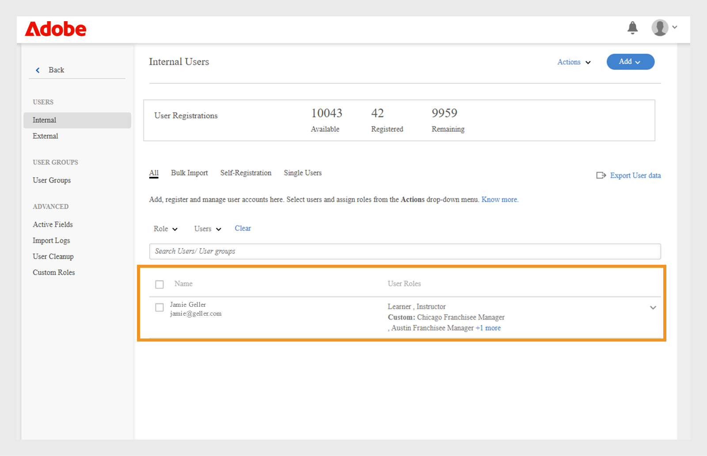
   _在使用者頁面搜尋使用者_

2. 選擇顯示使用者名稱的列末尾的下拉箭頭，然後選擇 **[!UICONTROL Manage custom roles]**。

   
   _在使用者頁面選擇管理自訂角色_

3. 會跳出一個對話框，顯示分配給使用者的自訂角色清單。 選擇 **[!UICONTROL Add/remove roles]** 新增或移除分配給使用者的自訂角色。

   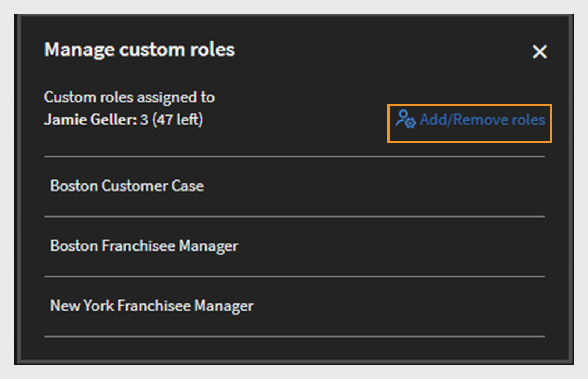
   _在「管理自訂角色」提示中選擇新增/移除角色_

4. 搜尋其他可指派給使用者的自訂角色。 找到後，選擇自訂角色。

   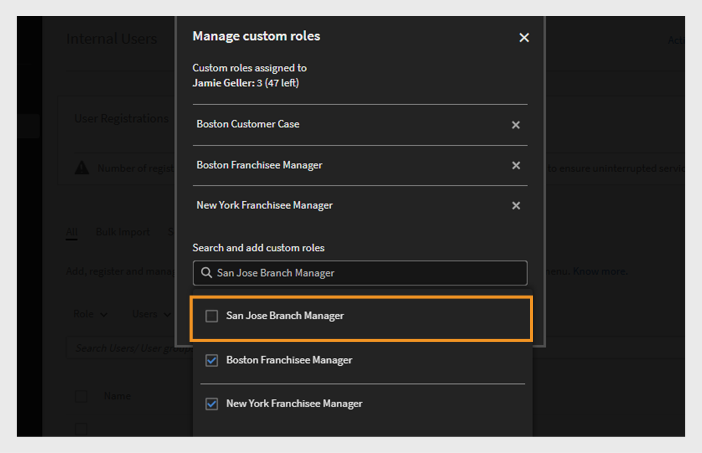
   _選擇自訂角色_

5. 選擇 **[!UICONTROL Save]**。 自訂角色變更的確認對話框會出現。 選擇 **[!UICONTROL Yes]**。

   
   _在確認提示中選擇「是」_

使用者會被指派第三個自訂角色。

要移除自訂角色，請遵循以下步驟：

1. 在 **[!UICONTROL Users]** 頁面上搜尋使用者。
2. 選擇使用者附近的下拉選單並選擇 **[!UICONTROL Manage custom roles]**。
3. 選擇 **[!UICONTROL Add/remove roles]** 新增或移除自訂角色。
4. 選擇 來 **[!UICONTROL remove icon]** 刪除自訂角色。

   
   _移除自訂角色_

### 切換自訂角色

要查看並選擇任何指派給你的自訂角色，請使用這個 **[!UICONTROL Switch custom role]** 選項。

_選擇自訂角色_

當自訂角色被指派給使用者時，使用者會收到電子郵件通知。 郵件中現在包含了角色名稱，以提升清晰度。

## 下載自訂角色報告

管理員可以下載 CSV 報告，列出所有自訂角色及其相關權限。 報告中會說明每個角色是手動建立還是透過 CSV 上傳，並總結每個角色所分配的存取權限與權限。

要下載報告，請依照以下步驟操作：

1. 以 . 登入。**[!UICONTROL Admin]**
2. 選擇 **[!UICONTROL Users]** > **[!UICONTROL Custom Roles]**。
3. 選擇 **[!UICONTROL Download]** 下載 CSV 報告的選項。

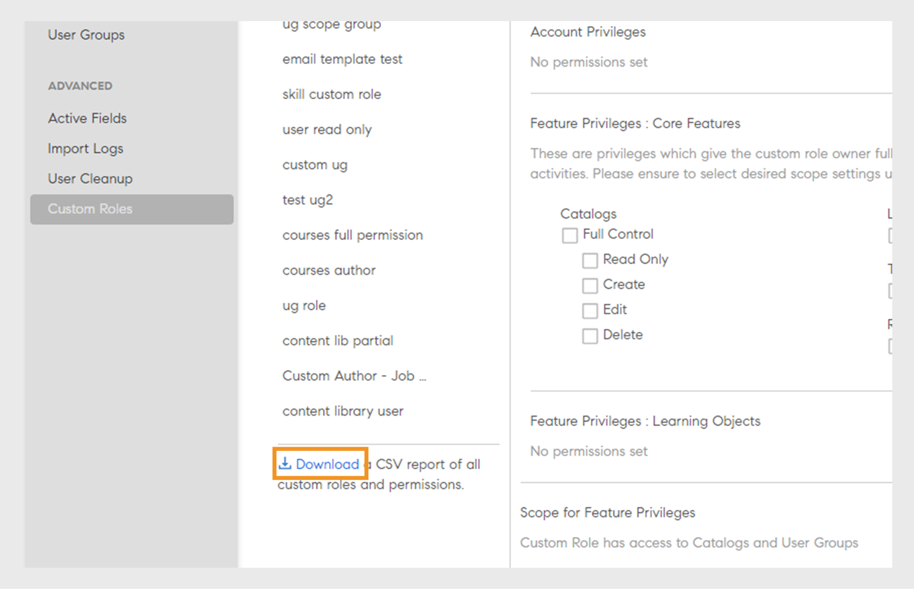
_下載自訂角色報告_

報告包含兩個 CSV 檔案：role.csv 和 user_role.csv。 role.csv檔案包括：

* 自訂角色
* 使用者識別碼
* 創造的源頭。

user_role.csv檔案包含欄位、自訂角色、建立來源，以及目錄、使用者、課程、學習路徑等詳細資訊。

## 自訂角色的稽核軌跡

管理員可下載自訂角色稽核報告，追蹤自訂角色的所有變更，包括建立、修改及刪除自訂角色及其相關功能存取。

請參閱本文 [《審計軌跡》以獲取自訂角色](/help/migrated/administrators/feature-summary/reports.md#audit-trail-for-custom-roles) 資訊。

## 限制自訂作者的資料夾存取權限 {#folder-custom-author}

Learning Manager 已經支援透過自訂角色提供內容庫存取的功能。 所有已經擁有內容庫存取權的自訂作者，即使設定好內容資料夾後，仍可繼續存取所有內容檔案。 這是為了維持傳承行為。 管理員若想維持現行行為，無需做任何更改。

若管理員想限制這些自訂作者的存取，需編輯現有的自訂角色，並透過僅提供特定內容資料夾存取權來設定。

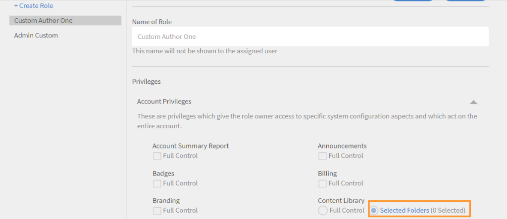

*限制自訂作者的資料夾存取權限*

在建立自訂作者時，你現在可以將內容資料夾指派給作者。 選擇「選取資料夾&#x200B;**」這個選項**。

點擊該選項後，會跳出一個新對話框，你可以將資料夾指派給自訂作者。

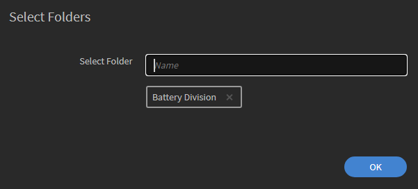

*選擇自訂作者的資料夾*

選擇資料夾並點擊 **[!UICONTROL OK]**。

## Learning Summary Dashboard for Custom administrator {#custom-admin-dashboard}

自訂管理員可以看到與管理員相同的視圖。 自訂管理員可能會存取超出其職權範圍的資料。 這只適用於自訂管理員擁有完整權限時。 在建立自訂管理員時，要授權完整權限，請在帳戶摘要報告中啟用該選項 **[!UICONTROL Full Control]** 。

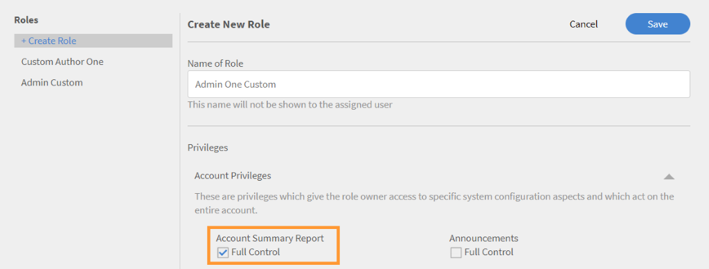

*建立自訂角色*

結果是選項 **[!UICONTROL All Catalogs]** **[!UICONTROL All User Groups]** 和 會被選取，其他選項會被禁用。

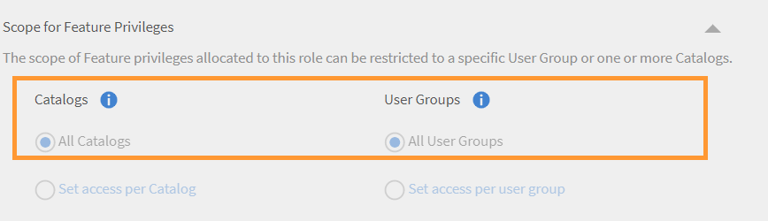

*定義權限範圍*

## 隱含權限 {#implicitpermissions}

當使用者被賦予特定實體的角色時，有時他們可能需要存取其他實體，才能執行該實體的任務。 例如，如果使用者獲得課程實體的創建權限，他們需要存取技能與標籤實體，才能將它們與正在建立的課程關聯。 此表格提供此類隱含權限的資訊。

<table>
 <tbody>
  <tr>
   <th>存取類型</th>
   <th>管理員授予的實體權限</th>
   <th>隱含實體權限</th>
   <th>隱性存取</th>
  </tr>
  <tr>
   <td>管理</td>
   <td>使用者</td>
   <td>群組</td>
   <td>糟糕</td>
  </tr>
  <tr>
   <td>報名</td>
   <td>所有 LOS（課程、工作輔助、學習計畫、認證）</td>
   <td>使用者 學習計畫</td>
   <td>閱讀</td>
  </tr>
  <tr>
   <td>創作</td>
   <td>
    
內容群組 就業補助 
</td>
   <td>標籤</td>
   <td>閱讀</td>
  </tr>
  <tr>
   <td>創作</td>
   <td>河道</td>
   <td>內容群組 標籤 技巧 徽章 就業補助</td>
   <td>請繼續閱讀</td>
  </tr>
  <tr>
   <td>創作</td>
   <td>學習計畫 認證 </td>
   <td>河道 標籤 技巧 徽章</td>
   <td>閱讀</td>
  </tr>
  <tr>
   <td>創作</td>
   <td>學習計畫</td>
   <td>目錄 團體 技巧 所有 LOS（課程、工作輔助、學習計畫、認證）</td>
   <td>閱讀</td>
  </tr>
  <tr>
   <td>創作</td>
   <td>公告</td>
   <td>使用者 團體 所有 LOS（課程、工作輔助、學習計畫、認證）</td>
   <td>閱讀</td>
  </tr>
  <tr>
   <td>創作</td>
   <td>遊戲化</td>
   <td>品牌形象</td>
   <td>寫</td>
  </tr>
  <tr>
   <td>*</td>
   <td>使用者</td>
   <td>計費</td>
   <td>閱讀</td>
  </tr>
  <tr>
   <td>*</td>
   <td>目錄</td>
   <td>群組 所有 LOS（課程、工作輔助、學習計畫、認證）</td>
   <td>閱讀</td>
  </tr>
  <tr>
   <td>*</td>
   <td>背景設定</td>
   <td>品牌形象 使用者</td>
   <td>閱讀</td>
  </tr>
  <tr>
   <td>*</td>
   <td>品牌形象</td>
   <td>背景設定</td>
   <td>閱讀</td>
  </tr>
  <tr>
   <td>*</td>
   <td>計費 遊戲化</td>
   <td>使用者</td>
   <td>閱讀</td>
  </tr>
 </tbody>
</table>

## 存取自訂角色 {#accessacustomrole}

當管理員指派自訂角色時，你會收到電子郵件通知。

注意：如果你已經以自訂角色登入 Learning Manager，則需要重新登入 Learning Manager，才能存取新角色。

要在角色間切換，請點擊學習管理員右上角的個人檔案圖示並選擇角色。

## 依可配置角色範圍的學習計畫 {#scopeconfigure}

在早期版本的 Learning Manager 中，任何有權限建立學習計畫的自訂角色，都可以將學習計畫範圍涵蓋所有類型的使用者群組與學習物件。

過去在獲得學習計畫存取權時，範圍設定是被停用的，使用者預設能存取所有目錄和所有使用者群組。

所有由管理員建立的學習計畫，預設適用於所有使用者。 使用者也可以被指派任何學習物件。 另一方面，擁有自訂角色的使用者可存取完整範圍，例如所有目錄、學習物件或使用者群組。 這表示管理員無法如預期建立自訂角色，讓權限有限的使用者存取學習計畫。

在這次學習管理員更新中，你可以為學習計畫建立自訂角色，允許對使用者和學習物件進行範圍設定。 換句話說，學習計畫可以建立有限的範圍，該範圍由自訂管理員的角色範圍衍生出來。

現在，管理員可以在授權學習計畫管理權限時，定義或限制範圍。

自訂管理員可以建立有限範圍的學習計畫，該範圍取決於自訂管理員可設定的角色範圍。 這類學習計畫僅對具有相同職務的自訂管理員開放，且一般管理員也能使用。 此外，自訂管理員無法在帳號中看到其他學習計畫。

現有的自訂管理員，若能存取學習計畫，則永遠擁有完整權限（依定義）。 他們會像一般管理員一樣，存取帳號內的所有學習計畫。 新建立的自訂角色，具備完整範圍，並新增自訂管理員，仍可存取所有學習計畫。

由管理員及全範圍自訂管理員所建立的學習計畫將照常建立，且不受範圍限制。

在「功能權限&#x200B;**範圍」區塊**&#x200B;中，授予自訂角色使用者群組及/或目錄的存取權限。

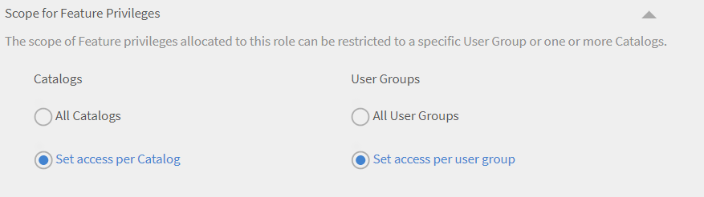

*授權使用者群組及/或目錄存取自訂角色*

將使用者指派到自訂角色。

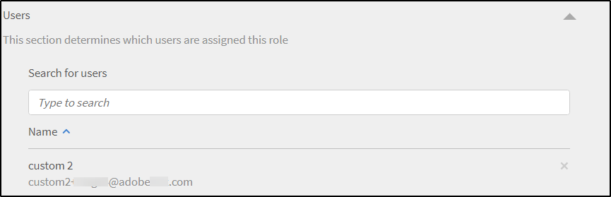

*指派使用者到自訂角色*

使用者現在以自訂管理員身份登入學習管理員，並新增學習計畫。

當新增學習者時，自訂管理員只能從可設定角色的範圍目錄中選擇訓練內容。

此學習計畫僅適用於使用者同時加入學習計畫範圍使用者群組的群組。 其他學生則免於此學習計畫。

## 學習者會被加入群組 {#learnergetsaddedtothegroup}

<!--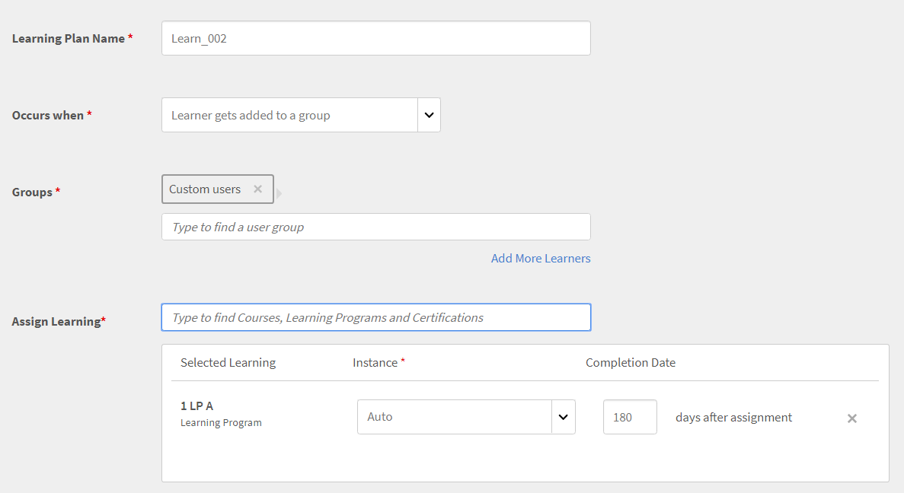-->

自訂管理員可以選擇任何包含該角色範圍使用者群組內使用者的使用者群組。

當使用者加入指定群組時，只有已屬於學習計畫範圍使用者群組並被加入指定群組的使用者，才會被指派學習物件。

## 範圍變更 {#changeinscope}

當管理員更改自訂角色的範圍時，該變更也會連鎖傳遞至自訂管理員。 當自訂管理員選擇已由先前自訂角色範圍涵蓋的學習計畫時，會顯示如下所示訊息：

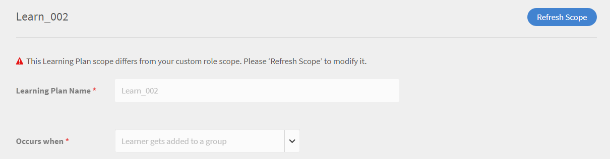

*範圍變更後的訊息*

自訂管理員現在必須將先前的範圍更新或刷新為新的範圍。

點擊後 **[!UICONTROL Refresh Scope]** 會更新示波器。 會顯示警告訊息。

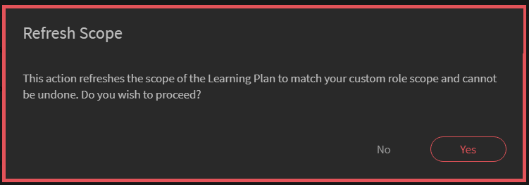

*刷新示波器後出現警告訊息*

點擊後 **[!UICONTROL Yes]** 會更新示波器。

## 將遊戲化報告加入自訂角色 {#gamification-custom}

管理員可以為自訂使用者啟用遊戲化報告。

1. 在頁面 **[!UICONTROL Custom Roles]** 中輸入自訂角色名稱。
1. 在該&#x200B;**[!UICONTROL Feature Privileges: Core Features]**&#x200B;區塊中，啟用類別&#x200B;**[!UICONTROL Reports]**&#x200B;的選項&#x200B;**[!UICONTROL Full Control]**。

1. 在區塊 **[!UICONTROL Users]**&#x200B;中，選擇將被指派新建立的自訂角色的使用者。
1. 點擊 **[!UICONTROL Save]**。

當使用者以自訂管理員身份登入並點擊 **[!UICONTROL Reports]** 左側窗格時，逐字稿會顯示如下：

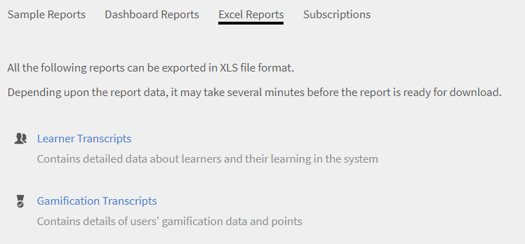

*下載遊戲化文字稿*

點擊 **[!UICONTROL Gamification Transcripts]**，選擇使用者，然後產生報告。

若管理員更改等級點數，報告會依照當前點數顯示等級。

重置遊戲化不會重置已達成的等級日期。

## 常見問題

**如果完整管理員移除我自訂角色的權限會怎樣？**

你的角色會保留現有權限，直到下一次完整管理員開啟並儲存你的角色定義。 此變更不會立即生效。 你目前的權限會一直保留，直到你的角色被明確編輯並儲存為止。

**我可以授權我無法存取的目錄角色目錄存取權嗎？**

不。 你建立的任何角色的範圍都限於你自己範圍內的目錄和使用者群組。 除非你的管理員設定了帳號允許擴展角色管理，否則你無法建立比你自己擁有更廣泛的權限的角色。

**唯讀與全控制有什麼差別？**

**唯** 讀功能讓你能查看 **自訂角色**、活躍欄位、 **匯入日誌**&#x200B;和 **使用者清理**。 你可以瀏覽、搜尋和下載報告，但無法採取任何行動。 **Full Control** 提供所有這些功能，並能建立、編輯與刪除角色、透過 CSV 匯入使用者、指派與移除角色使用者，以及清除已刪除的使用者。

**我可以給我建立的角色和我擁有的權限一樣嗎？**

是的。 你可以把你個人擁有的任何權限分配給你建立的角色。 你不能超過自己的權限集，但你可以建立與你權限相同層級或其子集的角色。

**當我做變更時，審計紀錄會顯示我是誰嗎？**

是的。 稽核報告會列出你自訂的角色作為每次變更的來源。 這表示完整管理員可以看到是哪個自訂角色對系統做出了任何變更。

**當帳戶啟用此功能後，現有的角色會發生什麼事？**

已啟用進階&#x200B;**權限的現有自訂角色**&#x200B;會自動取得匯入日誌&#x200B;**的存取**&#x200B;權。其他所有現有行為都沒有改變。 未啟用進階存取的角色則不受影響。

