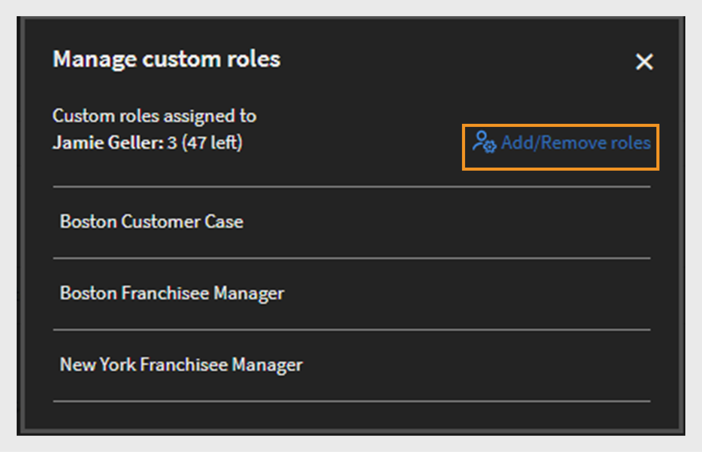

# 自訂角色

此功能可協助您定義自訂角色，並將特定職責指派給一組使用者。 此功能可讓您指派個人現有角色許可權以外的職責。

您可以建立自訂角色，以提供僅限於特定目錄的編寫功能。 您也可以建立專用於管理報告的角色。 然後，這些角色可指派給應承擔這些特定職責的個人。

>[!NOTE]
>
>新增自訂角色不會影響現有的自訂使用者群組或任何角色型群組，例如「所有管理員」、「所有作者」等

管理員能夠建立自訂管理員和自訂作者角色，並為每個角色量身打造許可權。 以下是與每個角色相關聯的許可權概觀：

**自訂作者角色許可權**

自訂作者可以執行下列工作：

* 存取內容資料庫以新增、編輯或刪除核心內容。
* 建立、編輯和刪除：
   * 課程
   * 工作輔助
   * 認證
   * 學習路徑
   * 學習方案

管理員和作者（包括自訂管理員和自訂作者）將能夠與外部共用目錄共用學習物件(LO)。 管理員和作者在建立學習物件(LO)時，應該能夠搜尋外部共用的目錄。

**自訂系統管理員角色許可權**

自訂管理員角色會復寫一組管理員職責，包括存取帳戶層級的許可權。 自訂管理員被授予管理與學習活動相關的主要功能的許可權，例如：

* 學習方案
* 目錄
* 報表
* 標記

此外，自訂管理員可以：

* 管理課程和工作輔助，包括註冊和刪除使用者。
* 建立、編輯和刪除認證、學習路徑和學習計畫。
* 存取所有學習物件(LO)的報告和註冊功能。

管理員現在可以在Adobe Learning Manager中檢視CSV建立的許可權。 「依選項篩選」可依管理員建立和透過CSV匯入的自訂角色進行篩選。 選取自訂角色後，您就能看到其許可權。

_篩選自訂角色_

## 建立自訂角色 {#create-role}

1. 以管理員身分登入。 開啟&#x200B;**[!UICONTROL Users]** > **[!UICONTROL Custom Role]**。
2. 選取&#x200B;**[!UICONTROL Create Role]**。 **[!UICONTROL Create New Role]**&#x200B;索引標籤隨即開啟。

   

   *建立自訂角色*

3. 在&#x200B;**[!UICONTROL Name of the Role]**&#x200B;欄位中輸入名稱。
4. **[!UICONTROL Account privileges]**：這些許可權可讓角色擁有者存取特定系統組態方面，並作用於整個帳戶。 選擇存取許可權。 使用者可完全控制指派的許可權。

   管理員可以授予「使用者」區段的詳細許可權，該區段包含內部/外部使用者、使用者群組和進階使用者。

   >[!NOTE]
   >
   >   範圍不適用於這些許可權。

   

   *設定範圍*

5. **功能許可權 — 核心功能**：用於授予特定功能的存取權，以管理學習活動。 可以使用此選項提供以下功能的許可權。

   管理員可提供詳細的許可權，例如目錄的唯讀、建立、編輯和刪除許可權。

   * 目錄
   * 報表
   * 標記

   

   *設定目錄、報表和標籤的範圍*

6. **功能許可權 — 學習物件：**&#x200B;使用此選項來存取學習對象的相關功能。 管理員可以為所有學習物件提供詳細許可權，包括課程、學習路徑、認證和工作輔助。 他們可以指派使用者許可權，例如建立、編輯、刪除或唯讀存取權。

   * 認證
   * 課程
   * 工作輔助
   * 學習計畫

   您也可以授與學習物件的特定作業控制權。 許可權可以是下列其中一項：

   * 唯讀
   * 建立
   * 編輯
   * 刪除
   * 註冊
   * 報告

   您也可以授予LO的完整控制權。

   

   *授與特定許可權*

7. **功能許可權的領域：**&#x200B;配置給此角色的功能許可權領域可以限製為特定使用者群組或一或多個目錄。

   目錄：使用選項按鈕提供對&#x200B;**[!UICONTROL All catalogs]**&#x200B;的控制，或使用&#x200B;**[!UICONTROL Set access per Catalog]**&#x200B;選項提供特定目錄的存取權。 您也可以選取多個目錄。

   使用者群組：提供&#x200B;**[!UICONTROL All User Groups]**&#x200B;的存取權或使用&#x200B;**[!UICONTROL Set access per user group]**&#x200B;選項提供特定使用者群組的存取權。 只能指定單一使用者群組。

   >[!NOTE]
   >
   >如果您在「帳戶許可權」底下選取宣告、Gamification、電子郵件範本、技能和使用者，則系統會依預設為所有使用者群組提供「使用者群組」存取權，且此選項會停用。

   如果您在「帳戶許可權」下選取了「學習計畫」，則預設會提供對所有「目錄」和「使用者群組」的存取權，而「範圍」下的這些選項會停用。

   

   *定義許可權範圍*

>[!NOTE]
>
>   在Learning Manager 27.6中，您可以建立自訂角色，使其涵蓋多個目錄，並為每個目錄授予不同的許可權集。

若要授與目錄的各種許可權，請遵循下列步驟：

1. 按一下選項&#x200B;**[!UICONTROL Set access per Catalog]**。
1. 選擇目錄，您就能看到每個目錄的許可權層級。 許可權如下：

   <table>
        <tbody>
        <tr>
          <td>
          
<b>許可權</b>
</td>
          <td>
          
<b>說明</b>
</td>
        </tr>
        <tr>
          <td>
          
完全控制
</td>
          <td>
          
授與所有學習物件的完整控制權。 許可權包括新增、編輯、刪除、讀取、註冊和報告。 
</td>
        </tr>
        <tr>
          <td>
          
報告
</td>
          <td>
          
僅授予學習物件「報表」標籤的存取權。
</td>
        </tr>
        <tr>
          <td>
          
註冊
</td>
          <td>
          
授予僅註冊學習物件的許可權。
</td>
        </tr>
        <tr>
          <td>
          
唯讀
</td>
          <td>
          
授予僅檢視目錄中的學習物件的許可權。
</td>
        </tr>
        </tbody>
      </table>

1. 根據您的要求啟用或停用許可權。
1. 若要儲存變更，請按一下&#x200B;**[!UICONTROL OK]**。 然後，若要儲存自訂角色的變更，請按一下&#x200B;**[!UICONTROL Save]**。

例如，請考量下列情況。

自訂使用者對學習物件的結果許可權是學習物件許可權和目錄許可權的交集。

自訂使用者擁有課程的完整許可權，且只有目錄A的唯讀存取權，但擁有目錄B的完整許可權。結果是對目錄A的課程的唯讀存取權和對目錄B的課程的完全控制權。

具有自訂角色的使用者可以：

* 僅檢視他/她有權存取的目錄中的內容。
* 根據學習物件所屬的目錄許可權，存取任何學習物件。

  身為管理員，您可以：

* 為自訂角色選擇多個目錄。
* 隨時修改目錄許可權。
* 從您不想再授與許可權的領域移除目錄。
* 當您授與目錄的許可權時，隱含地授與目錄的唯讀許可權。

  下表說明許可權的授予方式。

  <table>
    <tbody>
     <tr>
      <td>
       
<strong> </strong>
</td>
      <td>
       
<strong>目錄層級許可權</strong>
</td>
     </tr>
     <tr>
      <td>
       
<strong>學習物件 — 層級許可權</strong>

       
<strong>（例如：課程）</strong>
</td>
      <td>
       
完全控制
</td>
      <td>
       
註冊
</td>
      <td>
       
報告
</td>
      <td>
       
唯讀
</td>
     </tr>
     <tr>
      <td>
       
完全控制
</td>
      <td>
       
完全控制
</td>
      <td>
       
註冊
</td>
      <td>
       
報告
</td>
      <td>
       
唯讀
</td>
     </tr>
     <tr>
      <td>
       
註冊
</td>
      <td>
       
註冊
</td>
      <td>
       
註冊
</td>
      <td>
       
唯讀
</td>
      <td>
       
唯讀
</td>
     </tr>
     <tr>
      <td>
       
編輯和刪除
</td>
      <td>
       
編輯和刪除
</td>
      <td>
       
唯讀
</td>
      <td>
       
唯讀
</td>
      <td>
       
唯讀
</td>
     </tr>
     <tr>
      <td>
       
報告
</td>
      <td>
       
報告
</td>
      <td>
       
唯讀
</td>
      <td>
       
報告
</td>
      <td>
       
唯讀
</td>
     </tr>
    </tbody>
   </table>

1. **使用者：**&#x200B;使用此選項來決定哪些使用者被指派此角色。 您可以使用搜尋方塊選擇一或多個使用者。

   **將使用者新增至自訂角色CSV上傳：**&#x200B;若要透過上傳的CSV新增使用者，請將CustomRole欄新增至管理員用來匯入使用者的.csv檔案。 在要指派自訂角色的使用者的CustomRole欄下，輸入使用者的角色。 若要上傳CSV檔案，請按一下&#x200B;**[!UICONTROL Add > Upload a CSV]**。

   * 您無法搜尋使用者群組。
   * 您無法搜尋已指派管理員角色的使用者。
   * 指派新的自訂角色給使用者，將會覆寫使用者先前的自訂角色。

   <!---->

   * 具有「設定」許可權的自訂管理員將能夠設定從資料來源同步或同步使用者的排程，即使他們沒有「使用者」實體的許可權。
   * 如果自訂管理員擁有「使用者」實體的許可權，則可指派管理員角色給自己，成為標準管理員。

## 指派多個自訂角色給使用者

您可以使用以下方式將多個自訂角色指派給使用者：

* 使用UI：您可以直接從Adobe Learning Manager介面指派多個自訂角色給使用者。
* 使用CSV上傳：您可以上傳CSV檔案，一次為數個使用者指派多個自訂角色。

這可讓您更輕鬆地在整個系統中管理使用者存取和控制許可權。

### 透過使用者介面指派多個自訂角色

透過Adobe Learning Manager中的Admin Console指派多個自訂角色，是快速且直覺的選項，適用於上線、許可權調整或較小程度的更新。 角色能以視覺化方式指派，無需CSV上傳，可降低錯誤風險並提供即時可見度。 此方法可支援在職責轉換時進行快速更新，並視需要允許角色切換和委派。

若要指派多個自訂角色給使用者，請遵循下列步驟：

1. 以系統管理員身分登入，並選取&#x200B;**[!UICONTROL Users]**。
2. 在左側面板上選取&#x200B;**[!UICONTROL Custom Roles]**。
3. 建立新的自訂角色，並新增帳戶許可權、目錄、學習物件或範圍。 請參閱[這裡](#create-a-custom-role)提及的步驟。
4. 將使用者新增至自訂角色。

   
   _將使用者指派給自訂角色_

5. 選取&#x200B;**[!UICONTROL Save]**。

視需要為使用者選取多個自訂角色。 每位使用者最多可擁有50個自訂角色指派。 可用角色的數目會隨著每個指派而減少。

將使用者指派給其他自訂角色後，您可以檢視每個使用者仍可使用的角色指派數。

>[!NOTE]
>
>您最多可以為每個使用者指派50個角色，並為每個角色新增最多500個使用者。

### 使用CSV指派多個自訂角色

在Adobe Learning Manager中上傳CSV檔案可讓您有效率地大量指派自訂角色。 此程式尤其有利於大量員工入職、重組團隊或更新新培訓的存取權。 CSV匯入可節省手動工作、確保指派一致，並減少錯誤。 此方法在合併、部門範圍更新或全域訓練轉出期間特別有用。 此方法可協助管理員節省時間、標準化角色及維持控管。

您現在可以上傳兩個檔案至Box，透過CSV匯入將多個角色指派給使用者：

* role.csv
* user_role.csv。

user_role.csv檔案包含「自訂角色」和「使用者ID」欄位。

role.csv檔案包含欄位、自訂角色、建立的Source，以及目錄、使用者、課程、學習路徑等的詳細資訊。

如果CSV檔案的資料不正確或超出限制（每個使用者50個角色，每個角色500個使用者），則會出現一則訊息，顯示錯誤。

_自訂角色的錯誤通知_
使用者會在指派角色時收到電子郵件通知，包括角色的名稱。

### 管理自訂角色

管理員可隨著職責的變更在Adobe Learning Manager中更新、新增或移除使用者的自訂角色。 這可確儲存取權與目前的角色一致，而不會影響學習歷程記錄或註冊資料。 從&#x200B;**[!UICONTROL Users]**&#x200B;頁面，管理員可以使用[管理自訂角色]選項搜尋使用者、檢視其角色並調整它們。 此引導式介面可讓您輕鬆新增或移除角色，同時維持治理和安全性。

>[!NOTE]
>
>自訂管理員無法管理自訂角色（新增或移除自訂角色），也無法將自己提升為管理員角色。

將自訂角色指派給使用者後，您就可以從&#x200B;**[!UICONTROL Users]**&#x200B;頁面新增或移除自訂角色。

1. 在&#x200B;**[!UICONTROL Users]**&#x200B;頁面上搜尋使用者。

   
   _在使用者頁面中搜尋使用者_

2. 選取顯示使用者名稱之列結尾的下拉箭頭，然後選取&#x200B;**[!UICONTROL Manage custom roles]**。

   
   _選取管理使用者頁面中的自訂角色_

3. 會出現一個對話方塊，顯示指派給使用者的自訂角色清單。 選取&#x200B;**[!UICONTROL Add/remove roles]**&#x200B;以新增或移除指派給使用者的自訂角色。

   
   _在管理自訂角色提示中選取新增/移除角色_

4. 搜尋要指派給使用者的其他自訂角色。 找到之後，請選取自訂角色。

   
   _選取自訂角色_

5. 選取&#x200B;**[!UICONTROL Save]**。 自訂角色變更的確認對話方塊隨即顯示。 選取&#x200B;**[!UICONTROL Yes]**。

   
   _在確認提示中選取[是]_

第三個自訂角色會指派給使用者。

若要移除自訂角色，請執行下列步驟：

1. 在&#x200B;**[!UICONTROL Users]**&#x200B;頁面上搜尋使用者。
2. 選取使用者附近的下拉式清單，然後選取&#x200B;**[!UICONTROL Manage custom roles]**。
3. 選取&#x200B;**[!UICONTROL Add/remove roles]**&#x200B;以新增或移除自訂角色。
4. 選取&#x200B;**[!UICONTROL remove icon]**&#x200B;以刪除自訂角色。

   
   _移除自訂角色_

### 切換自訂角色

若要檢視並選取指派給您的任何自訂角色，請使用&#x200B;**[!UICONTROL Switch custom role]**&#x200B;選項。

_選取自訂角色_

當自訂角色指派給使用者時，使用者會收到電子郵件通知。 電子郵件現在包含角色名稱，以更清楚明瞭。

## 下載自訂角色報表

管理員可以下載CSV報告，其中列出所有自訂角色及其相關許可權。 該報告會指出每個角色是手動建立還是透過CSV上傳建立，並提供指派給每個角色的存取權和許可權摘要。

若要下載報表，請遵循下列步驟：

1. 以&#x200B;**[!UICONTROL Admin]**&#x200B;登入。
2. 選取&#x200B;**[!UICONTROL Users]** > **[!UICONTROL Custom Roles]**。
3. 選取&#x200B;**[!UICONTROL Download]**&#x200B;選項以下載CSV報表。

_下載自訂角色的報告_

報表有兩種CSV檔案：role.csv和user_role.csv。 role.csv檔案包含：

* 自訂角色
* 使用者ID
* 建立的Source。

user_role.csv檔案包含欄位、自訂角色、建立的Source，以及目錄、使用者、課程、學習路徑等的詳細資訊。

## 自訂角色的稽核軌跡

管理員可以下載自訂角色稽核報告，以追蹤對自訂角色所做的所有變更，包括建立、修改和刪除自訂角色及其相關功能存取權。

如需詳細資訊，請參閱本文[自訂角色的稽核軌跡](/help/migrated/administrators/feature-summary/reports.md#audit-trail-for-custom-roles)。

## 限制自訂作者的資料夾存取權 {#folder-custom-author}

Learning Manager已支援使用自訂角色授與內容資料庫存取權的功能。 所有已擁有內容資料庫存取權的自訂作者，即便已設定內容資料夾，仍可繼續存取所有內容檔案。 這是為了維護舊版行為。 如果管理員希望繼續目前的行為，則不需要進行任何變更。

如果他們想要限制對這些自訂作者的存取權，管理員需要編輯現有的自訂角色，並透過僅提供對特定內容資料夾的存取權來設定它們。

*限制自訂作者的資料夾存取權*

建立自訂作者時，您現在可以將內容資料夾指派給作者。 選擇選項&#x200B;**選取的資料夾**。

按一下選項後，會開啟一個新對話方塊，您可以在其中將資料夾指派給自訂作者。

*選取自訂作者的資料夾*

選擇資料夾並按一下&#x200B;**[!UICONTROL OK]**。

## 自訂管理員的學習摘要控制面板 {#custom-admin-dashboard}

自訂管理員看到的檢視與管理員看到的相同。 自訂管理員可能會提供超出其範圍的資料。 這僅適用於自訂管理員具有完整範圍的情況。 若要在建立自訂管理員時授與完整範圍，請啟用[帳戶摘要報告]中的選項&#x200B;**[!UICONTROL Full Control]**。

*建立自訂角色*

因此，將會選取選項&#x200B;**[!UICONTROL All Catalogs]**&#x200B;和&#x200B;**[!UICONTROL All User Groups]**，並停用其餘選項。

*定義許可權範圍*

## 隱含許可權 {#implicitpermissions}

當使用者獲得具有特定實體的角色時，他們可能需要存取其他實體以及能夠在授與的實體上執行任務的情況。 例如，如果使用者獲得了課程實體的「建立」存取權，他們需要存取技能和標籤實體，以便他們能夠將他們與正在建立的課程相關聯。 此表格提供這類隱含許可權的資訊。

<table>
 <tbody>
  <tr>
   <th>存取型別</th>
   <th>管理員授予的實體許可權</th>
   <th>隱含實體許可權</th>
   <th>隱含存取</th>
  </tr>
  <tr>
   <td>管理</td>
   <td>使用者</td>
   <td>群組</td>
   <td>Crud</td>
  </tr>
  <tr>
   <td>註冊</td>
   <td>所有失敗（課程、工作輔助、學習計畫、認證）</td>
   <td>使用者 
     學習方案</td>
   <td>讀取</td>
  </tr>
  <tr>
   <td>建立</td>
   <td>
    
內容群組 
      工作輔助 
</td>
   <td>標籤</td>
   <td>讀取</td>
  </tr>
  <tr>
   <td>建立</td>
   <td>課程</td>
   <td>內容群組 
     標籤 
     技能 
     徽章 
     工作輔助</td>
   <td>全部讀取</td>
  </tr>
  <tr>
   <td>建立</td>
   <td>學習方案 
     認證 </td>
   <td>課程 
     標籤 
     技能 
     徽章</td>
   <td>讀取</td>
  </tr>
  <tr>
   <td>建立</td>
   <td>學習方案</td>
   <td>目錄 
     群組 
     技能 
     所有失敗（課程、工作輔助、學習計畫、認證）</td>
   <td>讀取</td>
  </tr>
  <tr>
   <td>建立</td>
   <td>宣告</td>
   <td>使用者 
     群組 
     所有失敗（課程、工作輔助、學習計畫、認證）</td>
   <td>讀取</td>
  </tr>
  <tr>
   <td>建立</td>
   <td>遊戲</td>
   <td>品牌化</td>
   <td>寫入</td>
  </tr>
  <tr>
   <td>*</td>
   <td>使用者</td>
   <td>帳單</td>
   <td>讀取</td>
  </tr>
  <tr>
   <td>*</td>
   <td>目錄</td>
   <td>群組 
     所有失敗（課程、工作輔助、學習計畫、認證）</td>
   <td>讀取</td>
  </tr>
  <tr>
   <td>*</td>
   <td>設定</td>
   <td>品牌化 
     使用者</td>
   <td>讀取</td>
  </tr>
  <tr>
   <td>*</td>
   <td>品牌化</td>
   <td>設定</td>
   <td>讀取</td>
  </tr>
  <tr>
   <td>*</td>
   <td>帳單 
     遊戲</td>
   <td>使用者</td>
   <td>讀取</td>
  </tr>
 </tbody>
</table>

## 存取自訂角色 {#accessacustomrole}

管理員指派自訂角色時，您會收到電子郵件通知。

注意：如果您已使用自訂角色登入Learning Manager，則需要重新登入Learning Manager才能存取新角色。

若要在角色之間切換，請按一下Learning Manager右上角的設定檔圖示，然後選取角色。

## 由可設定角色界定的學習計畫 {#scopeconfigure}

在舊版Learning Manager中，任何有權建立學習計畫的自訂角色都可以設定所有型別使用者群組和學習物件的學習計畫範圍。

此範圍設定過去會在授與學習計畫存取權時停用，依預設會授與使用者存取所有目錄和所有使用者群組的許可權。

依預設，管理員建立的所有學習計畫均適用於所有使用者。 您也可以為使用者指派任何學習物件。 另一方面，擁有「自訂角色」的使用者可存取完整範圍，例如所有目錄、學習物件或使用者群組。 這表示管理員無法按預期建立自訂角色，以允許有限範圍的使用者存取學習計畫。

在這個Learning Manager更新中，您可以為學習計畫建立自訂角色，以允許設定使用者和學習物件的範圍。 換言之，您可以使用衍生自自訂管理員角色範圍的有限範圍來建立學習計畫。

現在，管理員可以在授與學習計畫管理存取權時定義或限制範圍。

自訂管理員可用有限的範圍建立學習計畫，具體範圍由自訂管理員可設定角色的範圍決定。 這類學習計畫除了可供一般管理員存取外，僅供具有相同角色的自訂管理員存取。 此外，自訂管理員無法在帳戶中看到任何其他學習計畫。

有權存取學習計畫的現有自訂管理員將一律具有完整範圍（依定義）。 他們會像一般管理員一樣存取帳戶中的所有學習計畫。 以完整範圍建立的新自訂角色以及新增至這些角色的新自訂管理員將可繼續存取所有學習計畫。

管理員和完整範圍自訂管理員建立的學習計畫會照常建立，不受範圍限制。

在&#x200B;**功能許可權範圍**&#x200B;區段中，授與使用者群組和/或自訂角色目錄的存取權。

*授與自訂角色的使用者群組和/或目錄的存取權*

將使用者指派給自訂角色。

*將使用者指派給自訂角色*

使用者現在以自訂管理員身分登入Learning Manager，並新增學習計畫。

新增新學習者時，自訂管理員只能從可設定角色的範圍目錄中選取訓練。

此學習計畫現在僅適用於學習者，前提是使用者也新增至學習計畫範圍內使用者群組中的群組。 所有其他學習者可獲劐免使用此學習方案。

## 學習者已新增至群組 {#learnergetsaddedtothegroup}

<!---->

自訂管理員可從角色所屬範圍內的使用者群組中，選取擁有使用者的任何使用者群組。

將使用者新增至指定群組時，只有已屬於學習計畫之範圍使用者群組，且已新增至指定使用者群組的使用者，才會獲指派學習物件。

## 範圍變更 {#changeinscope}

當管理員變更自訂角色的範圍時，變更也會級聯到自訂管理員。 當自訂管理員選擇已受先前自訂角色範圍的學習計畫時，會顯示訊息，如下所示：

範圍變更後&#x200B;*訊息*

自訂管理員現在必須將先前的範圍更新或重新整理到新的範圍。

按一下&#x200B;**[!UICONTROL Refresh Scope]**&#x200B;可更新範圍。 系統會顯示警告訊息。

重新整理領域後出現&#x200B;*警告訊息*

按一下&#x200B;**[!UICONTROL Yes]**&#x200B;可更新範圍。

## 將gamification報表新增至自訂角色 {#gamification-custom}

管理員可以為自訂使用者啟用遊戲化報表。

1. 在&#x200B;**[!UICONTROL Custom Roles]**&#x200B;頁面中，輸入自訂角色的名稱。
1. 在&#x200B;**[!UICONTROL Feature Privileges: Core Features]**&#x200B;區段中，啟用類別&#x200B;**[!UICONTROL Reports]**&#x200B;的選項&#x200B;**[!UICONTROL Full Control]**。

1. 在&#x200B;**[!UICONTROL Users]**&#x200B;區段中，選取將指派新建立之自訂角色的使用者。
1. 按一下&#x200B;**[!UICONTROL Save]**。

當使用者以自訂管理員身份登入並按一下左窗格上的&#x200B;**[!UICONTROL Reports]**&#x200B;時，成績單會出現，如下所示：

*下載gamification成績單*

按一下「**[!UICONTROL Gamification Transcripts]**」，選擇使用者並產生報表。

如果管理員變更了層級點，報表會根據目前點顯示層級。

重設遊戲化不會重設層級的達成日期。

## 常見問題 {#frequentlyaskedquestions}

+++如何建立自訂角色？

自訂角色就像作者或管理員角色的子集。 允許一或多個許可權、定義範圍，並將角色指派給使用者。

按一下&#x200B;**[!UICONTROL Users]** > **[!UICONTROL Custom Roles]**。 在[自訂角色]頁面中，按一下&#x200B;**[!UICONTROL Create Role]**。 輸入自訂角色的名稱並設定角色的許可權。 如需詳細資訊，請參閱[建立自訂角色](custom-role.md#create-role)。
+++

