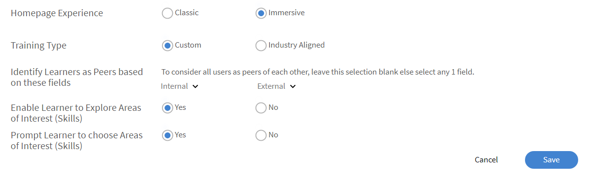
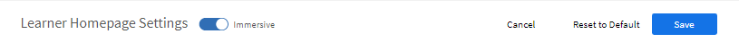
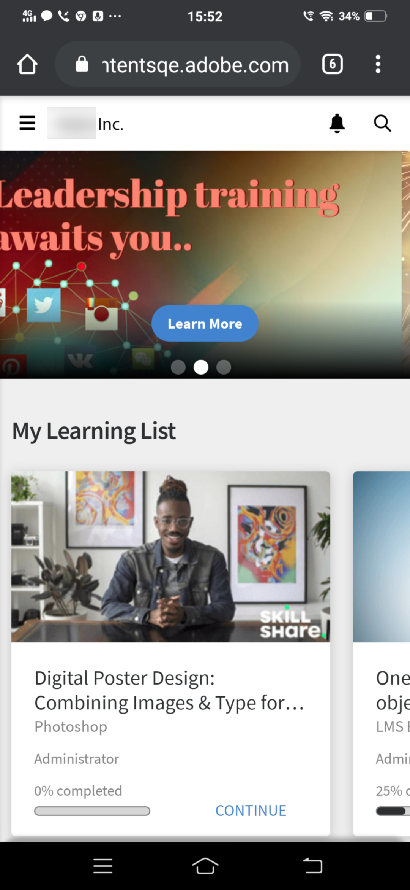
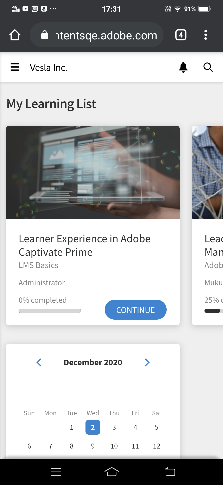
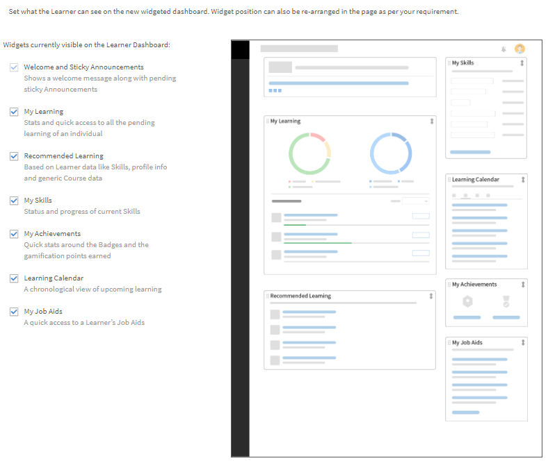

# 自定義學習者主頁

## 概觀 {#overview}

管理員可以自定義學習者的首頁，並使其更加現代、內容驅動和個人化。

個性化方法提供了一種基於小部件的構建學習者主頁頁面的方式，組織的管理員可以以所見即所得的方式在管理員用戶介面中進行配置。

該體驗由人工智能驅動的算法的個性化培訓建議驅動，該算法分析協力廠商內容的行業技能，結合同伴活動，以及使用顯式和隱式數據的學習者興趣領域。

### 自定義學習者主頁

在本培訓中，您將探索自定義學習者主頁的方法。

如果您無法啟動培訓，請寫信給 <almacademy@adobe.com>。

## 配置學習者主頁 {#configurethelearnerhomepage}

**在“品牌**>**學習者主页**”頁面上，管理員可以自定義學習者的主頁體驗，以便在學習者登錄學習者應用程式時，他/她會看到完全改版的外觀。

管理員可以從管理員應用（“品牌&#x200B;**>**&#x200B;學習者主页”頁面&#x200B;**標籤）**&#x200B;設置UI （外觀）。

管理員可以切換到沉浸式UI Widget視圖，相應地自定義小組件/功能，然後啟用沉浸式UI。

**學習者主頁**&#x200B;螢幕包含以下部分：

## 沉浸式布局選項 {#immersivelayoutoption}

要視圖沉浸式驅動頁面的佈局，請啟用沉浸式&#x200B;**選項**。您可以在「品牌推廣」>「一般」**中**&#x200B;切換此選項。

在以前的版本中，學習者主頁選項處於設定狀態。

您可以設定的選項如下：

**首頁體驗：**&#x200B;啟用&#x200B;**傳統**&#x200B;或&#x200B;**沈浸式**。 如果您選擇「沈浸式」，下列選項就會出現：

* **訓練型別：**&#x200B;選擇&#x200B;**產業**&#x200B;或&#x200B;**自訂校準**。 自訂培訓是內部建立的。 符合行業的培訓包括來自協力廠商提供商的現成內容。

*通過選擇“行業”或“自定義對齊”來設置首頁體驗*

“允許學習者探索感興趣的&#x200B;**領域”選項**&#x200B;適用於經典和沉浸式體驗。

<table>
 <tbody>
  <tr>
   <td>
    
<b>如果您選擇自訂……</b>
</td>
   <td>
    
<b>如果您選擇產業對齊……</b> 
</td>
  </tr>
  <tr>
   <td>
    
您最多可以選擇一個「內部」和「外部」作用中欄位。
</td>
   <td>
    
您最多可以選擇5個和1個欄位。 依預設，已選取<b>設定檔</b>選項。
</td>
  </tr>
 </tbody>
</table>

如果學習者少於1000名，則整個帳戶會視為單一範圍。 這是專門針對自定義訓練類型的。 如果 帳戶 的用戶少于 1000 個，則會將完整的帳戶視為其範圍。

>[!NOTE]
>
>“探索技能&#x200B;**”複選框**&#x200B;已移至設定>常規“。

如果選擇“沉浸式體驗”，則將啟用並灰顯。 此複選框只會針對傳統體驗啟用。

*學習者主頁設置*

沉浸式佈局是所有新帳戶的默認佈局。 版面由管理員可以啟用或停用的小部件控制。 根據小部件的定位方式，學習者主頁上也會反映相同的內容。

以下是您可以啟用/停用的小部件。

使用此功能，您可以在學習者UI上線之前預覽學習者UI。

對於現有帳戶，「沉浸式」**選項將為**「關閉&#x200B;****」。在開啟Social和遊戲化的新帳戶時，會啟用此功能。

*預覽學習者UI*

<table>
 <tbody>
  <tr>
   <td>
    
<b>控件</b>
</td>
   <td>
    
<b>說明</b>
</td>
  </tr>
  <tr>
   <td>
    
桅頂
</td>
   <td>
    
<b>什麼是刊頭以及如何自定義學習者刊頭？ </b> 

    
這對學習者來說是一個受歡迎的橫幅。 橫幅可以是影像或影片。 您可以將刊頭目標給特定的用戶組，學習者在登陸主頁后立即查看刊頭。 根據管理員設定的目標計劃，使用者群組可以看到多個主圖影像或視訊。 

    
以下是管理員上傳橫幅的方式：

    <ol>
     <li>在左側面板上，按兩下 <b>公告</b>。 </li>
     <li>在頁面的右上角，按兩下“ <b>添加</b>”。</li>
     <li>從「類型」<b></b>下拉式清單中選擇<b>「作為刊頭</b>」。</li>
     <li>寫下將在刊頭顯示的消息。</li>
     <li>上傳影像或影片。</li>
     <li>選擇目標對象。 選擇將顯示刊頭的消費者群組或培訓。</li>
     <li>儲存刊頭公告。</li>
    </ol></td>
  </tr>
  <tr>
   <td>
    
我的學習
</td>
   <td>
    
顯示學習者最近訪問的學習物件。 
</td>
  </tr>
  <tr>
   <td>
    
日曆
</td>
   <td>
    
按月為學習者顯示各種即將進行的課堂和虛擬課堂培訓培訓。 將顯示學習者可以註冊或已註冊的培訓，包括經理批准的培訓。 
</td>
  </tr>
  <tr>
   <td>
    
顯示截止日期的註冊
</td>
   <td>
    
顯示逾期、截止日期即將到來或按計劃進行的註冊。 
</td>
  </tr>
  <tr>
   <td>
    
遊戲化
</td>
   <td>
    
根據學習活動顯示排行榜。
</td>
  </tr>
  <tr>
   <td>
    
Social學習
</td>
   <td>
    
列出與學習者處於同一用戶範圍的用戶的活動和帖子。 
</td>
  </tr>
  <tr>
   <td>
    
按組織推薦
</td>
   <td>
    
啟用后，此介面工具集會向特定用戶群組推薦培訓。 每個使用者群組可以針對一個或多個培訓，目標計劃將基於時間段。  

    <ul>
     <li>
      
首先，管理員<a href="announcements.md#recommendation">創建類型<b>為「作為建議</b>」的公告</a>，然後選擇所需的培訓並使用組。屬於消費者群組的學習者將看到推薦的培訓。
</li>
     <li>
      
其次，管理員還可以決定建議是立即生效還是在指定日期生效。
</li>
    </ul></td>
  </tr>
  <!--<tr>
   <td>
    
Recommendation based on area of interest
</td>
   <td>
    
Displays Learning Objects based on the learner's chosen area of interest. The recommendation is driven by a Machine Learning algorithm.
</td>
  </tr>-->
  <tr>
   <td>
    
依目錄瀏覽 
</td>
   <td>
    
在主頁上將目錄顯示為磁貼。 
</td>
  </tr>
  <!--<tr>
   <td>
    
Recommendation based on peer activity 
</td>
   <td>
    
Displays training based on what a learner's peers are taking. This is again driven by a Machine Learning algorithm.
</td>
  </tr>-->
 </tbody>
</table>

保存更改后，學習者主頁將反映所有更改。

當學習者通過瀏覽器登錄到學習者應用程式時，他們可以看到以下沉浸式佈局：

<table>
 <tbody>
  <tr>
   <td>
    
<strong>主頁</strong>
</td>
   <td>
    
<strong>我的學習清單</strong>
</td>
   <td>
    
<strong>檢視目錄</strong>
</td>
  </tr>
 </tbody>
</table>

*檢視 首頁上各個部分的沉浸式佈局*

## 傳統版面配置選項 {#classiclayoutoption}

在此之前一直存在的使用者介面版面現在稱為「傳統版面」。 選擇此選項時，學習者主页視圖將恢復為經典佈局。

*預覽經典版面*

## 設定推薦 {#configurerecommendationsettings}

在“品牌>****&#x200B;常規&#x200B;**”上**，您可以為內部和外部學習者配置推薦範圍，並允許學習者在學習者主頁上選擇技能。

在&#x200B;**一般**&#x200B;頁面上，您有以下選項：

<table>
 <tbody>
  <tr>
   <td>
    
組織名稱
</td>
   <td>
    
學習者所屬的組織名稱。
</td>
  </tr>
  <tr>
   <td>
    
子網域
</td>
   <td>
    
組織的子網域。
</td>
  </tr>
  <tr>
   <td>
    
標誌樣式
</td>
   <td>
    
這就是您的徽標和公司名稱在學習管理器上的顯示方式。 
</td>
  </tr>
  <tr>
   <td>
    
主題
</td>
   <td>
    
主題應用於學習管理員。
</td>
  </tr>
  <tr>
   <td>
    
自訂
</td>
   <td>
    
Adobe Systems學習管理器允許您自定義帳戶，為使用者提供更豐富的體驗。 
</td>
  </tr>
  <tr>
   <td>
    
學習者首頁
</td>
   <td>
    
選擇<b>傳統</b>或<b>沈浸式</b>。 如果選擇「沉浸式」，則會顯示其他選項。
</td>
  </tr>
  <tr>
   <td>
    
訓練類型 
</td>
   <td>
    
<b>選擇「自定義</b>」或<b>「產業一致</b>」。如果學習者少於 1000 人，則整個帳戶被視為單個範圍。 推薦基於所有學習者。 
</td>
  </tr>
  <tr>
   <td>
    
建議範圍設定 
</td>
   <td>
    
選擇一或多個作用中的欄位。 對於<b>自訂</b>，您最多可以選擇一個使用中欄位。 對於<b>產業一致</b>，您最多可以選擇5個使用中的欄位。 
</td>
  </tr>
  <tr>
   <td>
    
讓學習者能夠探索感興趣的區域
</td>
   <td>
    
僅限傳統體驗。 選擇<b>是</b>或<b>否</b>。 
</td>
  </tr>
  <tr>
   <td>
    
提示使用者選擇興趣領域（技能）  
</td>
   <td>
    
僅適用於身臨其境體驗。 選擇 <b>「是</b> 」或 <b>「否</b>」。  
</td>
  </tr>
 </tbody>
</table>

>[!NOTE]
>
>對於新帳戶，“學習者主頁”、“培訓類型”和“建議範圍”設置將不可見。

