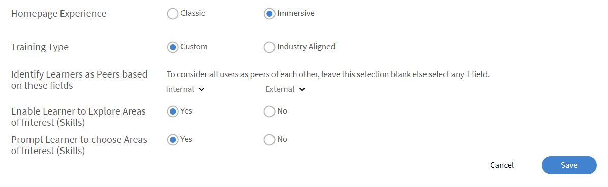
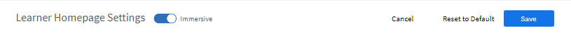
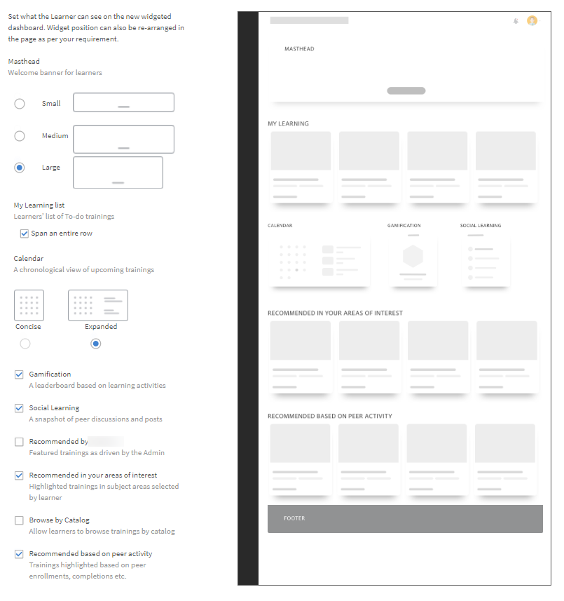
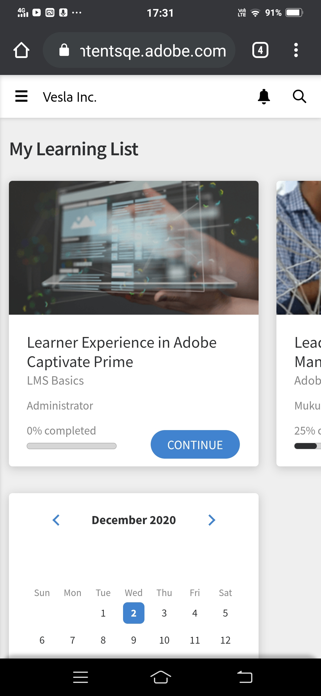
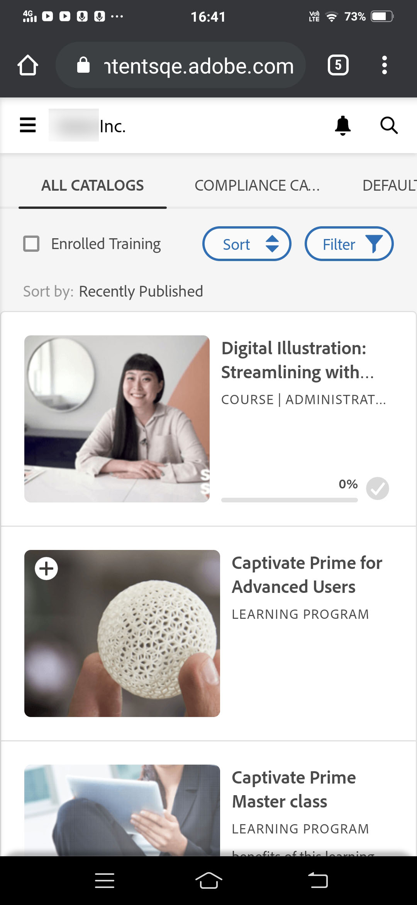
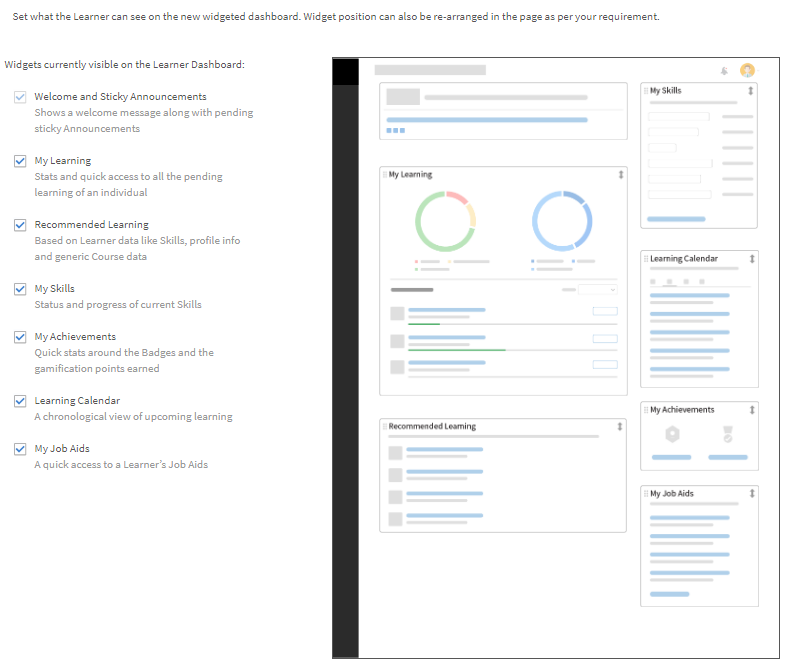

# 自訂學習者首頁

## 概觀 {#overview}

管理員可以自訂學習者的首頁，使其更具現代感、內容導向，並更貼合學習者的需求。

個人化方式提供基於小工具的學習者首頁建置方式，組織管理員可在管理介面中以所見即所得方式配置。

此體驗由 AI 驅動的演算法所提供個人化訓練建議，分析第三方內容以培養產業技能，並結合同儕活動及學習者興趣領域，並結合顯性與隱性資料。

### 自訂學習者首頁

在本次訓練中，您將探索如何自訂學習者首頁。

如果你無法啟動訓練，請寫信至 <almacademy@adobe.com>。

## 設定學習者首頁 {#configurethelearnerhomepage}

在 **品牌** > **學習者首頁** ，管理員可以自訂學習者的首頁體驗，讓學習者登入學習者應用程式時，能看到全新設計的外觀與體驗。

管理員可以從管理員應用程式&#x200B;**（品牌** > **學習者首頁** 標籤）設定介面（外觀與感覺）。

管理員可以切換到沉浸式 UI 小工具檢視，並相應地自訂小工具/功能，然後啟用沉浸式使用者介面。

**學習者首頁**&#x200B;畫面包含以下區塊：

## 沉浸式版面配置選項 {#immersivelayoutoption}

要查看沉浸式頁面的版面，請啟用「沉浸式&#x200B;**」選項**。你可以在 **品牌> General**&#x200B;中切換這個選項。

在先前版本中，學習者首頁選項位於設定中。

以下是你可以設定的選項：

**首頁體驗：** 啟用 **經典模式** 或 **沉浸式**&#x200B;模式。 如果你選擇沉浸式，會出現以下選項：

* **培訓類型：** 請選擇 **產業** 或 **客製化整合**。 客製化訓練則由內部製作。 產業對齊的培訓包含第三方供應商的現成內容。

*透過選擇產業或自訂對齊來設定首頁體驗*

**「讓學習者探索興趣**&#x200B;領域」選項適用於經典與沉浸式兩種體驗。

<table>
 <tbody>
  <tr>
   <td>
    
<b>如果你選擇自訂......</b>
</td>
   <td>
    
<b>如果你選擇產業連結......</b> 
</td>
  </tr>
  <tr>
   <td>
    
你最多只能選擇一個內部和外部活躍欄位。
</td>
   <td>
    
你最多只能選擇五個領域，至少一個領域。 預設情況下，會選擇「個人資料」</b>這個選項<b>。
</td>
  </tr>
 </tbody>
</table>

若學習者少於1000人，整個帳戶視為單一範圍。 這是針對自訂訓練類型。 若帳號用戶少於 1000 人，則視整個帳號為其範圍。

>[!NOTE]
>
>「探索技能&#x200B;**」的勾選框**&#x200B;已移至「設定>一般」。

如果選擇沉浸式體驗，這個功能會被啟用並顯示為灰色。 此勾選框僅在經典版體驗中啟用。

*學習者首頁設定*

沉浸式的配置是所有新帳號的預設配置。 版面配置由管理員可啟用或停用的小工具控制。 根據小工具的擺放方式，學習者首頁也會反映出相同的效果。

以下是你可以啟用或停用的小工具。

利用這個方法，你可以在學習者介面上線前預覽學習者介面。

現有帳號的沉浸式選項&#x200B;**會關閉****。**&#x200B;新帳號啟用時，社交和遊戲化功能已啟用。

*預覽學習者介面*

<table>
 <tbody>
  <tr>
   <td>
    
<b>小工具</b>
</td>
   <td>
    
<b>說明</b>
</td>
  </tr>
  <tr>
   <td>
    
報頭
</td>
   <td>
    
<b>什麼是 Masthead？我該如何自訂學習者 Masthead？ </b> 

    
這是一面歡迎學習者的旗幟。 橫幅可以是圖片或影片。 你可以將報頭鎖定特定使用者群組，學習者一抵達首頁即可立即查看報頭。 使用者群組可能會依照管理員設定的目標計畫看到多張英雄圖片或影片。 

    
管理員上傳橫幅的方式如下：

    <ol>
     <li>在左側面板，點選 <b>公告</b>。 </li>
     <li>在頁面右上角，點擊 <b>新增</b>。</li>
     <li>從<b>「類型</b>」下拉選單中，選擇<b>「作為主頁」。</b></li>
     <li>寫一段會刊登在報頭上的訊息。</li>
     <li>上傳圖片或影片。</li>
     <li>選擇目標受眾。 選擇使用者群組或訓練單位，該會顯示該主頁。</li>
     <li>省省頭頭的公告吧。</li>
    </ol></td>
  </tr>
  <tr>
   <td>
    
我的學習
</td>
   <td>
    
顯示學習者最近造訪的學習對象。 
</td>
  </tr>
  <tr>
   <td>
    
賽程表
</td>
   <td>
    
每月展示各種即將舉行的教室及虛擬教室培訓課程。 學習者可報名或已報名的課程會顯示，包括經理核准的訓練。 
</td>
  </tr>
  <tr>
   <td>
    
報名截止日期顯示
</td>
   <td>
    
顯示逾期、即將截止或進度正常的報名。 
</td>
  </tr>
  <tr>
   <td>
    
遊戲化
</td>
   <td>
    
根據學習活動顯示排行榜。
</td>
  </tr>
  <tr>
   <td>
    
社會學習
</td>
   <td>
    
列出與學習者同一使用者範圍的使用者所提供的活動與貼文。 
</td>
  </tr>
  <tr>
   <td>
    
組織推薦
</td>
   <td>
    
啟用後，此小工具會推薦特定使用者群體的培訓。 每個使用者群組可針對一項或多項訓練，目標計畫會依照時間框架訂定。  

    <ul>
     <li>
      
首先，管理員<a href="announcements.md#recommendation">會建立一個類型的 <b>As Recommendation</b> 公告</a>，然後選擇所需的訓練並使用群組。屬於使用者群組的學習者將能看到推薦的培訓內容。
</li>
     <li>
      
其次，管理員也可以決定推薦是立即生效還是指定日期生效。
</li>
    </ul></td>
  </tr>
  <!--
  <tr>
   <td>
    
Recommendation based on area of interest
</td>
   <td>
    
Displays Learning Objects based on the learner's chosen area of interest. The recommendation is driven by a Machine Learning algorithm.
</td>
  </tr>
  -->
  <tr>
   <td>
    
依目錄瀏覽 
</td>
   <td>
    
在首頁以磁貼形式顯示目錄。 
</td>
  </tr>
  <!--
  <tr>
   <td>
    
Recommendation based on peer activity 
</td>
   <td>
    
Displays training based on what a learner's peers are taking. This is again driven by a Machine Learning algorithm.
</td>
  </tr>
  -->
 </tbody>
</table>

儲存變更後，學習者首頁會反映所有變更。

當學習者透過瀏覽器登入學習器應用程式時，他們可以看到以下沉浸式的佈局：

<table>
 <tbody>
  <tr>
   <td>
    
<strong>首頁</strong>
</td>
   <td>
    
<strong>我的學習清單</strong>
</td>
   <td>
    
<strong>查看目錄</strong>
</td>
  </tr>
 </tbody>
</table>

*在首頁查看各區塊的沉浸式版面設計*

## 經典版面配置選項 {#classiclayoutoption}

一直以來存在的使用者介面佈局，現在被稱為經典佈局。 選擇此選項後，學習者首頁視圖會回復為經典版面。

*預覽經典版面配置*

## 設定推薦設定 {#configurerecommendationsettings}

在 **Branding** > **General** 中，你可以為內部與外部學習者設定推薦範圍，並讓學習者在學習者首頁選擇技能。

在 **一般** 頁面，你有以下選項：

<table>
 <tbody>
  <tr>
   <td>
    
組織名稱
</td>
   <td>
    
學習者所屬組織的名稱。
</td>
  </tr>
  <tr>
   <td>
    
子領域
</td>
   <td>
    
組織的子領域。
</td>
  </tr>
  <tr>
   <td>
    
標誌造型
</td>
   <td>
    
這就是你的標誌和公司名稱會在學習管理員中呈現的方式。 
</td>
  </tr>
  <tr>
   <td>
    
主題
</td>
   <td>
    
這個主題適用於學習管理器。
</td>
  </tr>
  <tr>
   <td>
    
自訂
</td>
   <td>
    
Adobe Learning Manager 讓你能自訂帳號，為使用者提供更豐富的體驗。 
</td>
  </tr>
  <tr>
   <td>
    
學習者首頁
</td>
   <td>
    
選擇 <b>經典模式 </b>或 <b>沉浸式</b>模式。 如果你選擇沉浸式，其他選項就會出現。
</td>
  </tr>
  <tr>
   <td>
    
訓練類型 
</td>
   <td>
    
請選擇 <b>客製化 </b>或 <b>產業連結</b>。 若學習者少於1000人，整個帳戶視為單一範圍。 此建議基於所有學習者。 
</td>
  </tr>
  <tr>
   <td>
    
建議範圍設定 
</td>
   <td>
    
選擇一個或多個活躍領域。 自訂<b></b>模式最多只能選擇一個活躍欄位。在 <b>產業連結</b>中，你最多只能選擇五個活躍領域。 
</td>
  </tr>
  <tr>
   <td>
    
讓學習者能夠探索感興趣的領域
</td>
   <td>
    
只限經典體驗。 選擇 <b>是 </b>或 <b>否</b>。 
</td>
  </tr>
  <tr>
   <td>
    
提示使用者選擇興趣領域（技能）  
</td>
   <td>
    
只是為了沉浸式體驗。 選擇 <b>是</b> 或 <b>否</b>。  
</td>
  </tr>
 </tbody>
</table>

>[!NOTE]
>
>新帳號的學習者首頁、訓練類型和推薦範圍設定將不可見。

