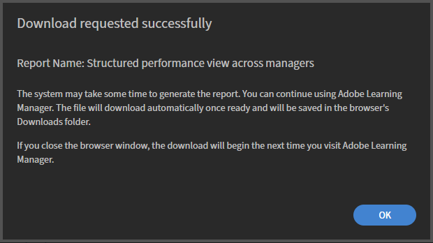
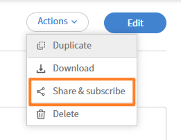

# 下載、分享並訂閱報告

## 概觀

在 Adobe Learning Manager 報告建器中產生、與其他管理員分享，並排程報告的交付。

在你將報告儲存在報告建構器後，可以隨時下載、與帳號內的其他管理員分享，或訂閱定期接收報告。

## 下載報告

1. 在 **「報告** 」標籤中，找到你想下載的報告。
2. 選擇 **下載**。
3. 選擇 **確定**。

   

   報表產生是非同步的。 當檔案準備好時，你會收到應用程式內的通知。

4. 打開通知並下載檔案。

>[!NOTE]
>
>例如，如果你的報告沒有匹配資料，因為篩選器沒有回傳結果，仍然會產生一個空檔案。 你不會收到錯誤;下載的檔案會有標頭但沒有列。

## 在報告建構器中分享並訂閱報告

讓其他管理員存取已儲存的報告，並在 Adobe Learning Manager 報告建工具中設定排程郵件送達。

**分享與訂閱**&#x200B;對話框有兩個獨立區塊：一個用來與其他管理員分享報告，另一個用來設定電子郵件訂閱。你可以用其中一種或兩種。

### 與其他管理員分享報告

共享管理員可以查看、複製及編輯報告。

1. 打開你想分享的報告。
2. 選擇 **行動** > **分享與訂閱**。

   

3. 在「擁有共享權限的管理員」中&#x200B;**，選擇**&#x200B;編輯&#x200B;**。**&#x200B;然後選擇 **「選擇使用者/使用者群組** 」欄位。
4. 搜尋並選擇你想分享的管理員或使用者群組。
5. 選擇 **儲存**。

被選中的管理員現在可以在他們的報告建工具檢視中存取報告。

建立一次報告，並與所有需要相同資料的管理員分享。 這避免了不同管理員獨立建立同一報告變體時產生重複報告的情況，這使得維持一致性及追蹤權威版本變得更困難。 當你分享報告時，收件人可以查看、複製並編輯它，因此一個配置良好的報告可以成為任何團隊專屬變化的基礎。

>[!NOTE]
>
>擁有共享權限的管理員可以查看、複製及編輯報告。 要移除存取權，請回到 **「分享與訂閱** 」並取消選擇該使用者或使用者群組。

### 訂閱管理員報告

訂閱管理員會依照您選擇的頻率以電子郵件收到報告。

1. 打開你想訂閱管理員的報告。
2. 選擇 **動作**  **分享並訂閱**。
3. 在「管理員與訂閱&#x200B;**」中**，選擇編輯。
4. 選擇 **電子郵件頻率** 下拉選單。
5. 選擇頻率：

   * **每天發送**

   * **每週發送**

   * **每月發送**

6. 在「 **選擇使用者/使用者群組** 」欄位中，搜尋並選擇要訂閱的管理員或使用者群組。
7. 選擇 **儲存**。

訂閱管理員會以電子郵件以選定頻率（每日、每週或每月）收到報告。

>[!TIP]
>
>在設定訂閱前，至少對報告套用一個排序。 這確保每次排程配送的列次序一致。
